# Project system design evolution — Unified RAG Studio

> Narrative and diagrams showing how the architecture deepens by phase. **Phase P0–P2** sections below restore **per-subphase** “Design Level” diagrams and decisions from historical documentation (`aa7f9dc`). **Phase 3+** milestones are **appended**; do not replace earlier sections when adding new work.

---

## Phase P0-1 · Monorepo Skeleton

**What changed:** Established the repository structure. A single git repo containing two apps (`web`, `api`) and shared `data/` catalogs. No services are running yet.

### Design Level 1 — Repository Layout

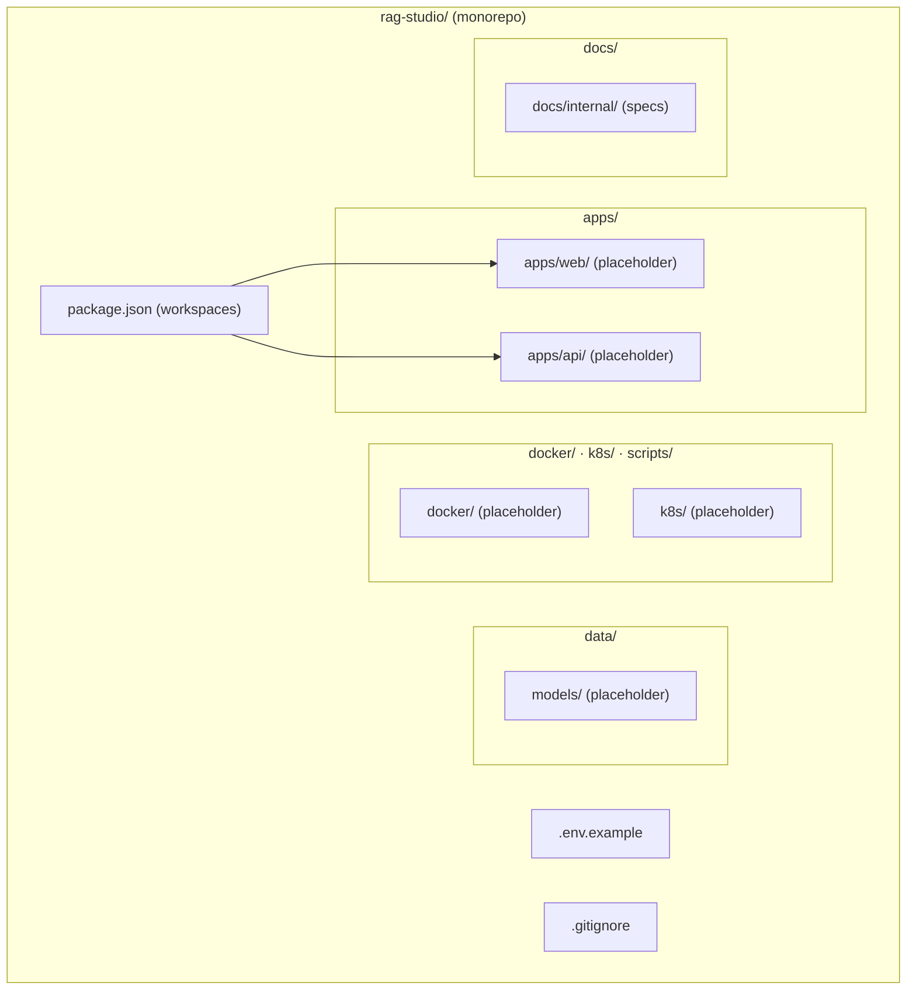
```mermaid
graph TD
    subgraph REPO["rag-studio/ (monorepo)"]
        PKG["package.json (workspaces)"]
        ENV[".env.example"]
        GIT[".gitignore"]

        subgraph APPS["apps/"]
            WEB["apps/web/  (placeholder)"]
            API["apps/api/  (placeholder)"]
        end

        subgraph DATA["data/"]
            MODELS["models/ (placeholder)"]
        end

        subgraph INFRA["docker/ · k8s/ · scripts/"]
            DOCKER["docker/  (placeholder)"]
            K8S["k8s/    (placeholder)"]
        end

        subgraph DOCS["docs/"]
            INTERNAL["docs/internal/ (specs)"]
        end
    end

    PKG --> WEB
    PKG --> API
```

**Key decisions:**
- npm workspaces for dependency hoisting and cross-package scripts
- `data/` as neutral territory — neither frontend nor backend owns it
- `.env.example` as the single source of truth for required env vars

---

## Phase P0-2 · Docker Compose Development Environment

**What changed:** All infrastructure services are now defined and can run locally with a single `docker compose up -d`. The architecture grows from a file layout to a live service mesh.

### Design Level 2 — Local Service Topology

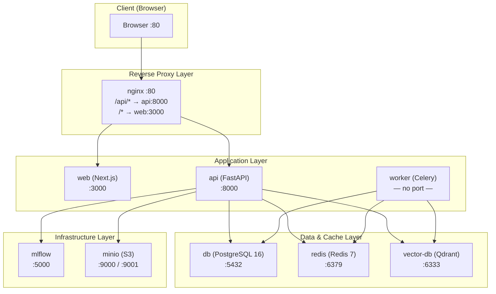
```mermaid
graph TB
    subgraph CLIENT["Client (Browser)"]
        BROWSER["Browser :80"]
    end

    subgraph NGINX_LAYER["Reverse Proxy Layer"]
        NGINX["nginx :80\n/api/* → api:8000\n/* → web:3000"]
    end

    subgraph APP_LAYER["Application Layer"]
        WEB["web (Next.js)\n:3000"]
        API["api (FastAPI)\n:8000"]
        WORKER["worker (Celery)\n— no port —"]
    end

    subgraph DATA_LAYER["Data & Cache Layer"]
        DB["db (PostgreSQL 16)\n:5432"]
        REDIS["redis (Redis 7)\n:6379"]
        QDRANT["vector-db (Qdrant)\n:6333"]
    end

    subgraph INFRA_LAYER["Infrastructure Layer"]
        MLFLOW["mlflow\n:5000"]
        MINIO["minio (S3)\n:9000 / :9001"]
    end

    BROWSER --> NGINX
    NGINX --> WEB
    NGINX --> API
    API --> DB
    API --> REDIS
    API --> QDRANT
    API --> MLFLOW
    API --> MINIO
    WORKER --> DB
    WORKER --> REDIS
    WORKER --> QDRANT
```

**Key decisions:**
- Nginx as single entry point — clients never speak directly to `web` or `api`
- All services health-checked so `depends_on: condition: service_healthy` works
- Dev override (bind mounts) vs prod override (pre-built images, resource limits) via compose file layering

---

## Phase P0-3 · CI/CD Pipelines

**What changed:** Code changes now flow through automated quality gates before reaching any environment. The "manual push to server" anti-pattern is replaced by a structured pipeline.

### Design Level 3 — CI/CD Flow

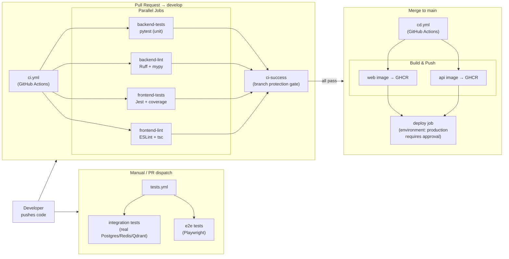
```mermaid
flowchart LR
    DEV["Developer\npushes code"]

    subgraph PR["Pull Request → develop"]
        CI["ci.yml\n(GitHub Actions)"]
        subgraph JOBS["Parallel Jobs"]
            FE_LINT["frontend-lint\nESLint + tsc"]
            FE_TEST["frontend-tests\nJest + coverage"]
            BE_LINT["backend-lint\nRuff + mypy"]
            BE_TEST["backend-tests\npytest (unit)"]
        end
        GATE["ci-success\n(branch protection gate)"]
    end

    subgraph MERGE["Merge to main"]
        CD["cd.yml\n(GitHub Actions)"]
        subgraph BUILD["Build & Push"]
            IMG_WEB["web image → GHCR"]
            IMG_API["api image → GHCR"]
        end
        DEPLOY["deploy job\n(environment: production\nrequires approval)"]
    end

    subgraph TESTS["Manual / PR dispatch"]
        TESTS_WF["tests.yml"]
        INT["integration tests\n(real Postgres/Redis/Qdrant)"]
        E2E["e2e tests\n(Playwright)"]
    end

    DEV --> PR
    CI --> FE_LINT & FE_TEST & BE_LINT & BE_TEST
    FE_LINT & FE_TEST & BE_LINT & BE_TEST --> GATE
    GATE -->|all pass| MERGE
    CD --> IMG_WEB & IMG_API --> DEPLOY
    DEV --> TESTS
    TESTS_WF --> INT & E2E
```

**Key decisions:**
- `ci-success` synthetic gate means branch protection needs only one check regardless of how many jobs are added
- CD triggers only on `main` — `develop` never auto-deploys
- Integration + E2E tests separated into `tests.yml` to keep CI fast

---

## Phase P0-4 · Backend Project Scaffold

**What changed:** The `apps/api/` placeholder is now a real FastAPI application with configuration, dependency injection, a health endpoint, and a production-grade Dockerfile.

### Design Level 4 — Backend Internal Architecture

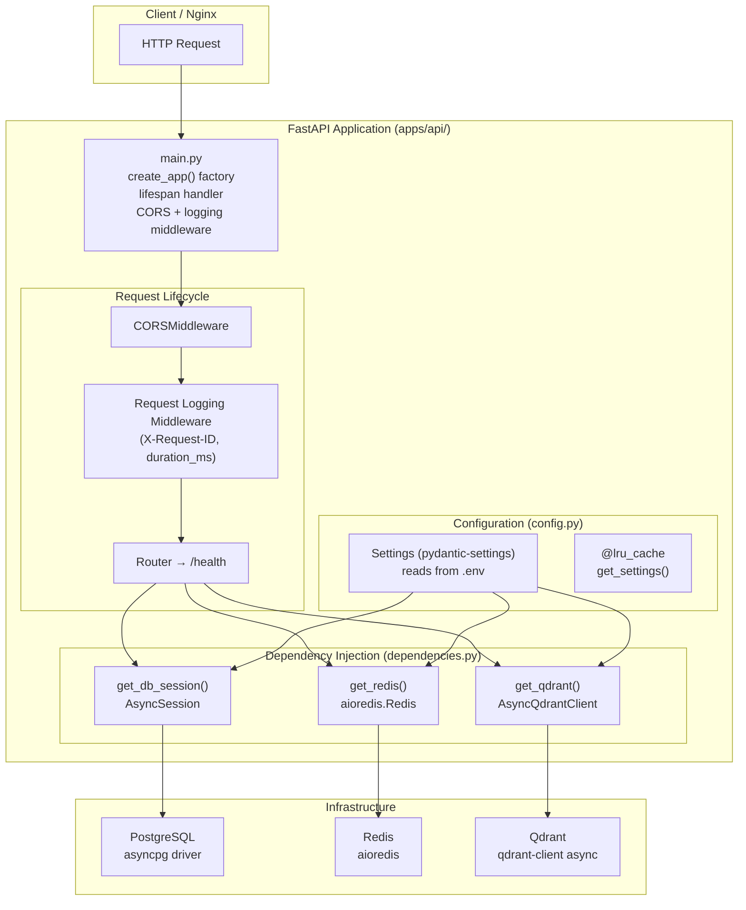
```mermaid
graph TB
    subgraph CLIENT["Client / Nginx"]
        REQ["HTTP Request"]
    end

    subgraph FASTAPI["FastAPI Application (apps/api/)"]
        MAIN["main.py\ncreate_app() factory\nlifespan handler\nCORS + logging middleware"]

        subgraph LAYERS["Request Lifecycle"]
            CORS_MW["CORSMiddleware"]
            LOG_MW["Request Logging Middleware\n(X-Request-ID, duration_ms)"]
            ROUTER["Router → /health"]
        end

        subgraph DI["Dependency Injection (dependencies.py)"]
            DB_DEP["get_db_session()\nAsyncSession"]
            REDIS_DEP["get_redis()\naioredis.Redis"]
            QDRANT_DEP["get_qdrant()\nAsyncQdrantClient"]
        end

        subgraph CONFIG["Configuration (config.py)"]
            SETTINGS["Settings (pydantic-settings)\nreads from .env"]
            CACHE["@lru_cache\nget_settings()"]
        end
    end

    subgraph INFRA["Infrastructure"]
        PG["PostgreSQL\nasyncpg driver"]
        RDS["Redis\naioredis"]
        QD["Qdrant\nqdrant-client async"]
    end

    REQ --> MAIN
    MAIN --> CORS_MW --> LOG_MW --> ROUTER
    ROUTER --> DB_DEP & REDIS_DEP & QDRANT_DEP
    DB_DEP --> PG
    REDIS_DEP --> RDS
    QDRANT_DEP --> QD
    SETTINGS --> DB_DEP & REDIS_DEP & QDRANT_DEP
```

**Key decisions:**
- `create_app()` factory (not module-level instance) enables isolated test clients
- `@lru_cache` on `get_settings()` means `.env` is parsed exactly once per process
- Type aliases (`DbSession = Annotated[AsyncSession, Depends(...)]`) keep route signatures clean
- 3-stage Dockerfile: builder (C tools) → development (hot-reload) → runtime (non-root, minimal)

---

## Phase P0-5 · Frontend Project Scaffold

**What changed:** The `apps/web/` placeholder is now a real Next.js 14 App Router application with TypeScript, Tailwind CSS, shadcn/ui configuration, Zustand state management setup, a typed API client, and a production-grade Dockerfile. The frontend can now serve a landing page and is ready for feature development.

### Design Level 5 — Frontend Internal Architecture

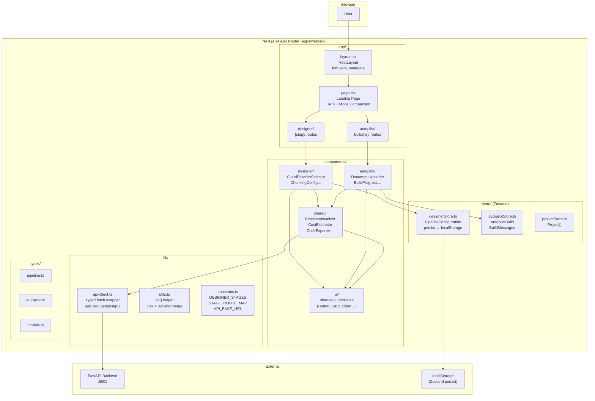
```mermaid
graph TB
    subgraph BROWSER["Browser"]
        USER["User"]
    end

    subgraph NEXTJS["Next.js 14 App Router (apps/web/src/)"]
        subgraph APP_DIR["app/"]
            LAYOUT["layout.tsx\nRootLayout\nfont vars, metadata"]
            PAGE["page.tsx\nLanding Page\nHero + Mode Comparison"]
            DESIGNER_RT["designer/\n[step]/ routes"]
            AUTOPILOT_RT["autopilot/\nbuild/[id]/ routes"]
        end

        subgraph COMPONENTS["components/"]
            UI_COMP["ui/\nshadcn/ui primitives\n(Button, Card, Slider…)"]
            DESIGNER_COMP["designer/\nCloudProviderSelector\nChunkingConfig…"]
            AUTOPILOT_COMP["autopilot/\nDocumentUploader\nBuildProgress…"]
            SHARED_COMP["shared/\nPipelineVisualizer\nCostEstimator\nCodeExporter…"]
        end

        subgraph LIB["lib/"]
            API_CLIENT["api-client.ts\nTyped fetch wrapper\napiClient.get/post/put"]
            UTILS["utils.ts\ncn() helper\nclsx + tailwind-merge"]
            CONSTANTS["constants.ts\nDESIGNER_STAGES\nSTAGE_ROUTE_MAP\nAPI_BASE_URL"]
        end

        subgraph STORE["store/ (Zustand)"]
            DS["designerStore.ts\nPipelineConfiguration\npersist → localStorage"]
            AS["autopilotStore.ts\nAutopilotBuild\nBuildMessages"]
            PS["projectStore.ts\nProject[]"]
        end

        subgraph TYPES["types/"]
            PIPELINE_T["pipeline.ts"]
            AUTOPILOT_T["autopilot.ts"]
            MODELS_T["models.ts"]
        end
    end

    subgraph EXTERNAL["External"]
        API["FastAPI Backend\n:8000"]
        LS["localStorage\n(Zustand persist)"]
    end

    USER --> LAYOUT
    LAYOUT --> PAGE
    PAGE --> DESIGNER_RT & AUTOPILOT_RT
    DESIGNER_RT --> DESIGNER_COMP
    AUTOPILOT_RT --> AUTOPILOT_COMP
    DESIGNER_COMP & AUTOPILOT_COMP --> SHARED_COMP
    SHARED_COMP --> API_CLIENT --> API
    DESIGNER_COMP --> DS
    AUTOPILOT_COMP --> AS
    DS --> LS
    DESIGNER_COMP & AUTOPILOT_COMP & SHARED_COMP --> UI_COMP
```

### Design Level 5b — Full Stack Integration View (P0-1 through P0-5)

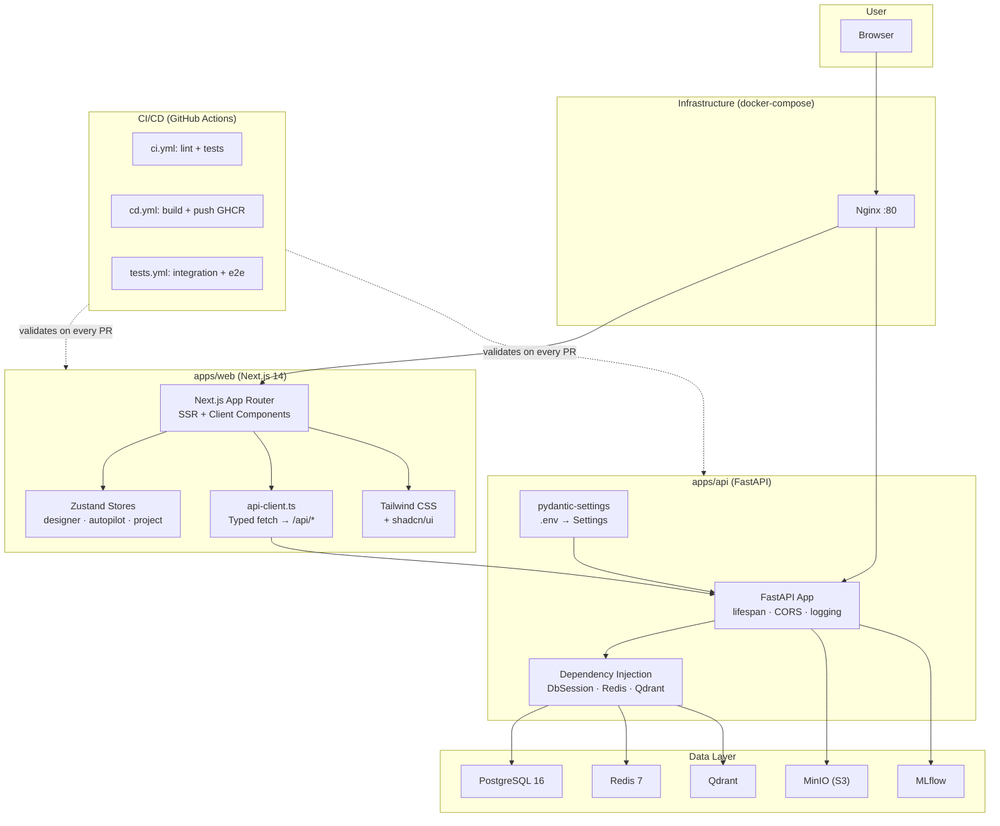
```mermaid
graph TB
    subgraph USER["User"]
        BROWSER["Browser"]
    end

    subgraph INFRA["Infrastructure (docker-compose)"]
        NGINX_BOX["Nginx :80"]
    end

    subgraph FRONTEND["apps/web (Next.js 14)"]
        NEXT_APP["Next.js App Router\nSSR + Client Components"]
        ZUSTAND["Zustand Stores\ndesigner · autopilot · project"]
        API_CL["api-client.ts\nTyped fetch → /api/*"]
        TW["Tailwind CSS\n+ shadcn/ui"]
    end

    subgraph BACKEND["apps/api (FastAPI)"]
        FASTAPI_APP["FastAPI App\nlifespan · CORS · logging"]
        DI_LAYER["Dependency Injection\nDbSession · Redis · Qdrant"]
        SETTINGS_BOX["pydantic-settings\n.env → Settings"]
    end

    subgraph DATA_STORES["Data Layer"]
        PG_BOX["PostgreSQL 16"]
        REDIS_BOX["Redis 7"]
        QDRANT_BOX["Qdrant"]
        MINIO_BOX["MinIO (S3)"]
        MLFLOW_BOX["MLflow"]
    end

    subgraph CI_CD["CI/CD (GitHub Actions)"]
        CI_BOX["ci.yml: lint + tests"]
        CD_BOX["cd.yml: build + push GHCR"]
        TESTS_BOX["tests.yml: integration + e2e"]
    end

    BROWSER --> NGINX_BOX
    NGINX_BOX --> NEXT_APP
    NGINX_BOX --> FASTAPI_APP
    NEXT_APP --> ZUSTAND
    NEXT_APP --> API_CL
    NEXT_APP --> TW
    API_CL --> FASTAPI_APP
    FASTAPI_APP --> DI_LAYER
    DI_LAYER --> PG_BOX & REDIS_BOX & QDRANT_BOX
    FASTAPI_APP --> MINIO_BOX & MLFLOW_BOX
    SETTINGS_BOX --> FASTAPI_APP

    CI_CD -.->|"validates on every PR"| FRONTEND
    CI_CD -.->|"validates on every PR"| BACKEND
```

**Key decisions:**
- `output: 'standalone'` in `next.config.js` reduces the production Docker image from ~400MB to ~120MB
- Zustand `persist` middleware serialises `PipelineConfiguration` to `localStorage` — users never lose in-progress pipeline designs on page refresh
- `api-client.ts` typed wrapper normalises errors into `ApiError` instances — all callers handle one error type
- CSS custom properties (`--primary`, `--background`) in `globals.css` enable runtime theme switching without rebuilding Tailwind
- `components.json` with `cssVariables: true` ensures shadcn/ui components inherit the same CSS tokens

---

---

## Phase P1-1 · JSON Model Catalogs

**What changed:** The `data/` directory is now the shared source of truth for all model metadata, strategies, pricing, and templates. Both frontend and backend read from these files — eliminating duplication and establishing a shared data contract.

### Design Level 6 — Shared Data Layer

```mermaid
graph TB
    subgraph DATA["data/ (Shared Catalog Layer)"]
        subgraph MODELS["data/models/"]
            EMB["embeddings.json\n10 models (OpenAI, Cohere,\nHuggingFace, Nomic)\ndimensions, cost, quality, tier"]
            GEN["generation.json\n9 LLMs (GPT-4o, Claude,\nGemini, Llama, Mistral)\ncontextWindow, costInput, costOutput"]
            RNK["rerankers.json\n4 models (Cohere, BGE,\nMS-MARCO, FlashRank)\ncost, quality, latency"]
        end

        subgraph STRATEGIES["data/"]
            CHK["chunking-strategies.json\n7 strategies\nbestFor, pros, cons, defaultConfig"]
            VEC["vector-stores.json\n9 stores (Qdrant, Pinecone,\nWeaviate, FAISS, pgvector...)\ntype, features, pricing"]
            RET["retrieval-strategies.json\n6 strategies (similarity, MMR,\nhybrid, parent-child, multi-query, ensemble)\nparameters, complexity"]
            CLD["cloud-providers.json\n4 providers (AWS, GCP,\nAzure, Multi-cloud)\nnativeServices, ragStudioDefaults"]
        end

        subgraph CATALOG["data/"]
            TPL["templates.json\n6 templates\nfull PipelineConfiguration per template"]
            PRC["pricing.json\nper-model costs\ncost calculator formulas\nbenchmark reference points"]
        end
    end

    subgraph FRONTEND["apps/web (Next.js)"]
        SEL["EmbeddingSelector\nVectorStoreSelector\nChunkingConfig\nCloudProviderSelector"]
        COST_FE["CostEstimator\n(reads pricing.json)"]
        TPL_FE["Template Gallery\n(reads templates.json)"]
    end

    subgraph BACKEND["apps/api (FastAPI)"]
        SCHEMA["Pydantic Schemas\n(validates model IDs against catalogs)"]
        COST_BE["cost_calculator.py\n(reads pricing.json)"]
        TPL_BE["TemplateService\n(reads templates.json)"]
    end

    EMB & GEN & RNK --> SEL
    PRC --> COST_FE & COST_BE
    TPL --> TPL_FE & TPL_BE
    CHK & VEC & RET & CLD --> SEL
    EMB & GEN --> SCHEMA
```

**Key decisions:**
- JSON files in `data/` serve as a **shared contract** — model IDs used in `PipelineConfiguration` are validated against these files on both frontend (TypeScript) and backend (Pydantic)
- `pricing.json` contains both raw prices AND documented formulas — cost calculator logic is traceable without reading code
- Templates store complete `PipelineConfiguration` objects — enabling atomic `POST /api/templates/{id}/apply` with no server-side merging
- `cloudProvider.ragStudioDefaults` cascades to downstream stages — selecting AWS pre-suggests OpenSearch, S3, and ECS Terraform templates
- Open-source models have `costPer1MTokens: 0.0` — the UI shows "free" but notes that self-hosting infrastructure costs apply

### Design Level 6b — Data Flow: JSON Catalog → UI → API

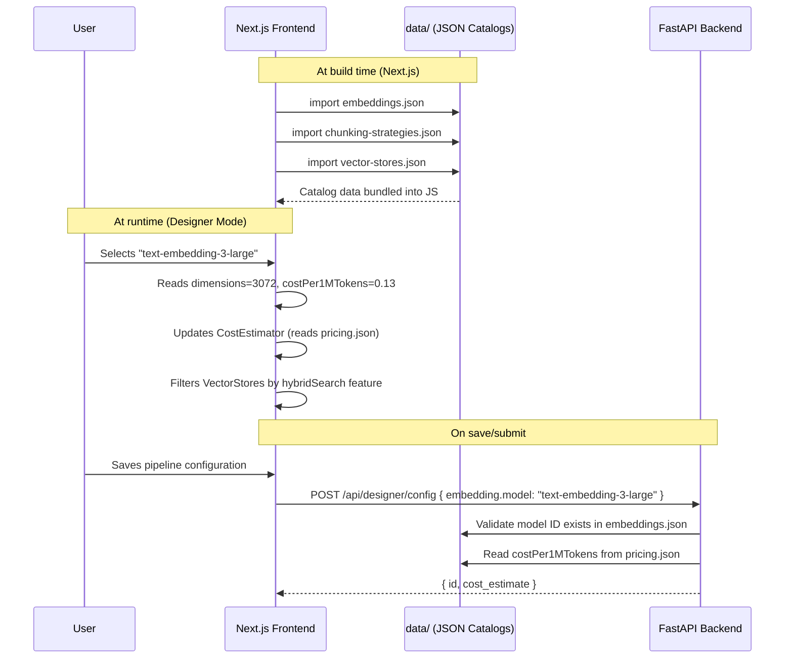
```mermaid
sequenceDiagram
    participant U as User
    participant FE as Next.js Frontend
    participant JSON as data/ (JSON Catalogs)
    participant API as FastAPI Backend

    Note over FE,JSON: At build time (Next.js)
    FE->>JSON: import embeddings.json
    FE->>JSON: import chunking-strategies.json
    FE->>JSON: import vector-stores.json
    JSON-->>FE: Catalog data bundled into JS

    Note over U,FE: At runtime (Designer Mode)
    U->>FE: Selects "text-embedding-3-large"
    FE->>FE: Reads dimensions=3072, costPer1MTokens=0.13
    FE->>FE: Updates CostEstimator (reads pricing.json)
    FE->>FE: Filters VectorStores by hybridSearch feature

    Note over FE,API: On save/submit
    U->>FE: Saves pipeline configuration
    FE->>API: POST /api/designer/config { embedding.model: "text-embedding-3-large" }
    API->>JSON: Validate model ID exists in embeddings.json
    API->>JSON: Read costPer1MTokens from pricing.json
    API-->>FE: { id, cost_estimate }
```

---

## Phase P1-2 · TypeScript Shared Types

**What changed:** The `apps/web/src/types/` directory now holds the complete TypeScript type system for the frontend. Every shape — from `PipelineConfiguration` to `AutopilotBuild` — is declared once, exported from a barrel, and shared across components, stores, and the API client. The JSON catalogs from P1-1 now have matching TypeScript interfaces, enabling type-safe imports of catalog data.

### Design Level 7 — TypeScript Type Layer

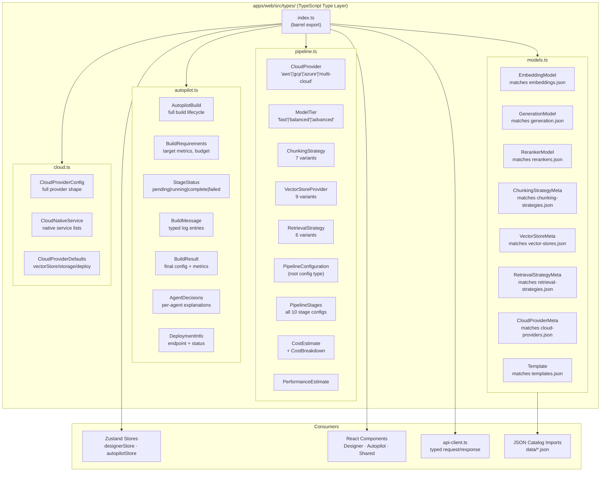
```mermaid
graph TB
    subgraph TYPES["apps/web/src/types/ (TypeScript Type Layer)"]
        INDEX["index.ts\n(barrel export)"]

        subgraph PIPELINE["pipeline.ts"]
            CP["CloudProvider\n'aws'|'gcp'|'azure'|'multi-cloud'"]
            MT["ModelTier\n'fast'|'balanced'|'advanced'"]
            CS["ChunkingStrategy\n7 variants"]
            VSP["VectorStoreProvider\n9 variants"]
            RS["RetrievalStrategy\n6 variants"]
            PC["PipelineConfiguration\n(root config type)"]
            STAGES["PipelineStages\nall 10 stage configs"]
            COST["CostEstimate\n+ CostBreakdown"]
            PERF["PerformanceEstimate"]
        end

        subgraph AUTOPILOT["autopilot.ts"]
            AB["AutopilotBuild\nfull build lifecycle"]
            BR["BuildRequirements\ntarget metrics, budget"]
            SS["StageStatus\npending|running|complete|failed"]
            BM["BuildMessage\ntyped log entries"]
            RESULT["BuildResult\nfinal config + metrics"]
            AD["AgentDecisions\nper-agent explanations"]
            DI["DeploymentInfo\nendpoint + status"]
        end

        subgraph MODELS["models.ts"]
            EM["EmbeddingModel\nmatches embeddings.json"]
            GM["GenerationModel\nmatches generation.json"]
            RM["RerankerModel\nmatches rerankers.json"]
            CSM["ChunkingStrategyMeta\nmatches chunking-strategies.json"]
            VSM["VectorStoreMeta\nmatches vector-stores.json"]
            RSM["RetrievalStrategyMeta\nmatches retrieval-strategies.json"]
            CPM["CloudProviderMeta\nmatches cloud-providers.json"]
            TPL["Template\nmatches templates.json"]
        end

        subgraph CLOUD["cloud.ts"]
            CPC["CloudProviderConfig\nfull provider shape"]
            CNS["CloudNativeService\nnative service lists"]
            CPD["CloudProviderDefaults\nvectorStore/storage/deploy"]
        end

        INDEX --> PIPELINE
        INDEX --> AUTOPILOT
        INDEX --> MODELS
        INDEX --> CLOUD
    end

    subgraph CONSUMERS["Consumers"]
        STORE["Zustand Stores\ndesignerStore · autopilotStore"]
        COMP["React Components\nDesigner · Autopilot · Shared"]
        API_CL["api-client.ts\ntyped request/response"]
        JSON_IMPORT["JSON Catalog Imports\ndata/*.json"]
    end

    INDEX --> STORE
    INDEX --> COMP
    INDEX --> API_CL
    MODELS --> JSON_IMPORT
```

### Design Level 7b — Type Dependency Graph

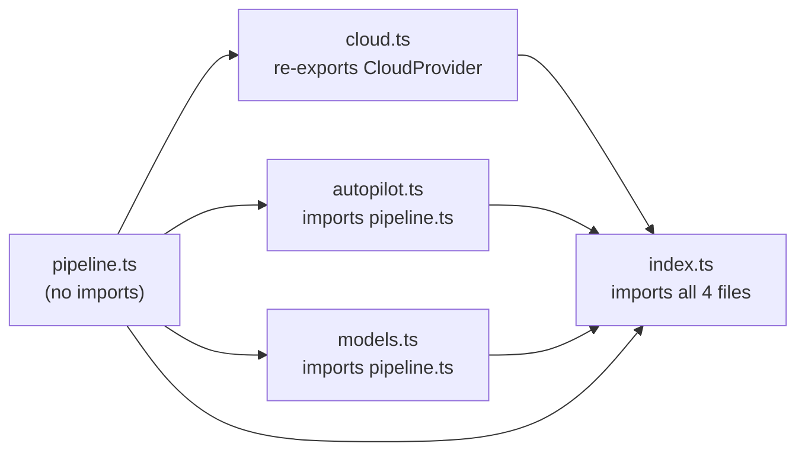
```mermaid
graph LR
    PIPELINE["pipeline.ts\n(no imports)"]
    CLOUD["cloud.ts\nre-exports CloudProvider"]
    AUTOPILOT["autopilot.ts\nimports pipeline.ts"]
    MODELS["models.ts\nimports pipeline.ts"]
    INDEX["index.ts\nimports all 4 files"]

    PIPELINE --> CLOUD
    PIPELINE --> AUTOPILOT
    PIPELINE --> MODELS
    CLOUD --> INDEX
    AUTOPILOT --> INDEX
    MODELS --> INDEX
    PIPELINE --> INDEX
```

**Key decisions:**
- `pipeline.ts` has zero imports — it is the leaf of the dependency graph; all other type files depend on it, never the reverse
- `CloudProvider` defined once in `pipeline.ts`; `cloud.ts` re-exports it for cloud-module consumers; `index.ts` exposes it only from `pipeline.ts` to prevent duplicate-export errors
- Object shapes use `interface` (better error messages, supports `extends`); union enumerations use `type` (required for string-literal unions)
- Optional stage fields (`reranking?`, `routing?`, `memory?`, `evaluation?`) model business rules directly — stages that must always be present are required, opt-in features are optional
- `stages: Record<string, StageStatus>` in `AutopilotBuild` uses a dictionary (not array) for O(1) lookup by stage ID in UI rendering
- `AgentDecisions` typed structure enables the "Explain in Designer" feature — the Decision Explainer renders named fields rather than raw JSON

---

---

## Phase P1-3 · Python Pydantic Schemas

**What changed:** The `apps/api/app/schemas/` package now provides Pydantic v2 schemas for every API boundary. These are the Python mirror of the TypeScript types (P1-2) and use the same enum values as the JSON catalogs (P1-1). The shared contract is now complete on both sides.

### Design Level 8 — Python Schema Layer

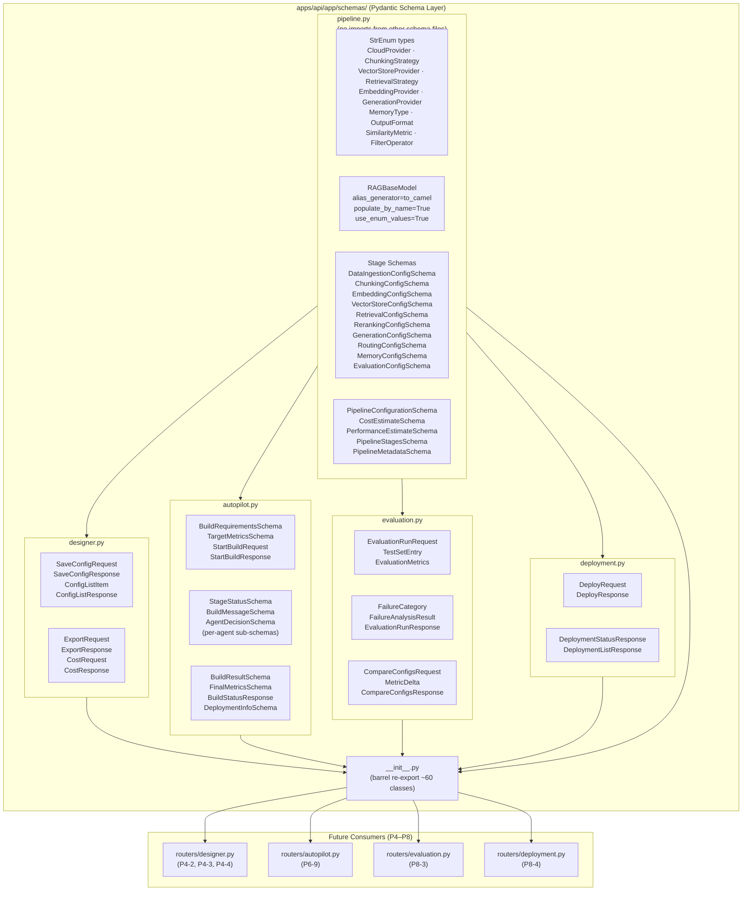
```mermaid
graph TB
    subgraph SCHEMAS["apps/api/app/schemas/ (Pydantic Schema Layer)"]
        INIT["__init__.py\n(barrel re-export ~60 classes)"]

        subgraph PIPELINE["pipeline.py\n(no imports from other schema files)"]
            ENUMS["StrEnum types\nCloudProvider · ChunkingStrategy\nVectorStoreProvider · RetrievalStrategy\nEmbeddingProvider · GenerationProvider\nMemoryType · OutputFormat\nSimilarityMetric · FilterOperator"]
            BASE["RAGBaseModel\nalias_generator=to_camel\npopulate_by_name=True\nuse_enum_values=True"]
            STAGE_SCHEMAS["Stage Schemas\nDataIngestionConfigSchema\nChunkingConfigSchema\nEmbeddingConfigSchema\nVectorStoreConfigSchema\nRetrievalConfigSchema\nRerankingConfigSchema\nGenerationConfigSchema\nRoutingConfigSchema\nMemoryConfigSchema\nEvaluationConfigSchema"]
            TOP_LEVEL["PipelineConfigurationSchema\nCostEstimateSchema\nPerformanceEstimateSchema\nPipelineStagesSchema\nPipelineMetadataSchema"]
        end

        subgraph DESIGNER["designer.py"]
            D1["SaveConfigRequest\nSaveConfigResponse\nConfigListItem\nConfigListResponse"]
            D2["ExportRequest\nExportResponse\nCostRequest\nCostResponse"]
        end

        subgraph AUTOPILOT["autopilot.py"]
            A1["BuildRequirementsSchema\nTargetMetricsSchema\nStartBuildRequest\nStartBuildResponse"]
            A2["StageStatusSchema\nBuildMessageSchema\nAgentDecisionSchema\n(per-agent sub-schemas)"]
            A3["BuildResultSchema\nFinalMetricsSchema\nBuildStatusResponse\nDeploymentInfoSchema"]
        end

        subgraph EVALUATION["evaluation.py"]
            E1["EvaluationRunRequest\nTestSetEntry\nEvaluationMetrics"]
            E2["FailureCategory\nFailureAnalysisResult\nEvaluationRunResponse"]
            E3["CompareConfigsRequest\nMetricDelta\nCompareConfigsResponse"]
        end

        subgraph DEPLOYMENT["deployment.py"]
            DP1["DeployRequest\nDeployResponse"]
            DP2["DeploymentStatusResponse\nDeploymentListResponse"]
        end

        PIPELINE --> DESIGNER
        PIPELINE --> AUTOPILOT
        PIPELINE --> EVALUATION
        PIPELINE --> DEPLOYMENT
        DESIGNER --> INIT
        AUTOPILOT --> INIT
        EVALUATION --> INIT
        DEPLOYMENT --> INIT
        PIPELINE --> INIT
    end

    subgraph CONSUMERS["Future Consumers (P4–P8)"]
        ROUTER_D["routers/designer.py\n(P4-2, P4-3, P4-4)"]
        ROUTER_A["routers/autopilot.py\n(P6-9)"]
        ROUTER_E["routers/evaluation.py\n(P8-3)"]
        ROUTER_DP["routers/deployment.py\n(P8-4)"]
    end

    INIT --> ROUTER_D
    INIT --> ROUTER_A
    INIT --> ROUTER_E
    INIT --> ROUTER_DP
```

### Design Level 8b — Schema ↔ Catalog ↔ TypeScript Contract

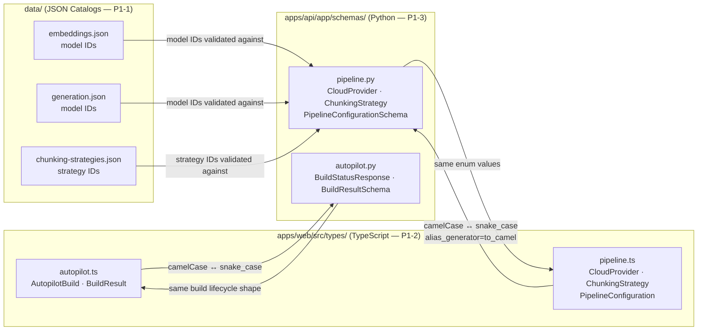
```mermaid
graph LR
    subgraph JSON["data/ (JSON Catalogs — P1-1)"]
        EMB_J["embeddings.json\nmodel IDs"]
        GEN_J["generation.json\nmodel IDs"]
        CHK_J["chunking-strategies.json\nstrategy IDs"]
    end

    subgraph TS["apps/web/src/types/ (TypeScript — P1-2)"]
        TS_P["pipeline.ts\nCloudProvider · ChunkingStrategy\nPipelineConfiguration"]
        TS_A["autopilot.ts\nAutopilotBuild · BuildResult"]
    end

    subgraph PY["apps/api/app/schemas/ (Python — P1-3)"]
        PY_P["pipeline.py\nCloudProvider · ChunkingStrategy\nPipelineConfigurationSchema"]
        PY_A["autopilot.py\nBuildStatusResponse · BuildResultSchema"]
    end

    EMB_J -- "model IDs validated against" --> PY_P
    GEN_J -- "model IDs validated against" --> PY_P
    CHK_J -- "strategy IDs validated against" --> PY_P

    TS_P -- "camelCase ↔ snake_case\nalias_generator=to_camel" --> PY_P
    TS_A -- "camelCase ↔ snake_case" --> PY_A

    PY_P -- "same enum values" --> TS_P
    PY_A -- "same build lifecycle shape" --> TS_A
```

**Key decisions:**
- `RAGBaseModel` shared base with `alias_generator=to_camel` — one change propagates camelCase aliases to all ~60 schemas
- `StrEnum` for all enumerated values — members ARE strings, so they serialise and compare without `.value` calls
- `pipeline.py` has zero imports from other schema files — it is the leaf of the schema dependency graph, preventing circular imports
- `__init__.py` barrel with explicit `__all__` — single import point for all routers; refactoring a schema's file location only requires updating the barrel
- `from_attributes=True` deliberately omitted — will be added to `RAGBaseModel` in P1-4 when ORM models are introduced

---

## Design Progression Summary

| Phase | Layer Added | Key Artefact |
|-------|------------|-------------|
| P0-1 | Repository structure | `package.json` workspaces, `.gitignore`, `.env.example` |
| P0-2 | Live service mesh | `docker/docker-compose.yml` — 9 services wired |
| P0-3 | Quality gates | `.github/workflows/ci.yml`, `cd.yml`, `tests.yml` |
| P0-4 | Backend application | `apps/api/app/main.py`, `config.py`, `dependencies.py`, `Dockerfile` |
| P0-5 | Frontend application | `apps/web/src/` — Next.js 14 App Router, Zustand, API client, Tailwind, Dockerfile |
| P1-1 | Shared data layer | `data/` — 9 JSON catalogs covering models, strategies, pricing, and templates |
| P1-2 | TypeScript type system | `apps/web/src/types/` — 4 type files + barrel export; all catalog shapes typed |
| P1-3 | Python schema layer | `apps/api/app/schemas/` — 6 files, ~60 Pydantic v2 schemas; camelCase aliases; StrEnum types |
| P1-4 | Database + migrations | `apps/api/app/models/` — 5 ORM models; `alembic/` — initial migration, 5 tables, indexes, FK constraints |
| P2-1 | Document ingestion core | `apps/api/app/core/ingestion/` — loaders, preprocessors, extractors, `IngestionService` |
| P2-2 | Chunking core | `apps/api/app/core/chunking/` — 8 strategies, `ChunkerFactory`, `ChunkQualityScorer`, `ChunkingService` |
| P2-3 | Embedding core | `apps/api/app/core/embedding/` — 5 providers, `EmbeddingCache`, `EmbeddingBenchmarker`, `EmbeddingService` |
| P2-4 | Vector store core | `apps/api/app/core/vectorstore/` — Qdrant / Pinecone / Weaviate clients, `VectorStoreFactory`, `VectorStoreService` |

---

## Phase P1-4 — Database Schema & Migrations

### Design Level 9 — ORM Model Layer

The database layer sits between the Pydantic schema layer and the service/route layer. It introduces 5 SQLAlchemy 2.0 ORM models with typed `Mapped[T]` annotations, JSONB columns for nested structures, and Alembic migrations for async PostgreSQL.

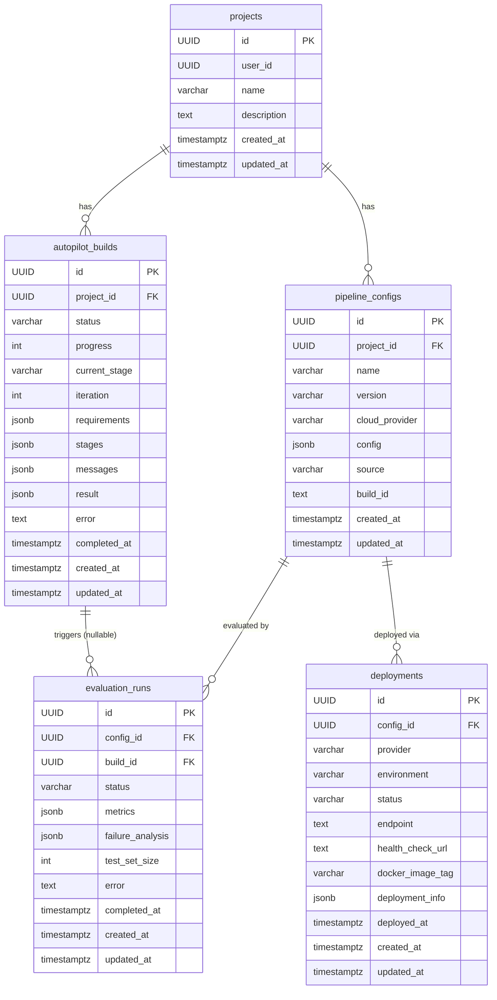
```mermaid
erDiagram
    projects {
        UUID id PK
        UUID user_id
        varchar name
        text description
        timestamptz created_at
        timestamptz updated_at
    }

    pipeline_configs {
        UUID id PK
        UUID project_id FK
        varchar name
        varchar version
        varchar cloud_provider
        jsonb config
        varchar source
        text build_id
        timestamptz created_at
        timestamptz updated_at
    }

    autopilot_builds {
        UUID id PK
        UUID project_id FK
        varchar status
        int progress
        varchar current_stage
        int iteration
        jsonb requirements
        jsonb stages
        jsonb messages
        jsonb result
        text error
        timestamptz completed_at
        timestamptz created_at
        timestamptz updated_at
    }

    evaluation_runs {
        UUID id PK
        UUID config_id FK
        UUID build_id FK
        varchar status
        jsonb metrics
        jsonb failure_analysis
        int test_set_size
        text error
        timestamptz completed_at
        timestamptz created_at
        timestamptz updated_at
    }

    deployments {
        UUID id PK
        UUID config_id FK
        varchar provider
        varchar environment
        varchar status
        text endpoint
        text health_check_url
        varchar docker_image_tag
        jsonb deployment_info
        timestamptz deployed_at
        timestamptz created_at
        timestamptz updated_at
    }

    projects ||--o{ pipeline_configs : "has"
    projects ||--o{ autopilot_builds : "has"
    pipeline_configs ||--o{ evaluation_runs : "evaluated by"
    pipeline_configs ||--o{ deployments : "deployed via"
    autopilot_builds ||--o{ evaluation_runs : "triggers (nullable)"
```

---

### Design Level 9b — ORM to Schema Data Flow

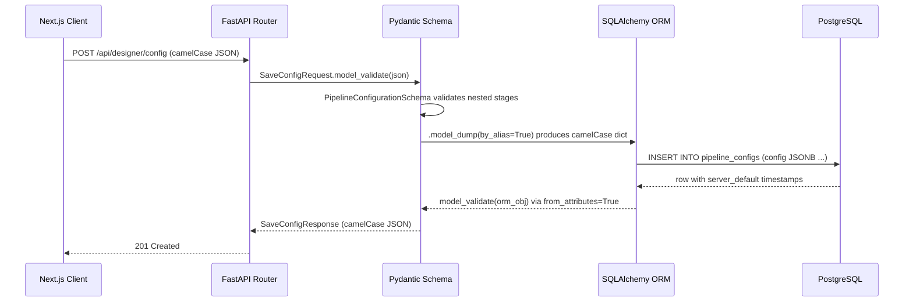
```mermaid
sequenceDiagram
    participant Client as Next.js Client
    participant API as FastAPI Router
    participant Schema as Pydantic Schema
    participant ORM as SQLAlchemy ORM
    participant DB as PostgreSQL

    Client->>API: POST /api/designer/config (camelCase JSON)
    API->>Schema: SaveConfigRequest.model_validate(json)
    Schema->>Schema: PipelineConfigurationSchema validates nested stages
    Schema->>ORM: .model_dump(by_alias=True) produces camelCase dict
    ORM->>DB: INSERT INTO pipeline_configs (config JSONB ...)
    DB-->>ORM: row with server_default timestamps
    ORM-->>Schema: model_validate(orm_obj) via from_attributes=True
    Schema-->>API: SaveConfigResponse (camelCase JSON)
    API-->>Client: 201 Created
```

---

### Design Level 9c — Alembic Migration Architecture

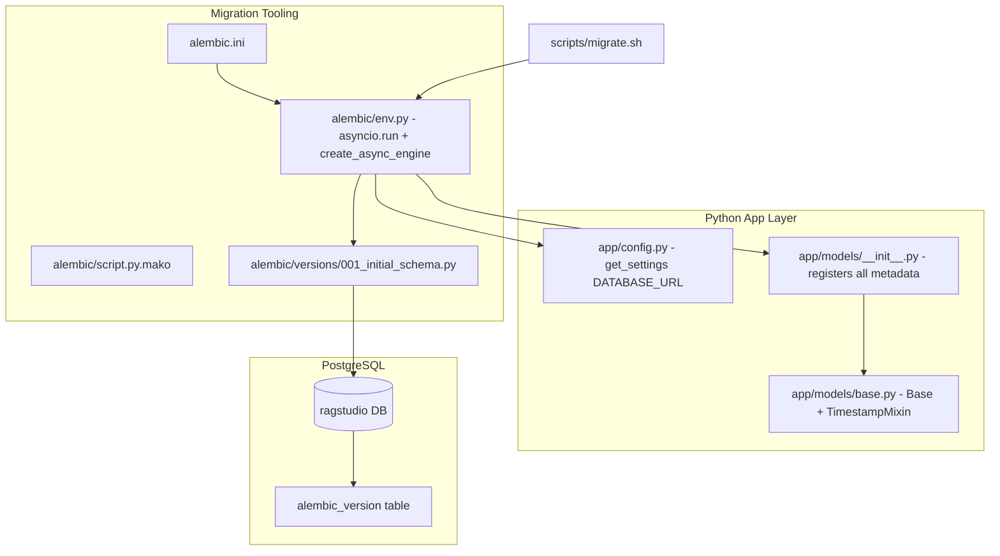
```mermaid
graph TB
    subgraph "Migration Tooling"
        INI[alembic.ini]
        ENV[alembic/env.py - asyncio.run + create_async_engine]
        MAKO[alembic/script.py.mako]
        V001[alembic/versions/001_initial_schema.py]
    end

    subgraph "Python App Layer"
        SETTINGS[app/config.py - get_settings DATABASE_URL]
        BASE[app/models/base.py - Base + TimestampMixin]
        INIT[app/models/__init__.py - registers all metadata]
    end

    subgraph "PostgreSQL"
        PG[(ragstudio DB)]
        AM[alembic_version table]
    end

    INI --> ENV
    ENV --> SETTINGS
    ENV --> INIT
    INIT --> BASE
    ENV --> V001
    V001 --> PG
    PG --> AM
    SCRIPTS[scripts/migrate.sh] --> ENV
```

---

## Phase P2-1 · Document Ingestion Service

**What changed:** Implemented the first core service layer module — a format-agnostic document ingestion pipeline. The backend can now load text from PDFs, DOCX, TXT, Markdown, HTML, CSV, JSON files, and remote URLs, clean the text, extract rich metadata, and return a unified list of LangChain `Document` objects ready for the downstream chunking service.

### Design Level 10 — Document Ingestion Pipeline

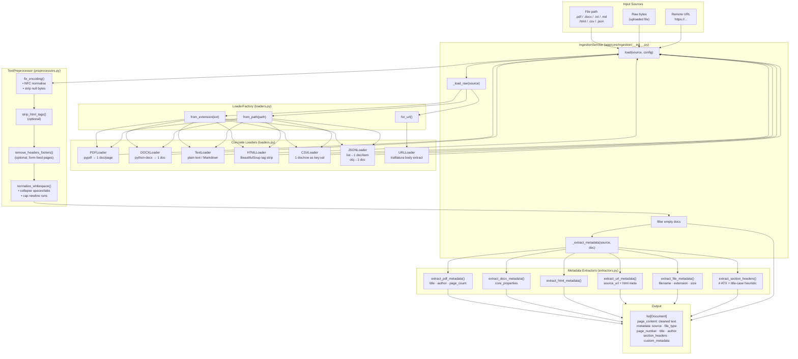
```mermaid
flowchart TD
    subgraph INPUT["Input Sources"]
        FILE["File path\n.pdf / .docx / .txt / .md\n.html / .csv / .json"]
        BYTES["Raw bytes\n(uploaded file)"]
        URL["Remote URL\nhttps://..."]
    end

    subgraph INGESTION_SERVICE["IngestionService  (app/core/ingestion/__init__.py)"]
        IS_LOAD["load(source, config)"]
        IS_LOADRAW["_load_raw(source)"]
        IS_META["_extract_metadata(source, doc)"]
        IS_FILTER["filter empty docs"]
    end

    subgraph LOADER_FACTORY["LoaderFactory  (loaders.py)"]
        LF_EXT["from_extension(ext)"]
        LF_PATH["from_path(path)"]
        LF_URL["for_url()"]
    end

    subgraph LOADERS["Concrete Loaders  (loaders.py)"]
        PDF_L["PDFLoader\npypdf → 1 doc/page"]
        DOCX_L["DOCXLoader\npython-docx → 1 doc"]
        TXT_L["TextLoader\nplain text / Markdown"]
        HTML_L["HTMLLoader\nBeautifulSoup tag strip"]
        CSV_L["CSVLoader\n1 doc/row as key:val"]
        JSON_L["JSONLoader\nlist→1 doc/item\nobj→1 doc"]
        URL_L["URLLoader\ntrafilatura body extract"]
    end

    subgraph PREPROCESSORS["TextPreprocessor  (preprocessors.py)"]
        FE["fix_encoding()\n• NFC normalise\n• strip null bytes"]
        SH["strip_html_tags()\n(optional)"]
        RHF["remove_headers_footers()\n(optional, form-feed pages)"]
        NW["normalize_whitespace()\n• collapse spaces/tabs\n• cap newline runs"]
    end

    subgraph EXTRACTORS["Metadata Extractors  (extractors.py)"]
        EPDF["extract_pdf_metadata()\ntitle · author · page_count"]
        EDOCX["extract_docx_metadata()\ncore_properties"]
        EHTML["extract_html_metadata()\n<title> · meta tags · og:*"]
        EURL["extract_url_metadata()\nsource_url + html meta"]
        EFILE["extract_file_metadata()\nfilename · extension · size"]
        ESEC["extract_section_headers()\n# ATX + title-case heuristic"]
    end

    subgraph OUTPUT["Output"]
        DOCS["list[Document]\npage_content: cleaned text\nmetadata: source · file_type\npage_number · title · author\nsection_headers · custom_metadata"]
    end

    FILE --> IS_LOAD
    BYTES --> IS_LOAD
    URL --> IS_LOAD

    IS_LOAD --> IS_LOADRAW
    IS_LOADRAW --> LF_EXT
    IS_LOADRAW --> LF_PATH
    IS_LOADRAW --> LF_URL

    LF_EXT & LF_PATH --> PDF_L & DOCX_L & TXT_L & HTML_L & CSV_L & JSON_L
    LF_URL --> URL_L

    PDF_L & DOCX_L & TXT_L & HTML_L & CSV_L & JSON_L & URL_L --> IS_LOAD

    IS_LOAD --> FE --> SH --> RHF --> NW
    NW --> IS_FILTER
    IS_FILTER --> IS_META

    IS_META --> EPDF
    IS_META --> EDOCX
    IS_META --> EHTML
    IS_META --> EURL
    IS_META --> EFILE
    IS_META --> ESEC

    EPDF & EDOCX & EHTML & EURL & EFILE & ESEC --> OUTPUT
    IS_FILTER --> OUTPUT
```

### Design Level 10b — Ingestion Service in Full Stack Context

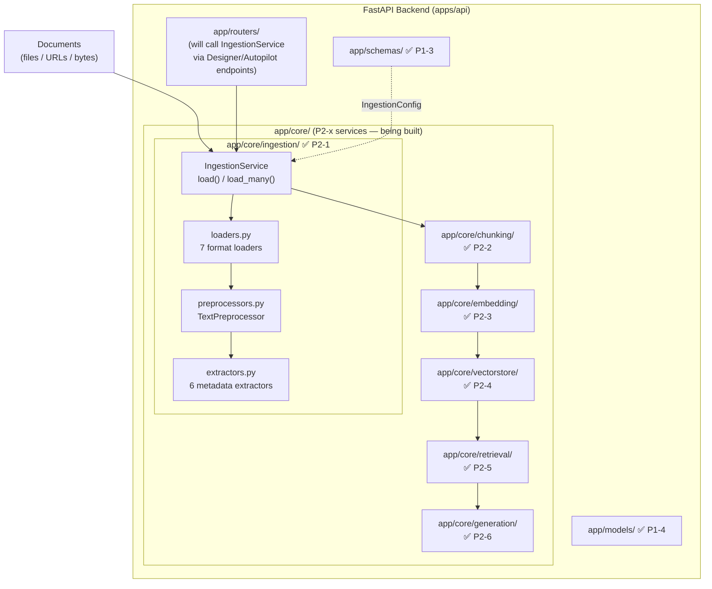
```mermaid
graph TB
    subgraph API["FastAPI Backend (apps/api)"]
        subgraph CORE["app/core/ (P2-x services — being built)"]
            subgraph INGESTION["app/core/ingestion/ ✅ P2-1"]
                ING_SVC["IngestionService\nload() / load_many()"]
                LOADERS_M["loaders.py\n7 format loaders"]
                PREPRO_M["preprocessors.py\nTextPreprocessor"]
                EXTRAC_M["extractors.py\n6 metadata extractors"]
            end
            CHUNKING["app/core/chunking/\n✅ P2-2"]
            EMBEDDING["app/core/embedding/\n✅ P2-3"]
            VECTORSTORE["app/core/vectorstore/\n✅ P2-4"]
            RETRIEVAL["app/core/retrieval/\n✅ P2-5"]
            GENERATION["app/core/generation/\n✅ P2-6"]
        end

        ROUTERS["app/routers/\n(will call IngestionService\nvia Designer/Autopilot endpoints)"]
        MODELS_M["app/models/ ✅ P1-4"]
        SCHEMAS_M["app/schemas/ ✅ P1-3"]
    end

    DOCS_IN["Documents\n(files / URLs / bytes)"] --> ING_SVC
    ING_SVC --> LOADERS_M --> PREPRO_M --> EXTRAC_M
    ING_SVC --> CHUNKING
    CHUNKING --> EMBEDDING
    EMBEDDING --> VECTORSTORE
    VECTORSTORE --> RETRIEVAL
    RETRIEVAL --> GENERATION
    ROUTERS --> ING_SVC
    SCHEMAS_M -.->|IngestionConfig| ING_SVC
```

---

## Phase P2-2 · Chunking Service

**What changed:** Implemented the second core service — the Chunking layer. The service accepts `list[Document]` from the Ingestion Service and returns `list[Chunk]` (a `Document` type alias with enriched metadata). Eight chunking strategies are available, each isolated in its own module. A `ChunkerFactory` dispatches to the correct implementation via a strategy-name map. `ChunkQualityScorer` enables Autopilot agents to filter low-quality chunks before embedding.

### Design Level 11 — Chunking Service Architecture

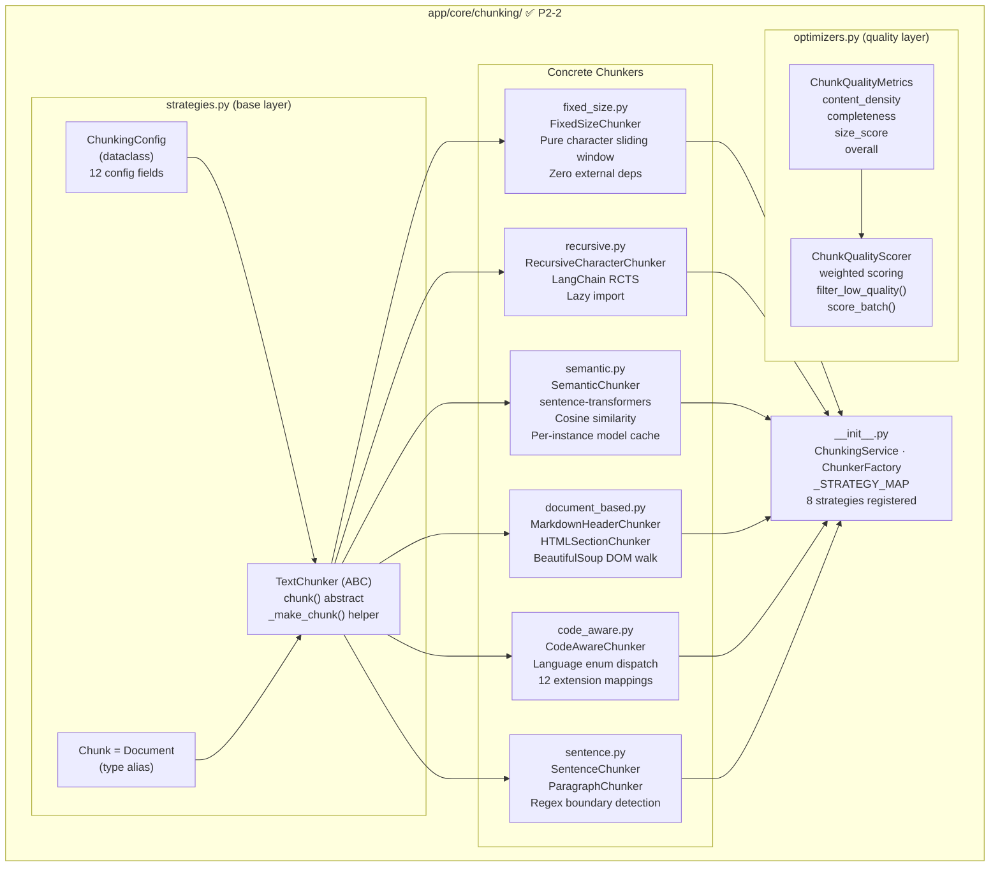
```mermaid
graph TD
    subgraph CHUNKING_PKG["app/core/chunking/ ✅ P2-2"]
        INIT["__init__.py\nChunkingService · ChunkerFactory\n_STRATEGY_MAP\n8 strategies registered"]

        subgraph BASE["strategies.py (base layer)"]
            CHUNK_ALIAS["Chunk = Document\n(type alias)"]
            CFG["ChunkingConfig\n(dataclass)\n12 config fields"]
            ABC_CLS["TextChunker (ABC)\nchunk() abstract\n_make_chunk() helper"]
        end

        subgraph STRATEGIES["Concrete Chunkers"]
            FX["fixed_size.py\nFixedSizeChunker\nPure character sliding window\nZero external deps"]
            RC["recursive.py\nRecursiveCharacterChunker\nLangChain RCTS\nLazy import"]
            SEM["semantic.py\nSemanticChunker\nsentence-transformers\nCosine similarity\nPer-instance model cache"]
            DOC["document_based.py\nMarkdownHeaderChunker\nHTMLSectionChunker\nBeautifulSoup DOM walk"]
            CODE["code_aware.py\nCodeAwareChunker\nLanguage enum dispatch\n12 extension mappings"]
            SENT["sentence.py\nSentenceChunker\nParagraphChunker\nRegex boundary detection"]
        end

        subgraph QUALITY["optimizers.py (quality layer)"]
            METRICS["ChunkQualityMetrics\ncontent_density\ncompleteness\nsize_score\noverall"]
            SCORER["ChunkQualityScorer\nweighted scoring\nfilter_low_quality()\nscore_batch()"]
        end
    end

    ABC_CLS --> FX & RC & SEM & DOC & CODE & SENT
    CFG --> ABC_CLS
    CHUNK_ALIAS --> ABC_CLS
    FX & RC & SEM & DOC & CODE & SENT --> INIT
    METRICS --> SCORER
```

### Design Level 11b — Chunking Data Flow

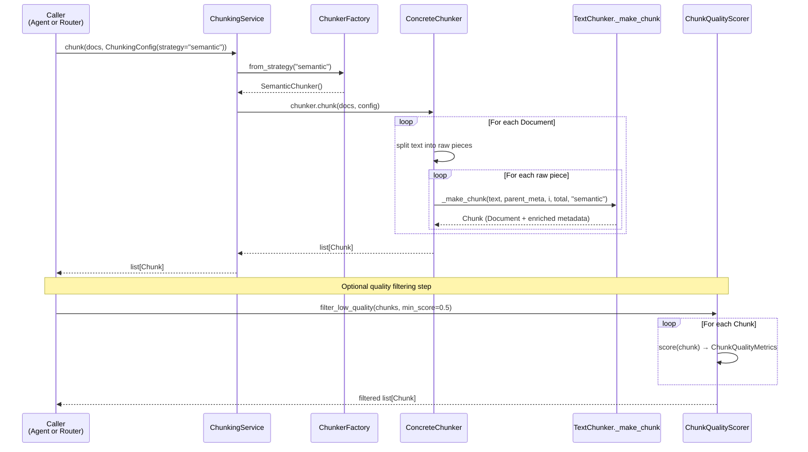
```mermaid
sequenceDiagram
    participant CALLER as Caller<br/>(Agent or Router)
    participant SVC as ChunkingService
    participant FAC as ChunkerFactory
    participant STRAT as ConcreteChunker
    participant ABC as TextChunker._make_chunk
    participant SCORER as ChunkQualityScorer

    CALLER->>SVC: chunk(docs, ChunkingConfig(strategy="semantic"))
    SVC->>FAC: from_strategy("semantic")
    FAC-->>SVC: SemanticChunker()
    SVC->>STRAT: chunker.chunk(docs, config)
    loop For each Document
        STRAT->>STRAT: split text into raw pieces
        loop For each raw piece
            STRAT->>ABC: _make_chunk(text, parent_meta, i, total, "semantic")
            ABC-->>STRAT: Chunk (Document + enriched metadata)
        end
    end
    STRAT-->>SVC: list[Chunk]
    SVC-->>CALLER: list[Chunk]

    Note over CALLER,SCORER: Optional quality filtering step
    CALLER->>SCORER: filter_low_quality(chunks, min_score=0.5)
    loop For each Chunk
        SCORER->>SCORER: score(chunk) → ChunkQualityMetrics
    end
    SCORER-->>CALLER: filtered list[Chunk]
```

### Design Level 11c — Chunking Service in Full Stack Context

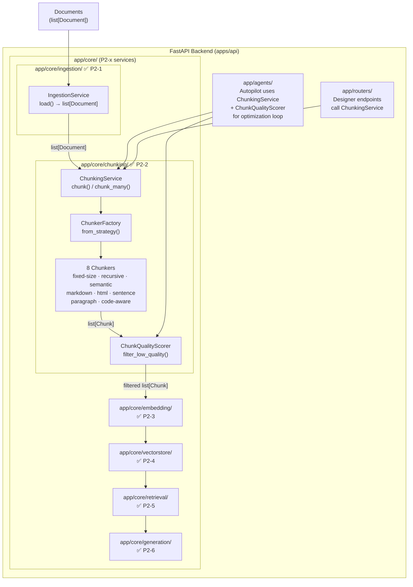
```mermaid
graph TB
    subgraph API["FastAPI Backend (apps/api)"]
        subgraph CORE["app/core/ (P2-x services)"]
            subgraph INGESTION_BOX["app/core/ingestion/ ✅ P2-1"]
                ING_SVC2["IngestionService\nload() → list[Document]"]
            end

            subgraph CHUNKING_BOX["app/core/chunking/ ✅ P2-2"]
                CHUNK_SVC["ChunkingService\nchunk() / chunk_many()"]
                CHUNK_FAC["ChunkerFactory\nfrom_strategy()"]
                EIGHT_STRAT["8 Chunkers\nfixed-size · recursive · semantic\nmarkdown · html · sentence\nparagraph · code-aware"]
                QUALITY_SVC["ChunkQualityScorer\nfilter_low_quality()"]
            end

            EMBEDDING_BOX["app/core/embedding/\n✅ P2-3"]
            VECTORSTORE_BOX["app/core/vectorstore/\n✅ P2-4"]
            RETRIEVAL_BOX["app/core/retrieval/\n✅ P2-5"]
            GENERATION_BOX["app/core/generation/\n✅ P2-6"]
        end

        AGENTS["app/agents/\nAutopilot uses ChunkingService\n+ ChunkQualityScorer\nfor optimization loop"]
        ROUTERS2["app/routers/\nDesigner endpoints\ncall ChunkingService"]
    end

    DOCS["Documents\n(list[Document])"] --> ING_SVC2
    ING_SVC2 -->|"list[Document]"| CHUNK_SVC
    CHUNK_SVC --> CHUNK_FAC --> EIGHT_STRAT
    EIGHT_STRAT -->|"list[Chunk]"| QUALITY_SVC
    QUALITY_SVC -->|"filtered list[Chunk]"| EMBEDDING_BOX
    EMBEDDING_BOX --> VECTORSTORE_BOX --> RETRIEVAL_BOX --> GENERATION_BOX
    AGENTS --> CHUNK_SVC
    AGENTS --> QUALITY_SVC
    ROUTERS2 --> CHUNK_SVC
```

---

## Phase P2-3 · Embedding Service

**What changed:** Implemented the third core service — the Embedding layer. The service accepts `list[Document]` (output of ChunkingService) and returns `list[tuple[Document, Embedding]]` — each chunk paired with its float vector, ready for upsert into the vector store. Five provider wrappers cover every model in the catalog (OpenAI, Cohere, Google, HuggingFace, Nomic). An `EmbeddingBenchmarker` lets Autopilot agents compare providers on throughput. An `EmbeddingCache` backed by Redis (with in-process dict fallback) eliminates redundant API calls for duplicate texts.

### Design Level 12 — Embedding Service Architecture

```mermaid
graph TD
    subgraph EMBEDDING_PKG["app/core/embedding/ ✅ P2-3"]
        INIT["__init__.py\nEmbeddingService · EmbedderFactory\n_PROVIDER_MAP\n5 providers registered"]

        subgraph BASE["strategies.py (base layer)"]
            EMB_ALIAS["Embedding = list[float]\n(type alias)"]
            CFG["EmbeddingConfig\n(dataclass)\nmodel · provider · dimensions\nbatch_size · max_tokens"]
            ABC_CLS["TextEmbedder (ABC)\nembed_documents() abstract\nembed_query() abstract"]
        end

        subgraph PROVIDERS["Concrete Embedders"]
            OAI["openai.py\nOpenAIEmbedder\nlangchain-openai\nMatryoshka dimensions support\nBatch: 100 texts"]
            COH["cohere.py\nCohereEmbedder\nlangchain-community\nCatalog ID → API name map\nBatch: 96 texts (API limit)"]
            GOO["google.py\nGoogleEmbedder\nlangchain-google-genai\ntext-embedding-004 (Gecko)\nBatch: 100 texts"]
            HF["huggingface.py\nHuggingFaceEmbedder\nsentence-transformers\nPer-instance model cache\nL2-normalised · Batch: 32"]
            NOM["nomic.py\nNomicEmbedder\nsentence-transformers\ntrust_remote_code=True\nSingleton model cache · 8K ctx"]
        end

        subgraph UTILITIES["Support Modules"]
            BENCH["benchmarker.py\nBenchmarkResult (dataclass)\nEmbeddingBenchmarker\nbenchmark() → sorted by\ntexts_per_second"]
            CACHE["cache.py\nEmbeddingCache\nSHA-256 key derivation\nRedis (binary pack 4B/float)\nIn-memory dict fallback\nembed_with_cache()"]
        end
    end

    ABC_CLS --> OAI & COH & GOO & HF & NOM
    CFG --> ABC_CLS
    EMB_ALIAS --> ABC_CLS
    OAI & COH & GOO & HF & NOM --> INIT
    BENCH --> INIT
    CACHE --> INIT
```

### Design Level 12b — Embedding Data Flow

```mermaid
sequenceDiagram
    participant CALLER as Caller<br/>(Agent or Router)
    participant SVC as EmbeddingService
    participant CACHE as EmbeddingCache
    participant FAC as EmbedderFactory
    participant PROV as ConcreteEmbedder
    participant REDIS as Redis

    CALLER->>SVC: embed(chunks, EmbeddingConfig(provider="openai"))
    SVC->>FAC: from_provider("openai")
    FAC-->>SVC: OpenAIEmbedder()
    SVC->>SVC: extract page_content from each chunk

    alt Cache enabled
        SVC->>CACHE: embed_with_cache(embedder, texts, config)
        loop For each text
            CACHE->>REDIS: GET emb:<sha256>
            REDIS-->>CACHE: hit → packed bytes OR miss → nil
        end
        Note over CACHE: Collect miss_texts
        CACHE->>PROV: embed_documents(miss_texts, config)
        PROV-->>CACHE: list[Embedding]
        loop For each miss
            CACHE->>REDIS: SETEX emb:<sha256> TTL packed_bytes
        end
        CACHE-->>SVC: list[Embedding] (hits + fresh)
    else No cache
        SVC->>PROV: embed_documents(texts, config)
        PROV-->>SVC: list[Embedding]
    end

    loop For each (chunk, vector)
        SVC->>SVC: enrich metadata with embedding_model,\nembedding_provider, embedding_dimensions
    end
    SVC-->>CALLER: list[tuple[Document, Embedding]]
```

### Design Level 12c — Embedding Service in Full Stack Context

```mermaid
graph TB
    subgraph API["FastAPI Backend (apps/api)"]
        subgraph CORE["app/core/ (P2-x services)"]
            subgraph INGESTION_BOX3["app/core/ingestion/ P2-1"]
                ING_SVC3["IngestionService\nload() -> list Document"]
            end

            subgraph CHUNKING_BOX3["app/core/chunking/ P2-2"]
                CHUNK_SVC3["ChunkingService\nchunk() / chunk_many()"]
                QUALITY_SVC3["ChunkQualityScorer\nfilter_low_quality()"]
            end

            subgraph EMBEDDING_BOX3["app/core/embedding/ P2-3"]
                EMB_SVC["EmbeddingService\nembed() / embed_query()\nembed_many()"]
                EMB_FAC["EmbedderFactory\nfrom_provider()"]
                FIVE_PROV["5 Embedders\nopenai cohere google\nhuggingface nomic"]
                BENCH_SVC["EmbeddingBenchmarker\nbenchmark()"]
                CACHE_SVC["EmbeddingCache\nRedis + memory fallback"]
            end

            VECTORSTORE_BOX3["app/core/vectorstore/ P2-4"]
            RETRIEVAL_BOX3["app/core/retrieval/ ✅ P2-5"]
            GENERATION_BOX3["app/core/generation/\n✅ P2-6"]
        end

        AGENTS3["app/agents\nEmbedding Tester Agent"]
        ROUTERS3["app/routers\nDesigner endpoints"]
        REDIS3["Redis Cache"]
    end

    DOCS3["Documents"] --> ING_SVC3
    ING_SVC3 -->|list Document| CHUNK_SVC3
    CHUNK_SVC3 -->|list Chunk| QUALITY_SVC3
    QUALITY_SVC3 -->|filtered chunks| EMB_SVC
    EMB_SVC --> EMB_FAC --> FIVE_PROV
    EMB_SVC <--> CACHE_SVC <--> REDIS3
    FIVE_PROV -->|document embedding pairs| VECTORSTORE_BOX3
    VECTORSTORE_BOX3 --> RETRIEVAL_BOX3 --> GENERATION_BOX3
    AGENTS3 --> BENCH_SVC
    BENCH_SVC --> FIVE_PROV
    ROUTERS3 --> EMB_SVC
```

---

## Phase P2-4 · Vector Store Service

**What changed:** Implemented the fourth core service — the vector persistence and dense search layer. ``VectorStoreService`` accepts parallel ``Document`` lists and embedding vectors (or pre-zipped pairs from ``EmbeddingService``), resolves a provider-specific ``VectorStoreClient`` via ``VectorStoreFactory``, and exposes async ``index`` / ``search`` returning ``ScoredDoc`` instances for the upcoming Retrieval Service. Qdrant is the fully featured default (async client, payload round-trip, optional filters). Pinecone is API-key gated with lazy SDK import. Weaviate uses the v1 REST + GraphQL stack over ``httpx`` so no extra client wheel is required for CI.

### Design Level 13 — Vector Store Package Layout

```mermaid
graph TD
    subgraph VS_PKG["app/core/vectorstore/ ✅ P2-4"]
        STRAT["strategies.py\nVectorStoreClient ABC\nVectorStoreRuntimeConfig\nVectorSearchFilter · ScoredDoc"]

        subgraph IMPL["Provider clients"]
            QD["qdrant_client.py\nQdrantVectorStore\nAsyncQdrantClient"]
            PC["pinecone_client.py\nPineconeVectorStore\nasyncio.to_thread"]
            WV["weaviate_client.py\nWeaviateVectorStore\nhttpx REST + GraphQL"]
        end

        FACT["factory.py\nVectorStoreFactory.create()"]
        SVC["__init__.py\nVectorStoreService\nindex · index_pairs · search"]
    end

    STRAT --> QD & PC & WV
    FACT --> QD & PC & WV
    SVC --> FACT
```

### Design Level 13b — Index and search sequence (Qdrant)

```mermaid
sequenceDiagram
    participant R as Router / Worker
    participant VS as VectorStoreService
    participant F as VectorStoreFactory
    participant Q as QdrantVectorStore
    participant DB as Qdrant

    R->>VS: await index_pairs(pairs, "qdrant", cfg)
    VS->>F: create("qdrant", cfg, qdrant_client=...)
    F-->>VS: QdrantVectorStore
    VS->>Q: ensure_collection(vector_size, metric)
    Q->>DB: create_collection (if missing)
    VS->>Q: upsert(points with payload)
    Q->>DB: upsert batch

    R->>VS: await search(query_vec, "qdrant", cfg, top_k=5)
    VS->>F: create(...)
    VS->>Q: search(vector, filters?)
    Q->>DB: search API
    DB-->>Q: ScoredPoint hits
    Q-->>VS: list ScoredDoc
    VS-->>R: ranked Documents + scores
```

### Design Level 13c — Vector Store in full RAG core chain

```mermaid
graph LR
    ING["IngestionService\nP2-1"] --> CHK["ChunkingService\nP2-2"]
    CHK --> EMB["EmbeddingService\nP2-3"]
    EMB --> VS["VectorStoreService\nP2-4"]
    VS --> RTV["RetrievalService\n✅ P2-5"]
    RTV --> GEN["GenerationService\n✅ P2-6"]
```

---

## Phase P2-5 · Retrieval Service

**What changed:** Implemented the fifth core service — retrieval orchestration on top of dense vector search. ``RetrievalService`` composes ``VectorStoreService`` with optional ``EmbeddingService`` for MMR re-embedding of candidates, in-memory **BM25** over a caller-supplied chunk corpus for **hybrid** dense+sparse fusion (RRF or weighted normalised blend), **multi-query** RRF when multiple query vectors are provided, **ensemble** RRF across named sub-strategies, **parent-child** uplift using ``parent_id`` / ``parent_page_content`` metadata, and optional **Cohere rerank** (httpx) with passthrough fallback. ``retrieval_runtime_from_pipeline`` maps ``RetrievalConfigSchema`` to runtime dataclasses at the router boundary.

### Design Level 14 — Retrieval package layout

```mermaid
graph TD
    subgraph RET_PKG["app/core/retrieval/ ✅ P2-5"]
        INIT["__init__.py\nRetrievalService\nretrieval_runtime_from_pipeline"]

        subgraph CFG["strategies.py"]
            RTC["RetrievalRuntimeConfig\nRerankingRuntimeConfig"]
        end

        subgraph LEX["bm25.py"]
            BM25["BM25Index · tokenize()\nOkapi BM25 in-memory"]
        end

        subgraph FUSE["fusion.py"]
            RRFK["reciprocal_rank_fusion_keys\nRRF on page_content keys"]
            WDS["weighted_dense_sparse\nα-blend after min-max norm"]
            MMR["mmr_order\nCosine MMR greedy"]
        end

        subgraph RERANK["rerankers.py"]
            COH["CohereReranker\nPOST /v1/rerank"]
            PASS["PassthroughReranker"]
        end

        subgraph BR["pipeline_bridge.py"]
            MAP["retrieval_runtime_from_pipeline\nPydantic → VectorSearchFilter"]
        end

        SVC["service.py\n_retrieve paths\n_parent_child_uplift"]
    end

    INIT --> SVC
    CFG --> SVC
    BM25 --> SVC
    RRFK & WDS & MMR --> SVC
    COH & PASS --> SVC
    MAP --> INIT
```

### Design Level 14b — Retrieve sequence (hybrid + rerank)

```mermaid
sequenceDiagram
    participant R as Router / Agent
    participant RS as RetrievalService
    participant VS as VectorStoreService
    participant BM as BM25Index
    participant CR as CohereReranker

    R->>RS: retrieve(query_text, query_vec, cfg, sparse_corpus=chunks)
    RS->>VS: search(query_vec, top_k=fetch)
    VS-->>RS: dense ScoredDoc[]
    RS->>BM: scores(query_text) + top_indices
    BM-->>RS: sparse ranking
    RS->>RS: RRF or weighted fusion → fused ScoredDoc[]
    alt rerank.enabled + cohere
        RS->>CR: rerank(query, document texts)
        CR-->>RS: reordered indices
    end
    RS-->>R: final ScoredDoc[]
```

### Design Level 14c — RAG core chain after P2-5

```mermaid
graph LR
    ING["IngestionService\nP2-1"] --> CHK["ChunkingService\nP2-2"]
    CHK --> EMB["EmbeddingService\nP2-3"]
    EMB --> VS["VectorStoreService\nP2-4"]
    VS --> RTV["RetrievalService\n✅ P2-5"]
    RTV --> GEN["GenerationService\n✅ P2-6"]
```

---

## Phase P2-6 · Generation Service

**What changed:** Implemented the sixth core service — multi-provider LLM generation with RAG-style context assembly. ``GenerationService`` accepts a user query plus ``list[Document]`` or ``list[ScoredDoc]`` (from ``RetrievalService``), builds a numbered context block with optional source hints, and invokes a LangChain ``BaseChatModel`` selected by ``GenerationRuntimeConfig.provider``. ``create_chat_model`` wires OpenAI, Anthropic, Google Gemini, Cohere (via langchain-community), Mistral (OpenAI-compatible endpoint), and OpenAI-compatible endpoints for **meta** / **custom** (Together, vLLM, local Llama) using dedicated settings keys. JSON output mode uses OpenAI native ``response_format``; other providers rely on prompt suffixes from ``output_format``. Optional ``stream()`` exposes ``astream`` for future SSE endpoints. ``generation_runtime_from_pipeline`` maps ``GenerationConfigSchema`` to runtime dataclasses at router boundaries.

### Design Level 15 — Generation package layout

```mermaid
graph TD
    subgraph GEN_PKG["app/core/generation/ ✅ P2-6"]
        INIT["__init__.py\nGenerationService\nGenerationResult · GenerationRuntimeConfig\ngeneration_runtime_from_pipeline"]

        subgraph PROMPTS["prompts.py"]
            DEF_SYS["DEFAULT_RAG_SYSTEM_PROMPT"]
            FMT["format_context_block()\nnumbered [n] + source"]
            USER["build_rag_user_message()\nJSON / Markdown hints"]
        end

        subgraph FACT["factory.py"]
            CM["create_chat_model()\nOpenAI · Anthropic · Google\nCohere · Mistral\nOpenAI-compatible"]
        end

        subgraph BR["pipeline_bridge.py"]
            MAP["generation_runtime_from_pipeline\nPydantic → dataclass"]
        end

        subgraph SVC["service.py"]
            GS["GenerationService\ngenerate() · stream()\n_normalize_context ScoredDoc|Document"]
        end

        PROMPTS --> SVC
        FACT --> SVC
        MAP --> INIT
        SVC --> INIT
    end
```

### Design Level 15b — RAG answer sequence (post-retrieval)

```mermaid
sequenceDiagram
    participant R as Router / Agent
    participant RS as RetrievalService
    participant GS as GenerationService
    participant LLM as Chat model

    R->>RS: retrieve(query, query_vec, ...)
    RS-->>R: list ScoredDoc

    R->>GS: generate(query, scored_docs, GenerationRuntimeConfig)
    GS->>GS: normalize ScoredDoc → Document
    GS->>GS: build_rag_user_message + system prompt
    GS->>LLM: ainvoke([System, Human])
    LLM-->>GS: AIMessage
    GS-->>R: GenerationResult(text, usage metadata)
```

### Design Level 15c — Full RAG core chain (P2-1 … P2-8 orchestration hooks)

```mermaid
graph LR
    ING6["IngestionService\nP2-1"] --> CHK6["ChunkingService\nP2-2"]
    CHK6 --> EMB6["EmbeddingService\nP2-3"]
    EMB6 --> VS6["VectorStoreService\nP2-4"]
    VS6 --> RT6["RetrievalService\nP2-5"]
    RT6 --> GEN6["GenerationService\nP2-6"]
    GEN6 --> EV6["EvaluationEngine\n✅ P2-7"]
    GEN6 -. optional async .-> Q8["Celery Workers\n✅ P2-8"]
    EV6 -. async eval jobs .-> Q8
```

**Key decisions:**
- **Provider factory** keeps API keys in ``Settings`` (pydantic-settings) — no secrets in pipeline JSON.
- **ScoredDoc passthrough** avoids forcing callers to unwrap retrieval results manually.
- **Streaming** is implemented at the service layer so HTTP routers can adopt SSE without changing prompt logic.

---

## Phase P2-7 · Evaluation Engine

**What changed:** Implemented the seventh core service — **RAGAS-backed batch evaluation** with OpenAI chat + embeddings (configurable via ``Settings``), **metric name resolution** from pipeline configs, **wall-clock latency** averaged per query, **heuristic failure clustering** from per-row scores, **A/B metric comparison** helpers, and **synthetic row stubs** from ``Document`` chunks for bootstrapping test sets. Persistence and HTTP routes remain future work (P4/P8); this layer is the pure scoring engine.

### Design Level 16 — Evaluation package layout

```mermaid
graph TD
    subgraph EVAL_PKG["app/core/evaluation/ ✅ P2-7"]
        INIT["__init__.py\nEvaluationEngine · EvaluationExample\ncompare_metrics · synthetic helpers"]

        subgraph RB["ragas_bridge.py"]
            RES["resolve_ragas_metric_names\nload_ragas_metrics"]
            DS["build_dataset → HF Dataset"]
            MAP["ragas_dict_to_evaluation_metrics\nRAGAS keys → API schema"]
        end

        subgraph SVC["service.py"]
            ENG["EvaluationEngine\nevaluate() · evaluate_async()\nlazy ragas.evaluate"]
        end

        subgraph FA["failure_analysis.py"]
            AN["analyze_failures()\nthreshold buckets"]
        end

        subgraph CMP["compare.py"]
            CM["compare_metrics()\nMetricDelta + winner"]
        end

        subgraph SYN["synthetic.py"]
            SY["examples_from_documents()\nstub Q/A rows"]
        end

        subgraph PB["pipeline_bridge.py"]
            PN["metric_names_from_pipeline()"]
        end

        RB --> SVC
        SVC --> FA
        CMP --> INIT
        SYN --> INIT
        PB --> INIT
    end
```

### Design Level 16b — Evaluate sequence (RAGAS + failure pass)

```mermaid
sequenceDiagram
    participant Caller as Router / Agent
    participant Eng as EvaluationEngine
    participant RAG as ragas.evaluate
    participant FA as analyze_failures

    Caller->>Eng: evaluate(list EvaluationExample, metric_names?)
    Eng->>Eng: build_dataset + load_ragas_metrics
    Eng->>RAG: evaluate(ds, metrics, llm, embeddings)
    RAG-->>Eng: Result (aggregate + per-row scores)
    Eng->>Eng: ragas_dict_to_evaluation_metrics + latency
    Eng->>FA: per_row rows from to_pandas()
    FA-->>Eng: FailureAnalysisResult
    Eng-->>Caller: EvaluationEngineResult
```

### Design Level 16c — Post-generation quality loop

```mermaid
graph LR
    GEN7["GenerationService\nP2-6"] --> EV7["EvaluationEngine\n✅ P2-7"]
    EV7 --> MET["RAGAS metrics\nfaithfulness · relevancy\nprecision · recall"]
    EV7 --> FAIL["Failure buckets\nheuristic triage"]
    EV7 --> AB["compare_metrics\nA/B deltas"]
```

**Key decisions:**
- **Secrets in Settings only** — evaluation uses the same ``OPENAI_API_KEY`` pattern as embeddings/generation for RAGAS defaults.
- **Lazy RAGAS import** — keeps test collection light and enables ``patch("ragas.evaluate")``.
- **Explicit ``pandas`` / ``datasets``** in ``requirements.txt`` so ``Result.to_pandas()`` and HF ``Dataset`` construction are reproducible in CI.

---

## Phase P2-8 · Celery Worker & Task Queue

**What changed:** Implemented an **always-on Celery fleet** wired to Redis (broker **and** result backend) beside FastAPI. A dedicated ``worker`` Compose service consumes tasks that mutate long-lived rows in PostgreSQL via **sync** SQLAlchemy (``psycopg`` rewriting from ``database_url_sync``, mirroring FastAPI's ``asyncpg`` URL). Tasks cover **stub Autopilot builds** (`AutopilotBuild` stage progression pending LangGraph), **offline RAGAS evaluation persistence** (`EvaluationRun` hydrated from inline example payloads today), and **stub cloud deployments** (`Deployment` endpoints). Provisional REST routes under ``/api/jobs/*`` enqueue work and expose ``GET /api/jobs/tasks/{task_id}`` for polling ``AsyncResult`` metadata ahead of SSE in Phase 7.

### Design Level 17 — Service topology with queue plane

```mermaid
graph TB
    subgraph CLIENT["Clients"]
        WEB["Designer / Autopilot UI\n(Phase 7+)"]
    end

    subgraph EDGE["HTTP · FastAPI"]
        API["apps/api · Uvicorn\nAsyncSession · async Redis · Qdrant"]
        JR["POST /api/jobs/*\nGET /api/jobs/tasks/{id}"]
    end

    subgraph QUEUE["Celery control plane"]
        BR["Redis broker lists"]
        RES["Redis result keys"]
        WRK["worker container(s)\nconcurrency=N"]
    end

    subgraph DATA["Stateful stores"]
        PG["PostgreSQL\nORM rows"]
        RAPI["Redis cache\n(shared with broker host)"]
    end

    WEB --> API
    API --> JR
    JR -->|publish task| BR
    BR --> WRK
    WRK --> PG
    WRK -->|state + return values| RES
    API --> PG
    API --> RAPI
    JR -. read AsyncResult .-> RES
```

### Design Level 17b — Job enqueue lifecycle

```mermaid
sequenceDiagram
    participant UI as Client / Tester
    participant API as FastAPI /jobs router
    participant RD as Redis broker
    participant CW as Celery worker
    participant DB as PostgreSQL

    UI->>API: POST /api/jobs/evaluation (+ examples[])
    API->>RD: run_evaluation.delay(...)
    RD-->>API: enqueue OK
    API-->>UI: JSON {taskId,...}
    CW->>RD: fetch body
    CW->>DB: sync_session_scope UPDATE evaluation_runs
    CW->>RD: STORE result blob
    UI->>API: GET /api/jobs/tasks/{taskId}
    API->>RD: AsyncResult hydrate
    API-->>UI: {state, result}
```

### Design Level 17c — Worker package layout

```mermaid
graph TD
    subgraph WK_PKG["app/worker ✅ P2-8"]
        INIT["__init__.py\nimport celery_app + tasks (registration side-effect)"]
        CA["celery_app.py\nbroker/backend\nJSON serializers"]
        TS["tasks.py\nbuild · evaluation · deployment"]
        DB_SYNC["db_sync.py\nsync_session_scope()"]
    end

    subgraph RT["app/routers/jobs.py"]
        RJQ[".delay enqueue + polling"]
    end

    subgraph SCH["app/schemas/jobs.py"]
        PYD["camelCase payloads"]
    end

    CA --> TS
    DB_SYNC --> TS
    TS --> RJQ
    SCH --> RJQ
    INIT --> CA
```

**Key decisions:**
- **Explicit Celery module path** ``celery -A app.worker:celery_app`` guarantees ``tasks.py`` registers handlers before worker children boot.
- **Sync DB boundary** avoids running ``asyncpg`` sessions inside Celery prefork workers.
- **Inline evaluation payloads** unblock execution before Phase 8 evaluation APIs persist full corpuses server-side only.
- **Operational defaults** — ``task_track_started``, ``task_acks_late``, ``worker_prefetch_multiplier=1`` trade a little latency for fair dispatch and crash safety.

---

## Phase P2-9 · Health & Utility Endpoints

**What changed:** Exposed **explicit health** routes (root liveness, `/health/live`, readiness with dependency checks), added **request-ID middleware** (echo or generate `X-Request-ID` for logs and responses), and introduced a **utilities** router for service info, **pipeline JSON validation** (`PipelineConfigurationSchema`), and a **catalog-driven cost preview** (`pricing.json` bundled under `apps/api/catalogs/` for Docker-friendly paths with optional `PRICING_CATALOG_PATH` override).

### Design Level 18 — Edge observability and helpers

```mermaid
graph LR
    subgraph CLIENTS["Clients · LB · k8s"]
        HC["Health checks"]
        UI["Designer shell (future)"]
    end

    subgraph API["FastAPI · apps/api"]
        MW["Middleware\nX-Request-ID + latency log"]
        H["GET /health\nGET /health/live\nGET /health/ready"]
        U["GET /api/utilities/info\nPOST validate-pipeline\nPOST cost"]
    end

    subgraph DEPS["Probed dependencies"]
        PG[("PostgreSQL")]
        RD["Redis"]
        QD["Qdrant"]
    end

    subgraph CAT["catalogs/pricing.json"]
        PR["CostEstimator\n(formula-aligned)"]
    end

    HC --> MW
    UI --> MW
    MW --> H
    MW --> U
    H -->|"ready"| PG
    H -->|"ready"| RD
    H -->|"ready"| QD
    U --> PR
```

### Design Level 18b — Readiness vs eager dependencies

```mermaid
flowchart TD
    RQ["GET /health/ready"]
    T{"APP_ENV == test?"}
    SK["Return 200 + skipped probes"]
    DB["async SQL SELECT 1"]
    RC["Redis PING (ephemeral client)"]
    QC["Qdrant get_collections (ephemeral client)"]
    OK{"all ok?"}
    Y["200 JSON checks map"]
    N["503 JSON not_ready"]

    RQ --> T
    T -->|yes| SK
    T -->|no| DB
    DB --> RC
    RC --> QC
    QC --> OK
    OK -->|yes| Y
    OK -->|no| N
```

**Key decisions:**
- **No eager ``Depends(get_redis)`` on readiness** — avoids connecting before test-mode bypass and keeps probes from mutating singleton pools during startup turbulence.
- **Utilities validation returns 200** with Pydantic error details — consistent contract for Designer import UX versus transport-level **422**.
- **Cost path is stateless** — reads JSON catalogue only; aligns with Phase 4’s eventual ``POST /api/designer/cost`` reuse of ``CostRequest`` / ``CostEstimateSchema``.
- **`API_SEMVER` single source** — health, OpenAPI metadata, and `/info` stay aligned (`app/metadata.py`).

---

## Phase 3 onward (frontend & API milestones)

> From here the doc follows **Phase 3 sub-phases (P3-1 …)** and later **Phase 4** API work. Phase 0–2 above are the detailed archive; the summary-style Phase 0–2 blocks from the short doc were **subsumed** by the restored sections.

---

## Phase 3 — Frontend foundation (evolving)

Phase 3 grows the experience layer in sub-phases.

### P3-1 — UI system

shadcn/ui + Tailwind tokens establish consistent interaction primitives (buttons, dialogs, forms).

### P3-2 — Client state stores (this milestone)

**Goal:** Persisted **Designer drafts**, **Autopilot sessions/build snapshots**, and **local project metadata** in the browser using Zustand + `localStorage`, coordinated with Next.js hydration.

```mermaid
flowchart TB
  subgraph Browser["Next.js client runtime"]
    UI[React UI]
    DS[Designer store]
    AS[Autopilot store]
    PS[Projects store]
    LH[(localStorage)]
  end
  subgraph FutureAPI["Phase 4+ APIs (planned)"]
    PAPI["Projects API"]
    CAPI["Designer config API"]
    AAPI["Autopilot API"]
  end
  UI --> DS & AS & PS
  DS & AS & PS -. persist .-> LH
  DS -. sync later .-> CAPI
  PS -. sync later .-> PAPI
  AS -. sync later .-> AAPI
```

**Characteristics:** UX continuity offline/between refreshes; explicit seam for server reconciliation once CRUD endpoints land.

### P3-3 — App shell & navigation (this milestone)

**Goal:** A consistent **app chrome** for every route: top navigation (mode switcher, project switcher, placeholders for templates/account), optional **project sidebar** on non-marketing routes, **React Query** at the root for upcoming API integration, and **404 / error** boundaries for resilient UX.

```mermaid
flowchart TB
  subgraph Shell["Next.js App Router"]
    RL["layout.tsx"]
    PV["Providers + QueryClient"]
    SH["StoreHydration"]
    AS["AppShell"]
    NB["Navbar"]
    SB["Sidebar — projects"]
    PG["page segments"]
  end
  RL --> PV --> SH --> AS
  AS --> NB
  AS --> SB
  AS --> PG
  subgraph Stores["Zustand persisted"]
    PS[(Projects metadata)]
  end
  NB --> PS
  SB --> PS
```

**Characteristics:** Sidebar hidden on `/` for a clean landing; Designer / Autopilot / Templates / Projects routes share chrome; collapse state persisted locally; server APIs remain Phase 4+.

### P3-4 — Landing page (this milestone)

**Goal:** A full-featured **marketing/entry experience** at `/` composed of seven focused section components assembled in `page.tsx`. All sections are **React Server Components** — zero client JS for the landing route — ensuring fast initial load and optimal Core Web Vitals.

```mermaid
flowchart TB
  subgraph Page["apps/web/src/app/page.tsx (RSC)"]
    HE["Hero\n badge · headline · gradient orbs · 2 CTAs"]
    MC["ModeComparison\n Designer card | Autopilot card"]
    HW["HowItWorks\n 4 numbered steps × 2 modes"]
    FT["Features\n 6-feature icon grid"]
    UC["UseCases\n 3 persona cards"]
    PR["Pricing\n Free / Pro / Enterprise tiers"]
    CT["CTA\n gradient banner · 2 CTAs"]
    FO["Footer\n minimal brand line"]
  end
  subgraph CSS["globals.css additions"]
    AN["@keyframes float\n .animate-float\n .animate-float-delayed"]
  end
  HE -->|uses| AN
  subgraph Routes["Navigation targets"]
    DR["/designer"]
    AR["/autopilot"]
  end
  HE --> DR & AR
  MC --> DR & AR
  CT --> DR & AR
```

**Component breakdown:**

| Component | Purpose | Key decisions |
|---|---|---|
| `Hero` | First impression | CSS-only floating orbs (`@keyframes float`), ping animation badge, two CTAs |
| `ModeComparison` | Feature contrast | Designer (primary) vs Autopilot (purple) visual split; feature lists with checkmarks |
| `HowItWorks` | Step-by-step guide | Two 4-step columns with connector lines; server component |
| `Features` | Capability grid | 6 cards with color-mapped lucide icons; hover lift transition |
| `UseCases` | Persona-driven | Learning Engineer / Startup / Enterprise; quote + benefit list pattern |
| `Pricing` | Conversion | `included: boolean | 'partial'` discriminated feature rows; Minus vs Check icons |
| `CTA` | Final conversion | Brand gradient banner; mirrors Hero's visual language |

**Characteristics:** Sidebar is suppressed on `/` (AppShell `isHome` check from P3-3). All sections are RSC — no `'use client'` required. Animated orbs use native CSS (`@keyframes`), not framer-motion. Routing from CTA buttons goes to `/designer` and `/autopilot`.

### P3-5 — Utilities & validators (this milestone)

**Goal:** Zod validation schemas for all pipeline types, four code/diagram generators (Mermaid, Python LCEL, YAML, Terraform), and a Vitest unit-test suite covering all generator outputs.

```mermaid
flowchart TB
  subgraph Lib["apps/web/src/lib/"]
    VAL["validators.ts\nZod schemas for\nPipelineConfiguration\nBuildRequirements"]
    CONST["constants.ts\nstage route map\ndefault values"]
  end

  subgraph Gen["apps/web/src/lib/generators/"]
    MG["mermaidGenerator.ts\ngenerateMermaidDiagram()\ngeneratePipelineSummary()"]
    PG["pythonCodeGenerator.ts\ngeneratePythonCode()\n— LangChain LCEL"]
    YG["yamlGenerator.ts\ngenerateYAML()"]
    TG["terraformGenerator.ts\ngenerateTerraform()\n— AWS / GCP / Azure"]
  end

  subgraph Tests["__tests__/  (Vitest)"]
    FX["fixtures.ts\nminimalConfig\nfullConfig\nazureConfig"]
    MT["mermaidGenerator.test.ts\n17 assertions + snapshot"]
    PT["pythonCodeGenerator.test.ts\n18 assertions + snapshot"]
    YT["yamlGenerator.test.ts\n19 assertions + 2 snapshots"]
    TT["terraformGenerator.test.ts\n21 assertions + 2 snapshots"]
    VT["validators.test.ts\n38 assertions"]
  end

  subgraph Types["apps/web/src/types/"]
    PC["PipelineConfiguration"]
    BR["BuildRequirements"]
  end

  Types --> VAL
  Types --> MG & PG & YG & TG
  FX --> MT & PT & YT & TT & VT
  VAL --> VT
```

**Key design decisions:**

| Module | Key design decision |
|---|---|
| `validators.ts` | Zod schemas mirror TS types; cross-field refinements (overlap < chunkSize, hybrid requires hybridSearch config) |
| `mermaidGenerator.ts` | Two sub-graphs (indexing vs query path); node labels sanitised to strip Mermaid syntax characters |
| `pythonCodeGenerator.ts` | Provider-to-import maps; LCEL `RunnableParallel` pattern; all optional stages (reranking, memory, multi-query) wired conditionally |
| `yamlGenerator.ts` | No third-party serialiser; hand-built helpers for quoting, bool, arrays; block scalars for system prompts |
| `terraformGenerator.ts` | Three concrete cloud targets (AWS/GCP/Azure); multi-cloud falls back to AWS; Pinecone handled as managed service with secrets-manager wiring |
| Tests | Targeted `.toContain()` assertions + `toMatchSnapshot()` per generator; shared fixtures eliminate duplication |

**Characteristics:** All generators are pure functions (no I/O, no global state), callable from both the browser export UI and the backend export API. The Vitest runner is installed now (`devDependencies`) so P10-3 adds React Testing Library on top rather than replacing this setup. 113 tests pass with 7 snapshots written on first run.

---

## Document maintenance (append-only policy)

> **2026-05-02:** **Phase P0–P2** sections above were **restored from git** (`aa7f9dc`, per-subphase “Design Level” diagrams). **Phase 3–4** milestones are **appended** after the bridge; extend only at the **end** of this file—do not replace earlier phases when adding new work.

---

## Phase 4 — Designer mode backend (API milestones, appended 2026-05-02)

The API is the **system of record** for workspaces (“projects”) and **Designer pipeline configurations**. CRUD is **user-scoped** via `X-User-ID` until JWT (Phase 12). Projects use **soft delete**; pipeline configs use **hard delete** with FK cascade where defined.

### After P4-1 · Projects API

```mermaid
flowchart TB
  subgraph clients [Clients]
    FE[Next.js]
  end
  subgraph apps_api [apps/api]
    PR[/api/projects REST/]
    PS[ProjectService]
    HC[Health / utilities / jobs…]
  end
  DB[(Postgres)]
  FE -->|Bearer-less; X-User-ID optional| PR
  PR --> PS
  PS --> DB
  HC --> DB
```

| Topic | Decision |
|--------|----------|
| Identity | Header `X-User-ID` + `default_user_id` in settings until P12 JWT |
| Delete | Soft delete via `deleted_at` |
| Detail payload | Summarized configs/builds to avoid huge JSON in list/detail |
| Persistence | Async SQLAlchemy; JSON columns portable across SQLite (tests) and Postgres |

### After P4-2 · Designer Config API

Designer persists **`PipelineConfigurationSchema`** in `pipeline_configs.config` (full JSON), with indexed scalar columns for listing. Access validates **project ownership** via join to `projects`.

```mermaid
flowchart TB
  subgraph clients [Clients]
    FE["Next.js"]
  end

  subgraph apps_api ["apps/api"]
    PR["/api/projects/"]
    DS["/api/designer/config"]
    PS["ProjectService"]
    DG["DesignerService"]
    HC["Health / utilities / jobs"]
  end

  DB[(Postgres)]

  FE --> PR
  FE --> DS
  PR --> PS
  DS --> DG
  PS --> DB
  DG --> DB
  HC --> DB
```

| Topic | Decision |
|--------|----------|
| Aggregate root | `PipelineConfig.project_id` → `projects.id` |
| Writes | `save_config` assigns server UUID; merges display `name` / `description` |
| Reads | DB timestamps injected into `metadata` on `SaveConfigResponse` |
| Delete | Hard row delete (evaluations/deployments cascade per schema) |

### Planned later in Phase 4

Cost API, export API, templates API — same tier; reuse projects + configs as aggregates.

```mermaid
flowchart LR
  FE[Designer UI]
  subgraph phase4 [Remaining Phase 4]
    P[/projects/]
    D[designer config done]
    C[/cost · export · templates/]
  end
  FE --> P
  FE --> D
  FE --> C
  P --> DB[(Postgres)]
  D --> DB
  C --> DB
```

---

## Looking ahead (compact)

Later phases add Designer UX depth (Phase 5), LangGraph autopilot agents + streaming APIs (Phases 6–7), evaluation/deployment endpoints (Phase 8), MLflow (Phase 9), automated testing gates (Phase 10), observability (Phase 11), and production hardening (Phase 12). Each increment extends this document with diagrams focused on new boundaries (auth, metrics, deployment planes).

---

## Later phases (preview)

- **Phase 5+:** Designer UI consumes Phase 4 endpoints end-to-end.
- **Phase 6–7:** Autopilot agents + web streaming — builds attach to `projects` and persist in existing tables.
- **Phase 12:** Replace header user with JWT and tighten row-level security.

*Append new sections at the end of this file when milestones land; preserve the full P0–P2 archive and later milestones above.*

---

## Phase 4 — P4-3 Cost Calculation API (Designer)

**Scope:** Stateless cost estimation for a validated `PipelineConfigurationSchema`. No Postgres read/write; pricing data is file-backed (`apps/api/catalogs/pricing.json` with fallback to repo `data/pricing.json`). This sub-phase adds the **estimation plane** next to existing **config persistence** (P4-2) and **projects** (P4-1).

### Architecture (level: Designer API + pricing catalog)

```mermaid
flowchart LR
  subgraph client [Client]
    FE[Designer UI / tools]
  end
  subgraph api [FastAPI]
    DC["POST /api/designer/cost"]
    CS[CostService]
    CE[CostEstimator]
  end
  subgraph data [Data]
    PJ[pricing.json]
  end
  FE -->|CostRequest JSON| DC
  DC --> CS
  CS --> CE
  CE --> PJ
  DC -->|CostEstimateSchema| FE
```

### Behaviour

| Input | Source |
|--------|--------|
| Pipeline stages | `CostRequest.config` — chunking, embedding model/dims, vector store provider, retrieval (strategy, `top_k`, multi-query config), reranking, generation |
| Volume assumptions | `queries_per_month`, `documents_count`, `avg_document_tokens` |
| Defaults | `pricing.json` → `assumptions` (avg input/output tokens per query) |

| Output | Meaning |
|--------|---------|
| `per_query` | Variable USD/query (embedding + generation + rerank + amortized retrieval reads) |
| `per_month` | Same components × scale + monthly vector storage |
| `breakdown` | Five rows: `embedding`, `vector_storage`, `retrieval_ops`, `reranking`, `generation` with percentages |

### Relation to utilities

`POST /api/utilities/cost` uses the same `CostEstimator` (via `app.core.utilities.cost` re-export). Designer-specific route is **`/api/designer/cost`** for product and OpenAPI grouping under `designer`.

### Next sub-phases in Phase 4

Export API, templates API — can call cost estimator for previews; no schema change required.

```mermaid
flowchart TB
  subgraph p4 [Phase 4 Designer backend]
    P1[Projects API]
    P2[Config API]
    P3[Cost API]
    P4[Export API]
    P5[Templates API]
  end
  P1 --> DB[(Postgres)]
  P2 --> DB
  P3 --> CAT[pricing.json]
  P4 --> DB
  P5 --> DB
  P5 --> TJ[templates.json]
```

---

## Phase 4 — P4-4 Export API (Designer)

**Scope:** Stateless code and manifest generation from a validated `PipelineConfigurationSchema`. Mirrors the P3-5 frontend generators so the Designer UI (P5-12) can call the API instead of generating only client-side. No Postgres; no pricing file.

### Architecture (export plane)

```mermaid
flowchart LR
  subgraph client [Client]
    FE[Designer UI / scripts]
  end
  subgraph api [FastAPI]
    EX["POST /api/designer/export"]
    ES[ExportService]
    G1[python_export]
    G2[yaml_export]
    G3[terraform_export]
    G4[docker_k8s_export]
  end
  FE -->|ExportRequest JSON| EX
  EX --> ES
  ES --> G1
  ES --> G2
  ES --> G3
  ES --> G4
  ES -->|ExportResponse| FE
```

### Phase 4 Designer backend (updated)

```mermaid
flowchart TB
  subgraph p4 [Phase 4 Designer backend]
    P1[Projects API]
    P2[Config API]
    P3[Cost API]
    P4[Export API]
    P5[Templates API]
  end
  P1 --> DB[(Postgres)]
  P2 --> DB
  P3 --> CAT[pricing.json]
  P4 -.->|stateless| GEN[Text generators]
  P5 --> DB
  P5 --> TJ[templates.json]
```

**Note:** The earlier diagram showed Export → DB; export is **stateless** — generators only. Templates API remains DB-backed.

### Next sub-phase in Phase 4

Templates API — list/apply `data/templates.json` and create `PipelineConfig` rows.

---

## Phase 4 · P4-5 Templates API (completed)

Designer backend can expose curated pipeline presets from the shared JSON catalog and materialize them as first-class saved configurations.

### Behaviour

- **Read paths** (`GET /api/templates`, `GET /api/templates/{id}`): load and validate `data/templates.json` (or `TEMPLATES_CATALOG_PATH` / optional `apps/api/catalogs/templates.json` mirror). No database reads for listing.
- **Apply** (`POST /api/templates/{id}/apply`): resolve template by id, build a `SaveConfigRequest` (optional `name` / `description` overrides), call `DesignerService.save_config` — same persistence rules as manual Designer create. Response extends `SaveConfigResponse` with `templateId` so clients know which preset was used.
- **Data fix:** `customer-support` template routing rules were aligned with `RoutingRuleSchema` (`condition` ∈ `keyword` | `query-length` | `semantic-complexity`, `targetModel`, optional `threshold` / `keywords`) so all templates validate as `PipelineConfigurationSchema`.

### Mermaid — Templates API (Phase 4)

```mermaid
flowchart LR
  subgraph read [Catalog read — stateless]
    FE1[Client / P5 gallery]
    TGET[GET /api/templates]
    TONE[GET /api/templates/id]
    TSVC[TemplateService.list / get]
    TJ[(templates.json)]
  end
  subgraph apply [Apply — persists]
    FE2[Client]
    TAP[POST .../apply]
    TAPL[TemplateService.apply]
    DS[DesignerService.save_config]
    DB[(Postgres PipelineConfig)]
  end
  FE1 --> TGET --> TSVC --> TJ
  FE1 --> TONE --> TSVC
  FE2 --> TAP --> TAPL --> DS --> DB
```

### Phase 4 Designer backend — revised summary

```mermaid
flowchart TB
  subgraph p4 [Phase 4 Designer backend]
    P1[Projects API]
    P2[Config API]
    P3[Cost API]
    P4[Export API]
    P5[Templates API]
  end
  P1 --> DB[(Postgres)]
  P2 --> DB
  P3 --> CAT[pricing.json]
  P4 -.->|stateless| GEN[Text generators]
  P5 -->|GET| TJ[templates.json]
  P5 -->|apply| DB
```

**Correction:** List/get template endpoints are **file-backed**, not DB-backed. Only **apply** writes through `DesignerService` to Postgres.

---

## Phase 4.5 · Guardrails (evolving)

Enterprise safety and policy checks are introduced **around** the existing RAG path without replacing core services. This section grows with each P4.5 sub-phase.

### P4.5-1 · Guardrails Core Infrastructure (completed)

**Scope:** Backend-only foundation in `apps/api/app/core/guardrails/`: abstract `Guardrail`, `GuardrailManager` (ordered per-stage execution with `ALLOW` / `WARN` / `BLOCK` / `MODIFY`), `GuardrailOrchestrator` with typed payloads (`str` for input/output, `RetrievalGuardPayload` for retrieval). Reference stubs `AlwaysAllowGuardrail` and `BlockIfSubstringGuardrail` support tests; real detectors arrive in P4.5-2–4. Pydantic placeholders `GuardrailsConfigSchema` / `GuardrailStageSettingsSchema` prepare pipeline integration (P4.5-5). Structured log line `guardrail_check` on each evaluation.

**Behaviour summary:**

* Stages: `input`, `retrieval`, `output` (`GuardrailStage`).
* `run_stage` stops on first `BLOCK`; `MODIFY` replaces the in-flight payload for subsequent guardrails in the same stage.
* No HTTP routes yet; generation and designer APIs will call the orchestrator in P4.5-5.

### Mermaid — RAG without guardrails (baseline before Phase 4.5)

```mermaid
flowchart LR
  U[User query] --> API[FastAPI]
  API --> RAG[RAG core services]
  RAG --> R[Response]
```

### Mermaid — P4.5-1 logical layer (hook points only)

```mermaid
flowchart TB
  subgraph hooks [Guardrail hook points — P4.5-1]
    GI[check_input]
    GR[check_retrieval]
    GO[check_output]
  end
  subgraph core [Existing RAG core — unchanged]
    ING[Ingestion]
    CH[Chunking]
    EMB[Embedding]
    VS[Vector store]
    RET[Retrieval]
    GEN[Generation]
  end
  U[User] --> GI
  GI --> ING
  ING --> CH --> EMB --> VS
  U --> RET
  RET --> GR
  GR --> GEN
  GEN --> GO
  GO --> OUT[Client response]
```

### Mermaid — GuardrailManager execution (single stage)

```mermaid
flowchart TD
  P0[Initial payload] --> G1[Guardrail 1]
  G1 -->|ALLOW/WARN| G2[Guardrail 2]
  G1 -->|MODIFY| M1[Updated payload]
  M1 --> G2
  G1 -->|BLOCK| STOP[Stage failed — blocked_by]
  G2 -->|...| OK[GuardrailPipelineResult]
```

### P4.5-2 · Input Guardrails (completed)

Concrete INPUT implementations live in `apps/api/app/core/guardrails/input/`.

* **PII** — `PiiRedactionGuardrail` redacts email, US-style SSN, credit-card runs that pass Luhn (13–19 digits), and phone-shaped spans. Credit-card detection runs **before** phone redaction so long digit sequences (PANs) are not partially matched as phone numbers.
* **Prompt injection** — `PromptInjectionGuardrail` blocks on a set of high-signal regex patterns (instruction override / jailbreak-style phrasing); patterns are extensible via constructor args.
* **Toxicity** — `ToxicityFilterGuardrail` combines optional `blocked_terms` (word-boundary matches) and `extra_patterns`. The default includes only a non-user **self-test** regex so production traffic is not blocked until operators configure terms or patterns (see P4.5-7 for file-based lists).

Registration helper: `register_default_input_guardrails(manager)` — order **PII (first)** → **injection** → **toxicity**. Schema: `InputStageGuardrailsSchema` adds `pii_redaction_enabled`, `prompt_injection_block_enabled`, `toxicity_block_enabled` under `GuardrailsConfigSchema.input`.

### Mermaid — INPUT stage chain (P4.5-2)

```mermaid
flowchart LR
  Q[Raw user query] --> PI[PII redaction MODIFY]
  PI --> INJ[Prompt injection BLOCK]
  INJ --> TOX[Toxicity BLOCK]
  TOX --> OK[Allowed / sanitized query to RAG]
```

### P4.5-3 · Output Guardrails (completed)

Concrete OUTPUT implementations live in `apps/api/app/core/guardrails/output/`.

* **Hallucination heuristic** — `HallucinationHeuristicGuardrail` compares substantive answer tokens to `GuardrailContext.extra["reference_texts"]` with word-boundary matching; low overlap yields **WARN** (skipped when no references).
* **Factuality** — `FactualityCheckGuardrail` flags **WARN** when date-like strings or large integers in the answer do not appear in reference text (complements overlap).
* **Citation verification** — `CitationVerificationGuardrail` parses `[n]` citations; invalid indices **BLOCK**; citations with zero sources **WARN**.

Registration: `register_default_output_guardrails(manager)` — order **hallucination** → **factuality** → **citation**. Schema: `OutputStageGuardrailsSchema` under `GuardrailsConfigSchema.output`.

### Mermaid — OUTPUT stage chain (P4.5-3)

```mermaid
flowchart LR
  GEN[LLM answer text] --> HH[Hallucination heuristic WARN]
  HH --> FC[Factuality literals WARN]
  FC --> CV[Citation verification BLOCK or ALLOW]
  CV --> OUT[Sanitized / gated response to client]
  RT[(reference_texts + citation_source_count in context.extra)] -.-> HH
  RT -.-> FC
  RT -.-> CV
```

### P4.5-4 · Retrieval Guardrails (completed)

Concrete RETRIEVAL implementations live in `apps/api/app/core/guardrails/retrieval/`.

* **Content filtering** — `RetrievedContentFilterGuardrail` removes chunks whose text matches blocked terms or regex patterns (default: self-test marker only). **BLOCK** if no chunks remain.
* **Source validation** — `SourceProvenanceGuardrail` enforces non-empty metadata keys and optional `https://` for `source_url`. Registered only when keys or HTTPS checks are configured.
* **Bias detection** — `RetrievalBiasHeuristicGuardrail` **WARN**s when patterns match the query or any chunk (extensible; default self-test only).

Registration: `register_default_retrieval_guardrails(manager)` — **content filter** → **source provenance** (conditional) → **bias heuristic**. Schema: `RetrievalStageGuardrailsSchema` under `GuardrailsConfigSchema.retrieval`.

### Mermaid — RETRIEVAL stage chain (P4.5-4)

```mermaid
flowchart LR
  RET[Ranked chunks + query] --> CF[Content filter MODIFY or BLOCK]
  CF --> SP[Source provenance MODIFY optional]
  SP --> BH[Bias heuristic WARN]
  BH --> OK[Filtered payload to generation]
```

### Mermaid — Phase 4.5 guardrail coverage (after P4.5-4)

```mermaid
flowchart TB
  subgraph IN [INPUT — P4.5-2]
    PII[PII redaction]
    INJ[Injection block]
    TOX[Toxicity block]
  end
  subgraph RET [RETRIEVAL — P4.5-4]
    CF[Content filter]
    SP[Source provenance]
    BH[Bias WARN]
  end
  subgraph OUT [OUTPUT — P4.5-3]
    HAL[Hallucination WARN]
    FAC[Factuality WARN]
    CIT[Citation BLOCK]
  end
  U[User query] --> IN
  IN --> VS[Vector search / hybrid retrieval]
  VS --> RET
  RET --> GEN[Generation]
  GEN --> OUT
  OUT --> R[Response]
```

### Next sub-phase in Phase 4.5

P4.5-5 · RAG Pipeline Integration — wire guardrails into Generation Service and Designer/Autopilot APIs.
