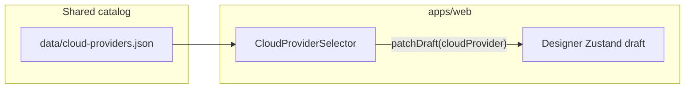
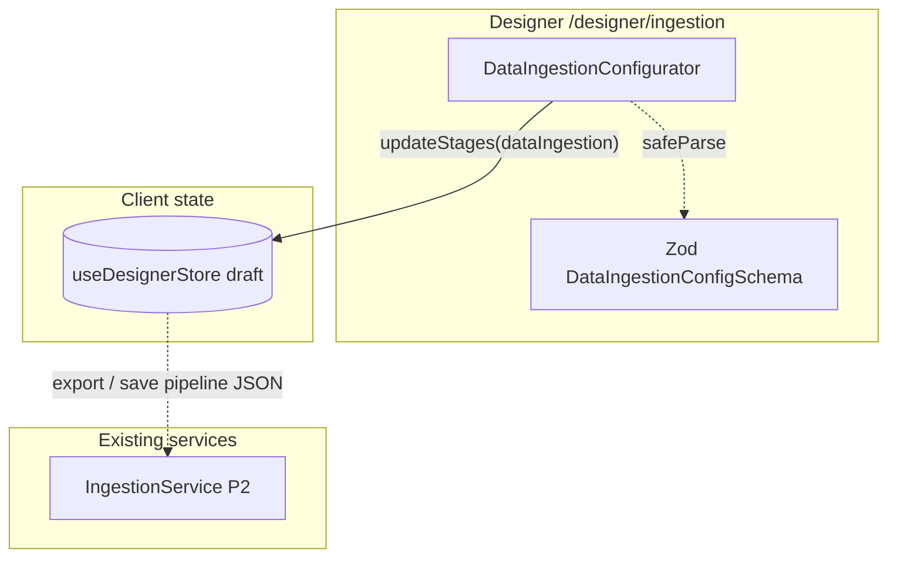
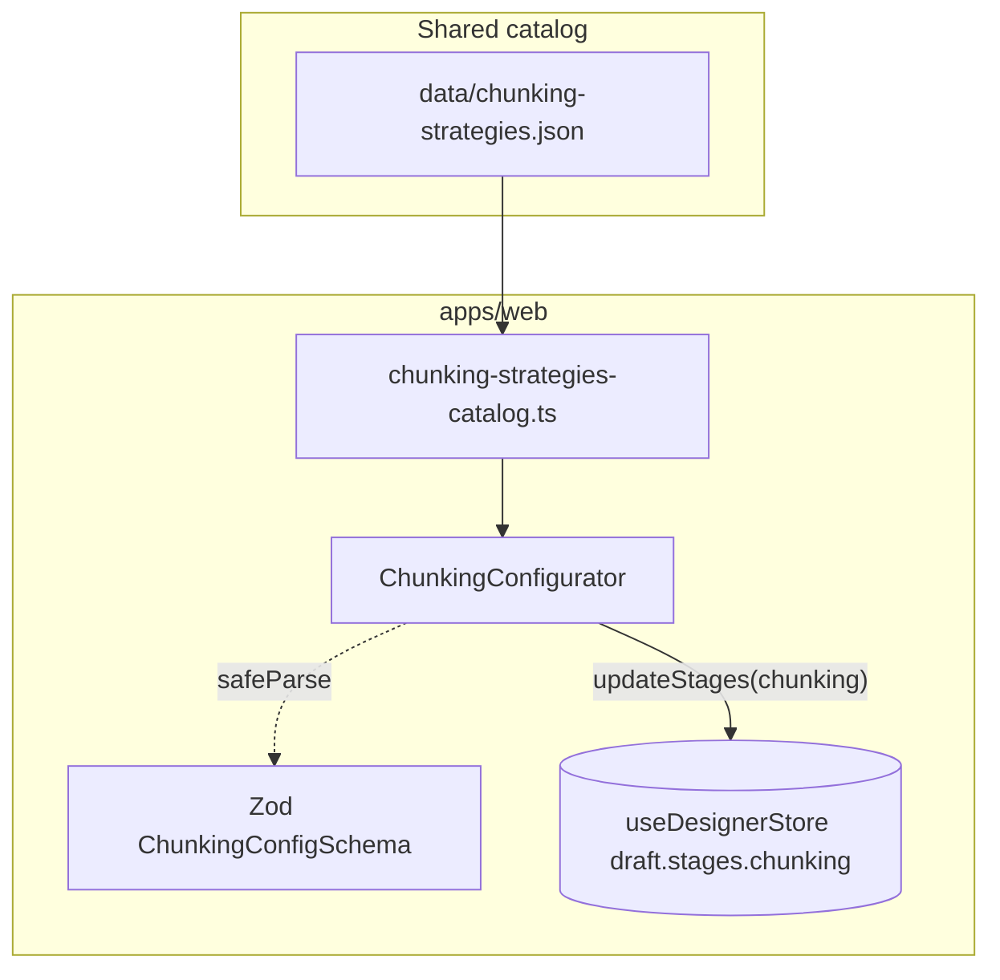
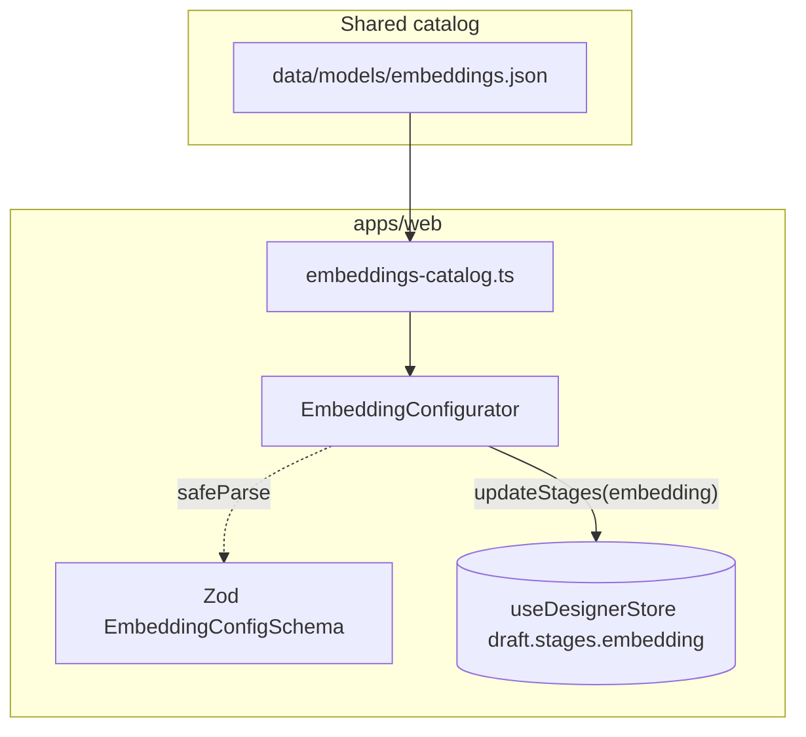
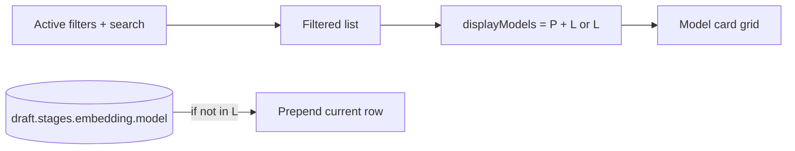
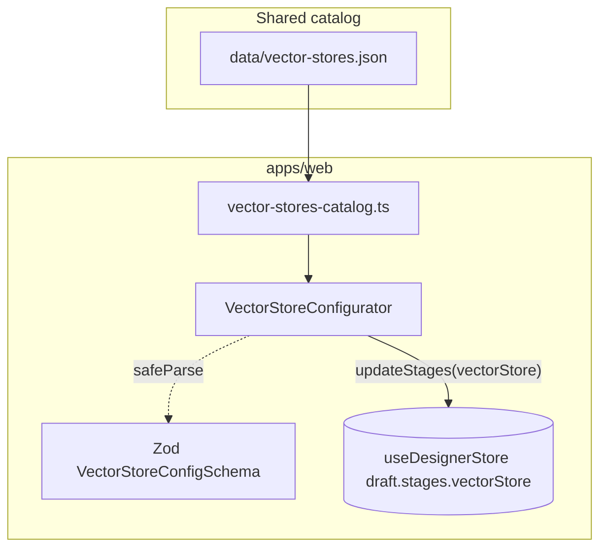
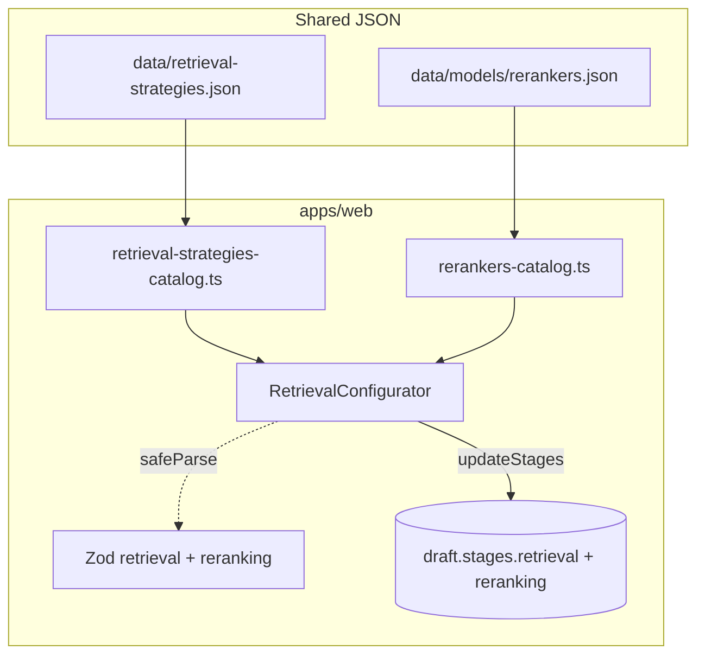

# Project system design evolution — Unified RAG Studio

> Narrative and diagrams showing how the architecture deepens by phase. **Phase P0–P2** sections restore **per-subphase** “Design Level” diagrams and decisions from historical documentation (`aa7f9dc`). Later milestones are split into separate files so the content stays easy to read on GitHub.

---

## Documents by phase

| Phase | Scope (summary) | File |
|------:|-----------------|------|
| **0** | Monorepo skeleton, Docker Compose dev, CI/CD, backend & frontend scaffolds | [PROJECT_SYSTEM_DESIGN_EVOLUTION_Phase0.md](./PROJECT_SYSTEM_DESIGN_EVOLUTION_Phase0.md) |
| **1** | JSON catalogs, TypeScript types, Pydantic schemas, DB migrations | [PROJECT_SYSTEM_DESIGN_EVOLUTION_Phase1.md](./PROJECT_SYSTEM_DESIGN_EVOLUTION_Phase1.md) |
| **2** | Ingestion, chunking, embedding, vector store, retrieval, generation, evaluation, Celery, health/utilities | [PROJECT_SYSTEM_DESIGN_EVOLUTION_Phase2.md](./PROJECT_SYSTEM_DESIGN_EVOLUTION_Phase2.md) |
| **3** | Frontend foundation (UI, stores, shell, landing, lib utilities) | [PROJECT_SYSTEM_DESIGN_EVOLUTION_Phase3.md](./PROJECT_SYSTEM_DESIGN_EVOLUTION_Phase3.md) |
| **4** | Designer mode backend (projects, config, cost, export, templates) | [PROJECT_SYSTEM_DESIGN_EVOLUTION_Phase4.md](./PROJECT_SYSTEM_DESIGN_EVOLUTION_Phase4.md) |
| **4.5** | Guardrails (policy, RAG integration, metrics, operator policy files) | [PROJECT_SYSTEM_DESIGN_EVOLUTION_Phase4.5.md](./PROJECT_SYSTEM_DESIGN_EVOLUTION_Phase4.5.md) |
| **5** | Designer UI (visual pipeline builder; started with cloud catalog selector) | [PROJECT_SYSTEM_DESIGN_EVOLUTION_Phase5.md](./PROJECT_SYSTEM_DESIGN_EVOLUTION_Phase5.md) |

---

## Document maintenance (append-only policy)

> **2026-05-02:** **Phase P0–P2** sections in the phase files were **restored from git** (`aa7f9dc`, per-subphase “Design Level” diagrams). **Phase 3+** milestones live in the linked files above; extend only at the **end** of the relevant phase file—do not replace earlier phases when adding new work.

> **Split (2026-05-02):** This index replaces a single large `PROJECT_SYSTEM_DESIGN_EVOLUTION.md` for GitHub rendering. When you add a new **top-level** phase, add a row to the table and create `PROJECT_SYSTEM_DESIGN_EVOLUTION_PhaseN.md` if needed.

---

## Phase 5 snapshot — Designer UI (after P5-2)

Phase 5 layers **interactive configuration** onto the Phase 3 shell and Phase 4 APIs. **P5-2** wires the shared **`data/cloud-providers.json`** catalog into the Designer **Cloud Provider** stage: users pick AWS, GCP, Azure, or Multi-Cloud; the choice persists in **`draft.cloudProvider`** (Zustand + localStorage) for downstream steps and API payloads.

Long-form diagrams and evolving design levels for Phase 5 live in **[PROJECT_SYSTEM_DESIGN_EVOLUTION_Phase5.md](./PROJECT_SYSTEM_DESIGN_EVOLUTION_Phase5.md)**.

---

## Phase 5 snapshot — Designer UI (after P5-3)

**P5-3** adds the **Data Ingestion** stage UI: users configure **`PipelineStages.dataIngestion`** (source type, file types, preprocessing, metadata, connection hints). **`DataIngestionConfigurator`** calls **`updateStages({ dataIngestion })`** so the nested config persists beside **`draft.cloudProvider`**. Validation uses shared **Zod** (`DataIngestionConfigSchema`). Runtime ingestion remains in backend **`IngestionService`**; the Designer captures deployable intent for exports and APIs.

---

## Phase 5 snapshot — Designer UI (after P5-4)

**P5-4** adds the **Chunking** stage: **`ChunkingConfigurator`** reads **`data/chunking-strategies.json`** (via **`chunking-strategies-catalog.ts`**) and writes **`updateStages({ chunking })`**. Users pick a **strategy** (fixed, recursive, semantic, markdown header, sentence, paragraph, code-aware), tune **token chunk size** and **overlap** within **Zod** bounds, edit the **separator ladder** for **recursive-character**, and set optional **chunk metadata**. **`StageNavigator`** shows a short **strategy · size/overlap** hint. Execution remains in backend **`ChunkingService` (P2-2)**; the UI captures deployable parameters for exports and APIs.

Long-form Phase 5 diagrams: **[PROJECT_SYSTEM_DESIGN_EVOLUTION_Phase5.md](./PROJECT_SYSTEM_DESIGN_EVOLUTION_Phase5.md)**.

---

## Phase 5 snapshot — Designer UI (after P5-5)

**P5-5** adds the **Embedding** stage: **`EmbeddingConfigurator`** reads **`data/models/embeddings.json`** (via **`embeddings-catalog.ts`**) and writes **`updateStages({ embedding })`**. Users discover models with **search** and **filters** (provider, tier, quality, speed, open-source, hide deprecated), select a **catalog-backed model** for **`model` / `provider` / `dimensions` / `maxTokens`**, and adjust **`batchSize`** within Zod bounds. **`StageNavigator`** shows a compact **name · dimensions** hint. Embedding execution stays in backend **`EmbeddingService` (P2-3)**; the UI captures deployable intent.

Long-form Phase 5 diagrams: **[PROJECT_SYSTEM_DESIGN_EVOLUTION_Phase5.md](./PROJECT_SYSTEM_DESIGN_EVOLUTION_Phase5.md)**.

---

## Phase 5 — P5-5 UX refinement (pinned selection, 2026-05-02)

When **search/filters** exclude the model already stored on **`draft.stages.embedding`**, the UI must not make the active choice disappear from the card grid. **`EmbeddingConfigurator`** therefore **prepends** the current catalog entry to the visible list and labels it **“Current · outside filters”**, with a short **aria-live** note in the filter summary. The main P5-5 dataflow is unchanged; this is a **client-only discoverability** layer on top of **`embeddings-catalog.ts`** and **`updateStages({ embedding })`**.

---

## Phase 5 snapshot — Designer UI (after P5-6)

**P5-6** adds the **Vector Store** stage: **`VectorStoreConfigurator`** reads **`data/vector-stores.json`** (via **`vector-stores-catalog.ts`**) and writes **`updateStages({ vectorStore })`**. Users **search** and **filter** (deployment type, AWS/GCP/Azure affinity, hybrid-capable), select a **provider card**, and edit **index name**, **metric** (catalog ∩ schema), **replicas/shards**, **namespace**, and optional **cloud placement hints**. Metric strings like **`l2`** / **`ip`** map to **`euclidean`** / **`dot`** for **`VectorStoreConfigSchema`**. **`StageNavigator`** shows **`vectorStoreHint`**. Runtime vector IO remains in **`VectorStoreService` (P2-4)**.

Long-form Phase 5 diagrams: **[PROJECT_SYSTEM_DESIGN_EVOLUTION_Phase5.md](./PROJECT_SYSTEM_DESIGN_EVOLUTION_Phase5.md)**.

---

## Phase 5 snapshot — Designer UI (after P5-7)

**P5-7** adds **retrieval and reranking** configuration: **`RetrievalConfigurator`** on **`/designer/retrieval`** reads **`data/retrieval-strategies.json`** via **`retrieval-strategies-catalog.ts`**, applies **`retrievalDefaultsFromCatalog`**, and writes **`updateStages({ retrieval })`** (strategy, top-k, optional score threshold, hybrid α, parent–child sizes, multi-query variants + LLM id, metadata filters). **Reranking** uses **`data/models/rerankers.json`** via **`rerankers-catalog.ts`** and **`updateStages({ reranking })`**. The **`/designer/reranking`** route uses **`variant="rerank-focus"`** for a compact retrieval summary plus full reranking controls. Client validation uses **Zod** (**`RetrievalConfigSchema`**, **`RerankingConfigSchema`**); execution stays in **`RetrievalService` (P2-5)**.

Long-form Phase 5 diagrams: **[PROJECT_SYSTEM_DESIGN_EVOLUTION_Phase5.md](./PROJECT_SYSTEM_DESIGN_EVOLUTION_Phase5.md)**.

---
