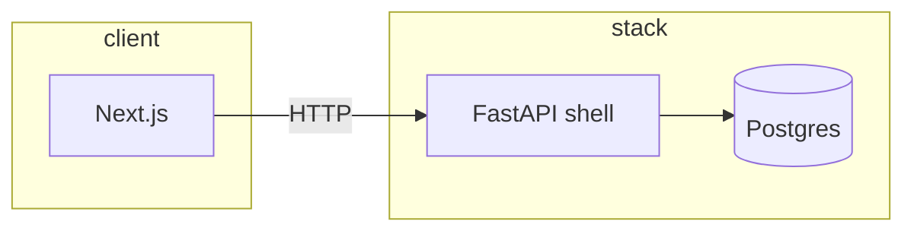
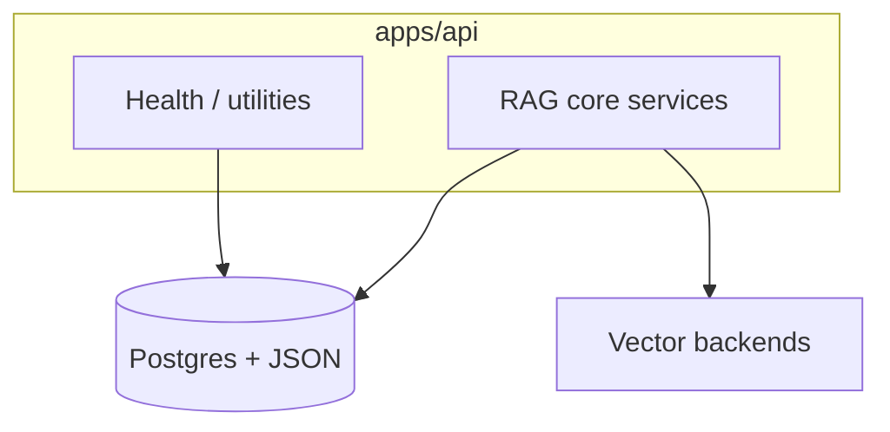
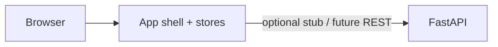
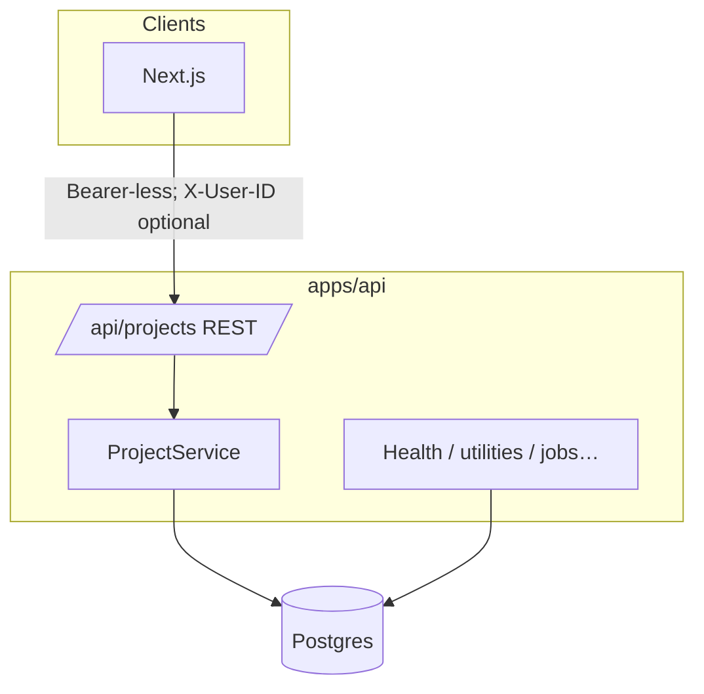
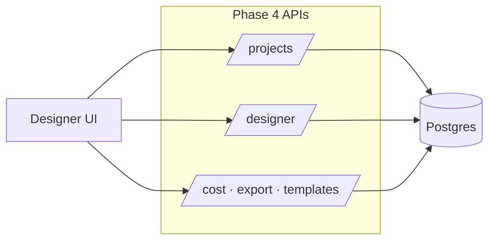

# RAG Studio — System design evolution

This document records how the platform design advances by phase. Each step adds capabilities while keeping earlier assumptions explicit.

---

## Phase 0 — Monorepo & infrastructure (baseline)

Single repository with `apps/web` (Next.js) and `apps/api` (FastAPI), local Docker Compose for Postgres, Redis, Qdrant, workers, and shared env contracts. No domain-specific business APIs yet.

---

## Phases 1–2 — Data contracts & RAG core services

**Phase 1:** Shared JSON catalogs, TypeScript types, Pydantic schemas, and **relational schema** (projects, pipeline configs, builds, evaluation runs, deployments) with Alembic.

**Phase 2:** In-process **core services** (ingestion, chunking, embedding, vector store, retrieval, generation, evaluation) and **health/utilities** — still mostly library code rather than product APIs.

---

## Phase 3 — Frontend foundation

App shell, navigation, persisted UI stores, landing page, validators/generators. **Backend project APIs may not exist yet**; UI can use local/mock state until Phase 4.

---

## Phase 4 — Designer mode backend (current milestone: P4-1)

The API becomes the **system of record** for workspaces (“projects”) used by Designer and Autopilot. CRUD is **user-scoped** (via `X-User-ID` until JWT auth in Phase 12) and supports **soft delete** so references remain auditable.

### After P4-1 · Projects API

**Design choices at this level**

| Topic | Decision |
|--------|----------|
| Identity | Header `X-User-ID` + `default_user_id` in settings until P12 JWT |
| Delete | Soft delete via `deleted_at` |
| Detail payload | Summarized configs/builds to avoid huge JSON in list/detail |
| Persistence | Async SQLAlchemy; JSON columns portable across SQLite (tests) and Postgres |

### Planned within Phase 4 (not implemented in P4-1)

Designer config CRUD, cost API, export API, templates API — these will extend the same API tier and reuse `Project` as the owning aggregate.

---

## Later phases (preview)

- **Phase 5+:** Designer UI consumes Phase 4 endpoints end-to-end.
- **Phase 6–7:** Autopilot agents + web streaming — builds attach to `projects` and persist in existing tables.
- **Phase 12:** Replace header user with JWT and tighten row-level security.

*Update this file when completing phase milestones or materially changing boundaries.*
