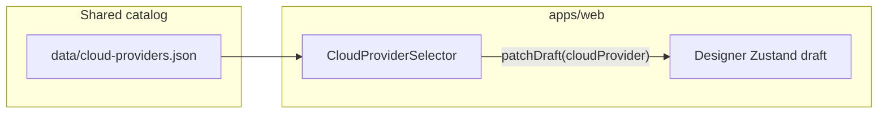

# Project system design evolution — Unified RAG Studio

> Narrative and diagrams showing how the architecture deepens by phase. **Phase P0–P2** sections restore **per-subphase** “Design Level” diagrams and decisions from historical documentation (`aa7f9dc`). Later milestones are split into separate files so the content stays easy to read on GitHub.

---

## Documents by phase

| Phase | Scope (summary) | File |
|------:|-----------------|------|
| **0** | Monorepo skeleton, Docker Compose dev, CI/CD, backend & frontend scaffolds | [PROJECT_SYSTEM_DESIGN_EVOLUTION_Phase0.md](./PROJECT_SYSTEM_DESIGN_EVOLUTION_Phase0.md) |
| **1** | JSON catalogs, TypeScript types, Pydantic schemas, DB migrations | [PROJECT_SYSTEM_DESIGN_EVOLUTION_Phase1.md](./PROJECT_SYSTEM_DESIGN_EVOLUTION_Phase1.md) |
| **2** | Ingestion, chunking, embedding, vector store, retrieval, generation, evaluation, Celery, health/utilities | [PROJECT_SYSTEM_DESIGN_EVOLUTION_Phase2.md](./PROJECT_SYSTEM_DESIGN_EVOLUTION_Phase2.md) |
| **3** | Frontend foundation (UI, stores, shell, landing, lib utilities) | [PROJECT_SYSTEM_DESIGN_EVOLUTION_Phase3.md](./PROJECT_SYSTEM_DESIGN_EVOLUTION_Phase3.md) |
| **4** | Designer mode backend (projects, config, cost, export, templates) | [PROJECT_SYSTEM_DESIGN_EVOLUTION_Phase4.md](./PROJECT_SYSTEM_DESIGN_EVOLUTION_Phase4.md) |
| **4.5** | Guardrails (policy, RAG integration, metrics, operator policy files) | [PROJECT_SYSTEM_DESIGN_EVOLUTION_Phase4.5.md](./PROJECT_SYSTEM_DESIGN_EVOLUTION_Phase4.5.md) |
| **5** | Designer UI (visual pipeline builder; started with cloud catalog selector) | [PROJECT_SYSTEM_DESIGN_EVOLUTION_Phase5.md](./PROJECT_SYSTEM_DESIGN_EVOLUTION_Phase5.md) |

---

## Document maintenance (append-only policy)

> **2026-05-02:** **Phase P0–P2** sections in the phase files were **restored from git** (`aa7f9dc`, per-subphase “Design Level” diagrams). **Phase 3+** milestones live in the linked files above; extend only at the **end** of the relevant phase file—do not replace earlier phases when adding new work.

> **Split (2026-05-02):** This index replaces a single large `PROJECT_SYSTEM_DESIGN_EVOLUTION.md` for GitHub rendering. When you add a new **top-level** phase, add a row to the table and create `PROJECT_SYSTEM_DESIGN_EVOLUTION_PhaseN.md` if needed.

---

## Phase 5 snapshot — Designer UI (after P5-2)

Phase 5 layers **interactive configuration** onto the Phase 3 shell and Phase 4 APIs. **P5-2** wires the shared **`data/cloud-providers.json`** catalog into the Designer **Cloud Provider** stage: users pick AWS, GCP, Azure, or Multi-Cloud; the choice persists in **`draft.cloudProvider`** (Zustand + localStorage) for downstream steps and API payloads.

Long-form diagrams and evolving design levels for Phase 5 live in **[PROJECT_SYSTEM_DESIGN_EVOLUTION_Phase5.md](./PROJECT_SYSTEM_DESIGN_EVOLUTION_Phase5.md)**.

---
