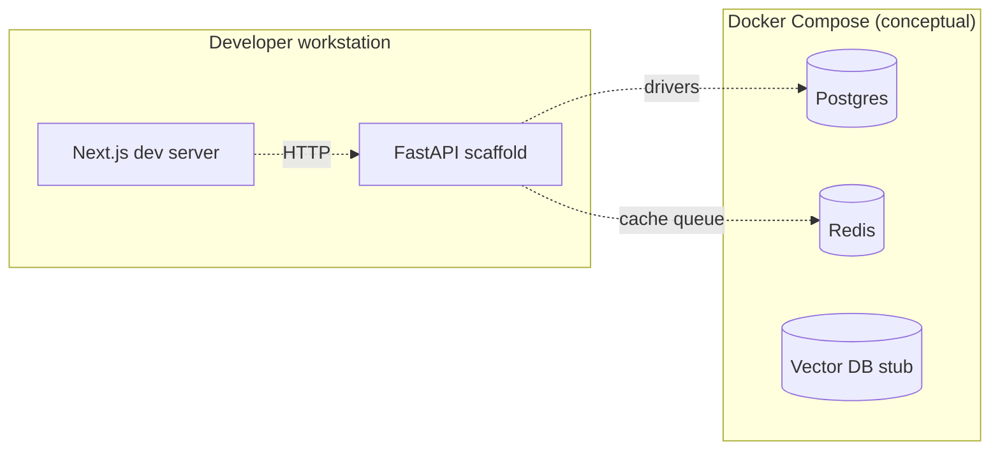
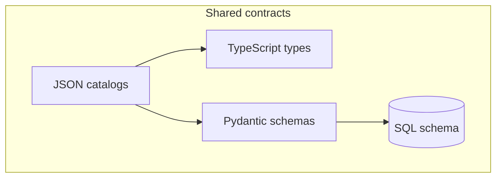
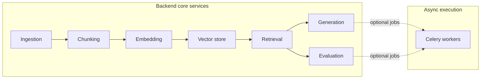
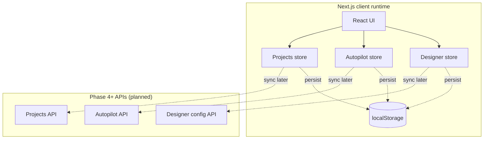

# Project system design evolution — Unified RAG Studio

> Narrative and diagrams showing how the architecture deepens by phase.  
> Last updated: Phase 3 · P3-2 (Zustand stores).

---

## Phase 0 — Bootstrap & runnable skeleton

**Goal:** Monorepo layout, local infra (Docker), CI skeleton, API + web scaffolds.

At this stage the system is “boxes and arrows”: services exist mainly so engineers can run lint/tests and prove connectivity—not yet rich domain logic.

**Characteristics:** Single repo, minimal coupling between UI and API; contracts informal.

---

## Phase 1 — Shared contracts as source of truth

**Goal:** JSON catalogs + mirrored TS/Python types + migrations establish **one vocabulary** for pipelines, models, and autopilot builds.

**Characteristics:** Frontend and backend compile against the same shapes; fewer translation bugs before complex UI arrives.

---

## Phase 2 — Reusable backend RAG platform services

**Goal:** Implement ingestion → chunking → embeddings → vector stores → retrieval → generation → evaluation, orchestrated asynchronously where needed.

**Characteristics:** Designer and Autopilot both consume the same engines via forthcoming APIs; complexity concentrates server-side.

---

## Phase 3 — Frontend foundation (evolving)

Phase 3 grows the experience layer in sub-phases.

### P3-1 — UI system

shadcn/ui + Tailwind tokens establish consistent interaction primitives (buttons, dialogs, forms).

### P3-2 — Client state stores (this milestone)

**Goal:** Persisted **Designer drafts**, **Autopilot sessions/build snapshots**, and **local project metadata** in the browser using Zustand + `localStorage`, coordinated with Next.js hydration.

**Characteristics:** UX continuity offline/between refreshes; explicit seam for server reconciliation once CRUD endpoints land.

### P3-3 — App shell & navigation (pending)

Global layout, routing polish, error boundaries—not reflected above yet.

### P3-4 — Landing refinements (pending)

Marketing surfaces atop the same shell.

### P3-5 — Utilities & validators (pending)

Shared validation/helpers bridging UI inputs to pipeline contracts.

---

## Looking ahead (compact)

Later phases add Designer UX depth (Phase 5), LangGraph autopilot agents + streaming APIs (Phases 6–7), evaluation/deployment endpoints (Phase 8), MLflow (Phase 9), automated testing gates (Phase 10), observability (Phase 11), and production hardening (Phase 12). Each increment extends this document with diagrams focused on new boundaries (auth, metrics, deployment planes).
