# Project system design evolution — Unified RAG Studio

> Narrative and diagrams showing how the architecture deepens by phase. **Phase P0–P2** sections restore **per-subphase** “Design Level” diagrams and decisions from historical documentation (`aa7f9dc`). Later milestones are split into separate files so the content stays easy to read on GitHub.

---

## Documents by phase

| Phase | Scope (summary) | File |
|------:|-----------------|------|
| **0** | Monorepo skeleton, Docker Compose dev, CI/CD, backend & frontend scaffolds | [PROJECT_SYSTEM_DESIGN_EVOLUTION_Phase0.md](./PROJECT_SYSTEM_DESIGN_EVOLUTION_Phase0.md) |
| **1** | JSON catalogs, TypeScript types, Pydantic schemas, DB migrations | [PROJECT_SYSTEM_DESIGN_EVOLUTION_Phase1.md](./PROJECT_SYSTEM_DESIGN_EVOLUTION_Phase1.md) |
| **2** | Ingestion, chunking, embedding, vector store, retrieval, generation, evaluation, Celery, health/utilities | [PROJECT_SYSTEM_DESIGN_EVOLUTION_Phase2.md](./PROJECT_SYSTEM_DESIGN_EVOLUTION_Phase2.md) |
| **3** | Frontend foundation (UI, stores, shell, landing, lib utilities) | [PROJECT_SYSTEM_DESIGN_EVOLUTION_Phase3.md](./PROJECT_SYSTEM_DESIGN_EVOLUTION_Phase3.md) |
| **4** | Designer mode backend (projects, config, cost, export, templates) | [PROJECT_SYSTEM_DESIGN_EVOLUTION_Phase4.md](./PROJECT_SYSTEM_DESIGN_EVOLUTION_Phase4.md) |
| **4.5** | Guardrails (policy, RAG integration, metrics, operator policy files) | [PROJECT_SYSTEM_DESIGN_EVOLUTION_Phase4.5.md](./PROJECT_SYSTEM_DESIGN_EVOLUTION_Phase4.5.md) |
| **5** | Designer UI (visual pipeline builder; started with cloud catalog selector) | [PROJECT_SYSTEM_DESIGN_EVOLUTION_Phase5.md](./PROJECT_SYSTEM_DESIGN_EVOLUTION_Phase5.md) |

---

## Document maintenance (append-only policy)

> **2026-05-02:** **Phase P0–P2** sections in the phase files were **restored from git** (`aa7f9dc`, per-subphase “Design Level” diagrams). **Phase 3+** milestones live in the linked files above; extend only at the **end** of the relevant phase file—do not replace earlier phases when adding new work.

> **Split (2026-05-02):** This index replaces a single large `PROJECT_SYSTEM_DESIGN_EVOLUTION.md` for GitHub rendering. When you add a new **top-level** phase, add a row to the table and create `PROJECT_SYSTEM_DESIGN_EVOLUTION_PhaseN.md` if needed.

---

## Phase 5 snapshot — Designer UI (after P5-2)

Phase 5 layers **interactive configuration** onto the Phase 3 shell and Phase 4 APIs. **P5-2** wires the shared **`data/cloud-providers.json`** catalog into the Designer **Cloud Provider** stage: users pick AWS, GCP, Azure, or Multi-Cloud; the choice persists in **`draft.cloudProvider`** (Zustand + localStorage) for downstream steps and API payloads.

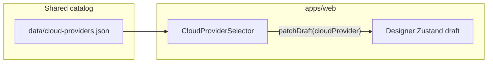
```mermaid
flowchart LR
  subgraph Catalog["Shared catalog"]
    CP[data/cloud-providers.json]
  end
  subgraph Web["apps/web"]
    UI[CloudProviderSelector]
    Z[Designer Zustand draft]
  end
  CP --> UI
  UI -->|"patchDraft(cloudProvider)"| Z
```

Long-form diagrams and evolving design levels for Phase 5 live in **[PROJECT_SYSTEM_DESIGN_EVOLUTION_Phase5.md](./PROJECT_SYSTEM_DESIGN_EVOLUTION_Phase5.md)**.

---

## Phase 5 snapshot — Designer UI (after P5-3)

**P5-3** adds the **Data Ingestion** stage UI: users configure **`PipelineStages.dataIngestion`** (source type, file types, preprocessing, metadata, connection hints). **`DataIngestionConfigurator`** calls **`updateStages({ dataIngestion })`** so the nested config persists beside **`draft.cloudProvider`**. Validation uses shared **Zod** (`DataIngestionConfigSchema`). Runtime ingestion remains in backend **`IngestionService`**; the Designer captures deployable intent for exports and APIs.

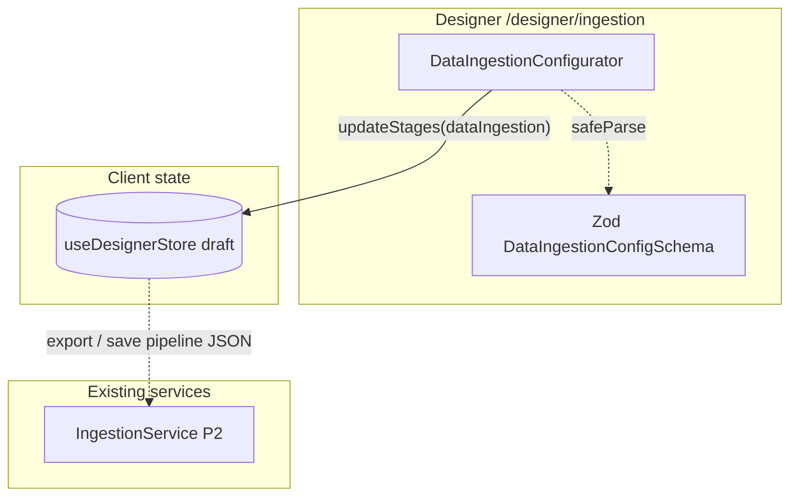
```mermaid
flowchart TB
  subgraph Designer["Designer /designer/ingestion"]
    DI[DataIngestionConfigurator]
    V[Zod DataIngestionConfigSchema]
  end
  subgraph State["Client state"]
    Z[(useDesignerStore draft)]
  end
  subgraph Backend["Existing services"]
    IS[IngestionService P2]
  end
  DI -->|"updateStages(dataIngestion)"| Z
  DI -.->|safeParse| V
  Z -.->|export / save pipeline JSON| IS
```

---

## Phase 5 snapshot — Designer UI (after P5-4)

**P5-4** adds the **Chunking** stage: **`ChunkingConfigurator`** reads **`data/chunking-strategies.json`** (via **`chunking-strategies-catalog.ts`**) and writes **`updateStages({ chunking })`**. Users pick a **strategy** (fixed, recursive, semantic, markdown header, sentence, paragraph, code-aware), tune **token chunk size** and **overlap** within **Zod** bounds, edit the **separator ladder** for **recursive-character**, and set optional **chunk metadata**. **`StageNavigator`** shows a short **strategy · size/overlap** hint. Execution remains in backend **`ChunkingService` (P2-2)**; the UI captures deployable parameters for exports and APIs.

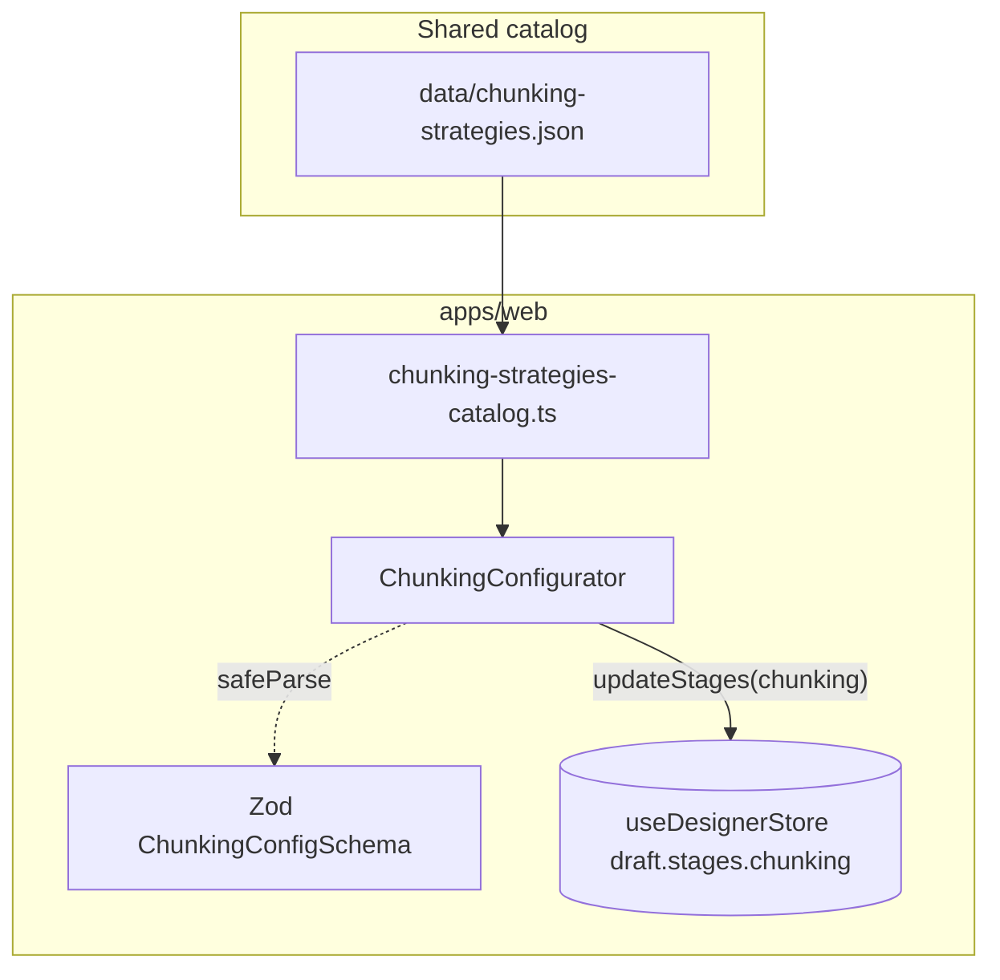
```mermaid
flowchart TB
  subgraph Catalog["Shared catalog"]
    CH[data/chunking-strategies.json]
  end
  subgraph Designer["apps/web"]
    Lib[chunking-strategies-catalog.ts]
    Cmp[ChunkingConfigurator]
    V[Zod ChunkingConfigSchema]
    Z[(useDesignerStore draft.stages.chunking)]
  end
  CH --> Lib
  Lib --> Cmp
  Cmp -->|"updateStages(chunking)"| Z
  Cmp -.->|safeParse| V
```

Long-form Phase 5 diagrams: **[PROJECT_SYSTEM_DESIGN_EVOLUTION_Phase5.md](./PROJECT_SYSTEM_DESIGN_EVOLUTION_Phase5.md)**.

---

## Phase 5 snapshot — Designer UI (after P5-5)

**P5-5** adds the **Embedding** stage: **`EmbeddingConfigurator`** reads **`data/models/embeddings.json`** (via **`embeddings-catalog.ts`**) and writes **`updateStages({ embedding })`**. Users discover models with **search** and **filters** (provider, tier, quality, speed, open-source, hide deprecated), select a **catalog-backed model** for **`model` / `provider` / `dimensions` / `maxTokens`**, and adjust **`batchSize`** within Zod bounds. **`StageNavigator`** shows a compact **name · dimensions** hint. Embedding execution stays in backend **`EmbeddingService` (P2-3)**; the UI captures deployable intent.

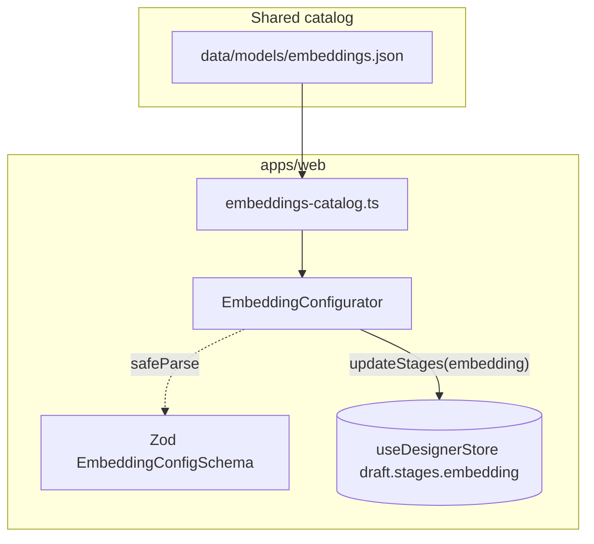
```mermaid
flowchart TB
  subgraph Catalog["Shared catalog"]
    EM[data/models/embeddings.json]
  end
  subgraph Designer["apps/web"]
    Lib[embeddings-catalog.ts]
    Cmp[EmbeddingConfigurator]
    V[Zod EmbeddingConfigSchema]
    Z[(useDesignerStore draft.stages.embedding)]
  end
  EM --> Lib
  Lib --> Cmp
  Cmp -->|"updateStages(embedding)"| Z
  Cmp -.->|safeParse| V
```

Long-form Phase 5 diagrams: **[PROJECT_SYSTEM_DESIGN_EVOLUTION_Phase5.md](./PROJECT_SYSTEM_DESIGN_EVOLUTION_Phase5.md)**.

---

## Phase 5 — P5-5 UX refinement (pinned selection, 2026-05-02)

When **search/filters** exclude the model already stored on **`draft.stages.embedding`**, the UI must not make the active choice disappear from the card grid. **`EmbeddingConfigurator`** therefore **prepends** the current catalog entry to the visible list and labels it **“Current · outside filters”**, with a short **aria-live** note in the filter summary. The main P5-5 dataflow is unchanged; this is a **client-only discoverability** layer on top of **`embeddings-catalog.ts`** and **`updateStages({ embedding })`**.

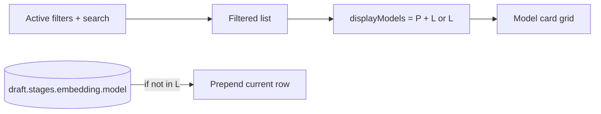
```mermaid
flowchart LR
  F[Active filters + search] --> L[Filtered list]
  S[(draft.stages.embedding.model)]
  S -->|if not in L| P[Prepend current row]
  L --> M[displayModels = P + L or L]
  M --> Cards[Model card grid]
```

---

## Phase 5 snapshot — Designer UI (after P5-6)

**P5-6** adds the **Vector Store** stage: **`VectorStoreConfigurator`** reads **`data/vector-stores.json`** (via **`vector-stores-catalog.ts`**) and writes **`updateStages({ vectorStore })`**. Users **search** and **filter** (deployment type, AWS/GCP/Azure affinity, hybrid-capable), select a **provider card**, and edit **index name**, **metric** (catalog ∩ schema), **replicas/shards**, **namespace**, and optional **cloud placement hints**. Metric strings like **`l2`** / **`ip`** map to **`euclidean`** / **`dot`** for **`VectorStoreConfigSchema`**. **`StageNavigator`** shows **`vectorStoreHint`**. Runtime vector IO remains in **`VectorStoreService` (P2-4)**.

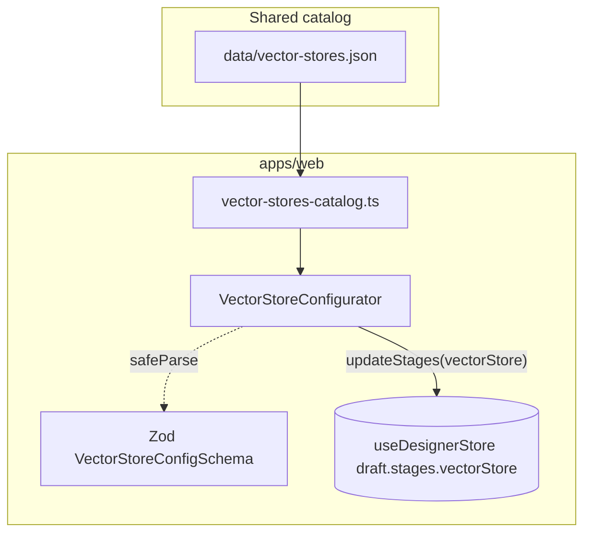
```mermaid
flowchart TB
  subgraph Catalog["Shared catalog"]
    VS[data/vector-stores.json]
  end
  subgraph Web["apps/web"]
    Lib[vector-stores-catalog.ts]
    Cmp[VectorStoreConfigurator]
    V[Zod VectorStoreConfigSchema]
    Z[(useDesignerStore draft.stages.vectorStore)]
  end
  VS --> Lib
  Lib --> Cmp
  Cmp -->|"updateStages(vectorStore)"| Z
  Cmp -.->|safeParse| V
```

Long-form Phase 5 diagrams: **[PROJECT_SYSTEM_DESIGN_EVOLUTION_Phase5.md](./PROJECT_SYSTEM_DESIGN_EVOLUTION_Phase5.md)**.

---

## Phase 5 snapshot — Designer UI (after P5-7)

**P5-7** adds **retrieval and reranking** configuration: **`RetrievalConfigurator`** on **`/designer/retrieval`** reads **`data/retrieval-strategies.json`** via **`retrieval-strategies-catalog.ts`**, applies **`retrievalDefaultsFromCatalog`**, and writes **`updateStages({ retrieval })`** (strategy, top-k, optional score threshold, hybrid α, parent–child sizes, multi-query variants + LLM id, metadata filters). **Reranking** uses **`data/models/rerankers.json`** via **`rerankers-catalog.ts`** and **`updateStages({ reranking })`**. The **`/designer/reranking`** route uses **`variant="rerank-focus"`** for a compact retrieval summary plus full reranking controls. Client validation uses **Zod** (**`RetrievalConfigSchema`**, **`RerankingConfigSchema`**); execution stays in **`RetrievalService` (P2-5)**.

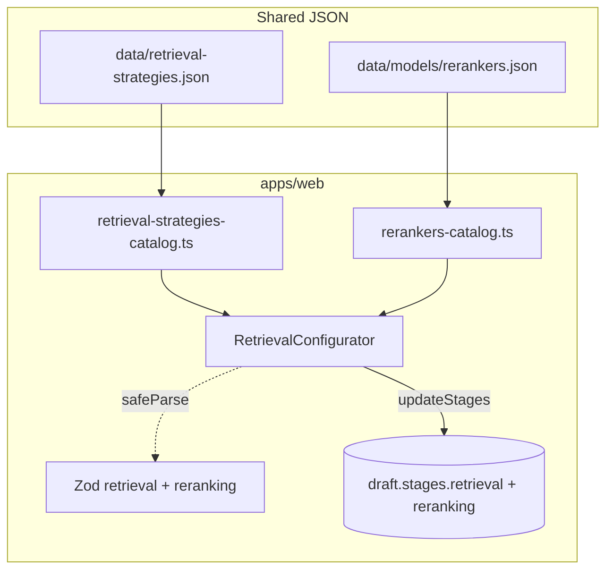
```mermaid
flowchart TB
  subgraph Data["Shared JSON"]
    RS[data/retrieval-strategies.json]
    RR[data/models/rerankers.json]
  end
  subgraph Web["apps/web"]
    L1[retrieval-strategies-catalog.ts]
    L2[rerankers-catalog.ts]
    C[RetrievalConfigurator]
    V[Zod retrieval + reranking]
    Z[(draft.stages.retrieval + reranking)]
  end
  RS --> L1
  RR --> L2
  L1 --> C
  L2 --> C
  C -->|"updateStages"| Z
  C -.->|safeParse| V
```

Long-form Phase 5 diagrams: **[PROJECT_SYSTEM_DESIGN_EVOLUTION_Phase5.md](./PROJECT_SYSTEM_DESIGN_EVOLUTION_Phase5.md)**.

---

## Phase 5 snapshot — Designer UI (after P5-8)

**P5-8** adds the **Generation** stage: **`GenerationConfigurator`** on **`/designer/generation`** reads **`data/models/generation.json`** via **`generation-catalog.ts`** and writes **`updateStages({ generation })`**. Users **search** and **filter** (provider, tier, open source, JSON mode, tool use), pick a **model card**, and tune **temperature**, **max output tokens** (capped by catalog **maxOutputTokens**), optional **top-p** (checkbox + slider), **output format**, and **system prompt**. **Pinned selection** matches **P5-5** when filters exclude the active model. **`StageNavigator`** shows **`generationHint`** (name · temperature · tokens). Execution remains in **`GenerationService` (P2-6)**.

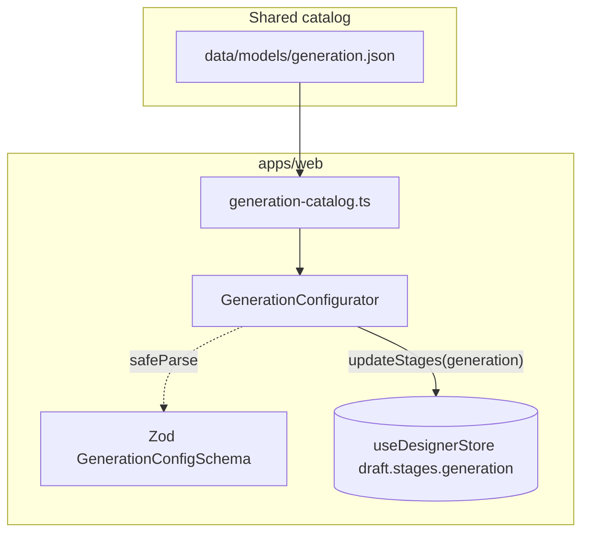
```mermaid
flowchart TB
  subgraph Catalog["Shared catalog"]
    GM[data/models/generation.json]
  end
  subgraph Web["apps/web"]
    Lib[generation-catalog.ts]
    Cmp[GenerationConfigurator]
    V[Zod GenerationConfigSchema]
    Z[(useDesignerStore draft.stages.generation)]
  end
  GM --> Lib
  Lib --> Cmp
  Cmp -->|"updateStages(generation)"| Z
  Cmp -.->|safeParse| V
```

Long-form Phase 5 diagrams: **[PROJECT_SYSTEM_DESIGN_EVOLUTION_Phase5.md](./PROJECT_SYSTEM_DESIGN_EVOLUTION_Phase5.md)**.

---

## Phase 5 snapshot — Designer UI (after P5-9)

**P5-9** adds three Designer stages — **`/designer/routing`**, **`/designer/memory`**, **`/designer/evaluation`** — implemented as **`RoutingConfigurator`**, **`MemoryConfigurator`**, and **`EvaluationConfigurator`**. Each calls **`updateStages`** with **`routing`**, **`memory`**, or **`evaluation`** slices aligned with **`RoutingConfig`**, **`MemoryConfig`**, and **`EvaluationConfig`** in **`pipeline.ts`**, validated by **`RoutingConfigSchema`**, **`MemoryConfigSchema`**, and **`EvaluationConfigSchema`**. **Routing** uses **`listGenerationModels()`** for fallback and per-rule **target** models. **Memory** selects **`MemoryType`** (none, conversation-buffer, summary-buffer, vector-memory) with optional **window**, **maxTokens**, **sessionPersistence**. **Evaluation** toggles metrics (**faithfulness**, **answer_relevance**, **context_precision**, **context_recall**, **latency**), **testSetSize** (10–1000), and **schedule** (**on-demand** | **continuous**). **`StageNavigator`** adds **`routingHint`**, **`memoryHint`**, **`evaluationHint`**. Exports (**YAML**, **Python**, **Mermaid**) already consumed these fields from **P2 / generators**; this milestone completes the **Designer UI** surface for them.

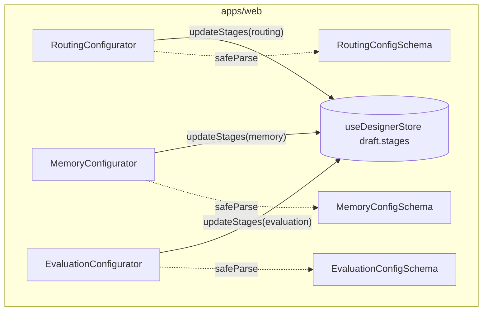
```mermaid
flowchart TB
  subgraph Web["apps/web"]
    R[RoutingConfigurator]
    M[MemoryConfigurator]
    E[EvaluationConfigurator]
    VR[RoutingConfigSchema]
    VM[MemoryConfigSchema]
    VE[EvaluationConfigSchema]
    Z[(useDesignerStore draft.stages)]
  end
  R -->|"updateStages(routing)"| Z
  M -->|"updateStages(memory)"| Z
  E -->|"updateStages(evaluation)"| Z
  R -.->|safeParse| VR
  M -.->|safeParse| VM
  E -.->|safeParse| VE
```

Long-form Phase 5 diagrams: **[PROJECT_SYSTEM_DESIGN_EVOLUTION_Phase5.md](./PROJECT_SYSTEM_DESIGN_EVOLUTION_Phase5.md)**.

---

## Phase 5 snapshot — Designer UI (after P5-10)

**P5-10** adds a **live pipeline visualizer** on every Designer route. **`DesignerShell`** groups the left column (**`StageNavigator`** + **`PipelineVisualizer placement=sidebar`**) and places **`PipelineVisualizer placement=main`** above **`main`** for small viewports. The visualizer subscribes to **`useDesignerStore`**, shows **`generatePipelineSummary`**, **`generatePipelineHighlights`**, and a **Mermaid** diagram from **`generateMermaidDiagram`**. The **mermaid** package renders **SVG** client-side with **theme** synced to **`.dark`** / **`prefers-color-scheme`**. The **indexing** and **query** subgraphs in **`mermaidGenerator.ts`** use a single coherent path: **query → (memory) → retrieve → (rerank) → (route) → generate → answer → (evaluate)**; **`VS --> RET`** links the index to retrieval.

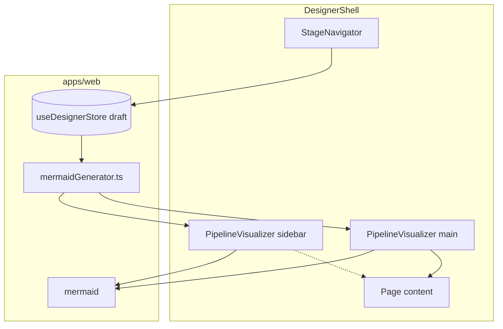
```mermaid
flowchart TB
  subgraph DS["DesignerShell"]
    Nav[StageNavigator]
    PVS[PipelineVisualizer sidebar]
    PVM[PipelineVisualizer main]
    Main[Page content]
  end
  subgraph W["apps/web"]
    MM[mermaid]
    MG[mermaidGenerator.ts]
    Z[(useDesignerStore draft)]
  end
  Nav --> Z
  Z --> MG
  MG --> PVS
  MG --> PVM
  PVS --> MM
  PVM --> MM
  PVM --> Main
  PVS -.-> Main
```

Long-form Phase 5 diagrams: **[PROJECT_SYSTEM_DESIGN_EVOLUTION_Phase5.md](./PROJECT_SYSTEM_DESIGN_EVOLUTION_Phase5.md)**.

---

## Phase 5 snapshot — Designer UI (after P5-11)

**P5-11** adds a **live cost estimator** strip in **`DesignerShell`**, mounted **above** **`PipelineVisualizer`** (both are siblings reading the same **`draft`**). **`CostEstimator`** debounces changes (~450 ms) and **`POST`s** **`/api/utilities/cost`** with **`{ config, queriesPerMonth, documentsCount, avgDocumentTokens }`** (defaults align with **`CostRequest`** on the API). The response **`CostEstimate`** (camelCase from **`RAGBaseModel`**) drives **per-query** and **monthly** headline cards, **stacked bar** shares for embedding / storage / retrieval / reranking / generation, and a **tabular breakdown** (component id, unit cost, usage, monthly, percentage). Errors (e.g. missing **`pricing.json`**) surface as **`ApiError`** detail. Workload fields are **local UI state** (not persisted in **`draft`**) to avoid **`persist`** churn.

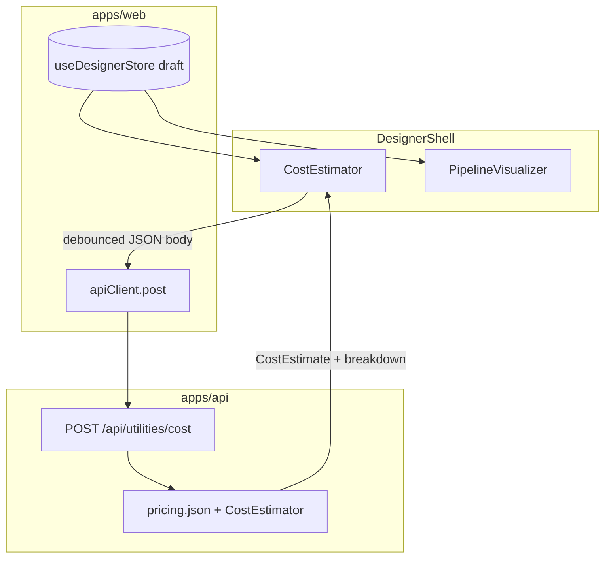
```mermaid
flowchart TB
  subgraph Shell["DesignerShell"]
    CE[CostEstimator]
    PV[PipelineVisualizer]
  end
  subgraph Client["apps/web"]
    Z[(useDesignerStore draft)]
    AC[apiClient.post]
  end
  subgraph API["apps/api"]
    U["POST /api/utilities/cost"]
    P[pricing.json + CostEstimator]
  end
  Z --> CE
  CE -->|"debounced JSON body"| AC
  AC --> U
  U --> P
  P -->|"CostEstimate + breakdown"| CE
  Z --> PV
```

Long-form Phase 5 diagrams: **[PROJECT_SYSTEM_DESIGN_EVOLUTION_Phase5.md](./PROJECT_SYSTEM_DESIGN_EVOLUTION_Phase5.md)**.

---

## Phase 5 snapshot — Designer UI (after P5-12)

**P5-12** adds a **code export** strip in **`DesignerShell`** between **`CostEstimator`** and **`PipelineVisualizer`**. **`CodeExporter`** reads **`useDesignerStore`** **`draft`**, lets users pick an export **format** (**python**, **yaml**, **terraform**, **docker-compose**, **k8s**), and **`POST`s** **`/api/designer/export`** with **`{ config, format }`**. The API returns **`code`**, **`filename`**, **`format`**, and **`contentType`** (camelCase). The UI offers **copy** and **blob download** of the artefact plus a **Deploy hints** disclosure with format-specific starter commands (**`deploy-hints.ts`**) and a second **copy** action for those commands. Draft edits are **debounced** (~450 ms); switching format **refetches immediately**. **`DesignerExportFormat`** / **`DesignerExportResponse`** live in **`apps/web/src/types/pipeline.ts`**.

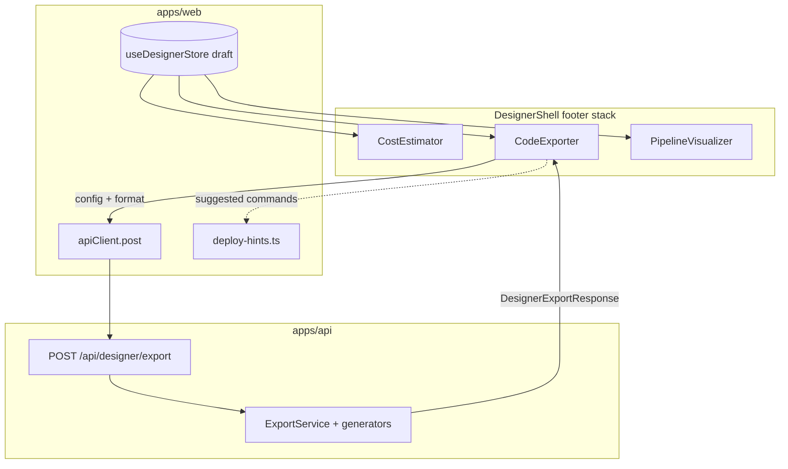
```mermaid
flowchart TB
  subgraph Shell["DesignerShell footer stack"]
    CE[CostEstimator]
    CX[CodeExporter]
    PV[PipelineVisualizer]
  end
  subgraph Web["apps/web"]
    Z[(useDesignerStore draft)]
    AC[apiClient.post]
    H[deploy-hints.ts]
  end
  subgraph API["apps/api"]
    E["POST /api/designer/export"]
    EX[ExportService + generators]
  end
  Z --> CE
  Z --> CX
  Z --> PV
  CX -->|"config + format"| AC
  AC --> E
  E --> EX
  EX -->|"DesignerExportResponse"| CX
  CX -.->|suggested commands| H
```

Long-form Phase 5 diagrams: **[PROJECT_SYSTEM_DESIGN_EVOLUTION_Phase5.md](./PROJECT_SYSTEM_DESIGN_EVOLUTION_Phase5.md)**.

---

## Phase 5 snapshot — Designer UI (after P5-13)

**P5-13** completes the **Designer Review** stage: **`DesignerStagePlaceholder`** renders **`DesignerReviewPage`** at **`/designer/review`**. The page shows **draft title**, **metadata timestamps**, a **grid of summary cards** (cloud through evaluation), **flow bullets** via **`generatePipelineHighlights`**, a **checklist of deep links** to prior stages, and **actions** — smooth-scroll jumps to the three footer **`section`** elements (**cost**, **export**, **pipeline**), **clipboard** copies for text summary and full **JSON** draft, and **confirm-gated** **`resetDraft`**. Shared DOM ids live in **`apps/web/src/lib/designer-section-anchors.ts`**; **`CostEstimator`**, **`CodeExporter`**, and **`PipelineVisualizer`** accept optional **`id`** and **`scroll-mt-4`** for predictable **`scrollIntoView`**. The shell layout is unchanged: Review content scrolls in **`main`**; the live cost/export/diagram strips remain the single integration point with **`POST /api/utilities/cost`** and **`POST /api/designer/export`**.

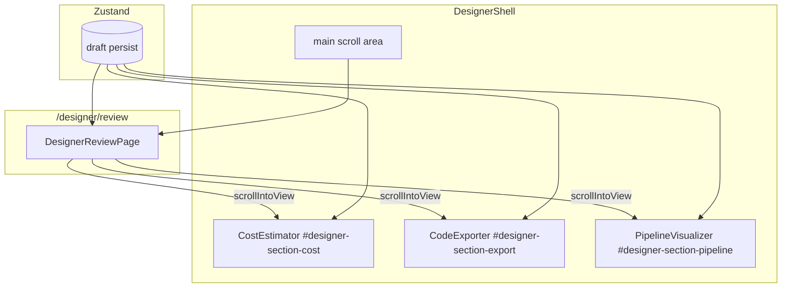
```mermaid
flowchart TB
  subgraph Route["/designer/review"]
    RV[DesignerReviewPage]
  end
  subgraph Shell["DesignerShell"]
    M[main scroll area]
    CE["CostEstimator #designer-section-cost"]
    CX["CodeExporter #designer-section-export"]
    PV["PipelineVisualizer #designer-section-pipeline"]
  end
  subgraph State["Zustand"]
    D[(draft persist)]
  end
  M --> RV
  RV -->|"scrollIntoView"| CE
  RV -->|"scrollIntoView"| CX
  RV -->|"scrollIntoView"| PV
  D --> RV
  D --> CE
  D --> CX
  D --> PV
```

Long-form Phase 5 diagrams: **[PROJECT_SYSTEM_DESIGN_EVOLUTION_Phase5.md](./PROJECT_SYSTEM_DESIGN_EVOLUTION_Phase5.md)**.

---

## Phase 5 snapshot — Template Gallery (after P5-14)

**P5-14** replaces the **`/templates`** placeholder with **`TemplateGallery`**: **`GET /api/templates`** loads the **JSON catalog** (validated server-side as **`TemplatesCatalogResponse`**). Cards support **search**, **complexity** filters, **“Preview locally”** (**`loadPipeline`** + **`/designer/review`** only), and **“Use template”** which opens a **Radix Dialog** to either **`POST /api/projects/`** (new workspace) or reuse an existing server **`projectId`**, then **`POST /api/templates/{id}/apply`** (**201**) to persist **`PipelineConfig`**. On success the client **rehydrates `useDesignerStore`**, **merges `useProjectStore`** (**`linkedPipelineId`**), and **redirects to Review**. This closes the **Designer ↔ Templates API** loop opened in **P4-5** without duplicating catalog files in the browser bundle.

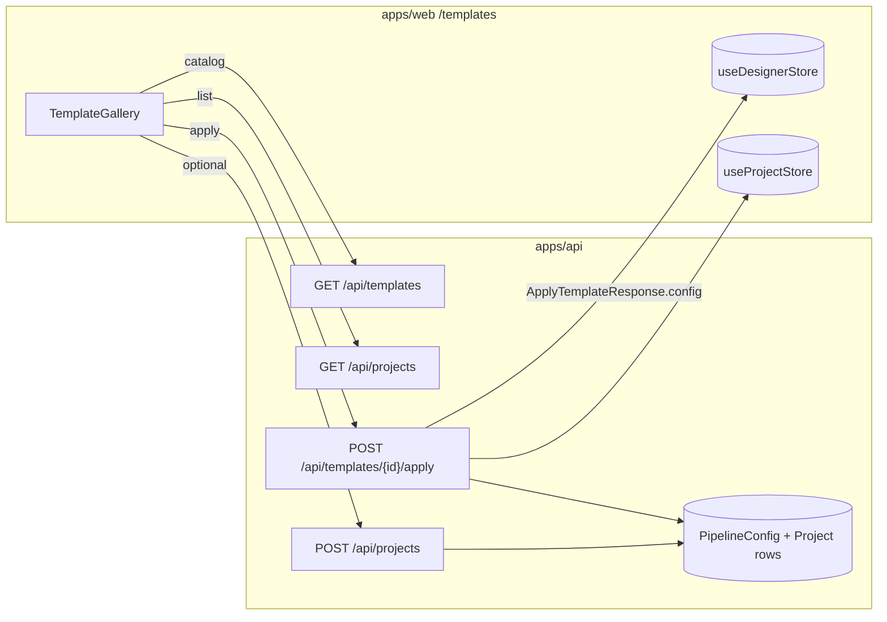
```mermaid
flowchart LR
  subgraph Web["apps/web /templates"]
    TG[TemplateGallery]
    ZD[(useDesignerStore)]
    ZP[(useProjectStore)]
  end
  subgraph API["apps/api"]
    TLIST["GET /api/templates"]
    PLIST["GET /api/projects"]
    PNEW["POST /api/projects"]
    TAPP["POST /api/templates/{id}/apply"]
    DB[(PipelineConfig + Project rows)]
  end
  TG -->|"catalog"| TLIST
  TG -->|"list"| PLIST
  TG -->|"optional"| PNEW
  TG -->|"apply"| TAPP
  TAPP --> DB
  PNEW --> DB
  TAPP -->|"ApplyTemplateResponse.config"| ZD
  TAPP --> ZP
```

Long-form Phase 5 diagrams: **[PROJECT_SYSTEM_DESIGN_EVOLUTION_Phase5.md](./PROJECT_SYSTEM_DESIGN_EVOLUTION_Phase5.md)**.

---

## Phase 6 — Autopilot LangGraph (after P6-1)

**P6-1** adds **`apps/api/app/core/agents/`**: a shared **`AutopilotGraphState`** (messages + build metadata + **`agent_trace`** + **`stage_outputs`** reducers), **central prompts**, a **stub tool registry**, and a **bootstrap LangGraph** (`bootstrap_prepare` → `bootstrap_finalize`) that runs without an LLM to validate the stack. The Celery **`run_pipeline_build`** stub now imports **`AUTOPILOT_STAGE_ORDER`** from the same module so UI/worker stage names stay aligned with the graph roadmap. Specialist subgraphs (P6-2 onward) will compile into a parent orchestrator (P6-8); APIs (P6-9) will stream **`agent_trace`** / **`messages`** to the client.

### P6-1 — Component view

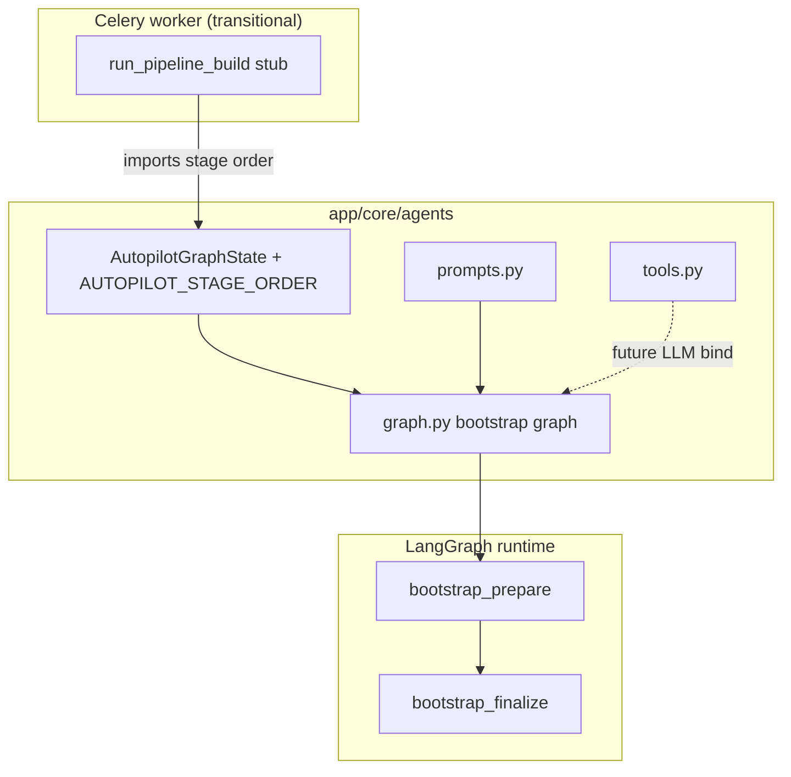
```mermaid
flowchart TB
  subgraph Worker["Celery worker (transitional)"]
    T[run_pipeline_build stub]
  end
  subgraph Agents["app/core/agents"]
    ST[AutopilotGraphState + AUTOPILOT_STAGE_ORDER]
    PR[prompts.py]
    TL[tools.py]
    GR[graph.py bootstrap graph]
  end
  subgraph LG["LangGraph runtime"]
    N1[bootstrap_prepare]
    N2[bootstrap_finalize]
  end
  T -->|"imports stage order"| ST
  GR --> N1 --> N2
  ST --> GR
  PR --> GR
  TL -.->|"future LLM bind"| GR
```

### P6-1 — Bootstrap graph (minimal executable)

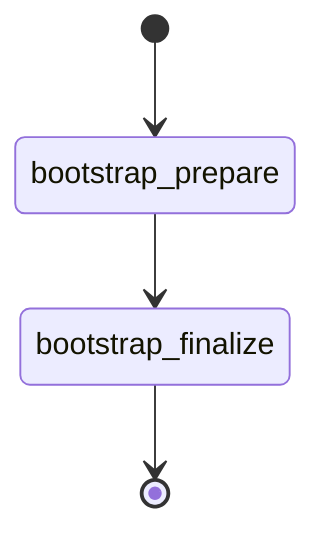
```mermaid
stateDiagram-v2
  [*] --> bootstrap_prepare
  bootstrap_prepare --> bootstrap_finalize
  bootstrap_finalize --> [*]
```

### Evolution note

Before P6-1, Autopilot progress was **time-sliced stub updates** in **`run_pipeline_build`** with no shared agent memory. After P6-1, the codebase has a **single state schema** and a **compiled graph** pattern; subsequent phases add **real nodes** per stage and replace the stub with orchestrated execution.

---

## Phase 6 — Autopilot LangGraph (after P6-2 · Document Analyst Agent)

**P6-2** adds **`app/core/agents/document_analyst.py`**: deterministic **corpus summarisation** and **chunking recommendations** from optional **`requirements["corpus_profiles"]`** (or synthetic unknown profiles per **`document_id`**). The compiled graph is now **linear**: **`bootstrap_prepare` → `bootstrap_finalize` → `document_analyst` → END**. **`stage_outputs["analyze"]`** holds `corpus_summary`, `chunking_recommendation` (primary/alternate strategy ids, rationale, suggested parameters), and trace-friendly **`agent_trace`** entries. **`tools.py`** exposes **`document_corpus_analyze`**, **`summarize_corpus_profiles_json`**, and **`recommend_chunking_from_summary_json`** for future LLM tool-calling without duplicating rules.

### P6-2 — Graph topology (bootstrap + analyze)

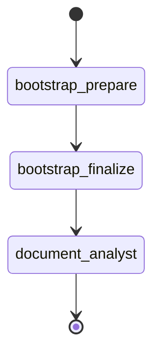
```mermaid
stateDiagram-v2
  [*] --> bootstrap_prepare
  bootstrap_prepare --> bootstrap_finalize
  bootstrap_finalize --> document_analyst
  document_analyst --> [*]
```

### P6-2 — Data flow (profiles → stage_outputs)

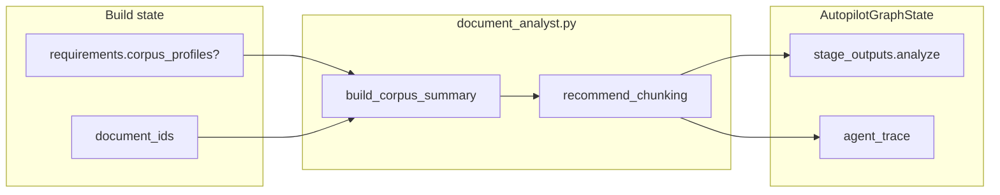
```mermaid
flowchart LR
  subgraph Inputs["Build state"]
    R["requirements.corpus_profiles?"]
    D[document_ids]
  end
  subgraph Analyst["document_analyst.py"]
    S[build_corpus_summary]
    REC[recommend_chunking]
  end
  subgraph Out["AutopilotGraphState"]
    SO["stage_outputs.analyze"]
    TR[agent_trace]
  end
  R --> S
  D --> S
  S --> REC
  REC --> SO
  REC --> TR
```

### Evolution note (P6-1 → P6-2)

After P6-1 the graph only **validated LangGraph wiring**. After P6-2 the first **real Autopilot stage** (`analyze` in **`AUTOPILOT_STAGE_ORDER`**) produces **actionable machine output** for the Chunking Optimizer (P6-3) while remaining **LLM-free** for reproducibility.

---

## Phase 6 — Autopilot LangGraph (after P6-3 · Chunking Optimizer Agent)

**P6-3** adds **`app/core/agents/chunking_optimizer.py`**: expands **`chunking_recommendation`** into deduped **`ChunkingConfig`** candidates (primary, alternates, and light **`optimize_for`** variants), runs **`ChunkingService.chunk`** on a **signal-aware synthetic corpus** (or **`requirements["chunking_sample_documents"]`**), scores chunks via **`ChunkQualityScorer`**, and writes **`stage_outputs["chunking"]`** (`selected`, `candidates_tried`, `alternatives_tested`). The compiled graph is **linear**: **`bootstrap_prepare` → `bootstrap_finalize` → `document_analyst` → `chunking_optimizer` → END**. Terminal **`current_stage`** is **`chunking_complete`**. Tooling adds **`chunking_optimizer_run`** for future LLM tool loops.

### P6-3 — Graph topology (bootstrap + analyze + chunking)

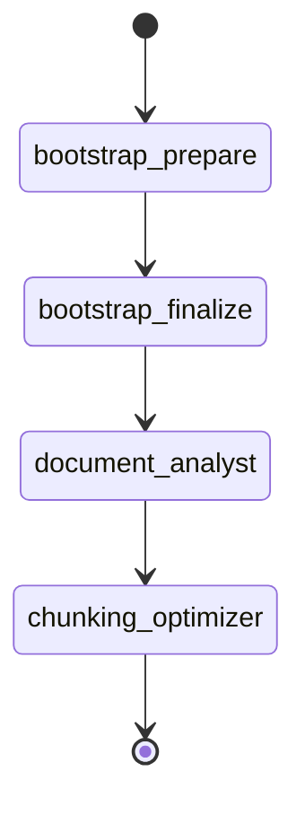
```mermaid
stateDiagram-v2
  [*] --> bootstrap_prepare
  bootstrap_prepare --> bootstrap_finalize
  bootstrap_finalize --> document_analyst
  document_analyst --> chunking_optimizer
  chunking_optimizer --> [*]
```

### P6-3 — Data flow (analyze → chunk benchmarks → stage_outputs)

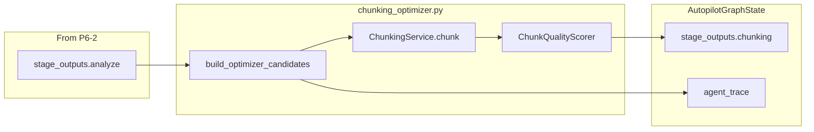
```mermaid
flowchart LR
  subgraph Prior["From P6-2"]
    A["stage_outputs.analyze"]
  end
  subgraph Opt["chunking_optimizer.py"]
    C[build_optimizer_candidates]
    S[ChunkingService.chunk]
    Q[ChunkQualityScorer]
  end
  subgraph Out["AutopilotGraphState"]
    CH["stage_outputs.chunking"]
    TR[agent_trace]
  end
  A --> C
  C --> S
  S --> Q
  Q --> CH
  C --> TR
```

### Evolution note (P6-2 → P6-3)

After P6-2, Autopilot produced **recommendations only**. After P6-3, the same build run **executes real chunkers** on a bounded corpus and selects a **measured** configuration, bridging **heuristic analyst output** to **service-level validation** before embedding work in P6-4.

---

## Phase 6 — Autopilot LangGraph (after P6-4 · Embedding Tester Agent)

**P6-4** adds **`app/core/agents/embedding_tester.py`**: loads **`data/models/embeddings.json`**, builds a bounded list of **`EmbeddingConfig`** candidates (pipeline `stages.embedding`, optional **`requirements["embedding_candidate_models"]`**, tier-aware defaults from **`optimize_for`**), derives benchmark strings by re-chunking the **same synthetic corpus** as P6-3 with the **winning chunking config** (or **`requirements["embedding_sample_texts"]`**), runs **`EmbeddingBenchmarker.benchmark`**, merges **live throughput/latency** with **catalog MTEB and list-price** signals into a **weighted composite** (`quality` / `latency` / `cost` / `balanced`), and writes **`stage_outputs["embedding"]`**. The compiled bootstrap graph is **linear** through **`embedding_tester`**; terminal **`current_stage`** is **`embedding_complete`**. Tooling adds **`embedding_tester_run`** (chunking + analyze + requirements JSON, optional pipeline JSON).

### P6-4 — Graph topology (bootstrap + analyze + chunking + embedding)

```mermaid
stateDiagram-v2
  [*] --> bootstrap_prepare
  bootstrap_prepare --> bootstrap_finalize
  bootstrap_finalize --> document_analyst
  document_analyst --> chunking_optimizer
  chunking_optimizer --> embedding_tester
  embedding_tester --> [*]
```

### P6-4 — Data flow (chunking winner + catalog → benchmarks → stage_outputs)

```mermaid
flowchart LR
  subgraph Prior["From P6-2 / P6-3"]
    A["stage_outputs.analyze"]
    CH["stage_outputs.chunking"]
  end
  subgraph EmbMod["embedding_tester.py"]
    CAT[data/models/embeddings.json]
    T[ChunkingService texts]
    B[EmbeddingBenchmarker]
  end
  subgraph Out["AutopilotGraphState"]
    E["stage_outputs.embedding"]
    TR[agent_trace]
  end
  A --> T
  CH --> T
  CAT --> B
  T --> B
  B --> E
  B --> TR
```

### Evolution note (P6-3 → P6-4)

After P6-3, Autopilot had a **measured chunking triple** but only **static** embedding intent from the Designer draft. After P6-4, the run **exercises real embedders** on representative chunk text (when providers succeed), ranks candidates with **explicit trade-offs** against **`optimize_for`**, and emits a **catalog-aligned** `provider` / `model` / `dimensions` choice for downstream retrieval tuning in **P6-5**.

---

## Phase 6 — Autopilot LangGraph (after P6-5 · Retrieval Optimizer Agent)

**P6-5** adds **`app/core/agents/retrieval_optimizer.py`**: builds **chunk texts** consistent with P6-4, generates a bounded set of **retrieval + rerank** candidates (pipeline **`stages.retrieval`** / **`reranking`** when present, else catalog of **similarity / hybrid / MMR / multi-query / ensemble**), scores them with **BM25-oracle MRR** plus a **latency proxy**, and writes **`stage_outputs["retrieval"]`**. The bootstrap graph is **linear** through **`retrieval_optimizer`**; terminal **`current_stage`** is **`retrieval_complete`**. Tooling adds **`retrieval_optimizer_run`**.

### P6-5 — Graph topology (bootstrap + analyze + chunking + embedding + retrieval)

```mermaid
stateDiagram-v2
  [*] --> bootstrap_prepare
  bootstrap_prepare --> bootstrap_finalize
  bootstrap_finalize --> document_analyst
  document_analyst --> chunking_optimizer
  chunking_optimizer --> embedding_tester
  embedding_tester --> retrieval_optimizer
  retrieval_optimizer --> [*]
```

### P6-5 — Data flow (chunk texts + offline scores → retrieval decision)

```mermaid
flowchart LR
  subgraph Prior["From P6-2 … P6-4"]
    A["stage_outputs.analyze"]
    CH["stage_outputs.chunking"]
    E["stage_outputs.embedding"]
  end
  subgraph RMod["retrieval_optimizer.py"]
    T[Chunk texts corpus]
    S[BM25 + dense proxy + fusion]
  end
  subgraph Out["AutopilotGraphState"]
    R["stage_outputs.retrieval"]
    TR[agent_trace]
  end
  A --> T
  CH --> T
  E --> S
  T --> S
  S --> R
  S --> TR
```

### Evolution note (P6-4 → P6-5)

After P6-4, Autopilot had a **chosen embedding model** but retrieval was still **Designer defaults**. After P6-5, the run emits a **measured retrieval configuration** (strategy, **top_k**, hybrid/MMR knobs, rerank on/off) aligned to **`optimize_for`**, ready for **generation / evaluation** agents in P6-6+.

---

## Phase 6 — Autopilot LangGraph (after P6-6 · Evaluation Agent)

**P6-6** adds **`app/core/agents/evaluation_agent.py`**: reuses **P6-5** chunk corpus and **selected retrieval** ranking, builds **per-query** rows with an **extractive** simulated answer, computes **deterministic metric proxies**, runs **`analyze_failures`**, compares aggregates to **`requirements["target_metrics"]`**, and writes **`stage_outputs["evaluation"]`**. The bootstrap graph ends at **`evaluation_agent` → END**; terminal **`current_stage`** is **`evaluation_complete`**. Tooling adds **`evaluation_agent_run`**.

### P6-6 — Graph topology (bootstrap … retrieval → evaluation)

```mermaid
stateDiagram-v2
  [*] --> bootstrap_prepare
  bootstrap_prepare --> bootstrap_finalize
  bootstrap_finalize --> document_analyst
  document_analyst --> chunking_optimizer
  chunking_optimizer --> embedding_tester
  embedding_tester --> retrieval_optimizer
  retrieval_optimizer --> evaluation_agent
  evaluation_agent --> [*]
```

### P6-6 — Data flow (retrieval decision + chunks → eval payload)

```mermaid
flowchart LR
  subgraph Prior["From P6-2 … P6-5"]
    A["stage_outputs.analyze"]
    CH["stage_outputs.chunking"]
    R["stage_outputs.retrieval"]
  end
  subgraph EMod["evaluation_agent.py"]
    Q[Eval queries + BM25 oracle]
    S[Lexical proxies + failure_analysis]
  end
  subgraph Out["AutopilotGraphState"]
    EV["stage_outputs.evaluation"]
    TR[agent_trace]
  end
  A --> Q
  CH --> Q
  R --> Q
  Q --> S
  S --> EV
  S --> TR
```

### Evolution note (P6-5 → P6-6)

After P6-5, Autopilot could **rank** chunks but had **no closed-loop quality signal** for the composed stack. After P6-6, each run emits a **structured evaluation payload** (metrics, **meets_targets**, **failure_analysis**) suitable for **orchestrator iteration** and UI explainability, while **full RAGAS** remains on the **async evaluation** path (**P2-7** / jobs) for production-grade scoring.

---

## Phase 6 — Autopilot LangGraph (after P6-7 · Deployment Agent)

**P6-7** adds **`app/core/agents/deployment_agent.py`**: after evaluation, the graph emits **container/IaC text** (Docker Compose, Kubernetes multi-doc YAML, Terraform HCL) either by **reusing P4 export generators** on a valid **`PipelineConfigurationSchema`** or by **fallback sketches** parameterized from **`stage_outputs`** (retrieval / embedding / chunking selections). **`cloud_deployers`** holds per-provider **dry-run** metadata (**`apply_gated: true`**) so Autopilot never performs cloud apply. **`AUTOPILOT_STAGE_ORDER`** now ends with **`deployment`**, aligning the Celery **`run_pipeline_build`** stub loop with the LangGraph stage list. Tooling adds **`deployment_agent_run`**.

### P6-7 — Graph topology (bootstrap … evaluation → deployment)

```mermaid
stateDiagram-v2
  [*] --> bootstrap_prepare
  bootstrap_prepare --> bootstrap_finalize
  bootstrap_finalize --> document_analyst
  document_analyst --> chunking_optimizer
  chunking_optimizer --> embedding_tester
  embedding_tester --> retrieval_optimizer
  retrieval_optimizer --> evaluation_agent
  evaluation_agent --> deployment_agent
  deployment_agent --> [*]
```

### P6-7 — Data flow (stages + optional Designer config → artefacts)

```mermaid
flowchart LR
  subgraph Prior["From P6-2 … P6-6 + optional pipeline_config"]
    EV["stage_outputs.evaluation"]
    R["stage_outputs.retrieval"]
    E["stage_outputs.embedding"]
    CH["stage_outputs.chunking"]
    PC["AutopilotGraphState.pipeline_config"]
  end
  subgraph DMod["deployment_agent.py"]
    V[Validate PipelineConfigurationSchema?]
    G[generate_docker_compose / k8s / terraform]
    F[Fallback sketches from selected knobs]
  end
  subgraph Out["AutopilotGraphState"]
    DEP["stage_outputs.deployment"]
    TR[agent_trace]
  end
  EV --> V
  R --> V
  E --> V
  CH --> V
  PC --> V
  V -->|valid| G
  V -->|invalid or missing| F
  G --> DEP
  F --> DEP
  DEP --> TR
```

### Evolution note (P6-6 → P6-7)

After P6-6, Autopilot could **score** the stack but could not yet **package** it for operators. After P6-7, each run carries **reviewable deployment artefacts** and explicit **gated** cloud next-steps, bridging Autopilot output toward **Designer export** parity and future **deployment APIs** without introducing unmanaged side effects in the graph.

---

## Phase 6 snapshot — P6-8 · Autopilot Orchestrator (evaluation gate + retries + progress)

**P6-8** turns the former **linear** bootstrap graph into a **closed-loop orchestrator**: after **`evaluation_agent`**, an **`orchestration_gate`** node reads **`meets_targets`**, **`requirements.max_iterations`**, and **`evaluation_pass_index`**. If targets are unmet and retries remain, the graph loops back to **`chunking_optimizer`** (re-using the prior **analyze** payload); otherwise it continues to **`deployment_agent`**. Every specialist trace row is merged with **`kind: autopilot_progress`** fields (stage, 0–100 **progress**, detail) from **`app.core.agents.progress`**, suitable for **SSE** consumers in **P6-9**. **`AutopilotGraphState`** gains **`evaluation_pass_index`** (incremented by the gate on retry). **`jobs.run_pipeline_build`** now invokes **`invoke_autopilot_orchestrator`**, persists **stages**, **messages**, **progress**, compact **`result.stage_outputs`**, and marks **`generation`** in **`AUTOPILOT_STAGE_ORDER`** as a **Designer-led** placeholder so API keys stay aligned with the worker stub matrix.

### P6-8 — LangGraph topology (gate + retry loop)

```mermaid
stateDiagram-v2
  [*] --> bootstrap_prepare
  bootstrap_prepare --> bootstrap_finalize
  bootstrap_finalize --> document_analyst
  document_analyst --> chunking_optimizer
  chunking_optimizer --> embedding_tester
  embedding_tester --> retrieval_optimizer
  retrieval_optimizer --> evaluation_agent
  evaluation_agent --> orchestration_gate
  orchestration_gate --> chunking_optimizer: retry_chunking
  orchestration_gate --> deployment_agent: deploy
  deployment_agent --> [*]
```

### P6-8 — Worker ↔ graph persistence

```mermaid
flowchart LR
  subgraph Celery["Celery worker"]
    T[run_pipeline_build]
  end
  subgraph Graph["LangGraph orchestrator"]
    G[invoke_autopilot_orchestrator]
  end
  subgraph DB["PostgreSQL"]
    B[autopilot_builds row]
  end
  T -->|initial_autopilot_graph_state| G
  G -->|agent_trace + stage_outputs + messages| T
  T -->|stages, progress, result, messages| B
```

### Evolution note (P6-7 → P6-8)

Before P6-8, a build always ran **one forward pass** regardless of metric gaps. After P6-8, **target-driven iteration** is explicit in the graph, **progress-shaped trace rows** exist for streaming UIs, and the **Celery build task** executes the **same** LangGraph the API will expose—eliminating the prior **pure stub** stage loop.

---

## Phase 6 snapshot — P6-9 · Autopilot API Endpoints (FastAPI façade over Celery + LangGraph)

**P6-9** exposes **first-class HTTP routes** under **`/api/autopilot`** so clients no longer have to manually create DB rows and call **`/api/jobs/build/{id}`**. **`POST /api/autopilot/build`** validates **`StartBuildRequest`**, checks **project ownership**, inserts **`autopilot_builds`** with **initial per-stage `pending` maps** aligned to **`AUTOPILOT_STAGE_ORDER`**, enqueues **`run_pipeline_build`**, and stores **`_celery_task_id`** beside user **`requirements`**. **`GET`** polling and **`GET …/stream`** surface **`BuildStatusResponse`** (camelCase JSON in SSE). **`POST …/cancel`** marks **`cancelled`** in PostgreSQL and **best-effort** **`revoke`**s the Celery task (tolerates broker outages). **`GET …/result`** returns the **raw** orchestrator JSON artifact. The worker gained **cooperative cancellation** checks so **`cancelled`** is not overwritten by a late **`complete`**.

### P6-9 — Request path (enqueue)

```mermaid
sequenceDiagram
  participant C as Client (Designer / P7 UI)
  participant API as FastAPI /api/autopilot
  participant PG as PostgreSQL
  participant R as Redis broker
  participant W as Celery worker

  C->>API: POST /build (projectId, requirements, documentIds)
  API->>PG: INSERT autopilot_builds (pending, stages, messages)
  API->>R: run_pipeline_build.delay(build_id)
  API->>PG: UPDATE requirements._celery_task_id
  API-->>C: 202 StartBuildResponse
  R->>W: deliver task
  W->>PG: status running → complete / failed / skip if cancelled
```

### P6-9 — Observe path (poll + SSE)

```mermaid
flowchart LR
  subgraph Client
    P[Poller]
    S[SSE reader]
  end
  subgraph API["FastAPI"]
    G[GET /build/id]
    ST[GET /build/id/stream]
  end
  PG[(autopilot_builds)]
  P --> G
  G --> PG
  S --> ST
  ST -->|"new session each tick"| PG
```

### Evolution note (P6-8 → P6-9)

Before P6-9, operators could enqueue **`run_pipeline_build`** only via the **generic jobs router** after hand-crafting persistence. After P6-9, **Autopilot is a cohesive HTTP vertical**: one **`POST`** starts a tracked build with **correct `requirements` hydration** for the orchestrator, **cancel** is a product feature (not a Celery admin task), and **SSE** matches the **polling schema** so Phase 7 can swap transports without redesigning payloads.

---

## Phase 7 snapshot — P7-1 · Document Uploader (browser → API → MinIO → Zustand)

**P7-1** closes the loop between **placeholder `documentIds`** and **real corpus bytes**. The FastAPI router adds **`POST /api/autopilot/upload`**, which validates **project ownership**, enforces **per-file size** / **count** caps from **`Settings`**, optionally type-checks extensions, and streams objects into the configured **MinIO** bucket under **`autopilot/{user}/{project}/…`** keys via **`upload_blobs_sync`** (executed in a **thread** off the asyncio loop). The **Next.js** Autopilot page renders **`DocumentUploader`**: it lists server projects from **`GET /api/projects/`**, posts **`FormData`** through **`postFormData`**, and persists **`UploadedDocumentItem`** metadata in **`useAutopilotStore`** for later **`POST /api/autopilot/build`** wiring.

### P7-1 — Upload + persistence path

```mermaid
flowchart LR
  subgraph Web["Next.js (Autopilot page)"]
    DU[DocumentUploader]
    Z[(Zustand persist)]
  end
  subgraph API["FastAPI /api/autopilot"]
    UP[POST /upload]
    OWN[Project ownership check]
  end
  subgraph Obj["Object storage"]
    M[(MinIO / S3 bucket)]
  end
  DU -->|GET list| PG[(PostgreSQL projects)]
  DU -->|multipart projectId + files| UP
  UP --> OWN
  OWN --> PG
  UP -->|put_object| M
  UP -->|201 documents[]| DU
  DU --> Z
```

### P7-1 — Build hand-off (conceptual; wired in later P7 tasks)

```mermaid
sequenceDiagram
  participant U as Autopilot UI
  participant API as FastAPI
  participant S3 as MinIO
  participant JOB as Celery worker

  U->>API: POST /upload (multipart)
  API->>S3: put_object(autopilot/…)
  API-->>U: objectId list
  Note over U: P7-2+ capture requirements
  U->>API: POST /build (documentIds = objectIds)
  API->>JOB: run_pipeline_build
  JOB->>JOB: LangGraph reads document_ids from state
```

### Evolution note (P6-9 → P7-1)

Before P7-1, **`documentIds`** were opaque strings with **no first-class ingestion path** from the product UI. After P7-1, **Autopilot shares the same MinIO substrate** referenced throughout Docker Compose and **`Settings`**, and the **frontend store** can accumulate **display-ready upload metadata** ahead of the **requirements** and **build progress** surfaces.

---

