# Project system design evolution — Unified RAG Studio

> Narrative and diagrams showing how the architecture deepens by phase. **Phase P0–P2** sections restore **per-subphase** “Design Level” diagrams and decisions from historical documentation (`aa7f9dc`). Later milestones are split into separate files so the content stays easy to read on GitHub.

---

## Documents by phase

| Phase | Scope (summary) | File |
|------:|-----------------|------|
| **0** | Monorepo skeleton, Docker Compose dev, CI/CD, backend & frontend scaffolds | [PROJECT_SYSTEM_DESIGN_EVOLUTION_Phase0.md](./PROJECT_SYSTEM_DESIGN_EVOLUTION_Phase0.md) |
| **1** | JSON catalogs, TypeScript types, Pydantic schemas, DB migrations | [PROJECT_SYSTEM_DESIGN_EVOLUTION_Phase1.md](./PROJECT_SYSTEM_DESIGN_EVOLUTION_Phase1.md) |
| **2** | Ingestion, chunking, embedding, vector store, retrieval, generation, evaluation, Celery, health/utilities | [PROJECT_SYSTEM_DESIGN_EVOLUTION_Phase2.md](./PROJECT_SYSTEM_DESIGN_EVOLUTION_Phase2.md) |
| **3** | Frontend foundation (UI, stores, shell, landing, lib utilities) | [PROJECT_SYSTEM_DESIGN_EVOLUTION_Phase3.md](./PROJECT_SYSTEM_DESIGN_EVOLUTION_Phase3.md) |
| **4** | Designer mode backend (projects, config, cost, export, templates) | [PROJECT_SYSTEM_DESIGN_EVOLUTION_Phase4.md](./PROJECT_SYSTEM_DESIGN_EVOLUTION_Phase4.md) |
| **4.5** | Guardrails (policy, RAG integration, metrics, operator policy files) | [PROJECT_SYSTEM_DESIGN_EVOLUTION_Phase4.5.md](./PROJECT_SYSTEM_DESIGN_EVOLUTION_Phase4.5.md) |
| **5** | Designer UI (visual pipeline builder; started with cloud catalog selector) | [PROJECT_SYSTEM_DESIGN_EVOLUTION_Phase5.md](./PROJECT_SYSTEM_DESIGN_EVOLUTION_Phase5.md) |

---

## Document maintenance (append-only policy)

> **2026-05-02:** **Phase P0–P2** sections in the phase files were **restored from git** (`aa7f9dc`, per-subphase “Design Level” diagrams). **Phase 3+** milestones live in the linked files above; extend only at the **end** of the relevant phase file—do not replace earlier phases when adding new work.

> **Split (2026-05-02):** This index replaces a single large `PROJECT_SYSTEM_DESIGN_EVOLUTION.md` for GitHub rendering. When you add a new **top-level** phase, add a row to the table and create `PROJECT_SYSTEM_DESIGN_EVOLUTION_PhaseN.md` if needed.

---

## Phase 5 snapshot — Designer UI (after P5-2)

Phase 5 layers **interactive configuration** onto the Phase 3 shell and Phase 4 APIs. **P5-2** wires the shared **`data/cloud-providers.json`** catalog into the Designer **Cloud Provider** stage: users pick AWS, GCP, Azure, or Multi-Cloud; the choice persists in **`draft.cloudProvider`** (Zustand + localStorage) for downstream steps and API payloads.

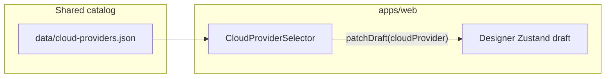

Long-form diagrams and evolving design levels for Phase 5 live in **[PROJECT_SYSTEM_DESIGN_EVOLUTION_Phase5.md](./PROJECT_SYSTEM_DESIGN_EVOLUTION_Phase5.md)**.

---

## Phase 5 snapshot — Designer UI (after P5-3)

**P5-3** adds the **Data Ingestion** stage UI: users configure **`PipelineStages.dataIngestion`** (source type, file types, preprocessing, metadata, connection hints). **`DataIngestionConfigurator`** calls **`updateStages({ dataIngestion })`** so the nested config persists beside **`draft.cloudProvider`**. Validation uses shared **Zod** (`DataIngestionConfigSchema`). Runtime ingestion remains in backend **`IngestionService`**; the Designer captures deployable intent for exports and APIs.

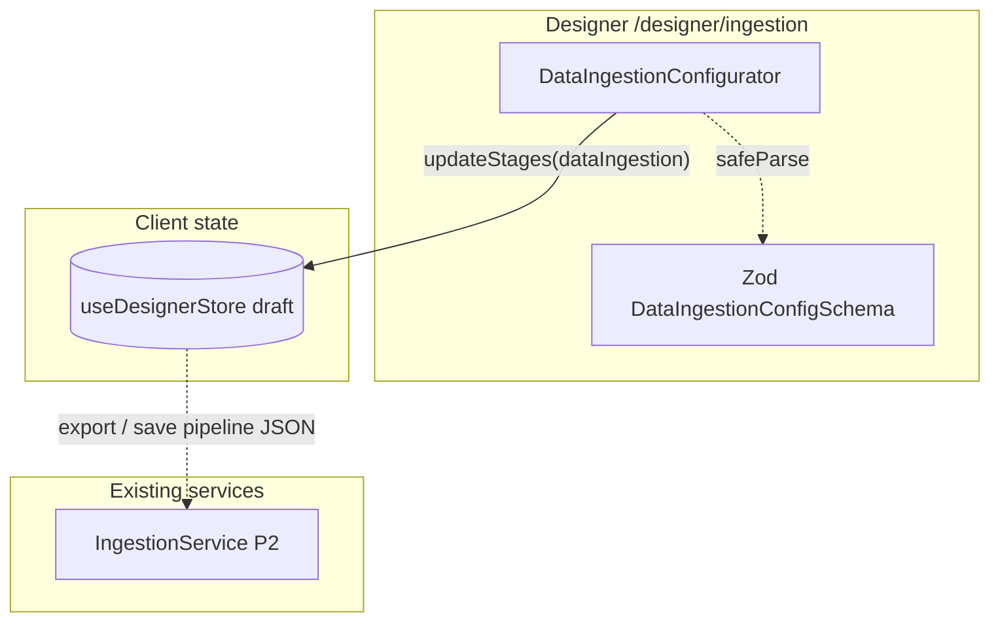

---

## Phase 5 snapshot — Designer UI (after P5-4)

**P5-4** adds the **Chunking** stage: **`ChunkingConfigurator`** reads **`data/chunking-strategies.json`** (via **`chunking-strategies-catalog.ts`**) and writes **`updateStages({ chunking })`**. Users pick a **strategy** (fixed, recursive, semantic, markdown header, sentence, paragraph, code-aware), tune **token chunk size** and **overlap** within **Zod** bounds, edit the **separator ladder** for **recursive-character**, and set optional **chunk metadata**. **`StageNavigator`** shows a short **strategy · size/overlap** hint. Execution remains in backend **`ChunkingService` (P2-2)**; the UI captures deployable parameters for exports and APIs.

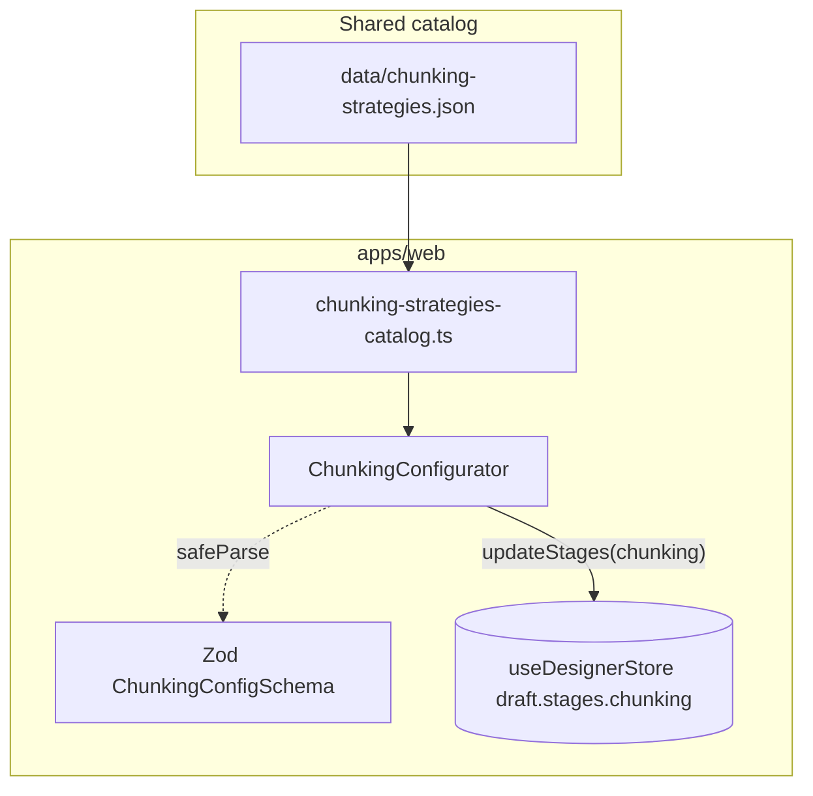

Long-form Phase 5 diagrams: **[PROJECT_SYSTEM_DESIGN_EVOLUTION_Phase5.md](./PROJECT_SYSTEM_DESIGN_EVOLUTION_Phase5.md)**.

---

## Phase 5 snapshot — Designer UI (after P5-5)

**P5-5** adds the **Embedding** stage: **`EmbeddingConfigurator`** reads **`data/models/embeddings.json`** (via **`embeddings-catalog.ts`**) and writes **`updateStages({ embedding })`**. Users discover models with **search** and **filters** (provider, tier, quality, speed, open-source, hide deprecated), select a **catalog-backed model** for **`model` / `provider` / `dimensions` / `maxTokens`**, and adjust **`batchSize`** within Zod bounds. **`StageNavigator`** shows a compact **name · dimensions** hint. Embedding execution stays in backend **`EmbeddingService` (P2-3)**; the UI captures deployable intent.

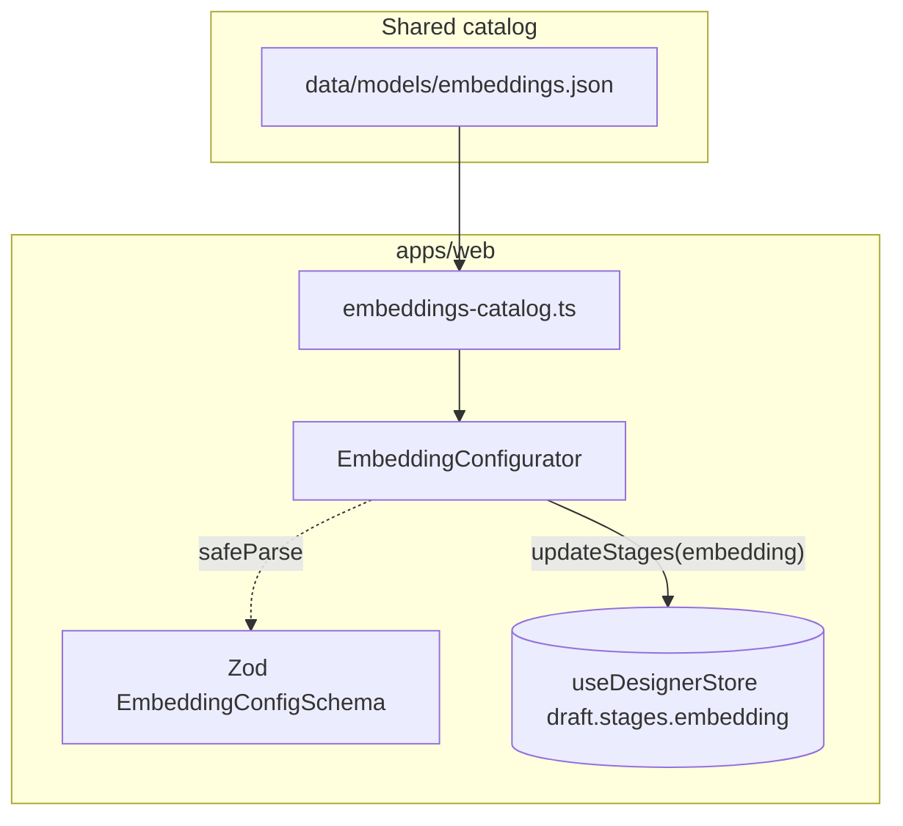

Long-form Phase 5 diagrams: **[PROJECT_SYSTEM_DESIGN_EVOLUTION_Phase5.md](./PROJECT_SYSTEM_DESIGN_EVOLUTION_Phase5.md)**.

---

## Phase 5 — P5-5 UX refinement (pinned selection, 2026-05-02)

When **search/filters** exclude the model already stored on **`draft.stages.embedding`**, the UI must not make the active choice disappear from the card grid. **`EmbeddingConfigurator`** therefore **prepends** the current catalog entry to the visible list and labels it **“Current · outside filters”**, with a short **aria-live** note in the filter summary. The main P5-5 dataflow is unchanged; this is a **client-only discoverability** layer on top of **`embeddings-catalog.ts`** and **`updateStages({ embedding })`**.

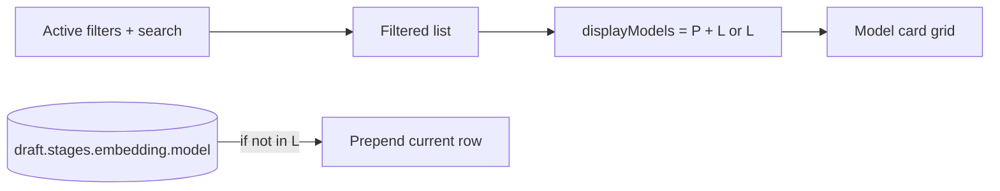

---

## Phase 5 snapshot — Designer UI (after P5-6)

**P5-6** adds the **Vector Store** stage: **`VectorStoreConfigurator`** reads **`data/vector-stores.json`** (via **`vector-stores-catalog.ts`**) and writes **`updateStages({ vectorStore })`**. Users **search** and **filter** (deployment type, AWS/GCP/Azure affinity, hybrid-capable), select a **provider card**, and edit **index name**, **metric** (catalog ∩ schema), **replicas/shards**, **namespace**, and optional **cloud placement hints**. Metric strings like **`l2`** / **`ip`** map to **`euclidean`** / **`dot`** for **`VectorStoreConfigSchema`**. **`StageNavigator`** shows **`vectorStoreHint`**. Runtime vector IO remains in **`VectorStoreService` (P2-4)**.

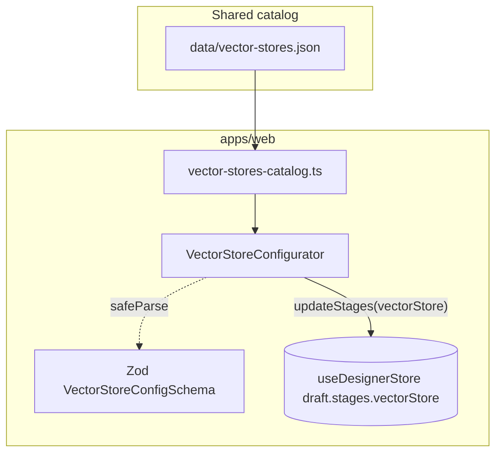

Long-form Phase 5 diagrams: **[PROJECT_SYSTEM_DESIGN_EVOLUTION_Phase5.md](./PROJECT_SYSTEM_DESIGN_EVOLUTION_Phase5.md)**.

---

## Phase 5 snapshot — Designer UI (after P5-7)

**P5-7** adds **retrieval and reranking** configuration: **`RetrievalConfigurator`** on **`/designer/retrieval`** reads **`data/retrieval-strategies.json`** via **`retrieval-strategies-catalog.ts`**, applies **`retrievalDefaultsFromCatalog`**, and writes **`updateStages({ retrieval })`** (strategy, top-k, optional score threshold, hybrid α, parent–child sizes, multi-query variants + LLM id, metadata filters). **Reranking** uses **`data/models/rerankers.json`** via **`rerankers-catalog.ts`** and **`updateStages({ reranking })`**. The **`/designer/reranking`** route uses **`variant="rerank-focus"`** for a compact retrieval summary plus full reranking controls. Client validation uses **Zod** (**`RetrievalConfigSchema`**, **`RerankingConfigSchema`**); execution stays in **`RetrievalService` (P2-5)**.

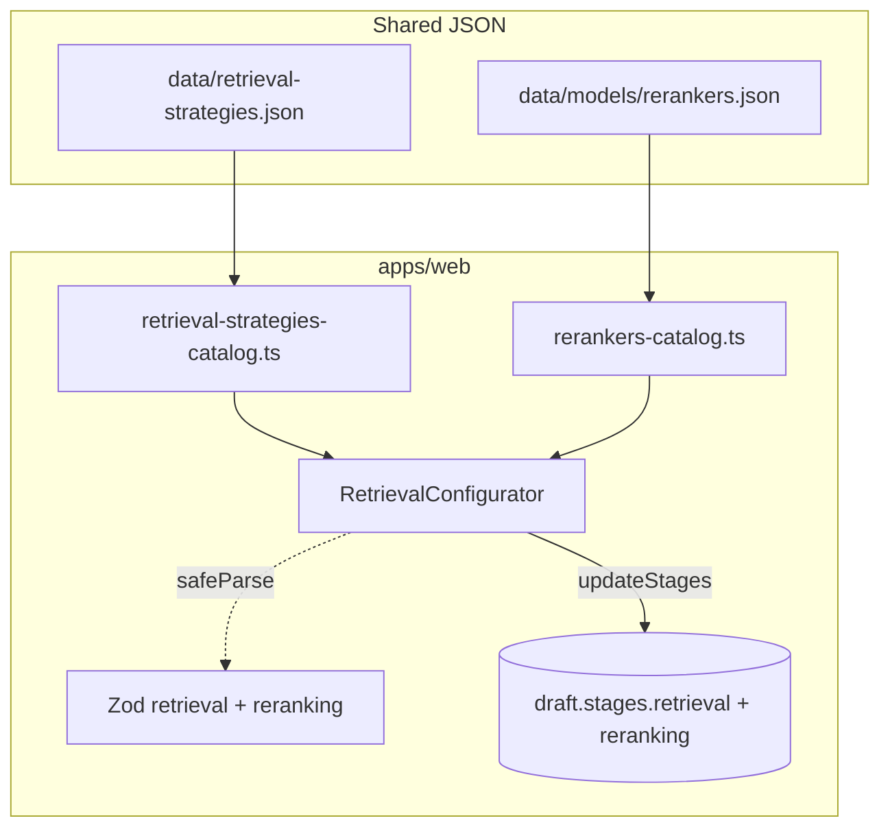

Long-form Phase 5 diagrams: **[PROJECT_SYSTEM_DESIGN_EVOLUTION_Phase5.md](./PROJECT_SYSTEM_DESIGN_EVOLUTION_Phase5.md)**.

---

## Phase 5 snapshot — Designer UI (after P5-8)

**P5-8** adds the **Generation** stage: **`GenerationConfigurator`** on **`/designer/generation`** reads **`data/models/generation.json`** via **`generation-catalog.ts`** and writes **`updateStages({ generation })`**. Users **search** and **filter** (provider, tier, open source, JSON mode, tool use), pick a **model card**, and tune **temperature**, **max output tokens** (capped by catalog **maxOutputTokens**), optional **top-p** (checkbox + slider), **output format**, and **system prompt**. **Pinned selection** matches **P5-5** when filters exclude the active model. **`StageNavigator`** shows **`generationHint`** (name · temperature · tokens). Execution remains in **`GenerationService` (P2-6)**.

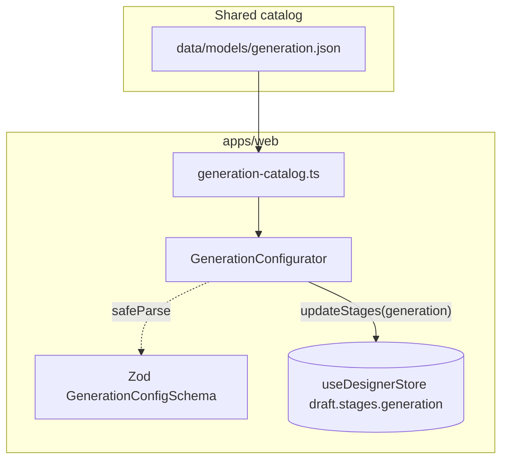

Long-form Phase 5 diagrams: **[PROJECT_SYSTEM_DESIGN_EVOLUTION_Phase5.md](./PROJECT_SYSTEM_DESIGN_EVOLUTION_Phase5.md)**.

---

## Phase 5 snapshot — Designer UI (after P5-9)

**P5-9** adds three Designer stages — **`/designer/routing`**, **`/designer/memory`**, **`/designer/evaluation`** — implemented as **`RoutingConfigurator`**, **`MemoryConfigurator`**, and **`EvaluationConfigurator`**. Each calls **`updateStages`** with **`routing`**, **`memory`**, or **`evaluation`** slices aligned with **`RoutingConfig`**, **`MemoryConfig`**, and **`EvaluationConfig`** in **`pipeline.ts`**, validated by **`RoutingConfigSchema`**, **`MemoryConfigSchema`**, and **`EvaluationConfigSchema`**. **Routing** uses **`listGenerationModels()`** for fallback and per-rule **target** models. **Memory** selects **`MemoryType`** (none, conversation-buffer, summary-buffer, vector-memory) with optional **window**, **maxTokens**, **sessionPersistence**. **Evaluation** toggles metrics (**faithfulness**, **answer_relevance**, **context_precision**, **context_recall**, **latency**), **testSetSize** (10–1000), and **schedule** (**on-demand** | **continuous**). **`StageNavigator`** adds **`routingHint`**, **`memoryHint`**, **`evaluationHint`**. Exports (**YAML**, **Python**, **Mermaid**) already consumed these fields from **P2 / generators**; this milestone completes the **Designer UI** surface for them.

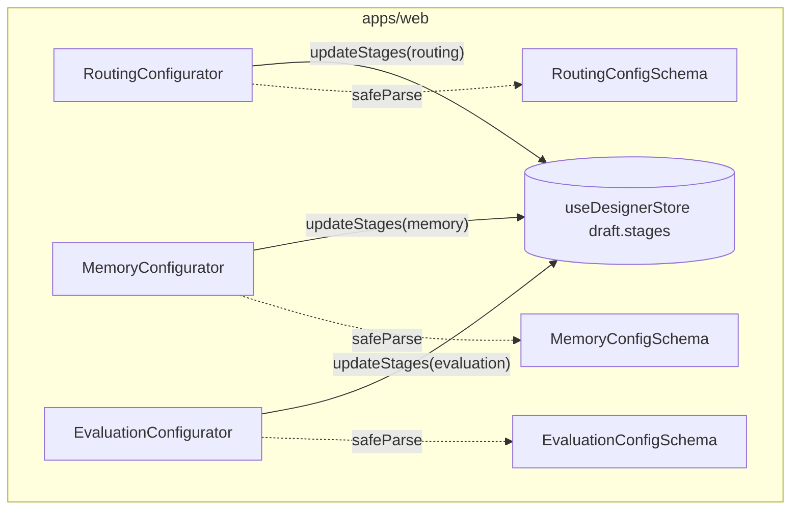

Long-form Phase 5 diagrams: **[PROJECT_SYSTEM_DESIGN_EVOLUTION_Phase5.md](./PROJECT_SYSTEM_DESIGN_EVOLUTION_Phase5.md)**.

---

## Phase 5 snapshot — Designer UI (after P5-10)

**P5-10** adds a **live pipeline visualizer** on every Designer route. **`DesignerShell`** groups the left column (**`StageNavigator`** + **`PipelineVisualizer placement=sidebar`**) and places **`PipelineVisualizer placement=main`** above **`main`** for small viewports. The visualizer subscribes to **`useDesignerStore`**, shows **`generatePipelineSummary`**, **`generatePipelineHighlights`**, and a **Mermaid** diagram from **`generateMermaidDiagram`**. The **mermaid** package renders **SVG** client-side with **theme** synced to **`.dark`** / **`prefers-color-scheme`**. The **indexing** and **query** subgraphs in **`mermaidGenerator.ts`** use a single coherent path: **query → (memory) → retrieve → (rerank) → (route) → generate → answer → (evaluate)**; **`VS --> RET`** links the index to retrieval.

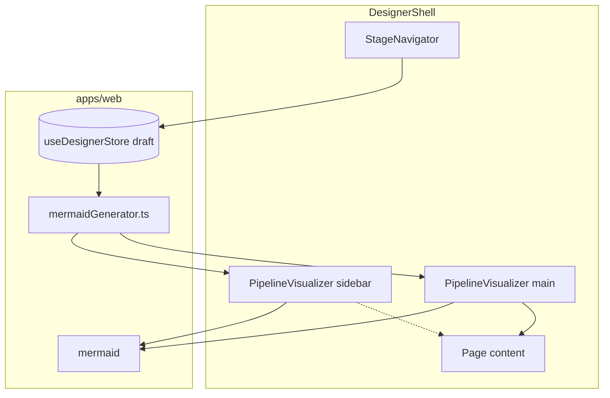

Long-form Phase 5 diagrams: **[PROJECT_SYSTEM_DESIGN_EVOLUTION_Phase5.md](./PROJECT_SYSTEM_DESIGN_EVOLUTION_Phase5.md)**.

---

## Phase 5 snapshot — Designer UI (after P5-11)

**P5-11** adds a **live cost estimator** strip in **`DesignerShell`**, mounted **above** **`PipelineVisualizer`** (both are siblings reading the same **`draft`**). **`CostEstimator`** debounces changes (~450 ms) and **`POST`s** **`/api/utilities/cost`** with **`{ config, queriesPerMonth, documentsCount, avgDocumentTokens }`** (defaults align with **`CostRequest`** on the API). The response **`CostEstimate`** (camelCase from **`RAGBaseModel`**) drives **per-query** and **monthly** headline cards, **stacked bar** shares for embedding / storage / retrieval / reranking / generation, and a **tabular breakdown** (component id, unit cost, usage, monthly, percentage). Errors (e.g. missing **`pricing.json`**) surface as **`ApiError`** detail. Workload fields are **local UI state** (not persisted in **`draft`**) to avoid **`persist`** churn.

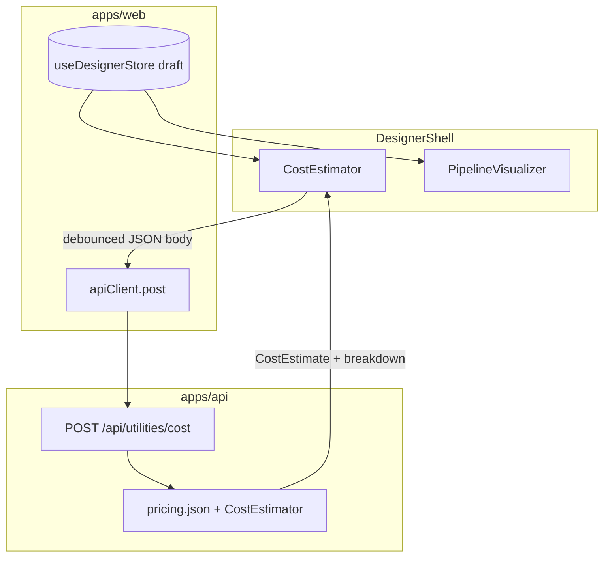

Long-form Phase 5 diagrams: **[PROJECT_SYSTEM_DESIGN_EVOLUTION_Phase5.md](./PROJECT_SYSTEM_DESIGN_EVOLUTION_Phase5.md)**.

---

## Phase 5 snapshot — Designer UI (after P5-12)

**P5-12** adds a **code export** strip in **`DesignerShell`** between **`CostEstimator`** and **`PipelineVisualizer`**. **`CodeExporter`** reads **`useDesignerStore`** **`draft`**, lets users pick an export **format** (**python**, **yaml**, **terraform**, **docker-compose**, **k8s**), and **`POST`s** **`/api/designer/export`** with **`{ config, format }`**. The API returns **`code`**, **`filename`**, **`format`**, and **`contentType`** (camelCase). The UI offers **copy** and **blob download** of the artefact plus a **Deploy hints** disclosure with format-specific starter commands (**`deploy-hints.ts`**) and a second **copy** action for those commands. Draft edits are **debounced** (~450 ms); switching format **refetches immediately**. **`DesignerExportFormat`** / **`DesignerExportResponse`** live in **`apps/web/src/types/pipeline.ts`**.

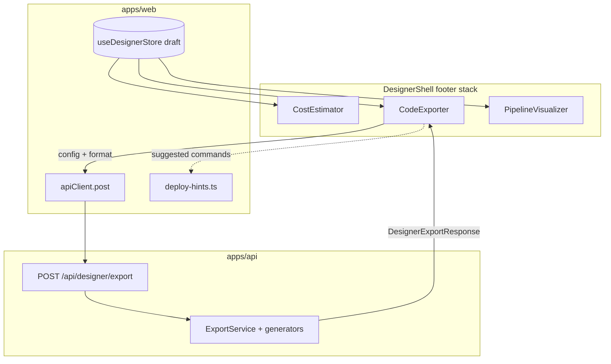

Long-form Phase 5 diagrams: **[PROJECT_SYSTEM_DESIGN_EVOLUTION_Phase5.md](./PROJECT_SYSTEM_DESIGN_EVOLUTION_Phase5.md)**.

---

## Phase 5 snapshot — Designer UI (after P5-13)

**P5-13** completes the **Designer Review** stage: **`DesignerStagePlaceholder`** renders **`DesignerReviewPage`** at **`/designer/review`**. The page shows **draft title**, **metadata timestamps**, a **grid of summary cards** (cloud through evaluation), **flow bullets** via **`generatePipelineHighlights`**, a **checklist of deep links** to prior stages, and **actions** — smooth-scroll jumps to the three footer **`section`** elements (**cost**, **export**, **pipeline**), **clipboard** copies for text summary and full **JSON** draft, and **confirm-gated** **`resetDraft`**. Shared DOM ids live in **`apps/web/src/lib/designer-section-anchors.ts`**; **`CostEstimator`**, **`CodeExporter`**, and **`PipelineVisualizer`** accept optional **`id`** and **`scroll-mt-4`** for predictable **`scrollIntoView`**. The shell layout is unchanged: Review content scrolls in **`main`**; the live cost/export/diagram strips remain the single integration point with **`POST /api/utilities/cost`** and **`POST /api/designer/export`**.

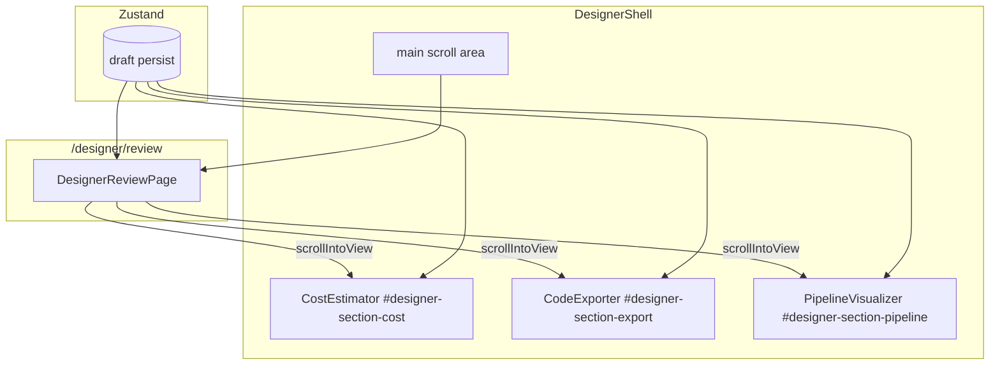

Long-form Phase 5 diagrams: **[PROJECT_SYSTEM_DESIGN_EVOLUTION_Phase5.md](./PROJECT_SYSTEM_DESIGN_EVOLUTION_Phase5.md)**.

---
