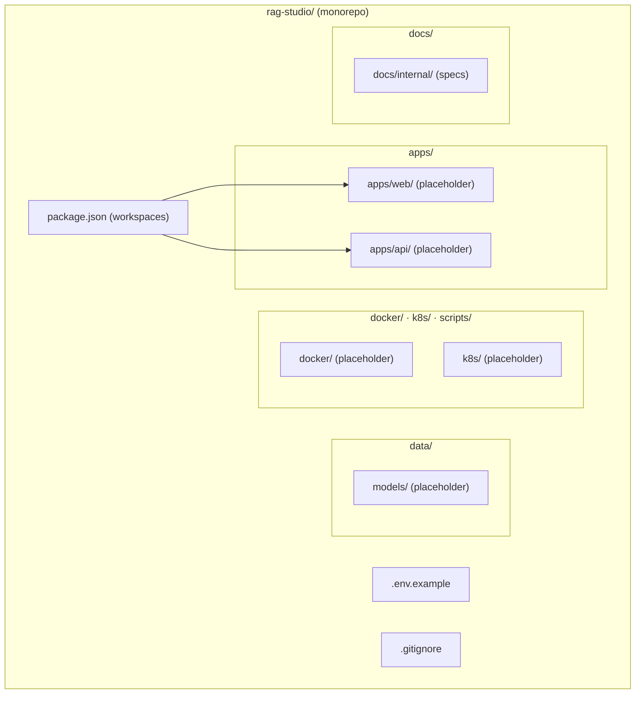
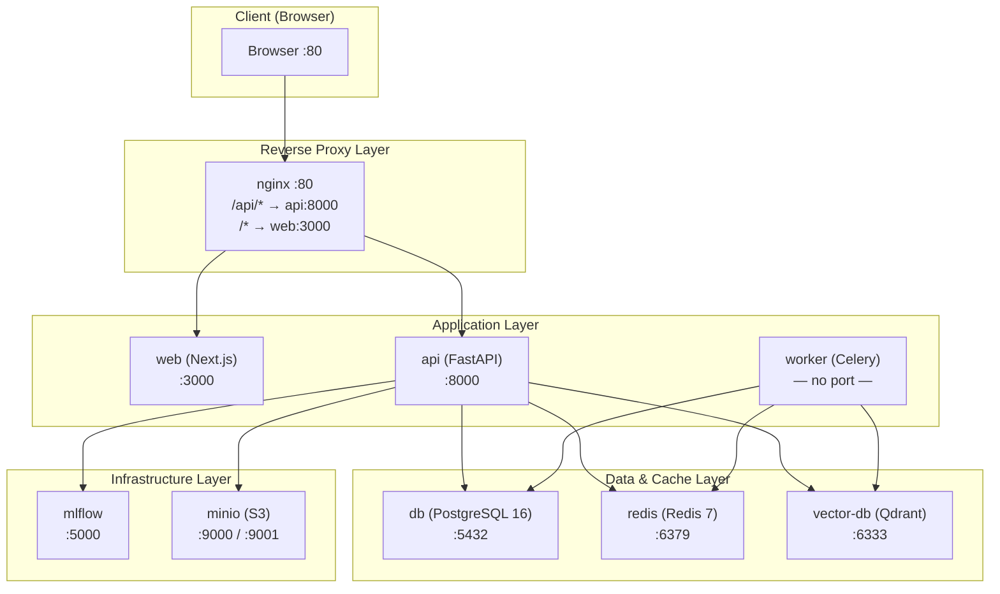
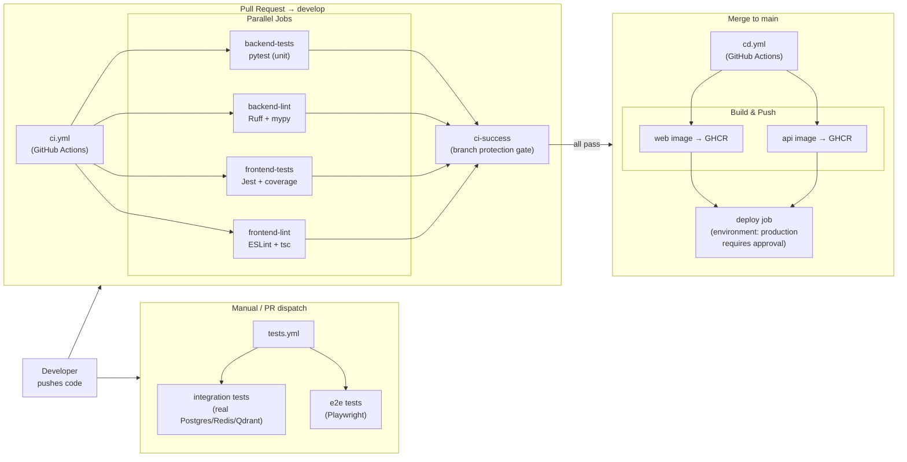
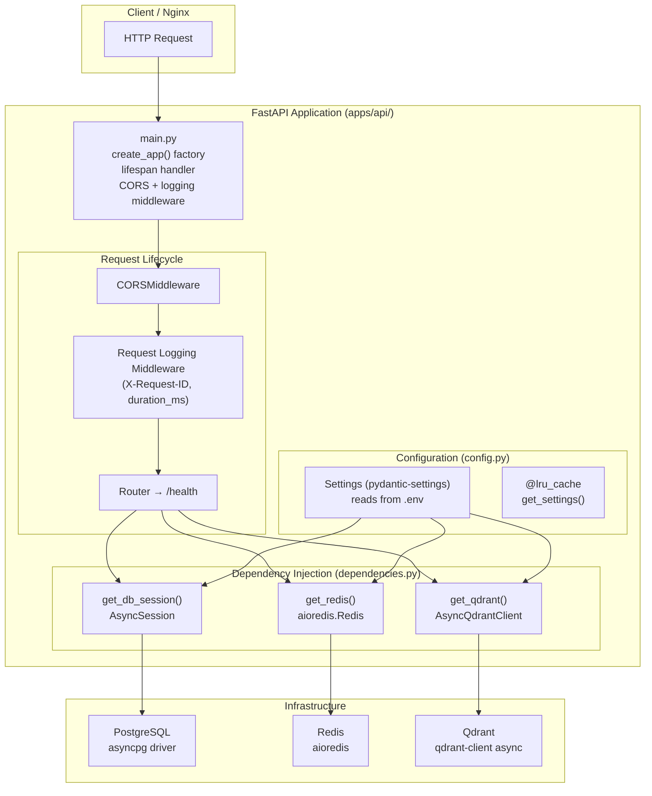
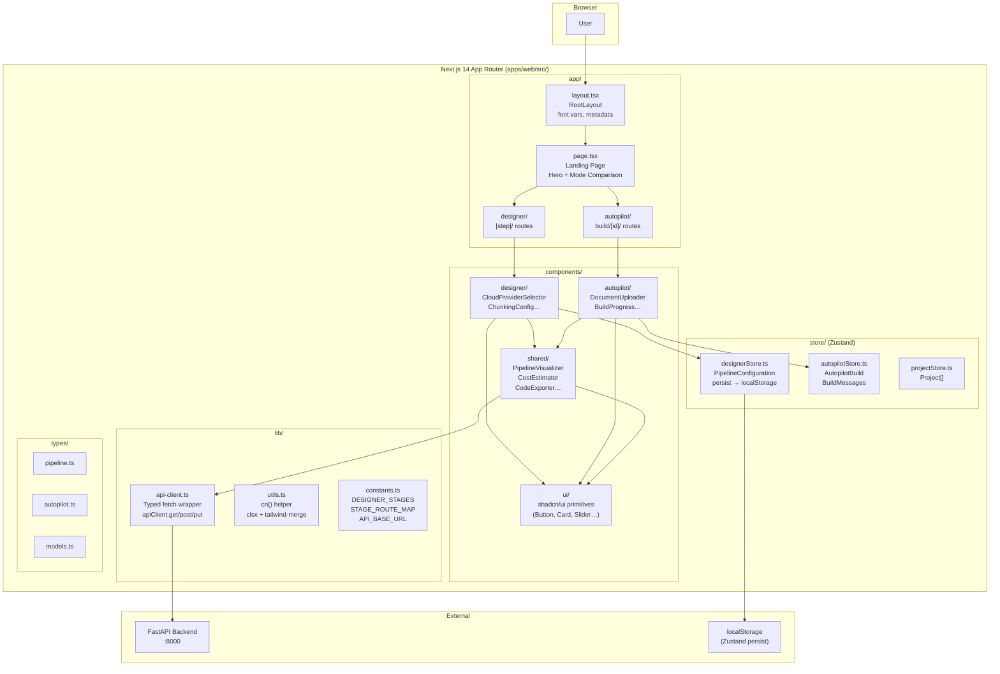
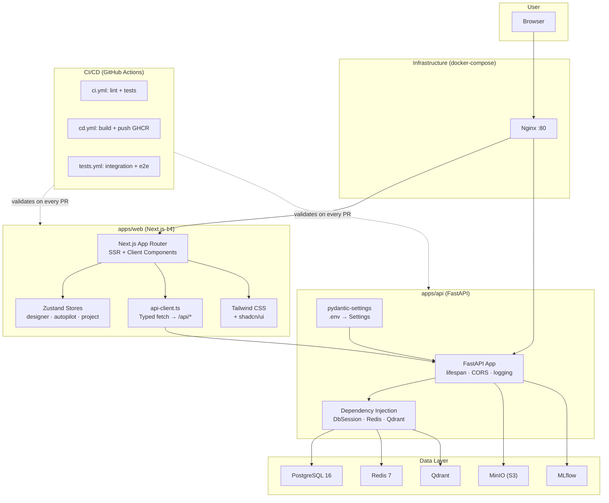

# Project system design evolution — Phase 0 (Bootstrap — P0-1 … P0-5)

> Part of the [master index](./PROJECT_SYSTEM_DESIGN_EVOLUTION.md).

---

## Phase P0-1 · Monorepo Skeleton

**What changed:** Established the repository structure. A single git repo containing two apps (`web`, `api`) and shared `data/` catalogs. No services are running yet.

### Design Level 1 — Repository Layout

**Key decisions:**
- npm workspaces for dependency hoisting and cross-package scripts
- `data/` as neutral territory — neither frontend nor backend owns it
- `.env.example` as the single source of truth for required env vars

---

## Phase P0-2 · Docker Compose Development Environment

**What changed:** All infrastructure services are now defined and can run locally with a single `docker compose up -d`. The architecture grows from a file layout to a live service mesh.

### Design Level 2 — Local Service Topology

**Key decisions:**
- Nginx as single entry point — clients never speak directly to `web` or `api`
- All services health-checked so `depends_on: condition: service_healthy` works
- Dev override (bind mounts) vs prod override (pre-built images, resource limits) via compose file layering

---

## Phase P0-3 · CI/CD Pipelines

**What changed:** Code changes now flow through automated quality gates before reaching any environment. The "manual push to server" anti-pattern is replaced by a structured pipeline.

### Design Level 3 — CI/CD Flow

**Key decisions:**
- `ci-success` synthetic gate means branch protection needs only one check regardless of how many jobs are added
- CD triggers only on `main` — `develop` never auto-deploys
- Integration + E2E tests separated into `tests.yml` to keep CI fast

---

## Phase P0-4 · Backend Project Scaffold

**What changed:** The `apps/api/` placeholder is now a real FastAPI application with configuration, dependency injection, a health endpoint, and a production-grade Dockerfile.

### Design Level 4 — Backend Internal Architecture

**Key decisions:**
- `create_app()` factory (not module-level instance) enables isolated test clients
- `@lru_cache` on `get_settings()` means `.env` is parsed exactly once per process
- Type aliases (`DbSession = Annotated[AsyncSession, Depends(...)]`) keep route signatures clean
- 3-stage Dockerfile: builder (C tools) → development (hot-reload) → runtime (non-root, minimal)

---

## Phase P0-5 · Frontend Project Scaffold

**What changed:** The `apps/web/` placeholder is now a real Next.js 14 App Router application with TypeScript, Tailwind CSS, shadcn/ui configuration, Zustand state management setup, a typed API client, and a production-grade Dockerfile. The frontend can now serve a landing page and is ready for feature development.

### Design Level 5 — Frontend Internal Architecture

### Design Level 5b — Full Stack Integration View (P0-1 through P0-5)

**Key decisions:**
- `output: 'standalone'` in `next.config.js` reduces the production Docker image from ~400MB to ~120MB
- Zustand `persist` middleware serialises `PipelineConfiguration` to `localStorage` — users never lose in-progress pipeline designs on page refresh
- `api-client.ts` typed wrapper normalises errors into `ApiError` instances — all callers handle one error type
- CSS custom properties (`--primary`, `--background`) in `globals.css` enable runtime theme switching without rebuilding Tailwind
- `components.json` with `cssVariables: true` ensures shadcn/ui components inherit the same CSS tokens

---

---

