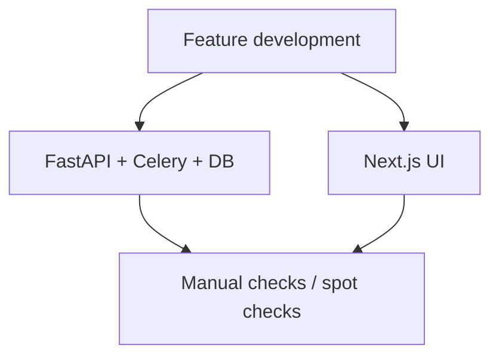
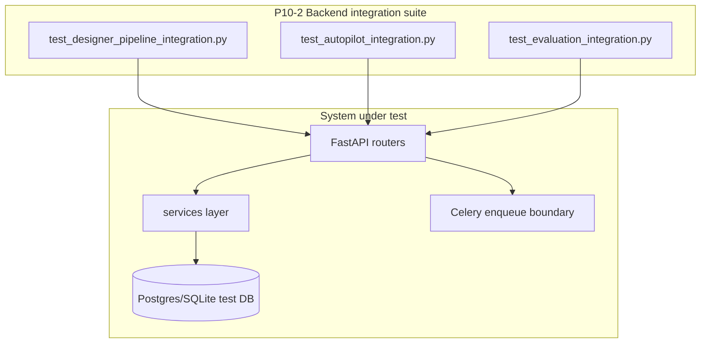
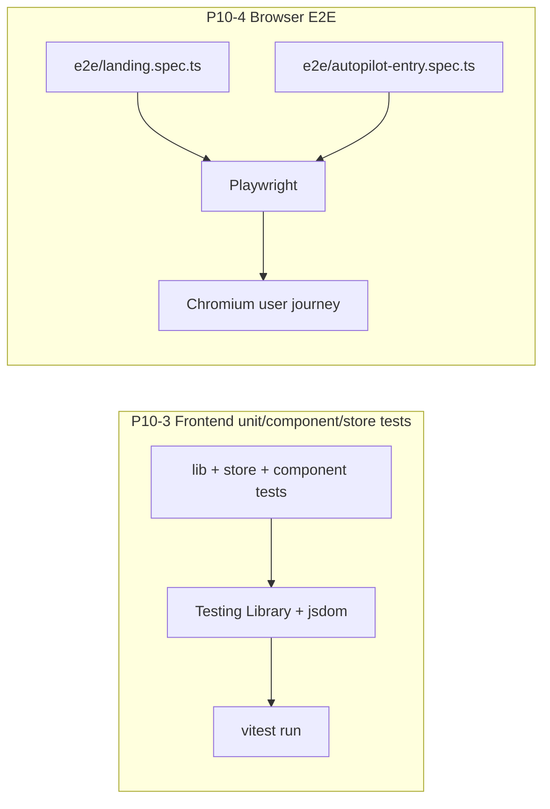
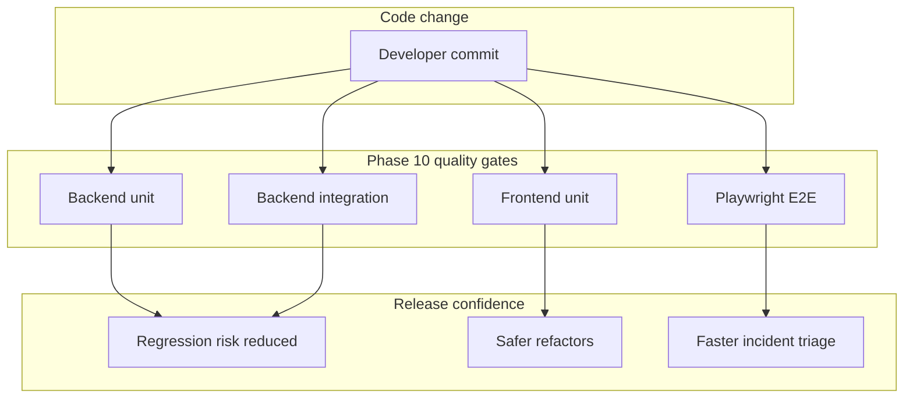

# Project system design evolution — Phase 10 (testing and quality gates)

> **Scope.** Phase 10 formalizes the quality system across backend and frontend: **`P10-1` backend unit gates**, **`P10-2` backend integration flows**, **`P10-3` frontend unit/component/store tests**, and **`P10-4` browser-level end-to-end checks**.

This phase evolves from ad-hoc confidence ("it works on my machine") to layered, repeatable release confidence where each test tier catches a different class of risk.

---

## Design level 0 — Before Phase 10: code-first delivery, limited automated guardrails

Before this phase, major product features existed (Designer, Autopilot, MLflow tracking), but test depth was uneven. Risk concentrated around regressions crossing API, worker, and UI boundaries.



**Gap:** no explicit, layered "quality gate pipeline" tying unit correctness to integration behavior and real user journeys.

---

## Design level 1 — P10-1: backend unit gate becomes deterministic

`P10-1` standardizes backend unit execution with `pytest`, marker taxonomy, and coverage discipline (`pytest-cov`, `pytest-asyncio`, unit vs integration separation).

```mermaid
flowchart LR
  subgraph BackendUnitGate["P10-1 Backend unit quality gate"]
    T1[tests/test_*.py]
    M1[@pytest.mark.unit]
    PY[pytest]
    COV[coverage app package]
    REP[CI pass or fail]
    T1 --> PY
    M1 --> PY
    PY --> COV
    COV --> REP
  end
```

**Architectural effect:** backend correctness is no longer inferred from integration behavior alone; low-level router/service/helper defects are caught earlier and faster.

---

## Design level 2 — P10-2: integration test plane validates cross-service behavior

`P10-2` adds integration tests for end-to-end backend flows (Designer and Autopilot paths) with realistic request/response lifecycles and queue handoff boundaries.

Representative implemented flows:
- Designer save/list/export roundtrip.
- Autopilot upload -> build enqueue -> status lifecycle -> cancel flow.



**Architectural effect:** verifies integration contracts and orchestration behavior that unit tests cannot prove in isolation.

---

## Design level 3 — P10-3 and P10-4: full-stack quality net (frontend + browser E2E)

`P10-3` extends confidence to frontend logic using Vitest + Testing Library.
`P10-4` adds Playwright browser journeys for true user-path validation.



---

## Design level 4 — Consolidated Phase 10 quality architecture

At phase completion, quality checks are layered and complementary instead of duplicated:
- **Unit** catches local logic breaks quickly.
- **Integration** catches API/service/dataflow mismatches.
- **Frontend unit** catches UI/state regressions.
- **E2E** catches broken real-world journeys.



---

## Sub-phase -> diagram map

| Sub-phase | Primary design levels | Focus |
|-----------|----------------------|-------|
| **P10-1** | 0 -> 1 | Backend unit gate standardization (`pytest`, markers, coverage discipline). |
| **P10-2** | 1 -> 2 | Cross-flow backend integration (Designer/Autopilot/Evaluation lifecycles). |
| **P10-3** | 2 -> 3 | Frontend unit/component/store validation with Vitest stack. |
| **P10-4** | 3 -> 4 | Browser-level user-journey verification with Playwright. |

---

## References (code and config)

| Area | Location |
|------|----------|
| Backend test config | `apps/api/pyproject.toml` |
| Backend unit tests | `apps/api/tests/test_*.py` |
| Backend integration tests | `apps/api/tests/test_integration/` |
| Frontend test scripts and deps | `apps/web/package.json` |
| Frontend unit tests | `apps/web/src/**/*.test.*` |
| Playwright config | `apps/web/playwright.config.ts` |
| E2E specs | `apps/web/e2e/` |
| Tracker docs | `docs/internal/project_status.md`, `docs/internal/TASKS.md` |

---

## Relation to neighboring phases

- **Phase 9** made Autopilot outcomes reproducible in MLflow; **Phase 10** makes that behavior safer to change over time.
- **Phase 11** builds on this by adding runtime observability (logs, metrics, analytics) for behavior in production.
