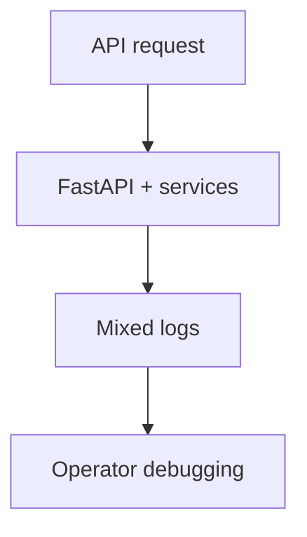
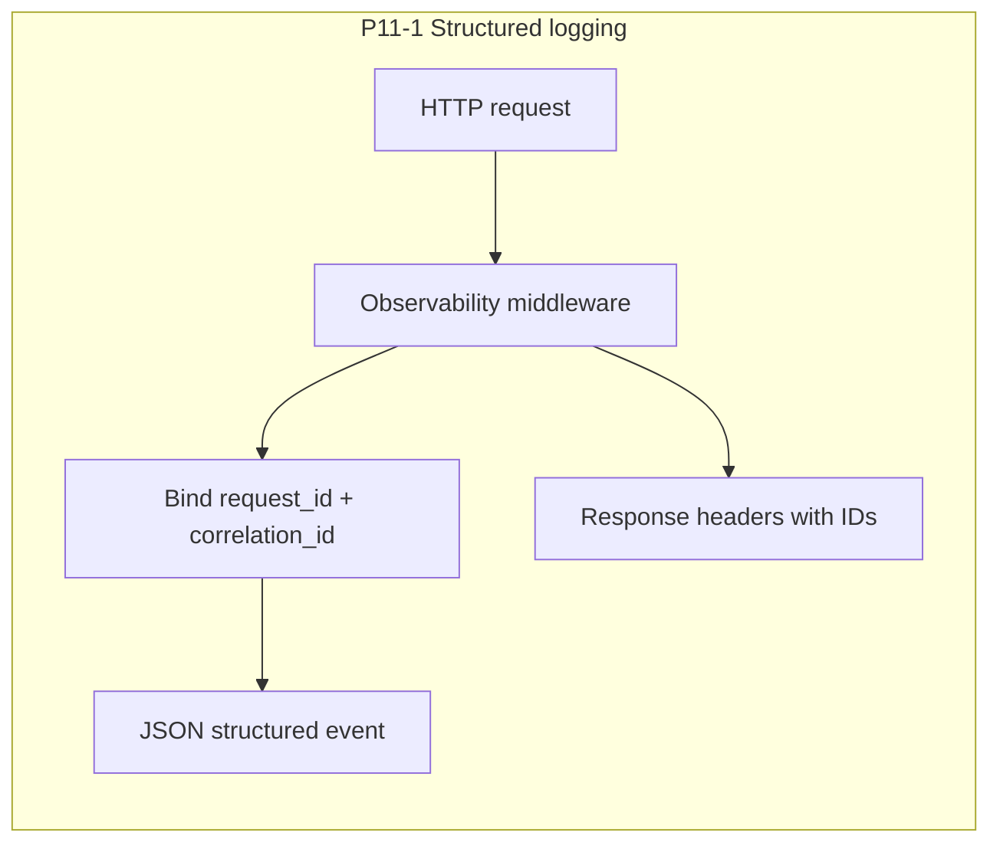

# Project system design evolution — Phase 11 (production observability)

> **Scope.** Phase 11 introduces production-grade observability in three layers: **`P11-1` structured logs**, **`P11-2` Prometheus metrics**, **`P11-3` usage and cost analytics APIs**.

This phase evolves the platform from "system works, but insight is fragmented" to "system behavior is traceable, measurable, and explainable to both engineering and product stakeholders."

---

## Design level 0 — Before Phase 11: operational visibility spread across ad-hoc logs

Prior phases focused on feature correctness and testing. Operational introspection existed, but there was no unified observability contract spanning request tracing, metric time series, and portfolio analytics.



**Gap:** difficult to answer quickly:
- What happened for this exact request?
- How often and how fast is the system operating?
- What are usage and cost signals per user portfolio?

---

## Design level 1 — P11-1: structured request observability baseline

`P11-1` adds structured logging setup and request context propagation:
- `structlog` configuration with JSON logs in non-debug environments.
- request and correlation identifiers bound into log context.
- deterministic response headers (`X-Request-ID`, `X-Correlation-ID` echo).



**Architectural effect:** request-level traceability becomes first-class instead of best-effort.

---

## Design level 2 — P11-2: metrics plane and monitoring surfaces

`P11-2` adds explicit metric instrumentation and scrape surfaces:
- request counters and latency histograms.
- terminal counters for Autopilot and evaluation outcomes.
- `/metrics` and monitoring routes consumable by Prometheus/Grafana stack.

```mermaid
flowchart TB
  subgraph Runtime["API runtime"]
    MW[HTTP middleware]
    METRIC[observe_http_request + domain counters]
    SCRAPE[/metrics]
    MON[/monitoring/rag]
    MW --> METRIC
    METRIC --> SCRAPE
    METRIC --> MON
  end

  subgraph ObservabilityStack["Optional compose observability stack"]
    PROM[Prometheus]
    GRAF[Grafana]
  end

  SCRAPE --> PROM --> GRAF
```

**Architectural effect:** logs answer "what happened," while metrics answer "how much/how fast over time."

---

## Design level 3 — P11-3: business analytics API as product-facing observability

`P11-3` exposes aggregated usage and inferred cost signals through API:
- `/api/analytics/summary` backed by analytics service.
- portfolio-level counts and cost/usage rollups by user scope.

```mermaid
flowchart LR
  subgraph ProductPlane["Product/API plane"]
    CLIENT[Dashboard / internal tools]
    AR[/api/analytics/summary]
    AS[AnalyticsService]
  end

  subgraph DataPlane["Operational data plane"]
    DB[(Postgres: projects, configs, builds, evals, deployments)]
  end

  CLIENT --> AR --> AS --> DB
```

**Architectural effect:** observability is not only infrastructure-facing; it becomes consumable product intelligence.

---

## Design level 4 — Consolidated Phase 11 observability architecture

At completion, Phase 11 forms a three-plane model:
- **Trace plane:** structured request/exception logs.
- **Metric plane:** scrapeable operational time series.
- **Analytics plane:** aggregated business-level usage/cost summaries.

```mermaid
flowchart TB
  subgraph Trace["Trace plane (P11-1)"]
    T1[Structured JSON logs]
    T2[Request/correlation IDs]
  end

  subgraph Metrics["Metric plane (P11-2)"]
    M1[HTTP counters + histograms]
    M2[Autopilot/Eval terminal counters]
    M3[/metrics + Prometheus/Grafana]
  end

  subgraph Analytics["Analytics plane (P11-3)"]
    A1[/api/analytics/summary]
    A2[Portfolio usage and cost signals]
  end

  Trace --> Ops[Operations and incident response]
  Metrics --> Ops
  Analytics --> Biz[Product and leadership decisions]
```

---

## Sub-phase -> diagram map

| Sub-phase | Primary design levels | Focus |
|-----------|----------------------|-------|
| **P11-1** | 0 -> 1 | Structured logging, correlation context, request traceability. |
| **P11-2** | 1 -> 2 | Prometheus metrics and monitoring integration surfaces. |
| **P11-3** | 2 -> 3 -> 4 | Product-facing usage/cost analytics completing observability triangle. |

---

## References (code and config)

| Area | Location |
|------|----------|
| Logging setup | `apps/api/app/observability/logging_setup.py` |
| Metrics definitions | `apps/api/app/observability/rag_metrics.py` |
| Middleware integration | `apps/api/app/main.py` |
| Analytics router | `apps/api/app/routers/analytics.py` |
| Analytics service | `apps/api/app/services/analytics_service.py` |
| Observability tests | `apps/api/tests/test_observability_p11.py` |
| Optional compose stack | `docker/docker-compose.observability.yml` |
| Tracker docs | `docs/internal/project_status.md`, `docs/internal/TASKS.md` |

---

## Relation to neighboring phases

- **Phase 10** validates behavior before release; **Phase 11** measures behavior after release.
- **Phase 12** hardens auth/security/performance and production deployment, leveraging the observability groundwork established here.
