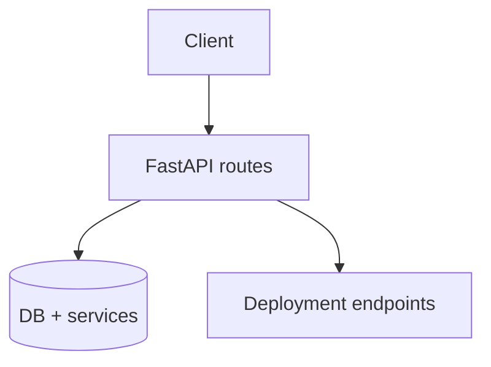
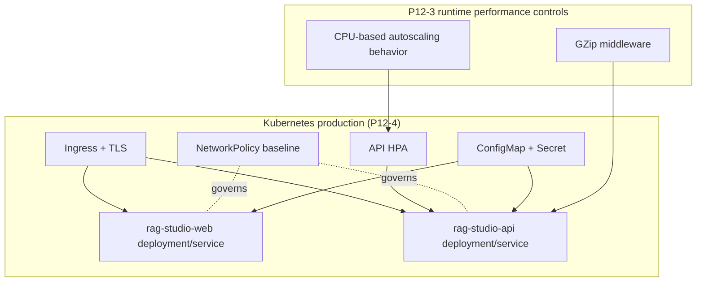
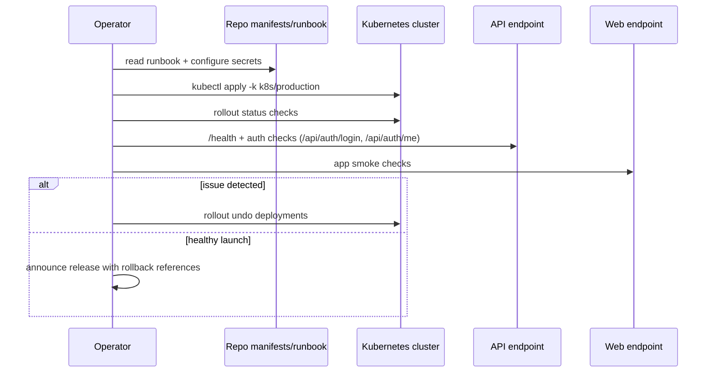
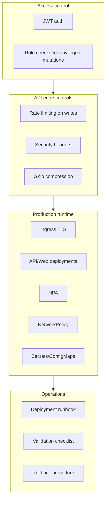

# Project system design evolution — Phase 12 (security hardening and production launch)

> **Scope.** Phase 12 transitions the platform from feature-complete to launch-ready through **`P12-1` authentication/authorization**, **`P12-2` security hardening**, **`P12-3` performance optimizations**, **`P12-4` Kubernetes production manifests**, **`P12-5` final documentation pass**, and **`P12-6` deployment and launch procedure**.

This phase evolves architecture from development-friendly trust defaults to explicit production controls and repeatable operations.

---

## Design level 0 — Start of Phase 12: pre-hardening baseline

Before Phase 12, core API and Autopilot flows were functional and observable, but production controls were not yet fully enforced end-to-end.



**Gap:** identity enforcement, abuse controls, production infra manifests, and standardized launch runbook needed to be formalized.

---

## Design level 1 — P12-1 and P12-2: trust boundary and security perimeter

`P12-1` introduces JWT auth primitives and role-aware endpoint protection.
`P12-2` adds transport/application hardening headers and write-method rate limiting.

```mermaid
flowchart LR
  subgraph Identity["P12-1 Identity and authorization"]
    LOGIN[/api/auth/login]
    ME[/api/auth/me]
    JWT[JWT token]
    DEPLOYW[Deployment write routes]
    ADMIN[AdminPrincipal guard]
    LOGIN --> JWT
    JWT --> ME
    JWT --> DEPLOYW --> ADMIN
  end

  subgraph Perimeter["P12-2 Security hardening"]
    MW[HTTP middleware]
    RL[Rate limit for POST/PUT/PATCH/DELETE]
    HDR[Security headers: CSP, XFO, nosniff, referrer, permissions]
    MW --> RL
    MW --> HDR
  end
```

**Architectural effect:** requests become authenticated/authorized by policy, not convention; API surface gains baseline abuse and browser hardening controls.

---

## Design level 2 — P12-3 and P12-4: performance + production runtime topology

`P12-3` applies low-risk runtime performance controls (GZip, autoscaling baseline).
`P12-4` codifies production Kubernetes topology and network boundaries.



**Architectural effect:** deployment is no longer environment-specific tribal knowledge; it is encoded as production manifests with scaling and security primitives.

---

## Design level 3 — P12-5 and P12-6: operational codification and launch workflow

`P12-5` and `P12-6` convert architecture into an executable operator procedure:
- preconditions and secret setup,
- apply manifests,
- rollout and health checks,
- auth validation and smoke tests,
- rollback commands.



---

## Design level 4 — Consolidated Phase 12 production architecture

At completion, Phase 12 establishes a secure, scalable, and operable production slice:
- explicit identity and role enforcement,
- hardened middleware defaults,
- performance and autoscaling controls,
- codified Kubernetes topology,
- documented rollout and rollback lifecycle.



---

## Sub-phase -> diagram map

| Sub-phase | Primary design levels | Focus |
|-----------|----------------------|-------|
| **P12-1** | 0 -> 1 | JWT issuance/validation and role-aware authorization boundaries. |
| **P12-2** | 1 | Middleware-level hardening and rate limiting guardrails. |
| **P12-3** | 1 -> 2 | Runtime response compression and throughput scaling baseline. |
| **P12-4** | 2 | Production Kubernetes topology and policy codification. |
| **P12-5** | 2 -> 3 | Documentation closure for production operations. |
| **P12-6** | 3 -> 4 | Repeatable rollout, validation, and rollback launch process. |

---

## References (code, manifests, docs)

| Area | Location |
|------|----------|
| Auth primitives | `apps/api/app/core/security/auth.py` |
| Auth endpoints | `apps/api/app/routers/auth.py` |
| Auth dependencies and admin guard | `apps/api/app/dependencies.py` |
| Deployment admin protection | `apps/api/app/routers/deployment.py` |
| Security headers, rate limiting, gzip | `apps/api/app/main.py` |
| Production manifests | `k8s/production/` |
| Runbook | `docs/public/PRODUCTION_DEPLOYMENT_RUNBOOK.md` |
| Completion notes | `docs/internal/PHASE12_COMPLETION_NOTES.md` |
| Tracker docs | `docs/internal/project_status.md`, `docs/internal/TASKS.md` |

---

## Relation to neighboring phases

- **Phase 11** made behavior observable; **Phase 12** makes behavior controllable and launchable in production.
- This phase closes the roadmap loop by translating architecture into enforceable runtime policy plus operational procedure.
