# Project system design evolution — Phase 2 (Backend RAG services — P2-1 … P2-9)

> Part of the [master index](./PROJECT_SYSTEM_DESIGN_EVOLUTION.md).

---

## Phase P2-1 · Document Ingestion Service

**What changed:** Implemented the first core service layer module — a format-agnostic document ingestion pipeline. The backend can now load text from PDFs, DOCX, TXT, Markdown, HTML, CSV, JSON files, and remote URLs, clean the text, extract rich metadata, and return a unified list of LangChain `Document` objects ready for the downstream chunking service.

### Design Level 10 — Document Ingestion Pipeline

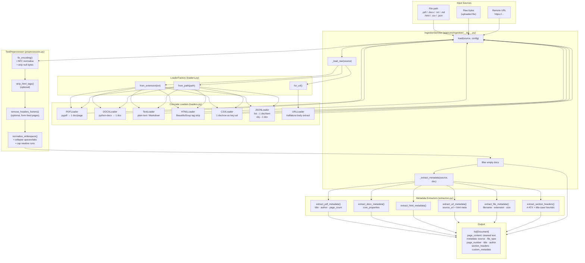
```mermaid
flowchart TD
    subgraph INPUT["Input Sources"]
        FILE["File path\n.pdf / .docx / .txt / .md\n.html / .csv / .json"]
        BYTES["Raw bytes\n(uploaded file)"]
        URL["Remote URL\nhttps://..."]
    end

    subgraph INGESTION_SERVICE["IngestionService  (app/core/ingestion/__init__.py)"]
        IS_LOAD["load(source, config)"]
        IS_LOADRAW["_load_raw(source)"]
        IS_META["_extract_metadata(source, doc)"]
        IS_FILTER["filter empty docs"]
    end

    subgraph LOADER_FACTORY["LoaderFactory  (loaders.py)"]
        LF_EXT["from_extension(ext)"]
        LF_PATH["from_path(path)"]
        LF_URL["for_url()"]
    end

    subgraph LOADERS["Concrete Loaders  (loaders.py)"]
        PDF_L["PDFLoader\npypdf → 1 doc/page"]
        DOCX_L["DOCXLoader\npython-docx → 1 doc"]
        TXT_L["TextLoader\nplain text / Markdown"]
        HTML_L["HTMLLoader\nBeautifulSoup tag strip"]
        CSV_L["CSVLoader\n1 doc/row as key:val"]
        JSON_L["JSONLoader\nlist→1 doc/item\nobj→1 doc"]
        URL_L["URLLoader\ntrafilatura body extract"]
    end

    subgraph PREPROCESSORS["TextPreprocessor  (preprocessors.py)"]
        FE["fix_encoding()\n• NFC normalise\n• strip null bytes"]
        SH["strip_html_tags()\n(optional)"]
        RHF["remove_headers_footers()\n(optional, form-feed pages)"]
        NW["normalize_whitespace()\n• collapse spaces/tabs\n• cap newline runs"]
    end

    subgraph EXTRACTORS["Metadata Extractors  (extractors.py)"]
        EPDF["extract_pdf_metadata()\ntitle · author · page_count"]
        EDOCX["extract_docx_metadata()\ncore_properties"]
        EHTML["extract_html_metadata()\n<title> · meta tags · og:*"]
        EURL["extract_url_metadata()\nsource_url + html meta"]
        EFILE["extract_file_metadata()\nfilename · extension · size"]
        ESEC["extract_section_headers()\n# ATX + title-case heuristic"]
    end

    subgraph OUTPUT["Output"]
        DOCS["list[Document]\npage_content: cleaned text\nmetadata: source · file_type\npage_number · title · author\nsection_headers · custom_metadata"]
    end

    FILE --> IS_LOAD
    BYTES --> IS_LOAD
    URL --> IS_LOAD

    IS_LOAD --> IS_LOADRAW
    IS_LOADRAW --> LF_EXT
    IS_LOADRAW --> LF_PATH
    IS_LOADRAW --> LF_URL

    LF_EXT & LF_PATH --> PDF_L & DOCX_L & TXT_L & HTML_L & CSV_L & JSON_L
    LF_URL --> URL_L

    PDF_L & DOCX_L & TXT_L & HTML_L & CSV_L & JSON_L & URL_L --> IS_LOAD

    IS_LOAD --> FE --> SH --> RHF --> NW
    NW --> IS_FILTER
    IS_FILTER --> IS_META

    IS_META --> EPDF
    IS_META --> EDOCX
    IS_META --> EHTML
    IS_META --> EURL
    IS_META --> EFILE
    IS_META --> ESEC

    EPDF & EDOCX & EHTML & EURL & EFILE & ESEC --> OUTPUT
    IS_FILTER --> OUTPUT
```

### Design Level 10b — Ingestion Service in Full Stack Context

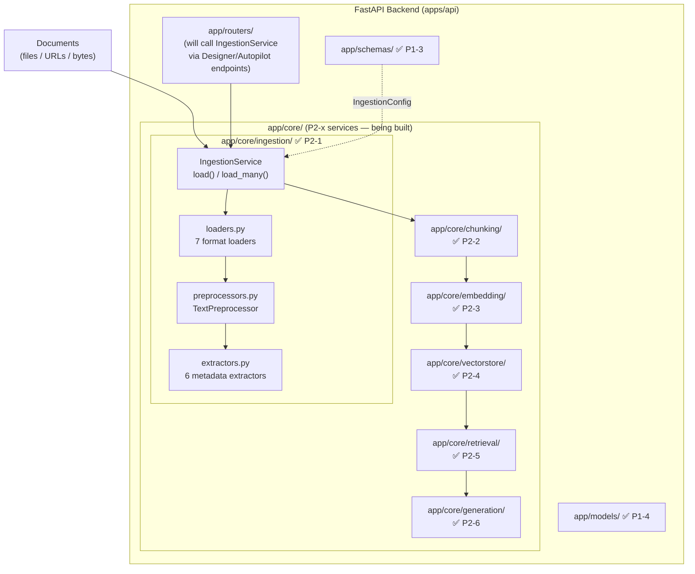
```mermaid
graph TB
    subgraph API["FastAPI Backend (apps/api)"]
        subgraph CORE["app/core/ (P2-x services — being built)"]
            subgraph INGESTION["app/core/ingestion/ ✅ P2-1"]
                ING_SVC["IngestionService\nload() / load_many()"]
                LOADERS_M["loaders.py\n7 format loaders"]
                PREPRO_M["preprocessors.py\nTextPreprocessor"]
                EXTRAC_M["extractors.py\n6 metadata extractors"]
            end
            CHUNKING["app/core/chunking/\n✅ P2-2"]
            EMBEDDING["app/core/embedding/\n✅ P2-3"]
            VECTORSTORE["app/core/vectorstore/\n✅ P2-4"]
            RETRIEVAL["app/core/retrieval/\n✅ P2-5"]
            GENERATION["app/core/generation/\n✅ P2-6"]
        end

        ROUTERS["app/routers/\n(will call IngestionService\nvia Designer/Autopilot endpoints)"]
        MODELS_M["app/models/ ✅ P1-4"]
        SCHEMAS_M["app/schemas/ ✅ P1-3"]
    end

    DOCS_IN["Documents\n(files / URLs / bytes)"] --> ING_SVC
    ING_SVC --> LOADERS_M --> PREPRO_M --> EXTRAC_M
    ING_SVC --> CHUNKING
    CHUNKING --> EMBEDDING
    EMBEDDING --> VECTORSTORE
    VECTORSTORE --> RETRIEVAL
    RETRIEVAL --> GENERATION
    ROUTERS --> ING_SVC
    SCHEMAS_M -.->|IngestionConfig| ING_SVC
```

---

## Phase P2-2 · Chunking Service

**What changed:** Implemented the second core service — the Chunking layer. The service accepts `list[Document]` from the Ingestion Service and returns `list[Chunk]` (a `Document` type alias with enriched metadata). Eight chunking strategies are available, each isolated in its own module. A `ChunkerFactory` dispatches to the correct implementation via a strategy-name map. `ChunkQualityScorer` enables Autopilot agents to filter low-quality chunks before embedding.

### Design Level 11 — Chunking Service Architecture

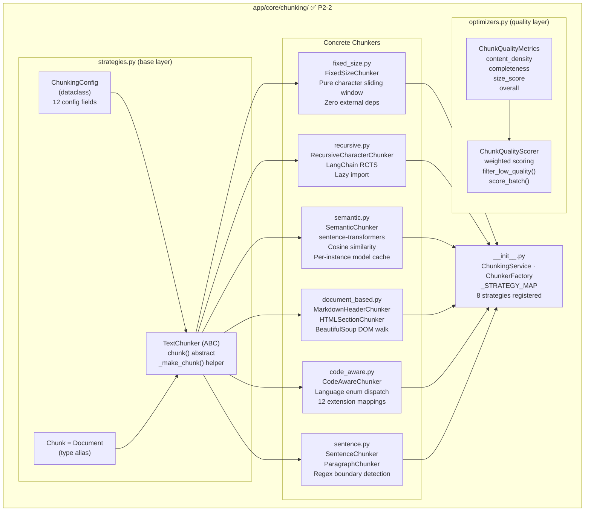
```mermaid
graph TD
    subgraph CHUNKING_PKG["app/core/chunking/ ✅ P2-2"]
        INIT["__init__.py\nChunkingService · ChunkerFactory\n_STRATEGY_MAP\n8 strategies registered"]

        subgraph BASE["strategies.py (base layer)"]
            CHUNK_ALIAS["Chunk = Document\n(type alias)"]
            CFG["ChunkingConfig\n(dataclass)\n12 config fields"]
            ABC_CLS["TextChunker (ABC)\nchunk() abstract\n_make_chunk() helper"]
        end

        subgraph STRATEGIES["Concrete Chunkers"]
            FX["fixed_size.py\nFixedSizeChunker\nPure character sliding window\nZero external deps"]
            RC["recursive.py\nRecursiveCharacterChunker\nLangChain RCTS\nLazy import"]
            SEM["semantic.py\nSemanticChunker\nsentence-transformers\nCosine similarity\nPer-instance model cache"]
            DOC["document_based.py\nMarkdownHeaderChunker\nHTMLSectionChunker\nBeautifulSoup DOM walk"]
            CODE["code_aware.py\nCodeAwareChunker\nLanguage enum dispatch\n12 extension mappings"]
            SENT["sentence.py\nSentenceChunker\nParagraphChunker\nRegex boundary detection"]
        end

        subgraph QUALITY["optimizers.py (quality layer)"]
            METRICS["ChunkQualityMetrics\ncontent_density\ncompleteness\nsize_score\noverall"]
            SCORER["ChunkQualityScorer\nweighted scoring\nfilter_low_quality()\nscore_batch()"]
        end
    end

    ABC_CLS --> FX & RC & SEM & DOC & CODE & SENT
    CFG --> ABC_CLS
    CHUNK_ALIAS --> ABC_CLS
    FX & RC & SEM & DOC & CODE & SENT --> INIT
    METRICS --> SCORER
```

### Design Level 11b — Chunking Data Flow

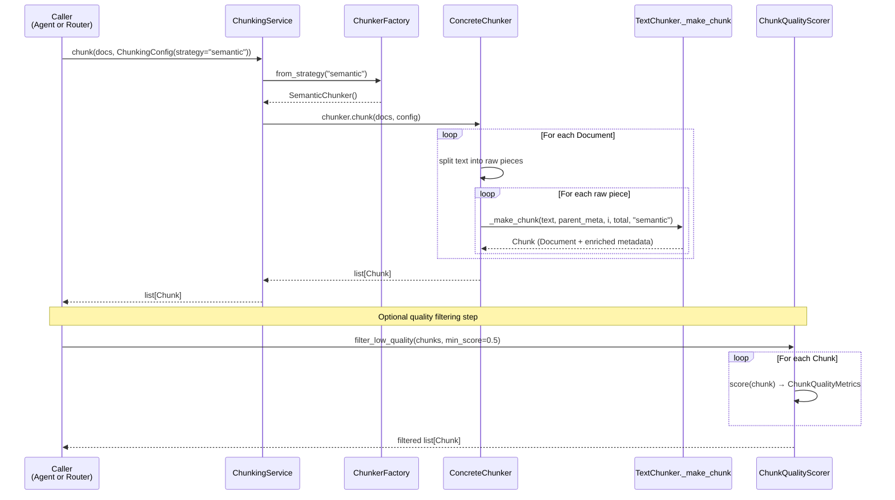
```mermaid
sequenceDiagram
    participant CALLER as Caller<br/>(Agent or Router)
    participant SVC as ChunkingService
    participant FAC as ChunkerFactory
    participant STRAT as ConcreteChunker
    participant ABC as TextChunker._make_chunk
    participant SCORER as ChunkQualityScorer

    CALLER->>SVC: chunk(docs, ChunkingConfig(strategy="semantic"))
    SVC->>FAC: from_strategy("semantic")
    FAC-->>SVC: SemanticChunker()
    SVC->>STRAT: chunker.chunk(docs, config)
    loop For each Document
        STRAT->>STRAT: split text into raw pieces
        loop For each raw piece
            STRAT->>ABC: _make_chunk(text, parent_meta, i, total, "semantic")
            ABC-->>STRAT: Chunk (Document + enriched metadata)
        end
    end
    STRAT-->>SVC: list[Chunk]
    SVC-->>CALLER: list[Chunk]

    Note over CALLER,SCORER: Optional quality filtering step
    CALLER->>SCORER: filter_low_quality(chunks, min_score=0.5)
    loop For each Chunk
        SCORER->>SCORER: score(chunk) → ChunkQualityMetrics
    end
    SCORER-->>CALLER: filtered list[Chunk]
```

### Design Level 11c — Chunking Service in Full Stack Context

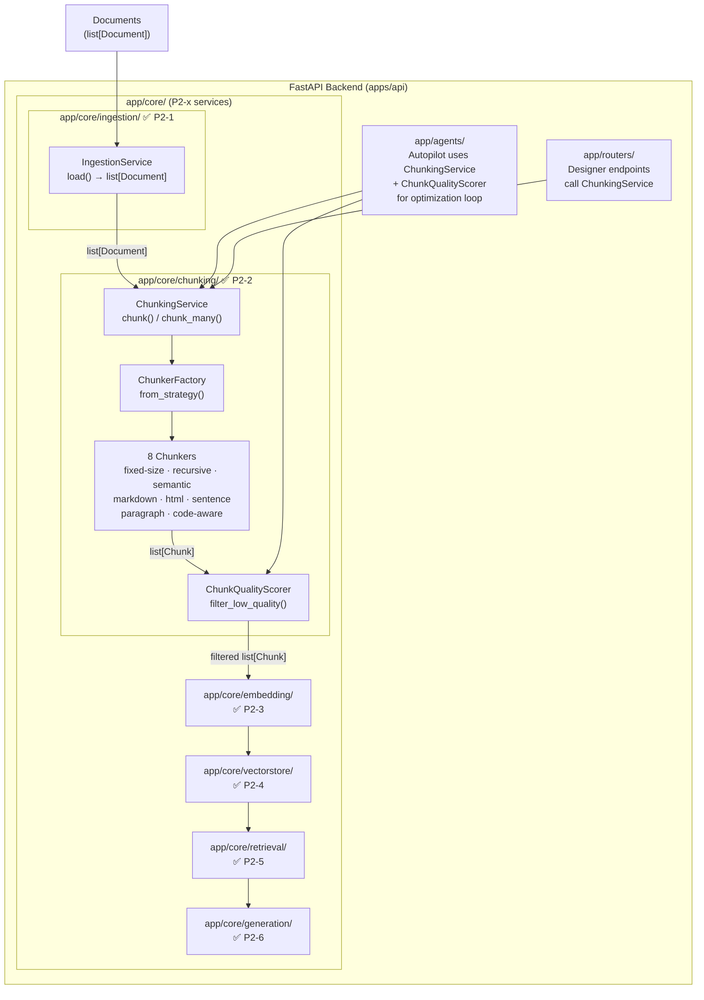
```mermaid
graph TB
    subgraph API["FastAPI Backend (apps/api)"]
        subgraph CORE["app/core/ (P2-x services)"]
            subgraph INGESTION_BOX["app/core/ingestion/ ✅ P2-1"]
                ING_SVC2["IngestionService\nload() → list[Document]"]
            end

            subgraph CHUNKING_BOX["app/core/chunking/ ✅ P2-2"]
                CHUNK_SVC["ChunkingService\nchunk() / chunk_many()"]
                CHUNK_FAC["ChunkerFactory\nfrom_strategy()"]
                EIGHT_STRAT["8 Chunkers\nfixed-size · recursive · semantic\nmarkdown · html · sentence\nparagraph · code-aware"]
                QUALITY_SVC["ChunkQualityScorer\nfilter_low_quality()"]
            end

            EMBEDDING_BOX["app/core/embedding/\n✅ P2-3"]
            VECTORSTORE_BOX["app/core/vectorstore/\n✅ P2-4"]
            RETRIEVAL_BOX["app/core/retrieval/\n✅ P2-5"]
            GENERATION_BOX["app/core/generation/\n✅ P2-6"]
        end

        AGENTS["app/agents/\nAutopilot uses ChunkingService\n+ ChunkQualityScorer\nfor optimization loop"]
        ROUTERS2["app/routers/\nDesigner endpoints\ncall ChunkingService"]
    end

    DOCS["Documents\n(list[Document])"] --> ING_SVC2
    ING_SVC2 -->|"list[Document]"| CHUNK_SVC
    CHUNK_SVC --> CHUNK_FAC --> EIGHT_STRAT
    EIGHT_STRAT -->|"list[Chunk]"| QUALITY_SVC
    QUALITY_SVC -->|"filtered list[Chunk]"| EMBEDDING_BOX
    EMBEDDING_BOX --> VECTORSTORE_BOX --> RETRIEVAL_BOX --> GENERATION_BOX
    AGENTS --> CHUNK_SVC
    AGENTS --> QUALITY_SVC
    ROUTERS2 --> CHUNK_SVC
```

---

## Phase P2-3 · Embedding Service

**What changed:** Implemented the third core service — the Embedding layer. The service accepts `list[Document]` (output of ChunkingService) and returns `list[tuple[Document, Embedding]]` — each chunk paired with its float vector, ready for upsert into the vector store. Five provider wrappers cover every model in the catalog (OpenAI, Cohere, Google, HuggingFace, Nomic). An `EmbeddingBenchmarker` lets Autopilot agents compare providers on throughput. An `EmbeddingCache` backed by Redis (with in-process dict fallback) eliminates redundant API calls for duplicate texts.

### Design Level 12 — Embedding Service Architecture

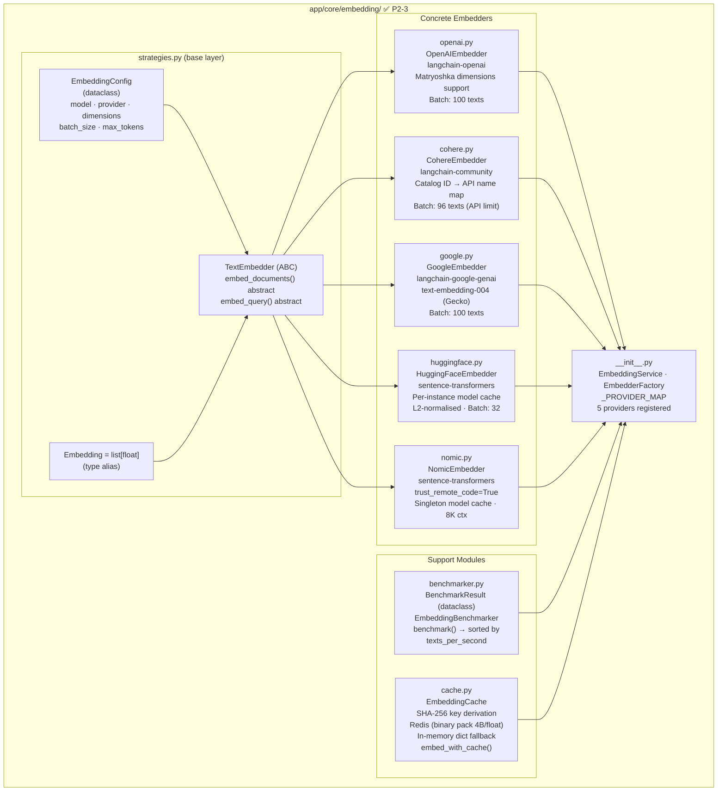
```mermaid
graph TD
    subgraph EMBEDDING_PKG["app/core/embedding/ ✅ P2-3"]
        INIT["__init__.py\nEmbeddingService · EmbedderFactory\n_PROVIDER_MAP\n5 providers registered"]

        subgraph BASE["strategies.py (base layer)"]
            EMB_ALIAS["Embedding = list[float]\n(type alias)"]
            CFG["EmbeddingConfig\n(dataclass)\nmodel · provider · dimensions\nbatch_size · max_tokens"]
            ABC_CLS["TextEmbedder (ABC)\nembed_documents() abstract\nembed_query() abstract"]
        end

        subgraph PROVIDERS["Concrete Embedders"]
            OAI["openai.py\nOpenAIEmbedder\nlangchain-openai\nMatryoshka dimensions support\nBatch: 100 texts"]
            COH["cohere.py\nCohereEmbedder\nlangchain-community\nCatalog ID → API name map\nBatch: 96 texts (API limit)"]
            GOO["google.py\nGoogleEmbedder\nlangchain-google-genai\ntext-embedding-004 (Gecko)\nBatch: 100 texts"]
            HF["huggingface.py\nHuggingFaceEmbedder\nsentence-transformers\nPer-instance model cache\nL2-normalised · Batch: 32"]
            NOM["nomic.py\nNomicEmbedder\nsentence-transformers\ntrust_remote_code=True\nSingleton model cache · 8K ctx"]
        end

        subgraph UTILITIES["Support Modules"]
            BENCH["benchmarker.py\nBenchmarkResult (dataclass)\nEmbeddingBenchmarker\nbenchmark() → sorted by\ntexts_per_second"]
            CACHE["cache.py\nEmbeddingCache\nSHA-256 key derivation\nRedis (binary pack 4B/float)\nIn-memory dict fallback\nembed_with_cache()"]
        end
    end

    ABC_CLS --> OAI & COH & GOO & HF & NOM
    CFG --> ABC_CLS
    EMB_ALIAS --> ABC_CLS
    OAI & COH & GOO & HF & NOM --> INIT
    BENCH --> INIT
    CACHE --> INIT
```

### Design Level 12b — Embedding Data Flow

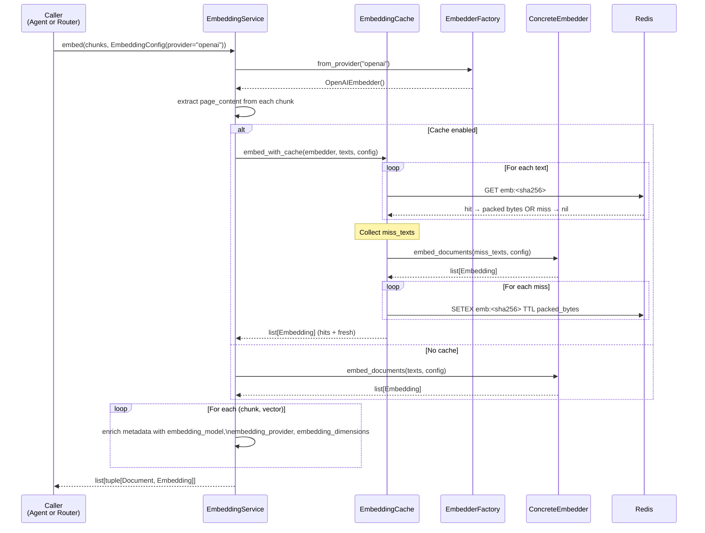
```mermaid
sequenceDiagram
    participant CALLER as Caller<br/>(Agent or Router)
    participant SVC as EmbeddingService
    participant CACHE as EmbeddingCache
    participant FAC as EmbedderFactory
    participant PROV as ConcreteEmbedder
    participant REDIS as Redis

    CALLER->>SVC: embed(chunks, EmbeddingConfig(provider="openai"))
    SVC->>FAC: from_provider("openai")
    FAC-->>SVC: OpenAIEmbedder()
    SVC->>SVC: extract page_content from each chunk

    alt Cache enabled
        SVC->>CACHE: embed_with_cache(embedder, texts, config)
        loop For each text
            CACHE->>REDIS: GET emb:<sha256>
            REDIS-->>CACHE: hit → packed bytes OR miss → nil
        end
        Note over CACHE: Collect miss_texts
        CACHE->>PROV: embed_documents(miss_texts, config)
        PROV-->>CACHE: list[Embedding]
        loop For each miss
            CACHE->>REDIS: SETEX emb:<sha256> TTL packed_bytes
        end
        CACHE-->>SVC: list[Embedding] (hits + fresh)
    else No cache
        SVC->>PROV: embed_documents(texts, config)
        PROV-->>SVC: list[Embedding]
    end

    loop For each (chunk, vector)
        SVC->>SVC: enrich metadata with embedding_model,\nembedding_provider, embedding_dimensions
    end
    SVC-->>CALLER: list[tuple[Document, Embedding]]
```

### Design Level 12c — Embedding Service in Full Stack Context

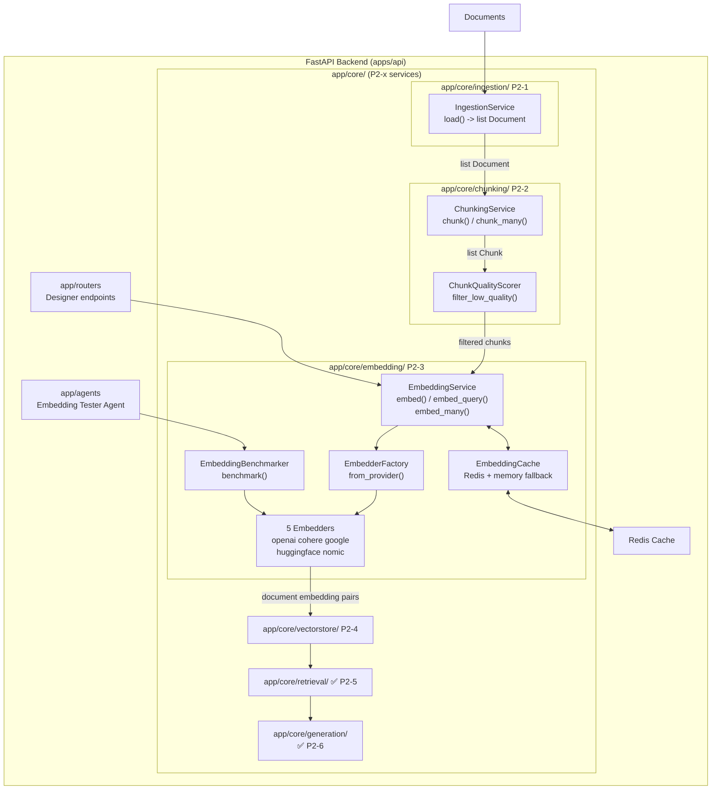
```mermaid
graph TB
    subgraph API["FastAPI Backend (apps/api)"]
        subgraph CORE["app/core/ (P2-x services)"]
            subgraph INGESTION_BOX3["app/core/ingestion/ P2-1"]
                ING_SVC3["IngestionService\nload() -> list Document"]
            end

            subgraph CHUNKING_BOX3["app/core/chunking/ P2-2"]
                CHUNK_SVC3["ChunkingService\nchunk() / chunk_many()"]
                QUALITY_SVC3["ChunkQualityScorer\nfilter_low_quality()"]
            end

            subgraph EMBEDDING_BOX3["app/core/embedding/ P2-3"]
                EMB_SVC["EmbeddingService\nembed() / embed_query()\nembed_many()"]
                EMB_FAC["EmbedderFactory\nfrom_provider()"]
                FIVE_PROV["5 Embedders\nopenai cohere google\nhuggingface nomic"]
                BENCH_SVC["EmbeddingBenchmarker\nbenchmark()"]
                CACHE_SVC["EmbeddingCache\nRedis + memory fallback"]
            end

            VECTORSTORE_BOX3["app/core/vectorstore/ P2-4"]
            RETRIEVAL_BOX3["app/core/retrieval/ ✅ P2-5"]
            GENERATION_BOX3["app/core/generation/\n✅ P2-6"]
        end

        AGENTS3["app/agents\nEmbedding Tester Agent"]
        ROUTERS3["app/routers\nDesigner endpoints"]
        REDIS3["Redis Cache"]
    end

    DOCS3["Documents"] --> ING_SVC3
    ING_SVC3 -->|list Document| CHUNK_SVC3
    CHUNK_SVC3 -->|list Chunk| QUALITY_SVC3
    QUALITY_SVC3 -->|filtered chunks| EMB_SVC
    EMB_SVC --> EMB_FAC --> FIVE_PROV
    EMB_SVC <--> CACHE_SVC <--> REDIS3
    FIVE_PROV -->|document embedding pairs| VECTORSTORE_BOX3
    VECTORSTORE_BOX3 --> RETRIEVAL_BOX3 --> GENERATION_BOX3
    AGENTS3 --> BENCH_SVC
    BENCH_SVC --> FIVE_PROV
    ROUTERS3 --> EMB_SVC
```

---

## Phase P2-4 · Vector Store Service

**What changed:** Implemented the fourth core service — the vector persistence and dense search layer. ``VectorStoreService`` accepts parallel ``Document`` lists and embedding vectors (or pre-zipped pairs from ``EmbeddingService``), resolves a provider-specific ``VectorStoreClient`` via ``VectorStoreFactory``, and exposes async ``index`` / ``search`` returning ``ScoredDoc`` instances for the upcoming Retrieval Service. Qdrant is the fully featured default (async client, payload round-trip, optional filters). Pinecone is API-key gated with lazy SDK import. Weaviate uses the v1 REST + GraphQL stack over ``httpx`` so no extra client wheel is required for CI.

### Design Level 13 — Vector Store Package Layout

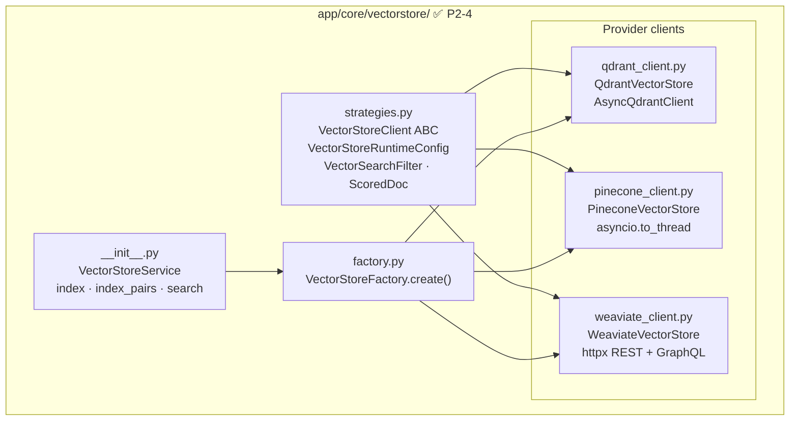
```mermaid
graph TD
    subgraph VS_PKG["app/core/vectorstore/ ✅ P2-4"]
        STRAT["strategies.py\nVectorStoreClient ABC\nVectorStoreRuntimeConfig\nVectorSearchFilter · ScoredDoc"]

        subgraph IMPL["Provider clients"]
            QD["qdrant_client.py\nQdrantVectorStore\nAsyncQdrantClient"]
            PC["pinecone_client.py\nPineconeVectorStore\nasyncio.to_thread"]
            WV["weaviate_client.py\nWeaviateVectorStore\nhttpx REST + GraphQL"]
        end

        FACT["factory.py\nVectorStoreFactory.create()"]
        SVC["__init__.py\nVectorStoreService\nindex · index_pairs · search"]
    end

    STRAT --> QD & PC & WV
    FACT --> QD & PC & WV
    SVC --> FACT
```

### Design Level 13b — Index and search sequence (Qdrant)

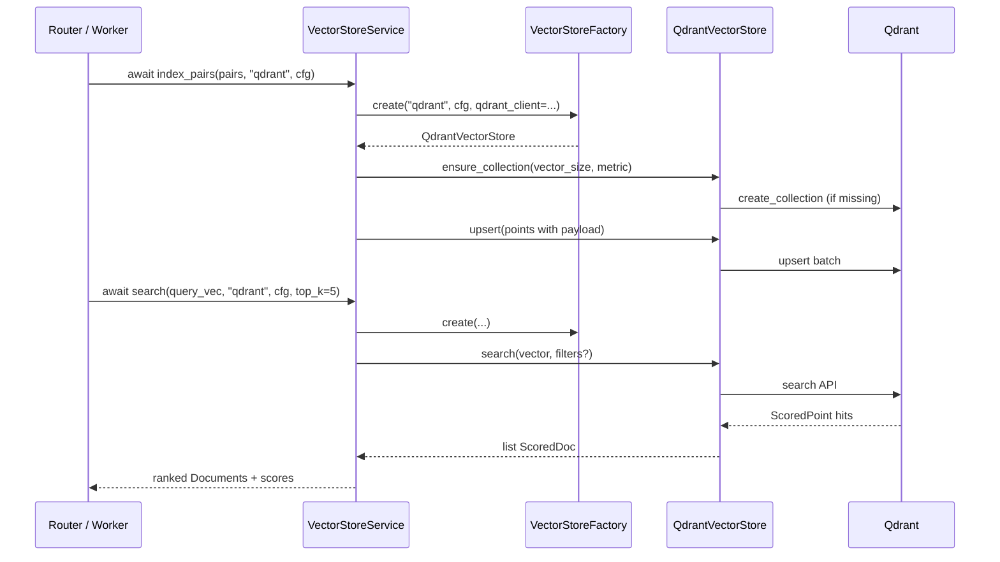
```mermaid
sequenceDiagram
    participant R as Router / Worker
    participant VS as VectorStoreService
    participant F as VectorStoreFactory
    participant Q as QdrantVectorStore
    participant DB as Qdrant

    R->>VS: await index_pairs(pairs, "qdrant", cfg)
    VS->>F: create("qdrant", cfg, qdrant_client=...)
    F-->>VS: QdrantVectorStore
    VS->>Q: ensure_collection(vector_size, metric)
    Q->>DB: create_collection (if missing)
    VS->>Q: upsert(points with payload)
    Q->>DB: upsert batch

    R->>VS: await search(query_vec, "qdrant", cfg, top_k=5)
    VS->>F: create(...)
    VS->>Q: search(vector, filters?)
    Q->>DB: search API
    DB-->>Q: ScoredPoint hits
    Q-->>VS: list ScoredDoc
    VS-->>R: ranked Documents + scores
```

### Design Level 13c — Vector Store in full RAG core chain

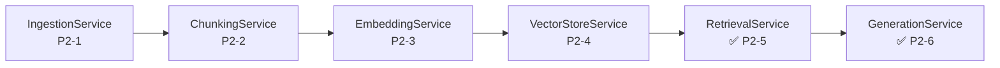
```mermaid
graph LR
    ING["IngestionService\nP2-1"] --> CHK["ChunkingService\nP2-2"]
    CHK --> EMB["EmbeddingService\nP2-3"]
    EMB --> VS["VectorStoreService\nP2-4"]
    VS --> RTV["RetrievalService\n✅ P2-5"]
    RTV --> GEN["GenerationService\n✅ P2-6"]
```

---

## Phase P2-5 · Retrieval Service

**What changed:** Implemented the fifth core service — retrieval orchestration on top of dense vector search. ``RetrievalService`` composes ``VectorStoreService`` with optional ``EmbeddingService`` for MMR re-embedding of candidates, in-memory **BM25** over a caller-supplied chunk corpus for **hybrid** dense+sparse fusion (RRF or weighted normalised blend), **multi-query** RRF when multiple query vectors are provided, **ensemble** RRF across named sub-strategies, **parent-child** uplift using ``parent_id`` / ``parent_page_content`` metadata, and optional **Cohere rerank** (httpx) with passthrough fallback. ``retrieval_runtime_from_pipeline`` maps ``RetrievalConfigSchema`` to runtime dataclasses at the router boundary.

### Design Level 14 — Retrieval package layout

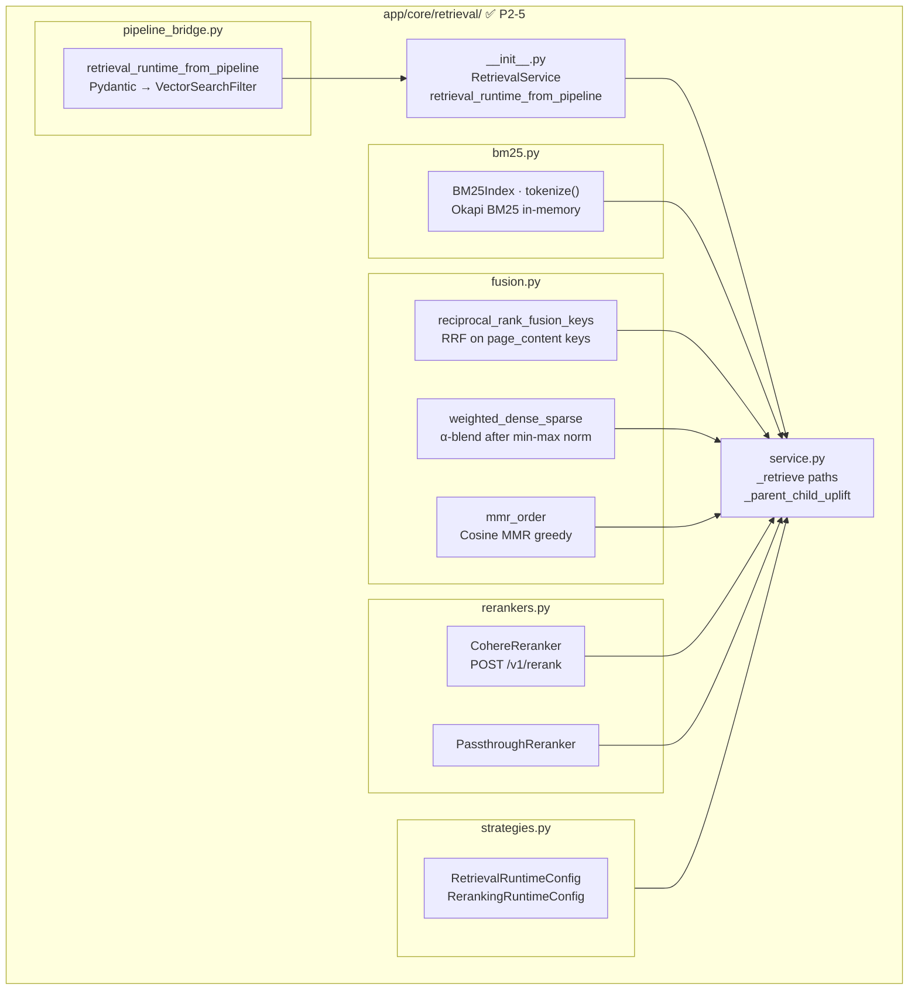
```mermaid
graph TD
    subgraph RET_PKG["app/core/retrieval/ ✅ P2-5"]
        INIT["__init__.py\nRetrievalService\nretrieval_runtime_from_pipeline"]

        subgraph CFG["strategies.py"]
            RTC["RetrievalRuntimeConfig\nRerankingRuntimeConfig"]
        end

        subgraph LEX["bm25.py"]
            BM25["BM25Index · tokenize()\nOkapi BM25 in-memory"]
        end

        subgraph FUSE["fusion.py"]
            RRFK["reciprocal_rank_fusion_keys\nRRF on page_content keys"]
            WDS["weighted_dense_sparse\nα-blend after min-max norm"]
            MMR["mmr_order\nCosine MMR greedy"]
        end

        subgraph RERANK["rerankers.py"]
            COH["CohereReranker\nPOST /v1/rerank"]
            PASS["PassthroughReranker"]
        end

        subgraph BR["pipeline_bridge.py"]
            MAP["retrieval_runtime_from_pipeline\nPydantic → VectorSearchFilter"]
        end

        SVC["service.py\n_retrieve paths\n_parent_child_uplift"]
    end

    INIT --> SVC
    CFG --> SVC
    BM25 --> SVC
    RRFK & WDS & MMR --> SVC
    COH & PASS --> SVC
    MAP --> INIT
```

### Design Level 14b — Retrieve sequence (hybrid + rerank)

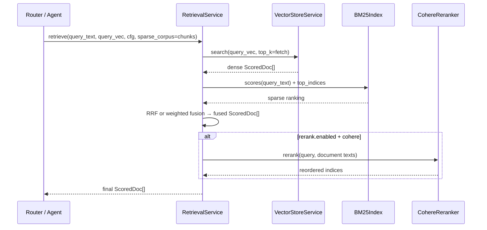
```mermaid
sequenceDiagram
    participant R as Router / Agent
    participant RS as RetrievalService
    participant VS as VectorStoreService
    participant BM as BM25Index
    participant CR as CohereReranker

    R->>RS: retrieve(query_text, query_vec, cfg, sparse_corpus=chunks)
    RS->>VS: search(query_vec, top_k=fetch)
    VS-->>RS: dense ScoredDoc[]
    RS->>BM: scores(query_text) + top_indices
    BM-->>RS: sparse ranking
    RS->>RS: RRF or weighted fusion → fused ScoredDoc[]
    alt rerank.enabled + cohere
        RS->>CR: rerank(query, document texts)
        CR-->>RS: reordered indices
    end
    RS-->>R: final ScoredDoc[]
```

### Design Level 14c — RAG core chain after P2-5

```mermaid
graph LR
    ING["IngestionService\nP2-1"] --> CHK["ChunkingService\nP2-2"]
    CHK --> EMB["EmbeddingService\nP2-3"]
    EMB --> VS["VectorStoreService\nP2-4"]
    VS --> RTV["RetrievalService\n✅ P2-5"]
    RTV --> GEN["GenerationService\n✅ P2-6"]
```

---

## Phase P2-6 · Generation Service

**What changed:** Implemented the sixth core service — multi-provider LLM generation with RAG-style context assembly. ``GenerationService`` accepts a user query plus ``list[Document]`` or ``list[ScoredDoc]`` (from ``RetrievalService``), builds a numbered context block with optional source hints, and invokes a LangChain ``BaseChatModel`` selected by ``GenerationRuntimeConfig.provider``. ``create_chat_model`` wires OpenAI, Anthropic, Google Gemini, Cohere (via langchain-community), Mistral (OpenAI-compatible endpoint), and OpenAI-compatible endpoints for **meta** / **custom** (Together, vLLM, local Llama) using dedicated settings keys. JSON output mode uses OpenAI native ``response_format``; other providers rely on prompt suffixes from ``output_format``. Optional ``stream()`` exposes ``astream`` for future SSE endpoints. ``generation_runtime_from_pipeline`` maps ``GenerationConfigSchema`` to runtime dataclasses at router boundaries.

### Design Level 15 — Generation package layout

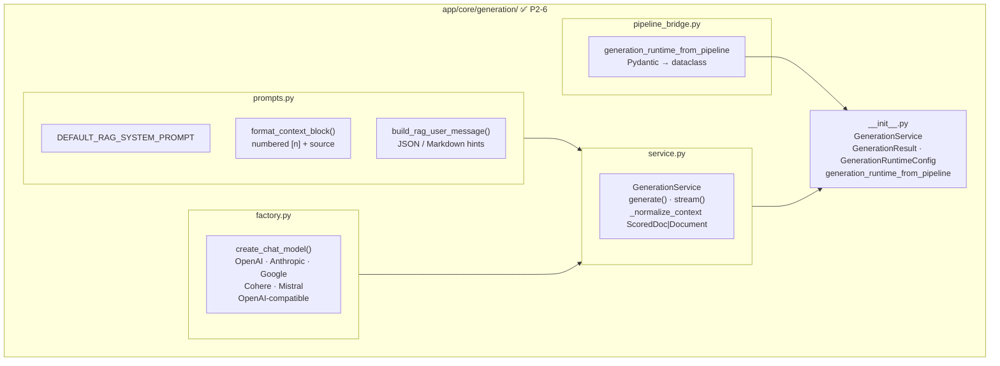
```mermaid
graph TD
    subgraph GEN_PKG["app/core/generation/ ✅ P2-6"]
        INIT["__init__.py\nGenerationService\nGenerationResult · GenerationRuntimeConfig\ngeneration_runtime_from_pipeline"]

        subgraph PROMPTS["prompts.py"]
            DEF_SYS["DEFAULT_RAG_SYSTEM_PROMPT"]
            FMT["format_context_block()\nnumbered [n] + source"]
            USER["build_rag_user_message()\nJSON / Markdown hints"]
        end

        subgraph FACT["factory.py"]
            CM["create_chat_model()\nOpenAI · Anthropic · Google\nCohere · Mistral\nOpenAI-compatible"]
        end

        subgraph BR["pipeline_bridge.py"]
            MAP["generation_runtime_from_pipeline\nPydantic → dataclass"]
        end

        subgraph SVC["service.py"]
            GS["GenerationService\ngenerate() · stream()\n_normalize_context ScoredDoc|Document"]
        end

        PROMPTS --> SVC
        FACT --> SVC
        MAP --> INIT
        SVC --> INIT
    end
```

### Design Level 15b — RAG answer sequence (post-retrieval)

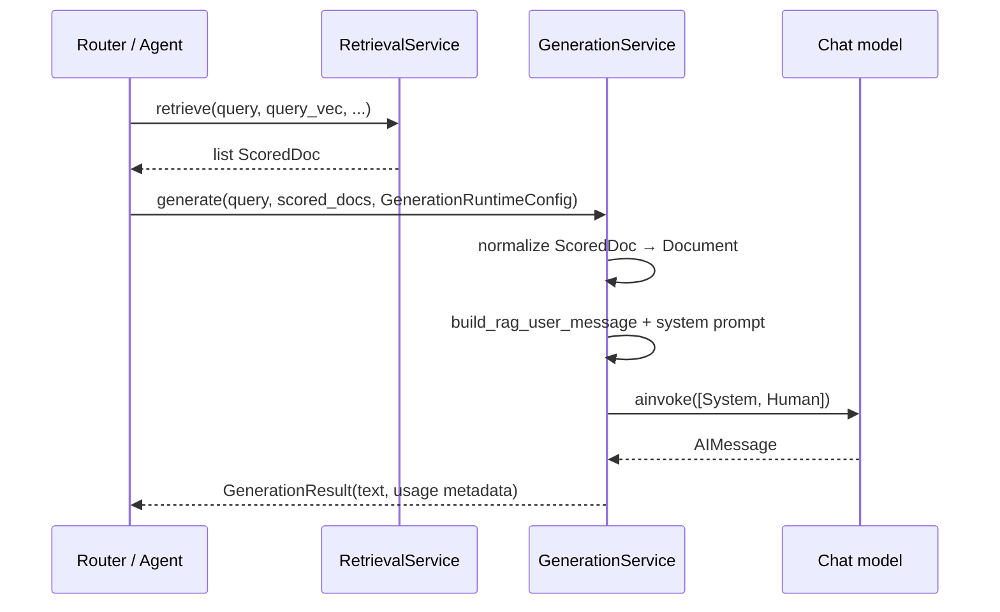
```mermaid
sequenceDiagram
    participant R as Router / Agent
    participant RS as RetrievalService
    participant GS as GenerationService
    participant LLM as Chat model

    R->>RS: retrieve(query, query_vec, ...)
    RS-->>R: list ScoredDoc

    R->>GS: generate(query, scored_docs, GenerationRuntimeConfig)
    GS->>GS: normalize ScoredDoc → Document
    GS->>GS: build_rag_user_message + system prompt
    GS->>LLM: ainvoke([System, Human])
    LLM-->>GS: AIMessage
    GS-->>R: GenerationResult(text, usage metadata)
```

### Design Level 15c — Full RAG core chain (P2-1 … P2-8 orchestration hooks)

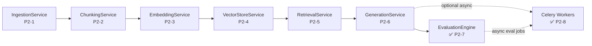
```mermaid
graph LR
    ING6["IngestionService\nP2-1"] --> CHK6["ChunkingService\nP2-2"]
    CHK6 --> EMB6["EmbeddingService\nP2-3"]
    EMB6 --> VS6["VectorStoreService\nP2-4"]
    VS6 --> RT6["RetrievalService\nP2-5"]
    RT6 --> GEN6["GenerationService\nP2-6"]
    GEN6 --> EV6["EvaluationEngine\n✅ P2-7"]
    GEN6 -. optional async .-> Q8["Celery Workers\n✅ P2-8"]
    EV6 -. async eval jobs .-> Q8
```

**Key decisions:**
- **Provider factory** keeps API keys in ``Settings`` (pydantic-settings) — no secrets in pipeline JSON.
- **ScoredDoc passthrough** avoids forcing callers to unwrap retrieval results manually.
- **Streaming** is implemented at the service layer so HTTP routers can adopt SSE without changing prompt logic.

---

## Phase P2-7 · Evaluation Engine

**What changed:** Implemented the seventh core service — **RAGAS-backed batch evaluation** with OpenAI chat + embeddings (configurable via ``Settings``), **metric name resolution** from pipeline configs, **wall-clock latency** averaged per query, **heuristic failure clustering** from per-row scores, **A/B metric comparison** helpers, and **synthetic row stubs** from ``Document`` chunks for bootstrapping test sets. Persistence and HTTP routes remain future work (P4/P8); this layer is the pure scoring engine.

### Design Level 16 — Evaluation package layout

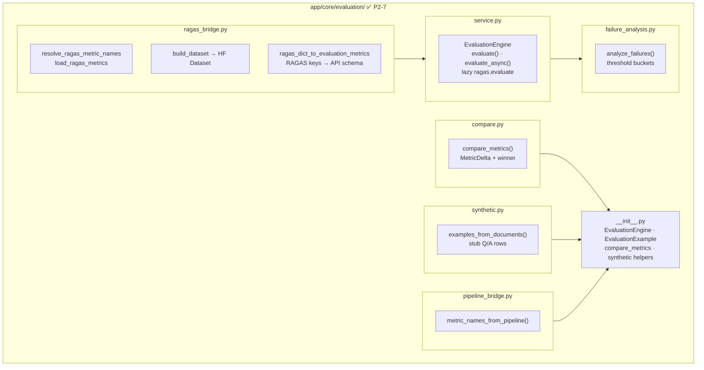
```mermaid
graph TD
    subgraph EVAL_PKG["app/core/evaluation/ ✅ P2-7"]
        INIT["__init__.py\nEvaluationEngine · EvaluationExample\ncompare_metrics · synthetic helpers"]

        subgraph RB["ragas_bridge.py"]
            RES["resolve_ragas_metric_names\nload_ragas_metrics"]
            DS["build_dataset → HF Dataset"]
            MAP["ragas_dict_to_evaluation_metrics\nRAGAS keys → API schema"]
        end

        subgraph SVC["service.py"]
            ENG["EvaluationEngine\nevaluate() · evaluate_async()\nlazy ragas.evaluate"]
        end

        subgraph FA["failure_analysis.py"]
            AN["analyze_failures()\nthreshold buckets"]
        end

        subgraph CMP["compare.py"]
            CM["compare_metrics()\nMetricDelta + winner"]
        end

        subgraph SYN["synthetic.py"]
            SY["examples_from_documents()\nstub Q/A rows"]
        end

        subgraph PB["pipeline_bridge.py"]
            PN["metric_names_from_pipeline()"]
        end

        RB --> SVC
        SVC --> FA
        CMP --> INIT
        SYN --> INIT
        PB --> INIT
    end
```

### Design Level 16b — Evaluate sequence (RAGAS + failure pass)

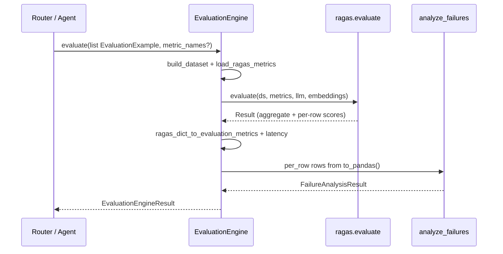
```mermaid
sequenceDiagram
    participant Caller as Router / Agent
    participant Eng as EvaluationEngine
    participant RAG as ragas.evaluate
    participant FA as analyze_failures

    Caller->>Eng: evaluate(list EvaluationExample, metric_names?)
    Eng->>Eng: build_dataset + load_ragas_metrics
    Eng->>RAG: evaluate(ds, metrics, llm, embeddings)
    RAG-->>Eng: Result (aggregate + per-row scores)
    Eng->>Eng: ragas_dict_to_evaluation_metrics + latency
    Eng->>FA: per_row rows from to_pandas()
    FA-->>Eng: FailureAnalysisResult
    Eng-->>Caller: EvaluationEngineResult
```

### Design Level 16c — Post-generation quality loop

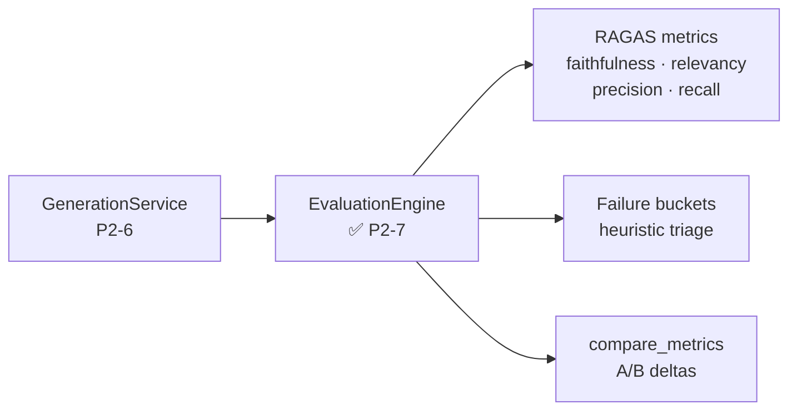
```mermaid
graph LR
    GEN7["GenerationService\nP2-6"] --> EV7["EvaluationEngine\n✅ P2-7"]
    EV7 --> MET["RAGAS metrics\nfaithfulness · relevancy\nprecision · recall"]
    EV7 --> FAIL["Failure buckets\nheuristic triage"]
    EV7 --> AB["compare_metrics\nA/B deltas"]
```

**Key decisions:**
- **Secrets in Settings only** — evaluation uses the same ``OPENAI_API_KEY`` pattern as embeddings/generation for RAGAS defaults.
- **Lazy RAGAS import** — keeps test collection light and enables ``patch("ragas.evaluate")``.
- **Explicit ``pandas`` / ``datasets``** in ``requirements.txt`` so ``Result.to_pandas()`` and HF ``Dataset`` construction are reproducible in CI.

---

## Phase P2-8 · Celery Worker & Task Queue

**What changed:** Implemented an **always-on Celery fleet** wired to Redis (broker **and** result backend) beside FastAPI. A dedicated ``worker`` Compose service consumes tasks that mutate long-lived rows in PostgreSQL via **sync** SQLAlchemy (``psycopg`` rewriting from ``database_url_sync``, mirroring FastAPI's ``asyncpg`` URL). Tasks cover **stub Autopilot builds** (`AutopilotBuild` stage progression pending LangGraph), **offline RAGAS evaluation persistence** (`EvaluationRun` hydrated from inline example payloads today), and **stub cloud deployments** (`Deployment` endpoints). Provisional REST routes under ``/api/jobs/*`` enqueue work and expose ``GET /api/jobs/tasks/{task_id}`` for polling ``AsyncResult`` metadata ahead of SSE in Phase 7.

### Design Level 17 — Service topology with queue plane

```mermaid
graph TB
    subgraph CLIENT["Clients"]
        WEB["Designer / Autopilot UI\n(Phase 7+)"]
    end

    subgraph EDGE["HTTP · FastAPI"]
        API["apps/api · Uvicorn\nAsyncSession · async Redis · Qdrant"]
        JR["POST /api/jobs/*\nGET /api/jobs/tasks/{id}"]
    end

    subgraph QUEUE["Celery control plane"]
        BR["Redis broker lists"]
        RES["Redis result keys"]
        WRK["worker container(s)\nconcurrency=N"]
    end

    subgraph DATA["Stateful stores"]
        PG["PostgreSQL\nORM rows"]
        RAPI["Redis cache\n(shared with broker host)"]
    end

    WEB --> API
    API --> JR
    JR -->|publish task| BR
    BR --> WRK
    WRK --> PG
    WRK -->|state + return values| RES
    API --> PG
    API --> RAPI
    JR -. read AsyncResult .-> RES
```

### Design Level 17b — Job enqueue lifecycle

```mermaid
sequenceDiagram
    participant UI as Client / Tester
    participant API as FastAPI /jobs router
    participant RD as Redis broker
    participant CW as Celery worker
    participant DB as PostgreSQL

    UI->>API: POST /api/jobs/evaluation (+ examples[])
    API->>RD: run_evaluation.delay(...)
    RD-->>API: enqueue OK
    API-->>UI: JSON {taskId,...}
    CW->>RD: fetch body
    CW->>DB: sync_session_scope UPDATE evaluation_runs
    CW->>RD: STORE result blob
    UI->>API: GET /api/jobs/tasks/{taskId}
    API->>RD: AsyncResult hydrate
    API-->>UI: {state, result}
```

### Design Level 17c — Worker package layout

```mermaid
graph TD
    subgraph WK_PKG["app/worker ✅ P2-8"]
        INIT["__init__.py\nimport celery_app + tasks (registration side-effect)"]
        CA["celery_app.py\nbroker/backend\nJSON serializers"]
        TS["tasks.py\nbuild · evaluation · deployment"]
        DB_SYNC["db_sync.py\nsync_session_scope()"]
    end

    subgraph RT["app/routers/jobs.py"]
        RJQ[".delay enqueue + polling"]
    end

    subgraph SCH["app/schemas/jobs.py"]
        PYD["camelCase payloads"]
    end

    CA --> TS
    DB_SYNC --> TS
    TS --> RJQ
    SCH --> RJQ
    INIT --> CA
```

**Key decisions:**
- **Explicit Celery module path** ``celery -A app.worker:celery_app`` guarantees ``tasks.py`` registers handlers before worker children boot.
- **Sync DB boundary** avoids running ``asyncpg`` sessions inside Celery prefork workers.
- **Inline evaluation payloads** unblock execution before Phase 8 evaluation APIs persist full corpuses server-side only.
- **Operational defaults** — ``task_track_started``, ``task_acks_late``, ``worker_prefetch_multiplier=1`` trade a little latency for fair dispatch and crash safety.

---

## Phase P2-9 · Health & Utility Endpoints

**What changed:** Exposed **explicit health** routes (root liveness, `/health/live`, readiness with dependency checks), added **request-ID middleware** (echo or generate `X-Request-ID` for logs and responses), and introduced a **utilities** router for service info, **pipeline JSON validation** (`PipelineConfigurationSchema`), and a **catalog-driven cost preview** (`pricing.json` bundled under `apps/api/catalogs/` for Docker-friendly paths with optional `PRICING_CATALOG_PATH` override).

### Design Level 18 — Edge observability and helpers

```mermaid
graph LR
    subgraph CLIENTS["Clients · LB · k8s"]
        HC["Health checks"]
        UI["Designer shell (future)"]
    end

    subgraph API["FastAPI · apps/api"]
        MW["Middleware\nX-Request-ID + latency log"]
        H["GET /health\nGET /health/live\nGET /health/ready"]
        U["GET /api/utilities/info\nPOST validate-pipeline\nPOST cost"]
    end

    subgraph DEPS["Probed dependencies"]
        PG[("PostgreSQL")]
        RD["Redis"]
        QD["Qdrant"]
    end

    subgraph CAT["catalogs/pricing.json"]
        PR["CostEstimator\n(formula-aligned)"]
    end

    HC --> MW
    UI --> MW
    MW --> H
    MW --> U
    H -->|"ready"| PG
    H -->|"ready"| RD
    H -->|"ready"| QD
    U --> PR
```

### Design Level 18b — Readiness vs eager dependencies

```mermaid
flowchart TD
    RQ["GET /health/ready"]
    T{"APP_ENV == test?"}
    SK["Return 200 + skipped probes"]
    DB["async SQL SELECT 1"]
    RC["Redis PING (ephemeral client)"]
    QC["Qdrant get_collections (ephemeral client)"]
    OK{"all ok?"}
    Y["200 JSON checks map"]
    N["503 JSON not_ready"]

    RQ --> T
    T -->|yes| SK
    T -->|no| DB
    DB --> RC
    RC --> QC
    QC --> OK
    OK -->|yes| Y
    OK -->|no| N
```

**Key decisions:**
- **No eager ``Depends(get_redis)`` on readiness** — avoids connecting before test-mode bypass and keeps probes from mutating singleton pools during startup turbulence.
- **Utilities validation returns 200** with Pydantic error details — consistent contract for Designer import UX versus transport-level **422**.
- **Cost path is stateless** — reads JSON catalogue only; aligns with Phase 4’s eventual ``POST /api/designer/cost`` reuse of ``CostRequest`` / ``CostEstimateSchema``.
- **`API_SEMVER` single source** — health, OpenAPI metadata, and `/info` stay aligned (`app/metadata.py`).

---

