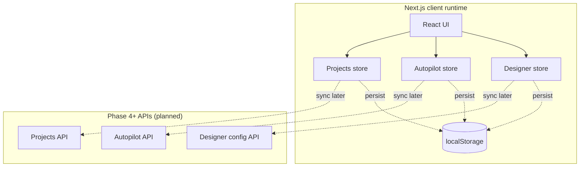
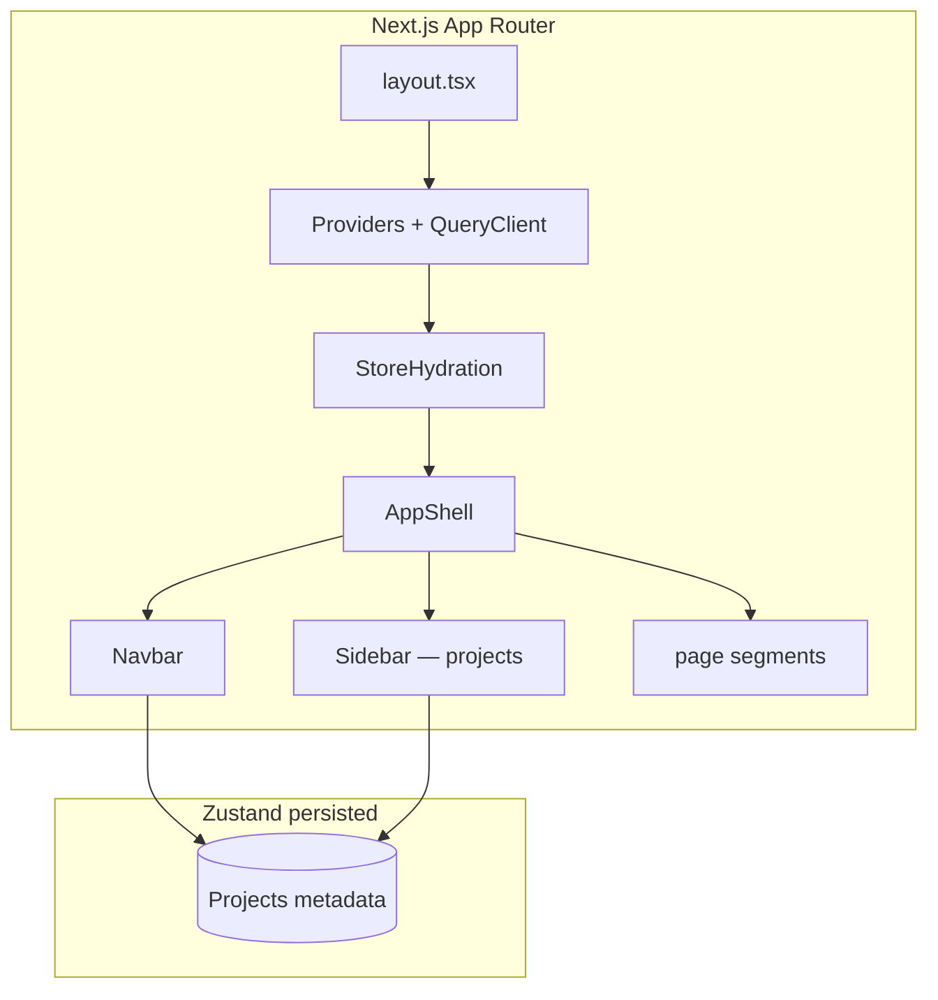
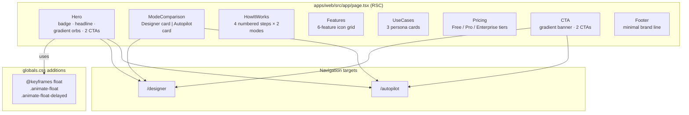
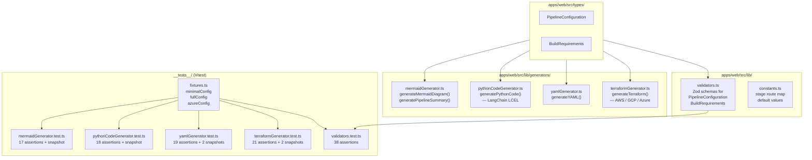

# Project system design evolution — Phase 3 (Frontend foundation)

> Part of the [master index](./PROJECT_SYSTEM_DESIGN_EVOLUTION.md).

---

## Phase 3 onward (frontend & API milestones)

> From here the doc follows **Phase 3 sub-phases (P3-1 …)** and later **Phase 4** API work. Phase 0–2 above are the detailed archive; the summary-style Phase 0–2 blocks from the short doc were **subsumed** by the restored sections.

---

## Phase 3 — Frontend foundation (evolving)

Phase 3 grows the experience layer in sub-phases.

### P3-1 — UI system

shadcn/ui + Tailwind tokens establish consistent interaction primitives (buttons, dialogs, forms).

### P3-2 — Client state stores (this milestone)

**Goal:** Persisted **Designer drafts**, **Autopilot sessions/build snapshots**, and **local project metadata** in the browser using Zustand + `localStorage`, coordinated with Next.js hydration.

**Characteristics:** UX continuity offline/between refreshes; explicit seam for server reconciliation once CRUD endpoints land.

### P3-3 — App shell & navigation (this milestone)

**Goal:** A consistent **app chrome** for every route: top navigation (mode switcher, project switcher, placeholders for templates/account), optional **project sidebar** on non-marketing routes, **React Query** at the root for upcoming API integration, and **404 / error** boundaries for resilient UX.

**Characteristics:** Sidebar hidden on `/` for a clean landing; Designer / Autopilot / Templates / Projects routes share chrome; collapse state persisted locally; server APIs remain Phase 4+.

### P3-4 — Landing page (this milestone)

**Goal:** A full-featured **marketing/entry experience** at `/` composed of seven focused section components assembled in `page.tsx`. All sections are **React Server Components** — zero client JS for the landing route — ensuring fast initial load and optimal Core Web Vitals.

**Component breakdown:**

| Component | Purpose | Key decisions |
|---|---|---|
| `Hero` | First impression | CSS-only floating orbs (`@keyframes float`), ping animation badge, two CTAs |
| `ModeComparison` | Feature contrast | Designer (primary) vs Autopilot (purple) visual split; feature lists with checkmarks |
| `HowItWorks` | Step-by-step guide | Two 4-step columns with connector lines; server component |
| `Features` | Capability grid | 6 cards with color-mapped lucide icons; hover lift transition |
| `UseCases` | Persona-driven | Learning Engineer / Startup / Enterprise; quote + benefit list pattern |
| `Pricing` | Conversion | `included: boolean | 'partial'` discriminated feature rows; Minus vs Check icons |
| `CTA` | Final conversion | Brand gradient banner; mirrors Hero's visual language |

**Characteristics:** Sidebar is suppressed on `/` (AppShell `isHome` check from P3-3). All sections are RSC — no `'use client'` required. Animated orbs use native CSS (`@keyframes`), not framer-motion. Routing from CTA buttons goes to `/designer` and `/autopilot`.

### P3-5 — Utilities & validators (this milestone)

**Goal:** Zod validation schemas for all pipeline types, four code/diagram generators (Mermaid, Python LCEL, YAML, Terraform), and a Vitest unit-test suite covering all generator outputs.

**Key design decisions:**

| Module | Key design decision |
|---|---|
| `validators.ts` | Zod schemas mirror TS types; cross-field refinements (overlap < chunkSize, hybrid requires hybridSearch config) |
| `mermaidGenerator.ts` | Two sub-graphs (indexing vs query path); node labels sanitised to strip Mermaid syntax characters |
| `pythonCodeGenerator.ts` | Provider-to-import maps; LCEL `RunnableParallel` pattern; all optional stages (reranking, memory, multi-query) wired conditionally |
| `yamlGenerator.ts` | No third-party serialiser; hand-built helpers for quoting, bool, arrays; block scalars for system prompts |
| `terraformGenerator.ts` | Three concrete cloud targets (AWS/GCP/Azure); multi-cloud falls back to AWS; Pinecone handled as managed service with secrets-manager wiring |
| Tests | Targeted `.toContain()` assertions + `toMatchSnapshot()` per generator; shared fixtures eliminate duplication |

**Characteristics:** All generators are pure functions (no I/O, no global state), callable from both the browser export UI and the backend export API. The Vitest runner is installed now (`devDependencies`) so P10-3 adds React Testing Library on top rather than replacing this setup. 113 tests pass with 7 snapshots written on first run.

---
