# Project system design evolution — Phase 4.5 (Guardrails)

> Part of the [master index](./PROJECT_SYSTEM_DESIGN_EVOLUTION.md).

---

## Phase 4.5 · Guardrails (evolving)

Enterprise safety and policy checks are introduced **around** the existing RAG path without replacing core services. This section grows with each P4.5 sub-phase.

### P4.5-1 · Guardrails Core Infrastructure (completed)

**Scope:** Backend-only foundation in `apps/api/app/core/guardrails/`: abstract `Guardrail`, `GuardrailManager` (ordered per-stage execution with `ALLOW` / `WARN` / `BLOCK` / `MODIFY`), `GuardrailOrchestrator` with typed payloads (`str` for input/output, `RetrievalGuardPayload` for retrieval). Reference stubs `AlwaysAllowGuardrail` and `BlockIfSubstringGuardrail` support tests; real detectors arrive in P4.5-2–4. Pydantic placeholders `GuardrailsConfigSchema` / `GuardrailStageSettingsSchema` prepare pipeline integration (P4.5-5). Structured log line `guardrail_check` on each evaluation.

**Behaviour summary:**

* Stages: `input`, `retrieval`, `output` (`GuardrailStage`).
* `run_stage` stops on first `BLOCK`; `MODIFY` replaces the in-flight payload for subsequent guardrails in the same stage.
* No HTTP routes yet; generation and designer APIs will call the orchestrator in P4.5-5.

### Mermaid — RAG without guardrails (baseline before Phase 4.5)

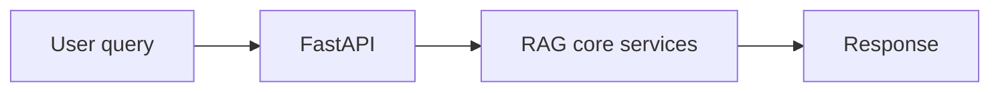

### Mermaid — P4.5-1 logical layer (hook points only)

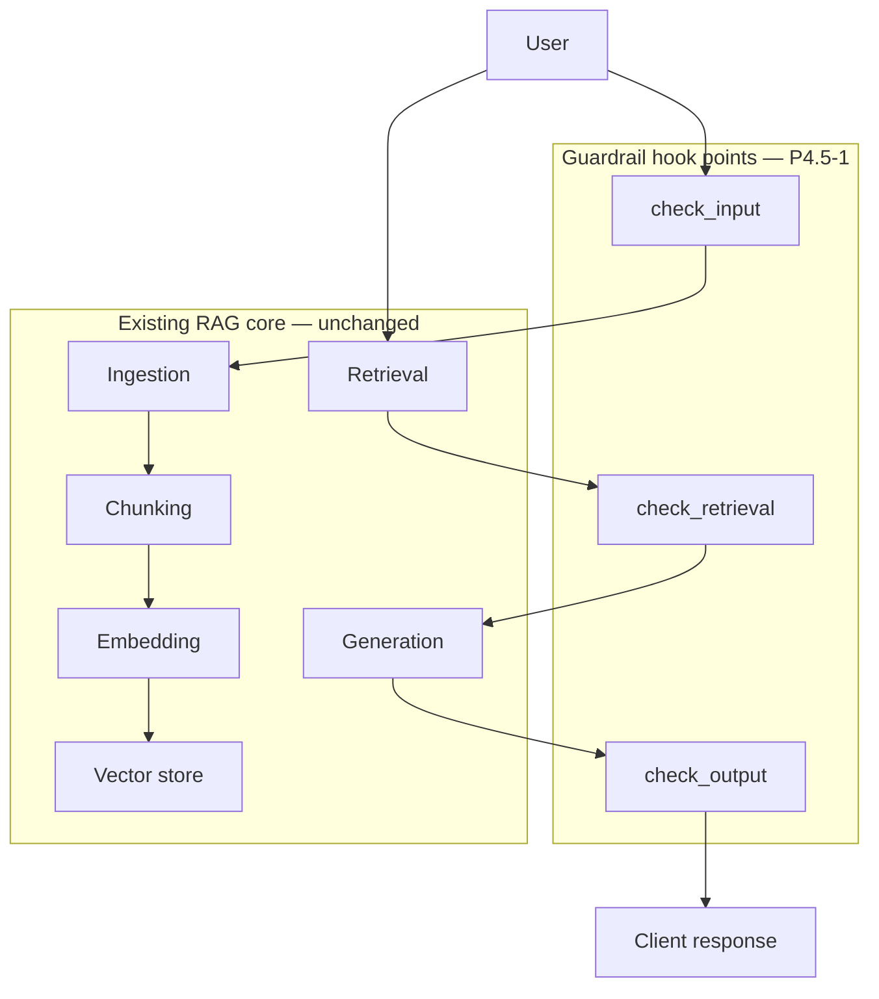

### Mermaid — GuardrailManager execution (single stage)

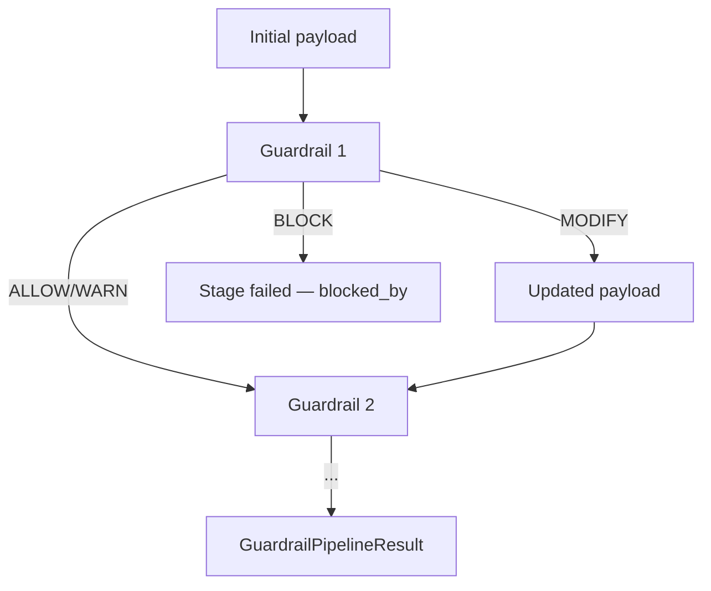

### P4.5-2 · Input Guardrails (completed)

Concrete INPUT implementations live in `apps/api/app/core/guardrails/input/`.

* **PII** — `PiiRedactionGuardrail` redacts email, US-style SSN, credit-card runs that pass Luhn (13–19 digits), and phone-shaped spans. Credit-card detection runs **before** phone redaction so long digit sequences (PANs) are not partially matched as phone numbers.
* **Prompt injection** — `PromptInjectionGuardrail` blocks on a set of high-signal regex patterns (instruction override / jailbreak-style phrasing); patterns are extensible via constructor args.
* **Toxicity** — `ToxicityFilterGuardrail` combines optional `blocked_terms` (word-boundary matches) and `extra_patterns`. The default includes only a non-user **self-test** regex so production traffic is not blocked until operators configure terms or patterns (see P4.5-7 for file-based lists).

Registration helper: `register_default_input_guardrails(manager)` — order **PII (first)** → **injection** → **toxicity**. Schema: `InputStageGuardrailsSchema` adds `pii_redaction_enabled`, `prompt_injection_block_enabled`, `toxicity_block_enabled` under `GuardrailsConfigSchema.input`.

### Mermaid — INPUT stage chain (P4.5-2)

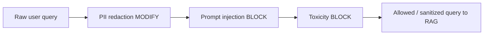

### P4.5-3 · Output Guardrails (completed)

Concrete OUTPUT implementations live in `apps/api/app/core/guardrails/output/`.

* **Hallucination heuristic** — `HallucinationHeuristicGuardrail` compares substantive answer tokens to `GuardrailContext.extra["reference_texts"]` with word-boundary matching; low overlap yields **WARN** (skipped when no references).
* **Factuality** — `FactualityCheckGuardrail` flags **WARN** when date-like strings or large integers in the answer do not appear in reference text (complements overlap).
* **Citation verification** — `CitationVerificationGuardrail` parses `[n]` citations; invalid indices **BLOCK**; citations with zero sources **WARN**.

Registration: `register_default_output_guardrails(manager)` — order **hallucination** → **factuality** → **citation**. Schema: `OutputStageGuardrailsSchema` under `GuardrailsConfigSchema.output`.

### Mermaid — OUTPUT stage chain (P4.5-3)

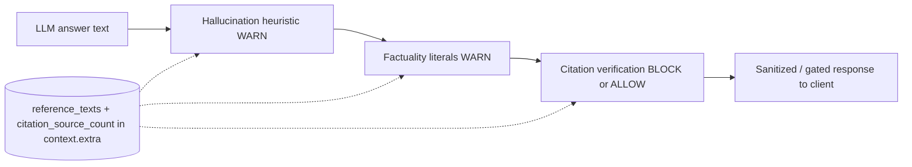

### P4.5-4 · Retrieval Guardrails (completed)

Concrete RETRIEVAL implementations live in `apps/api/app/core/guardrails/retrieval/`.

* **Content filtering** — `RetrievedContentFilterGuardrail` removes chunks whose text matches blocked terms or regex patterns (default: self-test marker only). **BLOCK** if no chunks remain.
* **Source validation** — `SourceProvenanceGuardrail` enforces non-empty metadata keys and optional `https://` for `source_url`. Registered only when keys or HTTPS checks are configured.
* **Bias detection** — `RetrievalBiasHeuristicGuardrail` **WARN**s when patterns match the query or any chunk (extensible; default self-test only).

Registration: `register_default_retrieval_guardrails(manager)` — **content filter** → **source provenance** (conditional) → **bias heuristic**. Schema: `RetrievalStageGuardrailsSchema` under `GuardrailsConfigSchema.retrieval`.

### Mermaid — RETRIEVAL stage chain (P4.5-4)

### Mermaid — Phase 4.5 guardrail coverage (after P4.5-4)

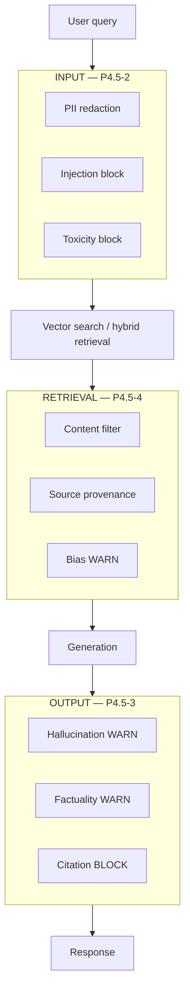

### Next sub-phase in Phase 4.5 (historical pointer)

P4.5-6 · Monitoring & Metrics — **done** (see append **P4.5-6 · Monitoring & Metrics**). Next: **P4.5-7 · Configuration & Testing**.

---

## Phase 4.5 — P4.5-5 · RAG Pipeline Integration (append)

**Intent:** One **end-to-end guarded path** from user query through retrieved chunks to LLM output, driven by optional **`guardrails`** on `PipelineConfigurationSchema`, plus **HTTP preview** for Designer and utilities (Autopilot-style callers).

### Behaviour

1. **`build_guardrail_manager(GuardrailsConfigSchema | None)`** registers INPUT / RETRIEVAL / OUTPUT rails according to stage `enabled` flags and per-check toggles (same kwargs as P4.5-2 … P4.5-4 `register_default_*` functions).
2. **`run_guarded_rag_query`** runs `GuardrailOrchestrator` for INPUT and RETRIEVAL, then **`GenerationService.generate`**, then OUTPUT checks with **reference passages** in `GuardrailContext.extra` for hallucination / citation rules.
3. **Preview APIs** accept `query`, full `config`, and **`contextDocuments`** (client-supplied retrieved chunks). Response returns **allow/block**, **stage summaries**, and **omits answer** when OUTPUT blocks.

### Mermaid — guarded RAG request path (P4.5-5)

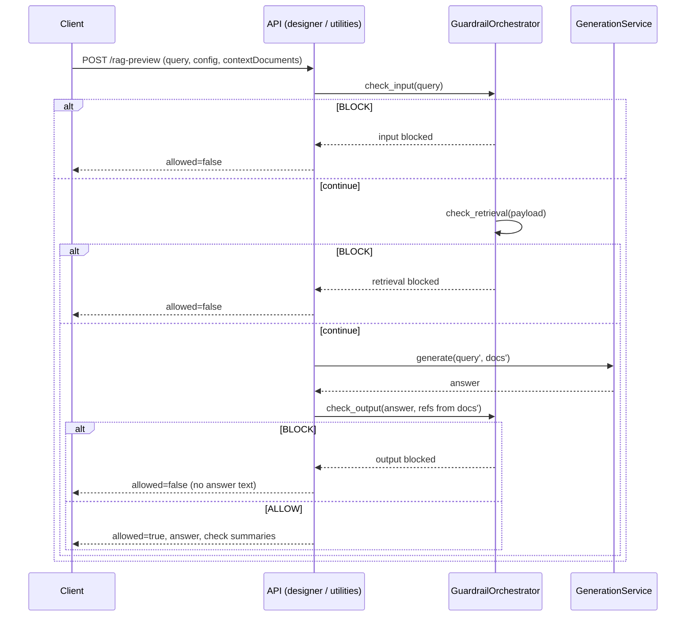

### Mermaid — configuration vs runtime (Phase 4.5 progression)

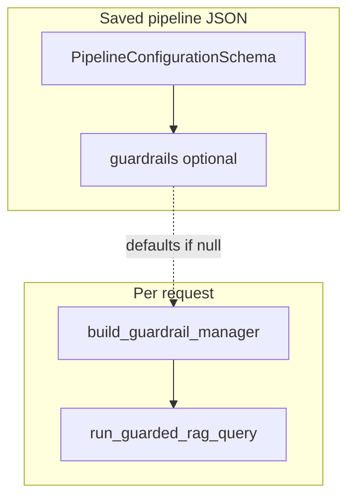

### Code map (concise)

| Piece | Location |
|-------|----------|
| Optional `guardrails` on pipeline | `app/schemas/pipeline.py` |
| Manager from policy | `app/core/guardrails/configure_manager.py` |
| Guarded runner | `app/core/rag/guarded_runner.py` |
| Shared preview service | `app/services/rag_preview_service.py` |
| Routes | `app/routers/designer.py`, `app/routers/utilities.py` |
| Frontend types | `apps/web/src/types/pipeline.ts` (`GuardrailsConfig`) |

---

## Phase 4.5 — P4.5-6 · Monitoring & Metrics (append)

**Intent:** Make guardrail behavior **measurable** for SRE and product analytics: every check and stage run emits **Prometheus** counters/histograms; full guarded RAG runs emit a **coarse outcome** time series; operators scrape **`/metrics`** or call **`/monitoring/guardrails`** for a JSON snapshot.

### Components

| Piece | Role |
|-------|------|
| `app/core/guardrails/metrics.py` | Defines `rag_guardrail_*` instruments and `collect_guardrail_metric_samples()`. |
| `GuardrailManager.run_stage` | Records per-check + per-stage-result samples after each `check()` and on stage exit. |
| `run_guarded_rag_query` | Records `success` / `blocked_*` pipeline outcomes. |
| `app/routers/monitoring.py` | `GET /metrics` (Prometheus text), `GET /monitoring/guardrails` (JSON). |
| `Settings.prometheus_metrics_enabled` | When `false`, both routes return **404**. |

### Mermaid — metrics flow (P4.5-6)

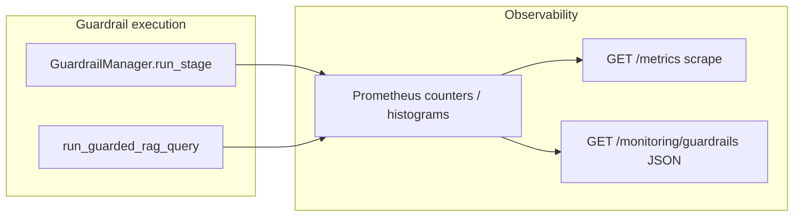

### Mermaid — guarded RAG with telemetry (conceptual)

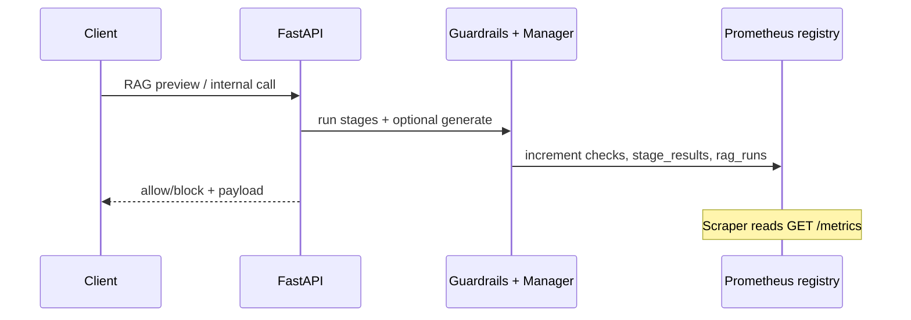

### Evolution note

Phase 4.5 now has **policy** (P4.5-2 … P4.5-4), **integration** (P4.5-5), and **telemetry** (P4.5-6). Phase 11 can unify these series with HTTP and infrastructure metrics in Grafana without changing guardrail semantics.

### Next sub-phase in Phase 4.5

P4.5-7 · Configuration & Testing — config files, comprehensive tests, and documentation pass.

---

## Phase 4.5 — P4.5-7 · Configuration & Testing (append)

**Intent:** Let operators **extend** toxicity, retrieval content-filter, and bias heuristics via **JSON policy files** on disk (separate from saved pipeline JSON), with **pytest** coverage and **documented** env vars. Keeps default behavior safe (self-test markers only) until paths are set.

### Behaviour

1. **`Settings`** exposes optional paths: `guardrails_toxicity_policy_path`, `guardrails_content_filter_policy_path`, `guardrails_bias_patterns_policy_path` (empty = unchanged defaults).
2. **`policy_loader`** reads JSON (`blocked_terms`, `regex_patterns` for toxicity/content filter; `regex_patterns` only for bias), compiles regexes (invalid pattern → `ValueError`), and **merges** file patterns with built-in default patterns so self-test markers remain available.
3. **`build_guardrail_manager`** loads policies via `get_settings()` and passes merged terms/patterns into `register_default_input_guardrails` / `register_default_retrieval_guardrails`.
4. **Examples** live under `apps/api/config/guardrails/examples/`; operator-specific overrides can live in `apps/api/config/guardrails/local/` (gitignored).

### Mermaid — operator policy files + manager build (P4.5-7)

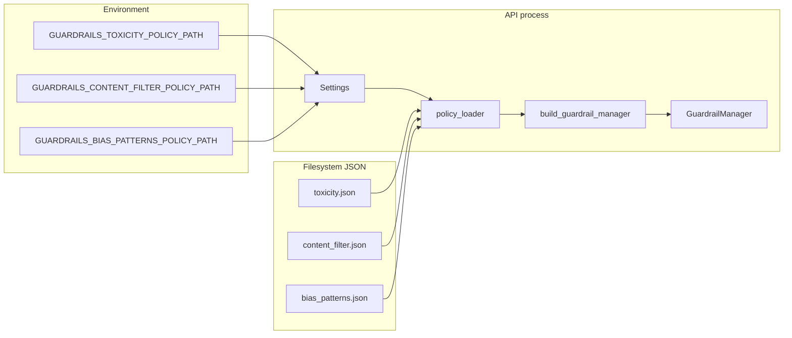

### Mermaid — configuration layers (Phase 4.5 complete)

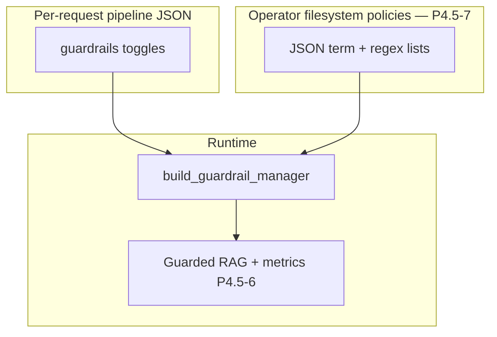

### Code map (concise)

| Piece | Location |
|-------|----------|
| Settings fields | `app/config.py` |
| Load + merge | `app/core/guardrails/policy_loader.py` |
| Wire into manager | `app/core/guardrails/configure_manager.py` |
| Default pattern exports | `input/toxicity.py`, `retrieval/content_filter.py`, `retrieval/bias.py` |
| Example JSON | `apps/api/config/guardrails/examples/` |
| Tests | `apps/api/tests/test_core/test_guardrails_policy_loader.py` |

### Evolution note

Phase **4.5** is **complete**: policy implementations, RAG integration, Prometheus metrics, and **operator-configurable** lists/patterns without redeploying pipeline documents.
