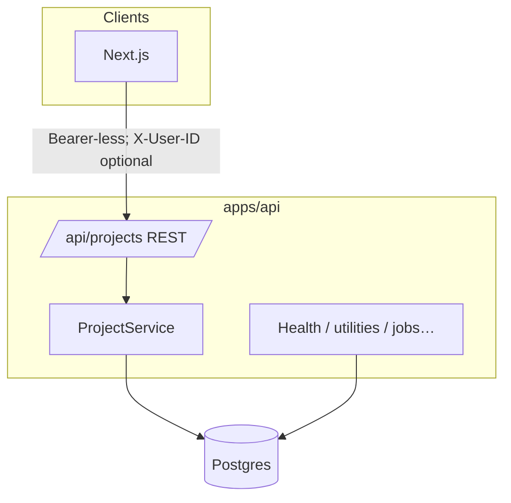
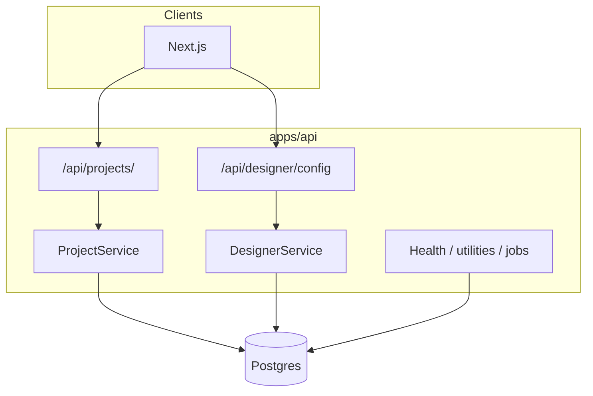
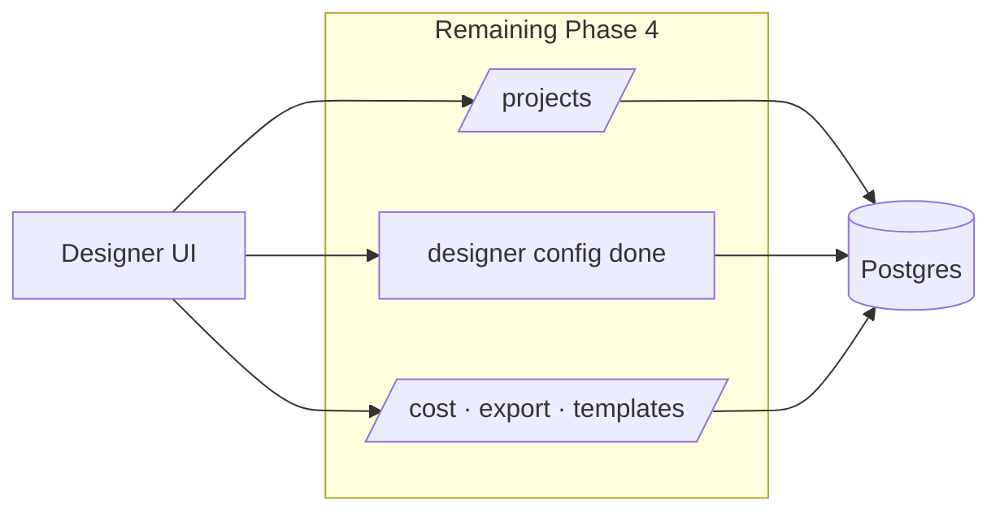
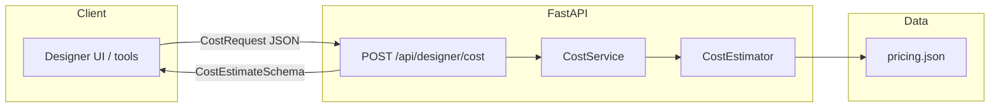
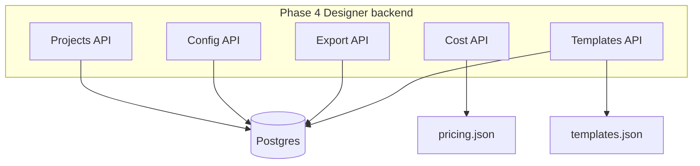
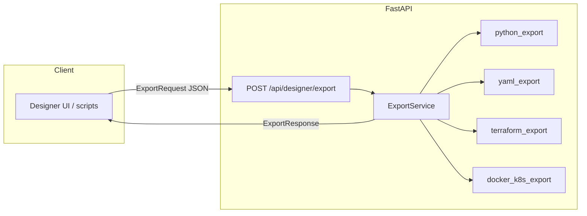
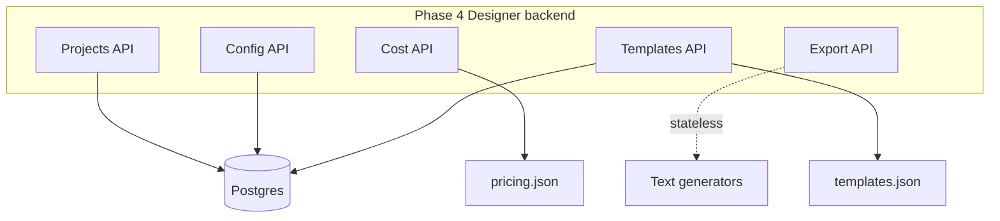
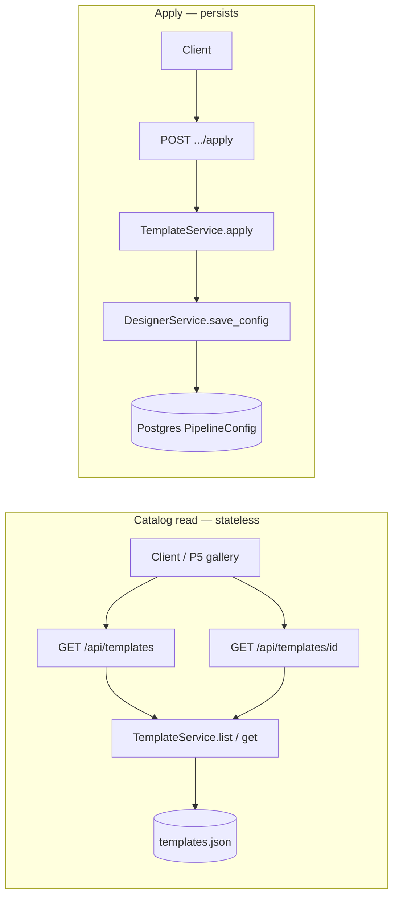
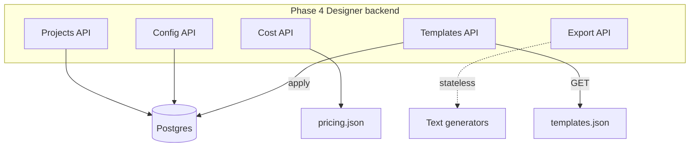

# Project system design evolution — Phase 4 (Designer mode backend)

> Part of the [master index](./PROJECT_SYSTEM_DESIGN_EVOLUTION.md).

---

## Phase 4 — Designer mode backend (API milestones, appended 2026-05-02)

The API is the **system of record** for workspaces (“projects”) and **Designer pipeline configurations**. CRUD is **user-scoped** via `X-User-ID` until JWT (Phase 12). Projects use **soft delete**; pipeline configs use **hard delete** with FK cascade where defined.

### After P4-1 · Projects API

| Topic | Decision |
|--------|----------|
| Identity | Header `X-User-ID` + `default_user_id` in settings until P12 JWT |
| Delete | Soft delete via `deleted_at` |
| Detail payload | Summarized configs/builds to avoid huge JSON in list/detail |
| Persistence | Async SQLAlchemy; JSON columns portable across SQLite (tests) and Postgres |

### After P4-2 · Designer Config API

Designer persists **`PipelineConfigurationSchema`** in `pipeline_configs.config` (full JSON), with indexed scalar columns for listing. Access validates **project ownership** via join to `projects`.

| Topic | Decision |
|--------|----------|
| Aggregate root | `PipelineConfig.project_id` → `projects.id` |
| Writes | `save_config` assigns server UUID; merges display `name` / `description` |
| Reads | DB timestamps injected into `metadata` on `SaveConfigResponse` |
| Delete | Hard row delete (evaluations/deployments cascade per schema) |

### Planned later in Phase 4

Cost API, export API, templates API — same tier; reuse projects + configs as aggregates.

---

## Looking ahead (compact)

Later phases add Designer UX depth (Phase 5), LangGraph autopilot agents + streaming APIs (Phases 6–7), evaluation/deployment endpoints (Phase 8), MLflow (Phase 9), automated testing gates (Phase 10), observability (Phase 11), and production hardening (Phase 12). Each increment extends this document with diagrams focused on new boundaries (auth, metrics, deployment planes).

---

## Later phases (preview)

- **Phase 5+:** Designer UI consumes Phase 4 endpoints end-to-end.
- **Phase 6–7:** Autopilot agents + web streaming — builds attach to `projects` and persist in existing tables.
- **Phase 12:** Replace header user with JWT and tighten row-level security.

*Append new sections at the end of this file when milestones land; preserve the full P0–P2 archive and later milestones above.*

---

## Phase 4 — P4-3 Cost Calculation API (Designer)

**Scope:** Stateless cost estimation for a validated `PipelineConfigurationSchema`. No Postgres read/write; pricing data is file-backed (`apps/api/catalogs/pricing.json` with fallback to repo `data/pricing.json`). This sub-phase adds the **estimation plane** next to existing **config persistence** (P4-2) and **projects** (P4-1).

### Architecture (level: Designer API + pricing catalog)

### Behaviour

| Input | Source |
|--------|--------|
| Pipeline stages | `CostRequest.config` — chunking, embedding model/dims, vector store provider, retrieval (strategy, `top_k`, multi-query config), reranking, generation |
| Volume assumptions | `queries_per_month`, `documents_count`, `avg_document_tokens` |
| Defaults | `pricing.json` → `assumptions` (avg input/output tokens per query) |

| Output | Meaning |
|--------|---------|
| `per_query` | Variable USD/query (embedding + generation + rerank + amortized retrieval reads) |
| `per_month` | Same components × scale + monthly vector storage |
| `breakdown` | Five rows: `embedding`, `vector_storage`, `retrieval_ops`, `reranking`, `generation` with percentages |

### Relation to utilities

`POST /api/utilities/cost` uses the same `CostEstimator` (via `app.core.utilities.cost` re-export). Designer-specific route is **`/api/designer/cost`** for product and OpenAPI grouping under `designer`.

### Next sub-phases in Phase 4

Export API, templates API — can call cost estimator for previews; no schema change required.

---

## Phase 4 — P4-4 Export API (Designer)

**Scope:** Stateless code and manifest generation from a validated `PipelineConfigurationSchema`. Mirrors the P3-5 frontend generators so the Designer UI (P5-12) can call the API instead of generating only client-side. No Postgres; no pricing file.

### Architecture (export plane)

### Phase 4 Designer backend (updated)

**Note:** The earlier diagram showed Export → DB; export is **stateless** — generators only. Templates API remains DB-backed.

### Next sub-phase in Phase 4

Templates API — list/apply `data/templates.json` and create `PipelineConfig` rows.

---

## Phase 4 · P4-5 Templates API (completed)

Designer backend can expose curated pipeline presets from the shared JSON catalog and materialize them as first-class saved configurations.

### Behaviour

- **Read paths** (`GET /api/templates`, `GET /api/templates/{id}`): load and validate `data/templates.json` (or `TEMPLATES_CATALOG_PATH` / optional `apps/api/catalogs/templates.json` mirror). No database reads for listing.
- **Apply** (`POST /api/templates/{id}/apply`): resolve template by id, build a `SaveConfigRequest` (optional `name` / `description` overrides), call `DesignerService.save_config` — same persistence rules as manual Designer create. Response extends `SaveConfigResponse` with `templateId` so clients know which preset was used.
- **Data fix:** `customer-support` template routing rules were aligned with `RoutingRuleSchema` (`condition` ∈ `keyword` | `query-length` | `semantic-complexity`, `targetModel`, optional `threshold` / `keywords`) so all templates validate as `PipelineConfigurationSchema`.

### Mermaid — Templates API (Phase 4)

### Phase 4 Designer backend — revised summary

**Correction:** List/get template endpoints are **file-backed**, not DB-backed. Only **apply** writes through `DesignerService` to Postgres.

---

