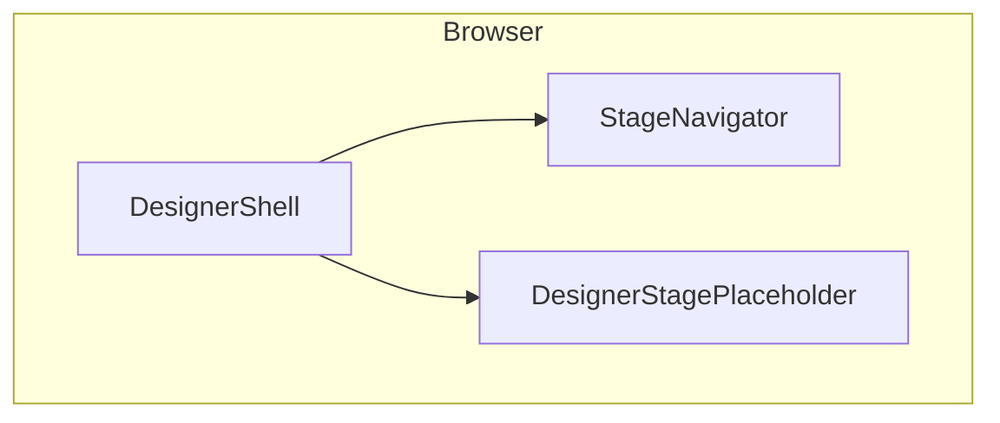
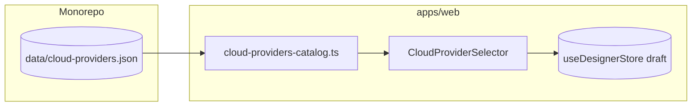
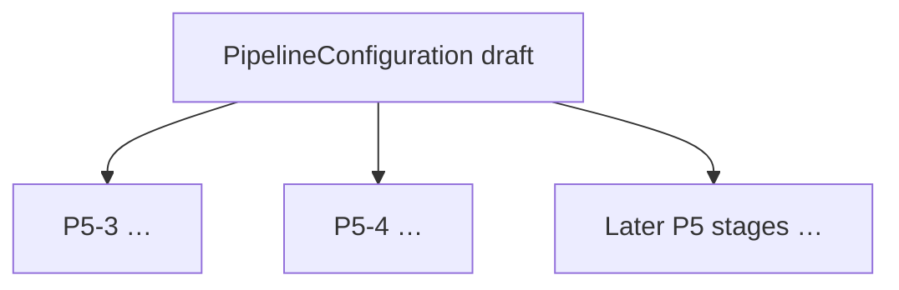

# Project system design evolution — Phase 5 (Designer UI)

> **Append-only.** Phase 5 adds the visual pipeline builder experience in **Designer mode**. This file starts simple and deepens as sub-phases land (P5-1 layout → P5-2 cloud selector → …).

---

## Design level 1 — Shell only (after P5-1)

The user navigates **12 stages** via **StageNavigator** + routes under `/designer/**`. **Pipeline configuration** is still mostly placeholders except routing and persisted draft shape.

---

## Design level 2 — Cloud catalog bound to draft (after P5-2)

The **Cloud Provider** stage renders **`CloudProviderSelector`**, which reads **`data/cloud-providers.json`** at build time via **`apps/web/src/lib/cloud-providers-catalog.ts`**. Selecting a provider calls **`patchDraft({ cloudProvider })`** so **`PipelineConfiguration.cloudProvider`** stays aligned with backend enums (`aws`, `gcp`, `azure`, `multi-cloud`). **Logo assets** ship under **`apps/web/public/logos/`** so catalog **`logo`** paths resolve. The sidebar shows the current provider abbreviation next to the Cloud stage link.

---

## Future levels (placeholder)

Later P5 tasks add panels for ingestion, chunking, embeddings, vector store, retrieval, generation, routing/memory/evaluation, visualizer, cost, export, review, and templates — each **`patchDraft`** / **`updateStages`** onto the same **`draft`** object consumed by Phase 4 APIs.

---

*Append new “Design level” sections at the end as P5-3+ ship.*
