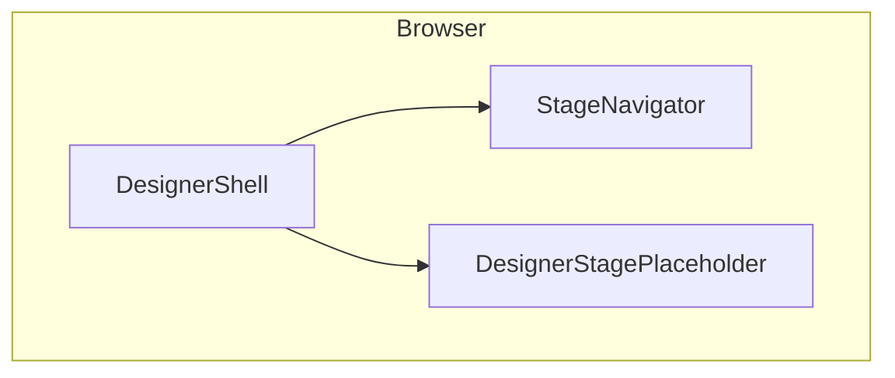
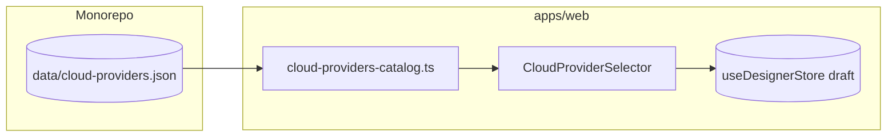
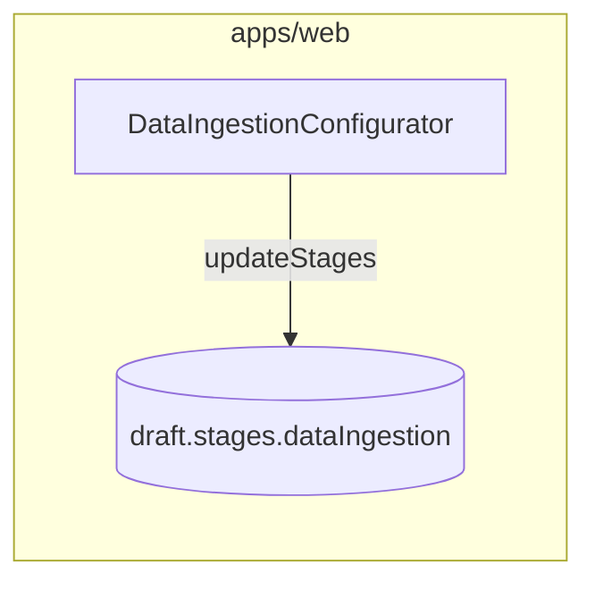
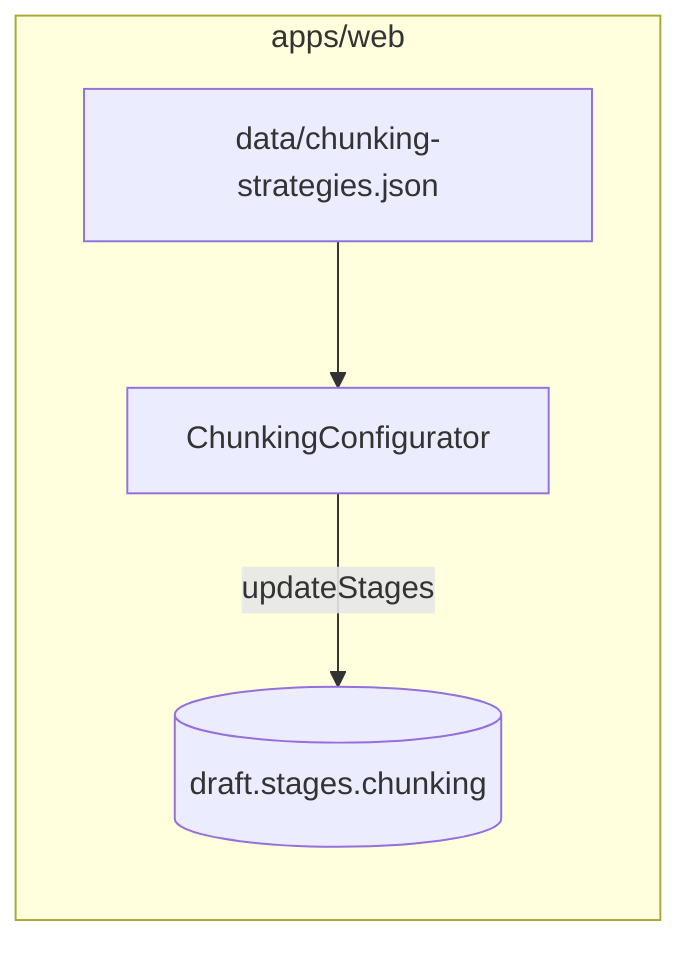
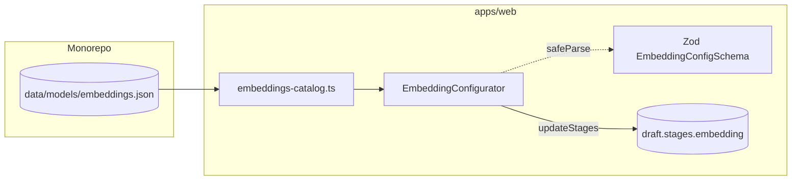
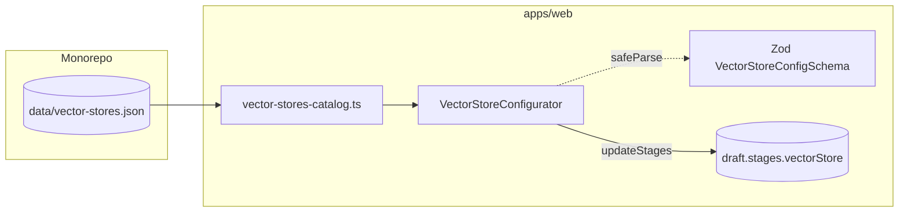
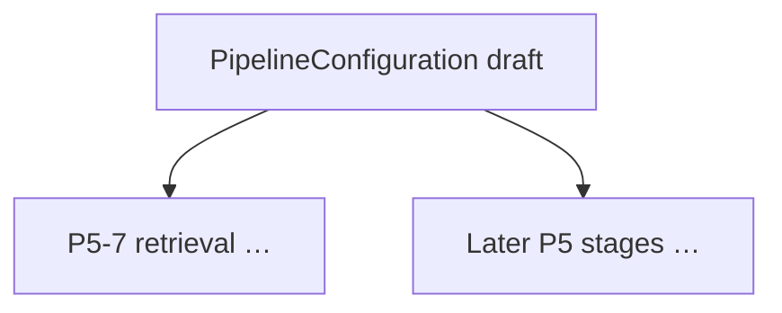

# Project system design evolution — Phase 5 (Designer UI)

> **Append-only.** Phase 5 adds the visual pipeline builder experience in **Designer mode**. This file starts simple and deepens as sub-phases land (P5-1 layout → P5-2 cloud selector → P5-3 ingestion → …).

---

## Design level 1 — Shell only (after P5-1)

The user navigates **12 stages** via **StageNavigator** + routes under `/designer/**`. **Pipeline configuration** is still mostly placeholders except routing and persisted draft shape.



---

## Design level 2 — Cloud catalog bound to draft (after P5-2)

The **Cloud Provider** stage renders **`CloudProviderSelector`**, which reads **`data/cloud-providers.json`** at build time via **`apps/web/src/lib/cloud-providers-catalog.ts`**. Selecting a provider calls **`patchDraft({ cloudProvider })`** so **`PipelineConfiguration.cloudProvider`** stays aligned with backend enums (`aws`, `gcp`, `azure`, `multi-cloud`). **Logo assets** ship under **`apps/web/public/logos/`** so catalog **`logo`** paths resolve. The sidebar shows the current provider abbreviation next to the Cloud stage link.



---

## Design level 3 — Data ingestion bound to `draft.stages.dataIngestion` (after P5-3)

The **Data Ingestion** stage renders **`DataIngestionConfigurator`**, which edits **`DataIngestionConfig`** fields aligned with **`apps/web/src/types/pipeline.ts`** and **`apps/api/app/schemas/pipeline.py`**. Updates flow through **`updateStages`** (nested merge for preprocessing/metadata). **`connectionConfig`** holds non-secret hints only (bucket, prefix, host, etc.). **`StageNavigator`** surfaces a compact **source type** label next to the ingestion step.



---

## Design level 4 — Chunking bound to `draft.stages.chunking` (after P5-4)

The **Chunking** stage renders **`ChunkingConfigurator`**, which edits **`ChunkingConfig`** (**`strategy`**, **`chunkSize`**, **`chunkOverlap`**, optional **`separators`**, optional **`metadata`**) aligned with **`apps/web/src/types/pipeline.ts`** and **`ChunkingConfigSchema`** in **`validators.ts`**. Strategy cards are driven by **`data/chunking-strategies.json`**; switching strategy applies catalog defaults (clamped to **128–4096** tokens and overlap rules). **Recursive character** exposes a **separator ladder** textarea with `\n` / `\t` escapes. **`StageNavigator`** shows a compact **strategy · tokens/overlap** subtitle under **Chunking**.



---

## Design level 5 — Embedding catalog bound to `draft.stages.embedding` (after P5-5)

The **Embedding** stage renders **`EmbeddingConfigurator`**, which reads **`data/models/embeddings.json`** via **`apps/web/src/lib/embeddings-catalog.ts`**. Users **search** and **filter** (provider, tier, quality, speed, open-source, hide deprecated), pick a **model card**, and tune **`batchSize`** within **`EmbeddingConfigSchema`**. Selection calls **`embeddingConfigFromCatalogEntry`** so **`model`**, **`provider`**, **`dimensions`**, and **`maxTokens`** stay aligned with the catalog record. **`StageNavigator`** shows **`embeddingHint`** (display name · dimensions).



**Refinement (same design level):** if the **filtered** set omits the **currently selected** catalog id, **`EmbeddingConfigurator`** prepends that row to the grid and marks **“Current · outside filters”** so configuration state stays visible.

---

## Design level 6 — Vector store bound to `draft.stages.vectorStore` (after P5-6)

The **Vector Store** stage renders **`VectorStoreConfigurator`**, which reads **`data/vector-stores.json`** via **`apps/web/src/lib/vector-stores-catalog.ts`**. Users filter by **type**, **cloud**, and **hybridSearch**, pick a **provider** card, and edit **`indexName`**, **metric** (intersection of catalog **supportedMetrics** and **`SimilarityMetric`**), **replicas/shards**, optional **namespace**, and optional **cloud** hints. Switching providers calls **`vectorStorePatchFromCatalog`** so **metric** stays valid; pinned rows mirror the Embedding stage when filters hide the active provider. **`StageNavigator`** shows **`vectorStoreHint`**.



---

## Future levels (placeholder)

Remaining P5 tasks add panels for **retrieval**, **generation**, **routing/memory/evaluation**, **visualizer**, **cost**, **export**, **review**, and **templates** — each **`updateStages`** / **`patchDraft`** onto the same **`draft`** consumed by Phase 4 APIs.



---

## Design level 9 — Routing, memory & evaluation bound to `draft.stages` (after P5-9)

The **Routing**, **Memory**, and **Evaluation** routes render dedicated configurators that edit **`routing`** (**enabled**, **rules** with **condition** / **keywords** / **threshold** / **targetModel**, **defaultModel**), **`memory`** (**type**, **windowSize**, **maxTokens**, **sessionPersistence**), and **`evaluation`** (**enabled**, **metrics**, **testSetSize**, **schedule**). **Routing** model pickers reuse **`data/models/generation.json`** via **`generation-catalog.ts`** (same ids as **Generation**). Client validation uses existing **Zod** schemas; **Python**/**YAML**/**Mermaid** generators already referenced these shapes. **`StageNavigator`** shows compact hints (**routing**: on/off + rule count; **memory**: short type label; **evaluation**: on/off + metric count).

```mermaid
flowchart LR
  subgraph Routes["Designer routes"]
    RTG[/designer/routing]
    MEM[/designer/memory]
    EVL[/designer/evaluation]
  end
  subgraph Cmp["Components"]
    RC[RoutingConfigurator]
    MC[MemoryConfigurator]
    EC[EvaluationConfigurator]
  end
  subgraph State["Zustand draft"]
    S[(stages.routing memory evaluation)]
  end
  RTG --> RC
  MEM --> MC
  EVL --> EC
  RC --> S
  MC --> S
  EC --> S
```

---

*Append new “Design level” sections at the end as P5-10+ ship.*
