# Project system design evolution — Phase 6 (Autopilot LangGraph + API)

> **Append-only companion.** Phase 6 adds **backend Autopilot**: shared **LangGraph** state, specialist agents that populate **`stage_outputs`**, a **closed-loop orchestrator** with retries, **Celery** execution, and **first-class HTTP** under **`/api/autopilot`**. This file progresses from the **minimal bootstrap graph** (P6-1) to the **full façade** clients use in Phase 7 (P6-9).
>
> Canonical cumulative log (all phases): [`PROJECT_SYSTEM_DESIGN_EVOLUTION.md`](./PROJECT_SYSTEM_DESIGN_EVOLUTION.md).

---

## Design level 1 — Foundation only (after P6-1 · LangGraph Agent Infrastructure)

**Goal:** Prove **LangGraph** wiring, a single **`AutopilotGraphState`** contract, and **stage name alignment** with the worker—without yet running real corpus logic.

The codebase introduces **`apps/api/app/core/agents/`**: **`AutopilotGraphState`** (messages, build metadata, **`agent_trace`**, **`stage_outputs`** reducers), **central prompts**, a **stub tool registry**, and a **bootstrap** graph **`bootstrap_prepare` → `bootstrap_finalize`** that runs **without an LLM**. **`run_pipeline_build`** still performs transitional work but now imports **`AUTOPILOT_STAGE_ORDER`** from the same module so **UI / worker / graph** share one ordered list of stage ids.

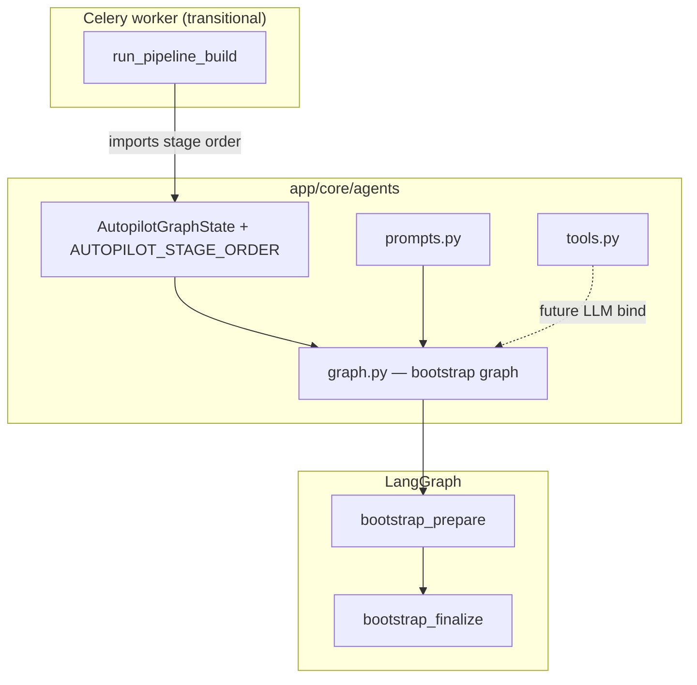

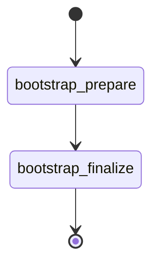

**Evolution:** Before P6-1, progress was **time-sliced stub updates** with no shared agent memory. After P6-1, there is a **compiled graph pattern** and one **state schema** ready for real nodes.

---

## Design level 2 — First real stage (after P6-2 · Document Analyst Agent)

**Goal:** Emit **actionable machine output** for downstream optimizers while staying **deterministic** (no LLM required for core paths).

**`document_analyst`** summarises the corpus (from **`requirements["corpus_profiles"]`** or synthetic profiles per **`document_id`**) and writes **`stage_outputs["analyze"]`** (chunking recommendations, **`corpus_summary`**, trace rows). Graph: **`bootstrap_prepare` → `bootstrap_finalize` → `document_analyst` → END**.

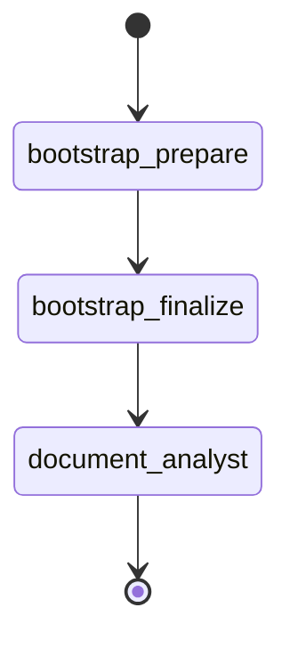

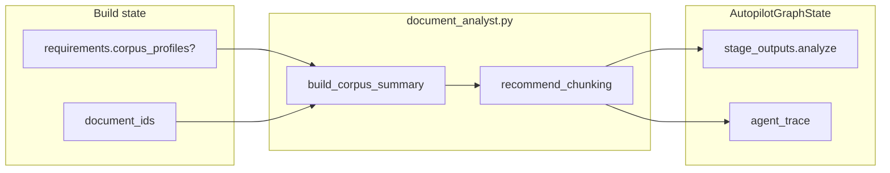

**Evolution:** P6-1 validated wiring; P6-2 produces the **first stage output** consumed by chunking (P6-3).

---

## Design level 3 — Measured chunking (after P6-3 · Chunking Optimizer Agent)

**Goal:** Bridge **recommendations** to **`ChunkingService`** execution and **quality scores** on a bounded corpus.

**`chunking_optimizer`** expands recommendations into candidates, runs **`ChunkingService.chunk`**, scores via **`ChunkQualityScorer`**, writes **`stage_outputs["chunking"]`** (`selected`, `candidates_tried`, `alternatives_tested`). Linear graph through **`chunking_optimizer`**.

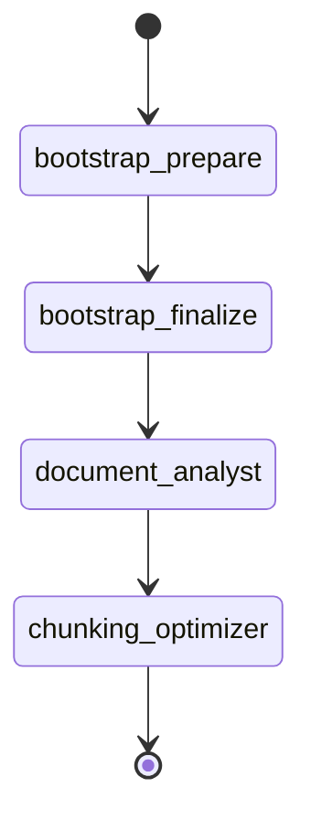

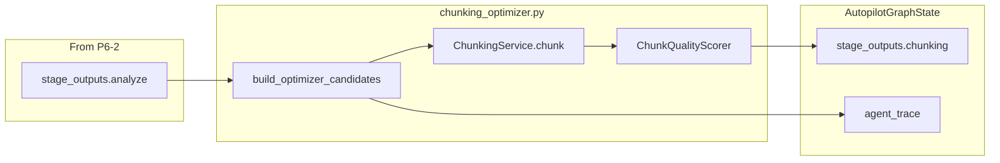

**Evolution:** Autopilot now holds a **measured chunking triple**, not only analyst text.

---

## Design level 4 — Embedding benchmarks (after P6-4 · Embedding Tester Agent)

**Goal:** Rank **embedding** candidates using **live benchmarks** plus catalog signals, aligned to **`optimize_for`**.

**`embedding_tester`** uses the **winning chunking config** and **`EmbeddingBenchmarker`**, reads **`data/models/embeddings.json`**, writes **`stage_outputs["embedding"]`**.

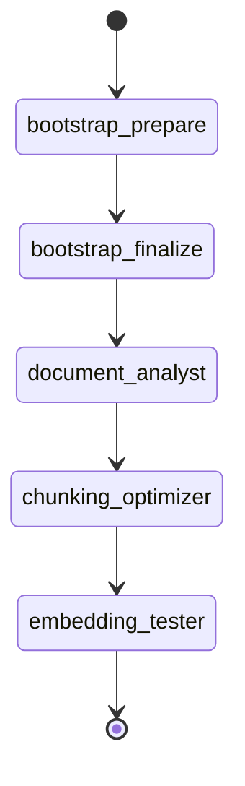

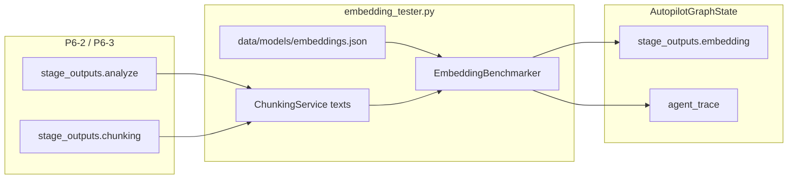

**Evolution:** **Static** embedding intent from Designer drafts becomes **exercised, ranked** selection.

---

## Design level 5 — Retrieval tuning (after P6-5 · Retrieval Optimizer Agent)

**Goal:** Emit **retrieval + rerank** configuration from **offline scores** (e.g. BM25-oracle MRR, latency proxy).

**`retrieval_optimizer`** writes **`stage_outputs["retrieval"]`**. Graph extends linearly through **`retrieval_optimizer`**.

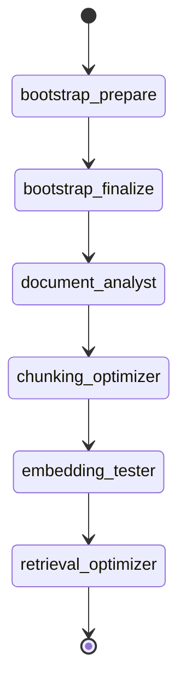

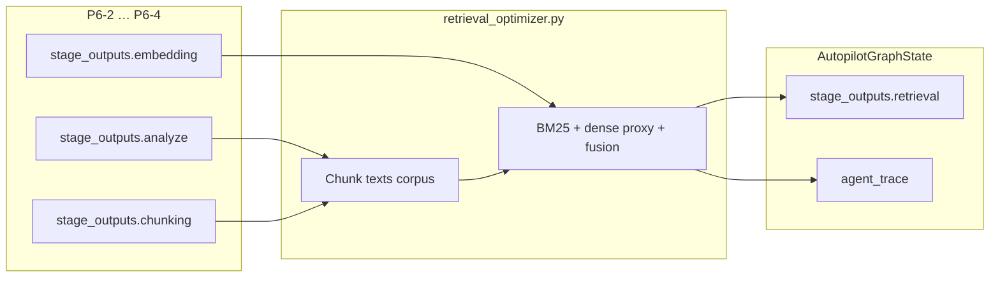

**Evolution:** The stack has a **measured retrieval configuration** ready for evaluation.

---

## Design level 6 — Evaluation proxies (after P6-6 · Evaluation Agent)

**Goal:** Close a **quality loop** with deterministic **metric proxies**, **`meets_targets`**, and **`failure_analysis`** (full RAGAS remains on async job paths / P2-7).

**`evaluation_agent`** writes **`stage_outputs["evaluation"]`**.

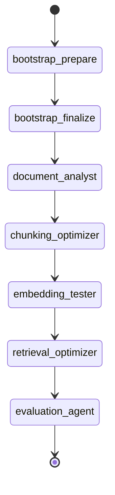

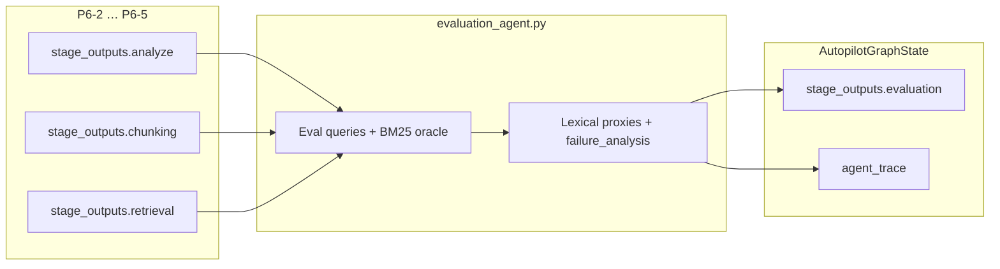

**Evolution:** Autopilot can **score** the composed stack, not only rank retrieval.

---

## Design level 7 — Deployment artefacts (after P6-7 · Deployment Agent)

**Goal:** **Package** outputs as reviewable **Docker / K8s / Terraform** text, reusing **P4 export** when pipeline JSON validates; **gated** cloud metadata only (**no apply**).

**`deployment_agent`** extends graph through **`deployment_agent` → END** (linear era, pre-gate).

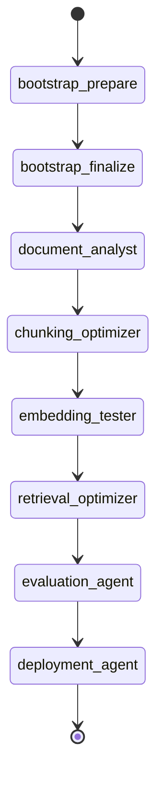

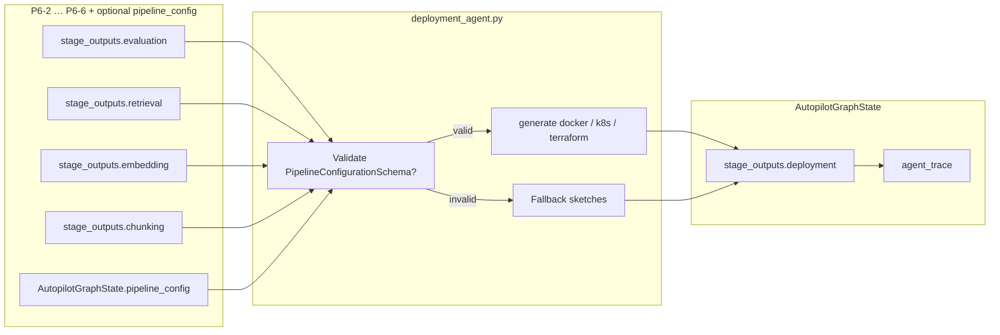

**Evolution:** Operators get **artefacts** comparable to Designer export, without unmanaged cloud side effects.

---

## Design level 8 — Orchestrator loop + progress (after P6-8 · Autopilot Orchestrator)

**Goal:** **Target-driven retries** (loop back to **`chunking_optimizer`** when evaluation fails and budget allows) and **progress-shaped** **`agent_trace`** rows for streaming UIs.

**`orchestration_gate`** follows **`evaluation_agent`**. **`run_pipeline_build`** invokes **`invoke_autopilot_orchestrator`** and persists **stages**, **messages**, **progress**, **`result.stage_outputs`**.

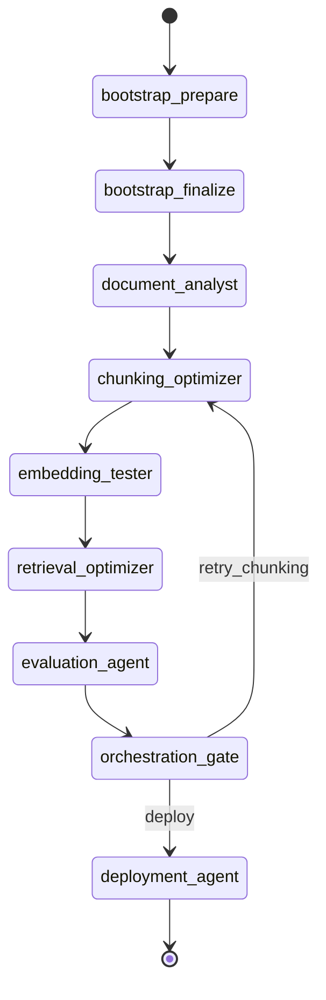

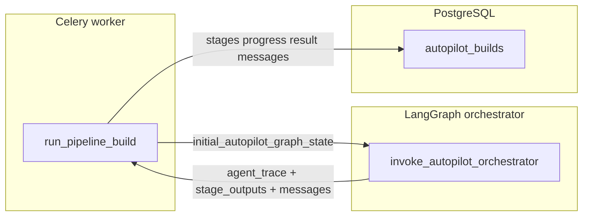

**Evolution:** One **forward pass** becomes an explicit **iterate-until-target-or-cap** product behaviour; worker and graph are **unified**.

---

## Design level 9 — HTTP vertical (after P6-9 · Autopilot API Endpoints)

**Goal:** **Clients** start and observe builds without generic job hacks: **`POST /upload`** (P7-1), **`POST /build`**, **`GET /build/{id}`**, **`GET …/stream`**, **`POST …/cancel`**, **`GET …/result`**.

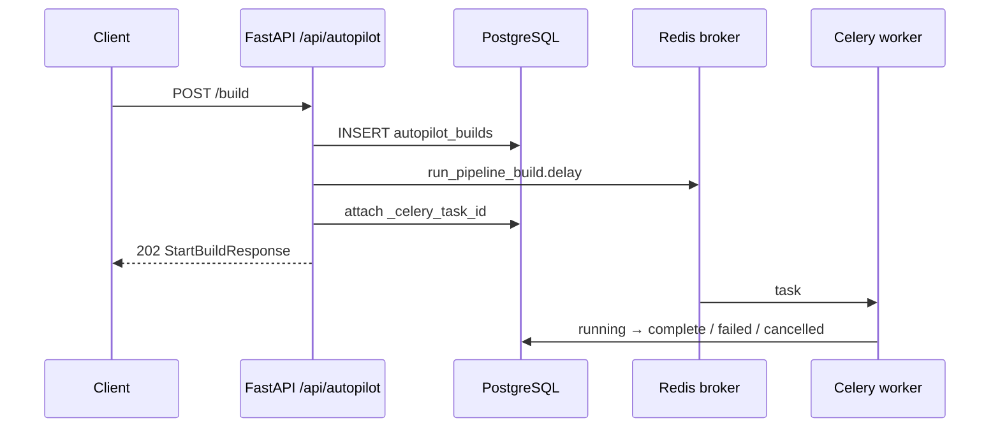

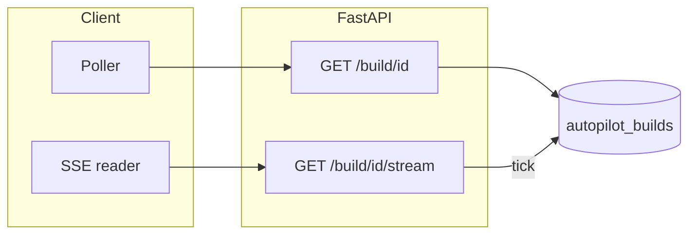

**Evolution:** Autopilot is a **cohesive HTTP + queue + DB** product slice; Phase 7 only adds **browser UX** on top of these contracts.

---

*Append new “Design level” sections here if Phase 6 gains follow-on tasks (e.g. streaming schema revisions) after P6-9.*
