# Project system design evolution — Phase 7 (Autopilot frontend)

> **Append-only companion.** Phase 7 adds the **Autopilot browser experience**: real **uploads**, **requirements** editing, **live build** observation (SSE + poll fallback), **observability** (feed, charts), **typed results** and **Designer handoff**, then a **multi-route shell** and **server history list**. This file moves from **single-page wizard** beginnings to **multi-page IA** at the end of the phase.
>
> Canonical cumulative log (all phases): [`PROJECT_SYSTEM_DESIGN_EVOLUTION.md`](./PROJECT_SYSTEM_DESIGN_EVOLUTION.md).

---

## Design level 1 — Real corpus path (after P7-1 · Document Uploader)

**Goal:** Replace opaque **`documentIds`** with **multipart upload** to **object storage** and **Zustand** metadata the build request can reference.

**`POST /api/autopilot/upload`** validates **project ownership**, enforces caps from **`Settings`**, writes **MinIO** keys under **`autopilot/{user}/{project}/…`**. **`DocumentUploader`** lists **`GET /api/projects`**, calls **`postFormData`**, stores **`objectId`** rows in **`useAutopilotStore`**.

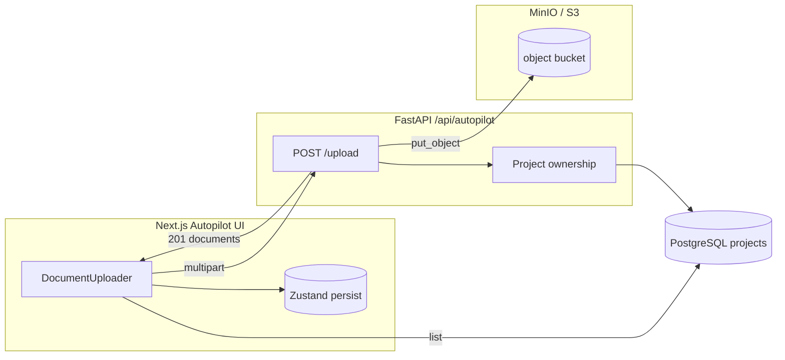

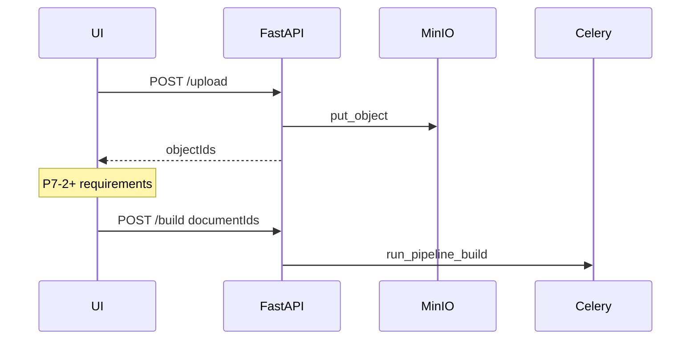

**Evolution:** Phase 6 APIs could enqueue builds; Phase 7-1 supplies **real bytes** and stable **object keys** for those **`documentIds`**.

---

## Design level 2 — Authoritative constraints (after P7-2 · Requirements Form)

**Goal:** **`StartBuildRequest.requirements`** is edited in the UI with **Zod** validation before any **Start** action.

**`RequirementsForm`** binds sliders and cards to **`useAutopilotStore.requirements`** (persisted): **target metrics**, **`optimizeFor`**, budget/latency, **cloud provider** from catalog, **`maxIterations`**.

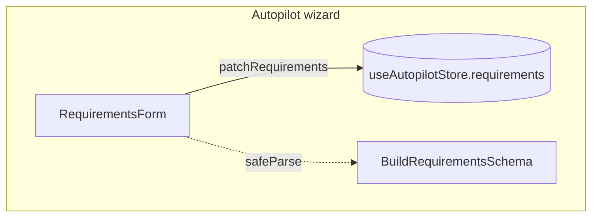

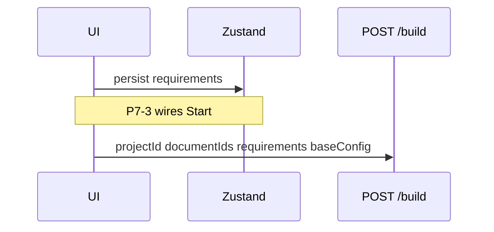

**Evolution:** **Defaults** become **operator-authored** constraints aligned with the backend schema.

---

## Design level 3 — Closed-loop run (after P7-3 · Build Progress Monitor)

**Goal:** **Start**, **Cancel**, and **observe** a build from the product UI with **resilient transport**.

**`BuildProgressMonitor`** calls **`POST /api/autopilot/build`**, **`useAutopilotBuildSubscription`** uses **SSE** **`…/stream`** then **poll** **`GET …/build/{id}`**. **`autopilot-build-status.ts`** merges **`BuildStatusResponse`** into **`AutopilotBuild`** while preserving **`input`**.

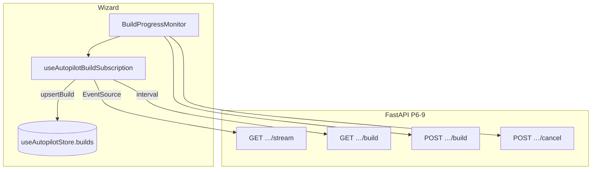

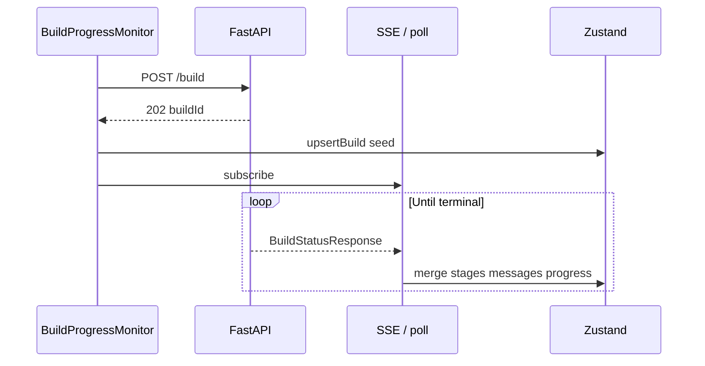

**Evolution:** The wizard is **operationally complete** for enqueue + watch; further levels add **depth** (logs, charts, reports, navigation).

---

## Design level 4 — Agent log UX (after P7-4 · Agent Activity Feed)

**Goal:** **`messages`** are **searchable**, **filterable**, and **exportable** without devtools.

**`AgentActivityFeed`** reads **`builds[activeBuildId].messages`**, supports agent/type filters, **JSON / text export**, **smart scroll-to-bottom**.

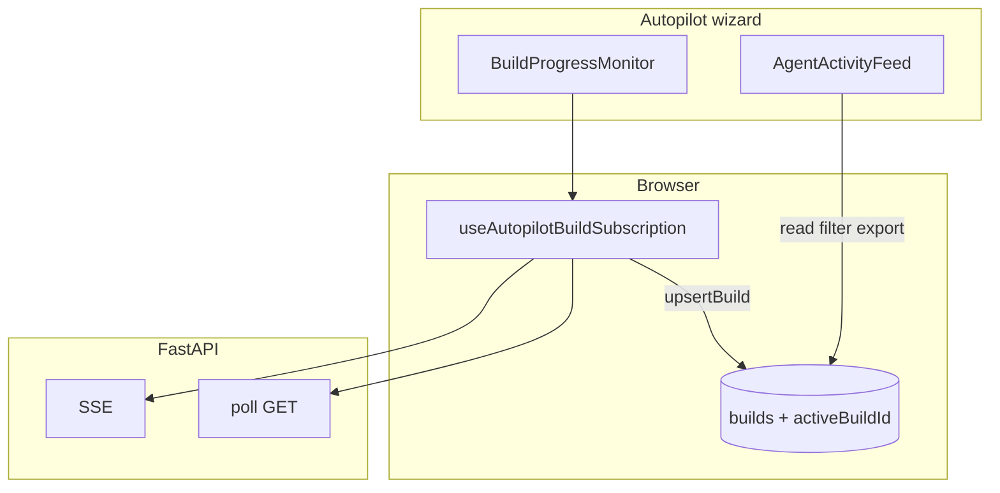

**Evolution:** Observability moves from **progress bars only** to **first-class operator logs**.

---

## Design level 5 — Structured metrics slice (after P7-5 · Metrics Dashboard)

**Goal:** Chart **quality / embedding / retrieval** signals while **`result`** may still be **opaque** orchestrator JSON.

**`extract_dashboard_metrics`** projects **`result.stage_outputs`** → **`BuildStatusResponse.dashboard_metrics`**. **`MetricsDashboard`** + **Recharts** render on each poll/SSE tick.

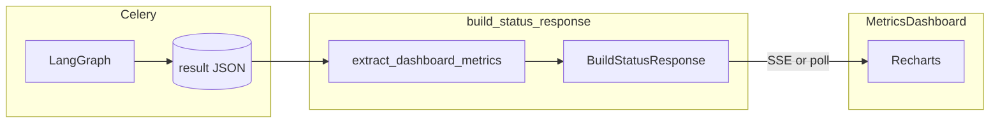

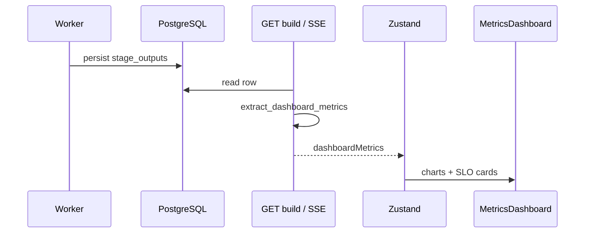

**Evolution:** Operators see **SLO-aligned charts** without waiting for a normalised **`BuildResult`**.

---

## Design level 6 — Typed build report + Designer (after P7-6 · Decision Explainer & Results)

**Goal:** **`BuildStatusResponse.result`** validates as **`BuildResultSchema`** for **metric cards**, **JSON download**, **DecisionExplainer**, and **Open in Designer**.

**`compose_build_result_payload`** merges typed **`config`**, **`metrics`**, **`decisions`**, **`deployment`**, **`total_iterations`** onto **`autopilot_builds.result`**. **`ResultsSummary`** + **`DecisionExplainer`** consume **`build.result`**.

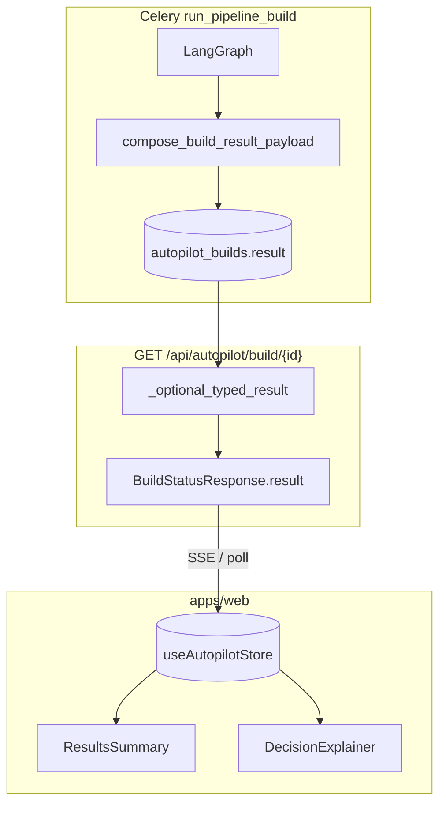

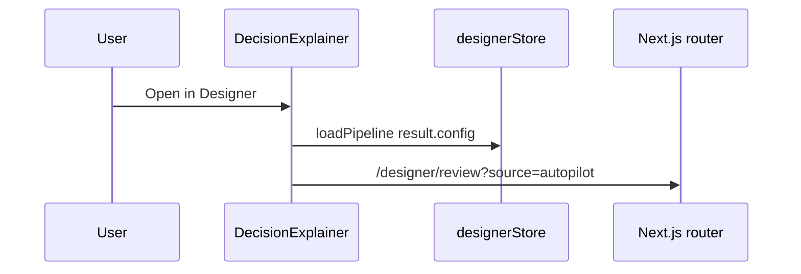

**Evolution:** Autopilot output becomes **interchangeable** with Designer **`PipelineConfiguration`** for review and iteration.

---

## Design level 7 — Information architecture + history API (after P7-7 · Autopilot Entry & History Pages)

**Goal:** **Discoverable routes**, **server-backed build lists**, and **deep links** back into the wizard—without changing the **rich** **`GET /build/{id}`** contract.

**`AutopilotShell`** wraps **`/autopilot`** (overview), **`/autopilot/new`** (full wizard), **`/autopilot/history`** (paginated **`GET /api/autopilot/builds`**), **`/autopilot/projects`** (backend project picker). **`?build=`** + **`?project=`** on **`/autopilot/new`** hydrates store via one-shot **GET** when needed.

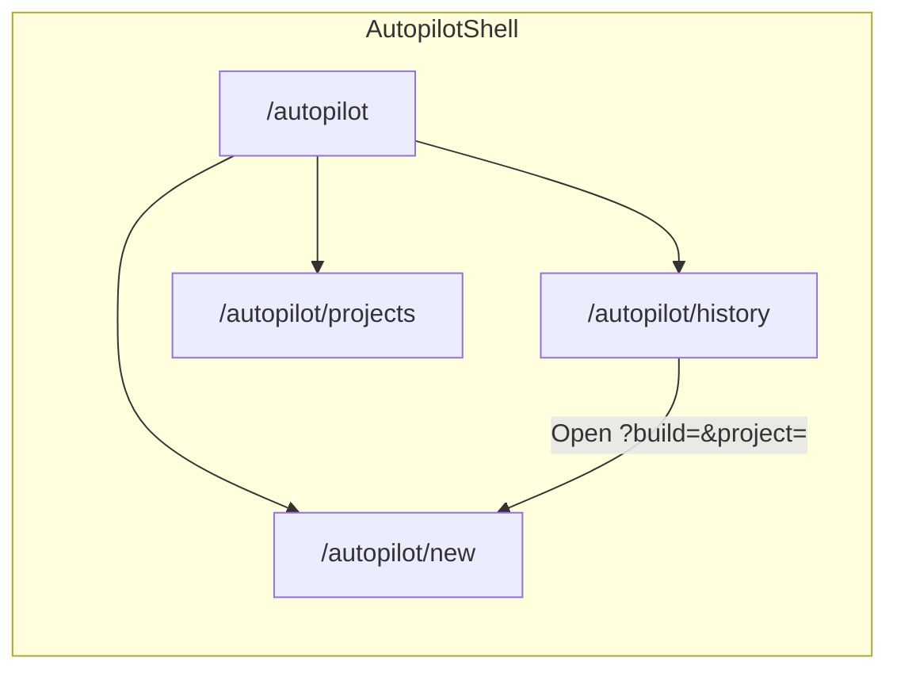

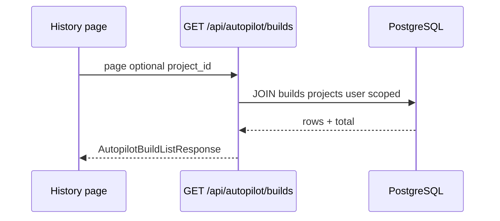

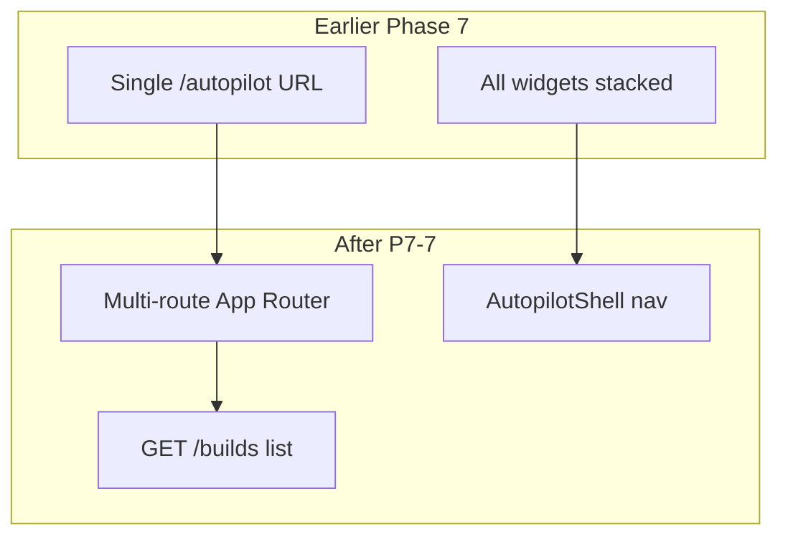

**Evolution:** **Everything on one scroll** becomes a **product surface** with **overview**, **wizard**, **history**, and **project** contexts; list API supports **fresh sessions** and **ops dashboards**.

---

*Append new “Design level” sections here for any Phase 7 follow-on (e.g. auth-gated history, build comparison UI).*
