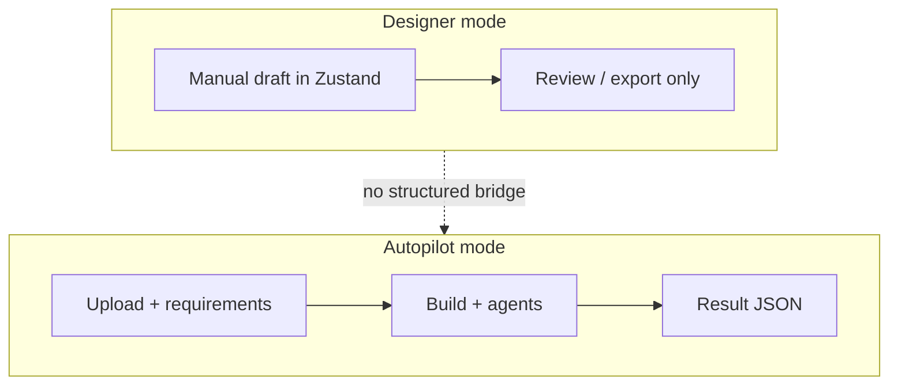
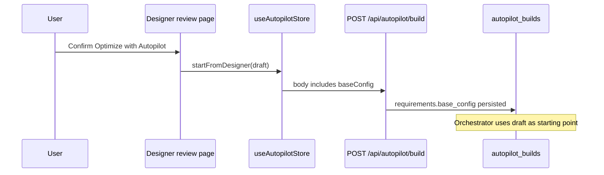
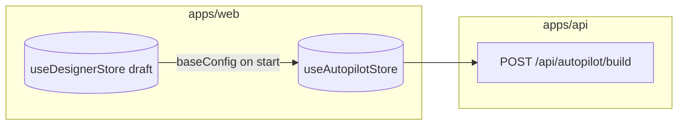
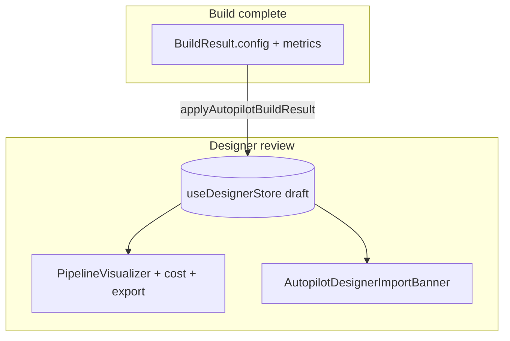
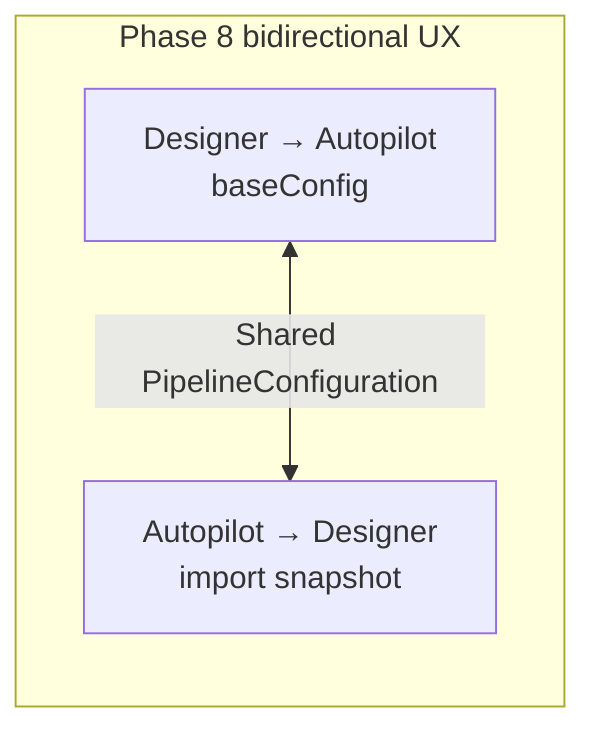
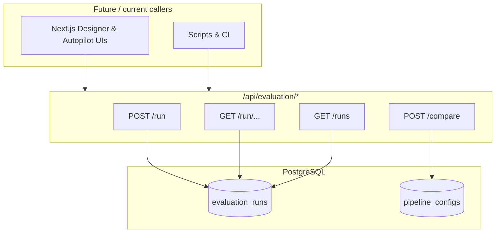
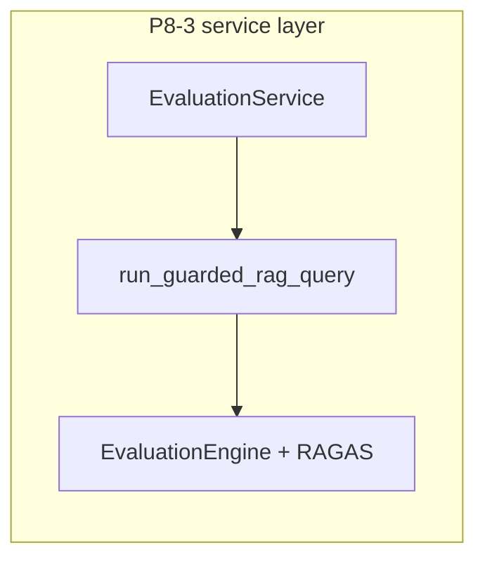
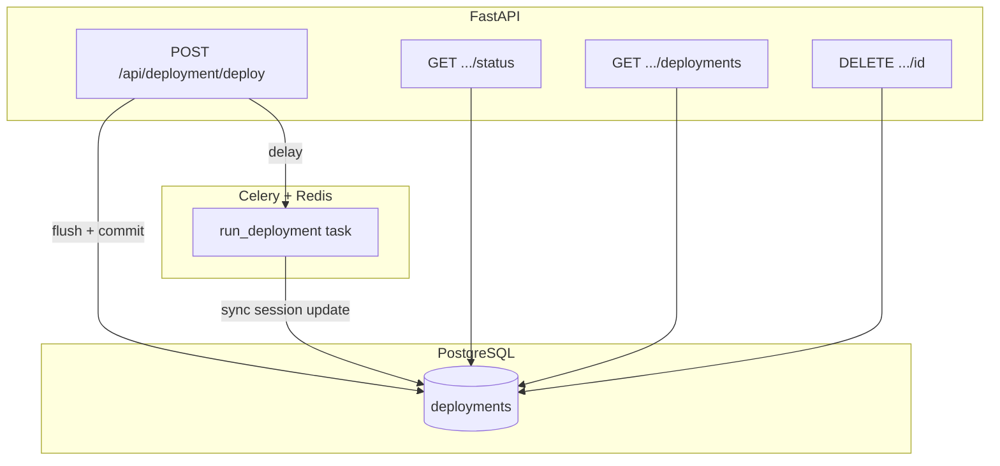
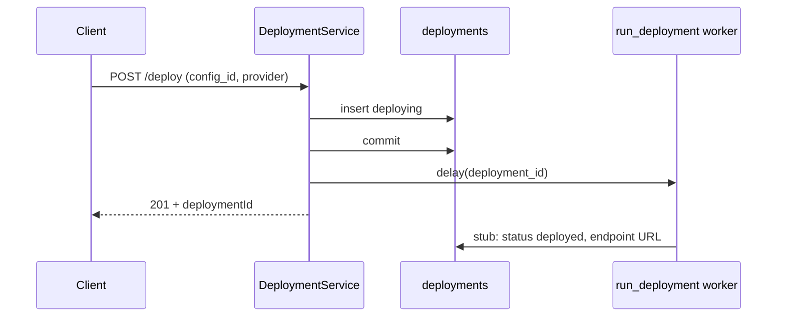
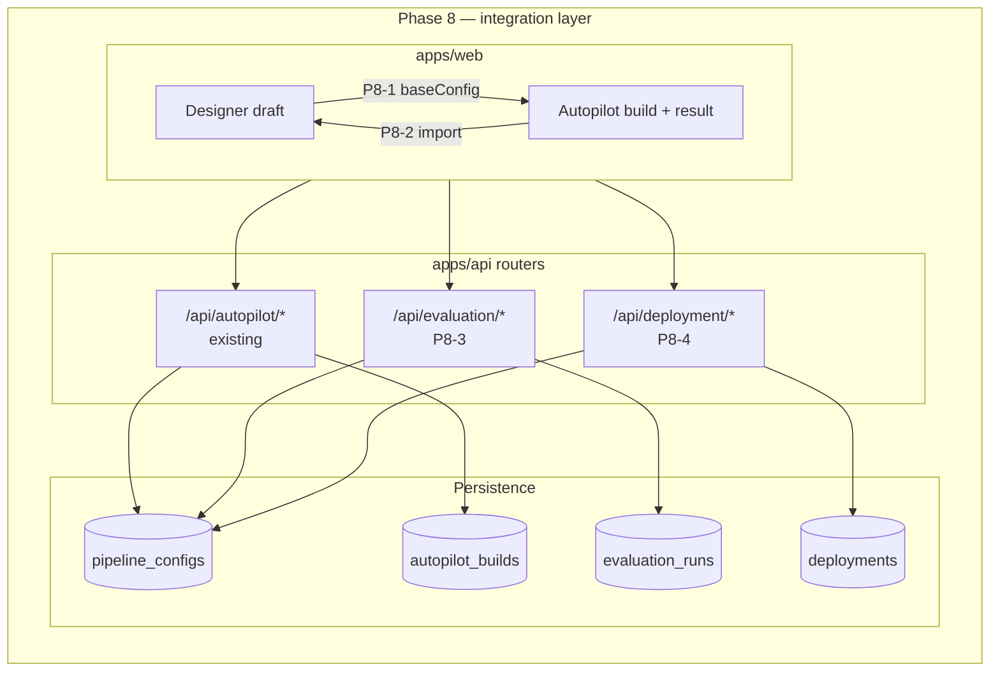

# Project system design evolution — Phase 8 (Designer ↔ Autopilot integration)

> **Scope.** Phase 8 connects **Designer mode** and **Autopilot mode** through a **shared pipeline config contract**, **HTTP APIs** for **evaluation** and **deployment**, and **Zustand** handoff state on the web app. This document evolves from a **siloed two-mode** picture (start of phase) to the **integrated platform** at phase completion (**P8-1 → P8-4**).

---

## Design level 0 — Siloed modes (before Phase 8)

**Designer** and **Autopilot** share JSON catalogs and types, but there is **no first-class handoff**: starting an Autopilot build does not carry a Designer draft as a structured baseline, and finished builds are not imported back into **`useDesignerStore`** as a reviewable draft. **Evaluation** and **deployment** are not yet exposed as cohesive REST surfaces under a single integration story.

---

## Design level 1 — Designer → Autopilot handoff (after **P8-1**)

The user can open **“Optimize with Autopilot”** from **`/designer/review`**. **`useAutopilotStore.startFromDesigner(draft)`** stores the Designer **`PipelineConfiguration`** as **`baseConfig`**. **`BuildProgressMonitor`** submits **`POST /api/autopilot/build`** with **`baseConfig`** (camelCase) so the backend persists **`requirements["base_config"]`** on the build row for the LangGraph orchestrator. **Document uploads remain mandatory** (`document_ids`); the handoff carries **hyperparameters**, not corpus binaries.

---

## Design level 2 — Autopilot → Designer visualization (after **P8-2**)

Completed builds expose **“Open in Designer”**: **`applyAutopilotBuildResult`** copies **`BuildResult.config`** into **`draft`**, sets **`metadata.source: autopilot`**, **`metadata.buildId`**, and **`autopilotImportSnapshot`** (metrics, iterations). **`/designer/review?source=autopilot`** renders **`AutopilotDesignerImportBanner`** alongside the existing **PipelineVisualizer**, **CostEstimator**, and **CodeExporter** — same visualization stack as a manual design, with Autopilot provenance visible.

---

## Design level 3 — Evaluation API as shared backend (after **P8-3**)

**RAGAS-style evaluation** is available over HTTP for **saved pipeline configs**: **`POST /api/evaluation/run`**, **`GET /api/evaluation/run/{id}`**, **`GET /api/evaluation/runs?config_id=`**, **`POST /api/evaluation/compare`**. **`EvaluationService`** joins **`evaluation_runs` → `pipeline_configs` → `projects`** with **`X-User-ID`** scoping. Runs can feed **comparison** of two configs (paired run ids or fresh runs on a shared synthetic set). This binds **Designer** and **Autopilot** outputs to the **same evaluation surface** once a config id exists in the database.

---

## Design level 4 — Deployment API + async worker (after **P8-4**)

**Deployments** are **first-class resources**: **`POST /api/deployment/deploy`** creates a **`deployments`** row and enqueues **`jobs.run_deployment`** via Celery (commit **before** enqueue to avoid worker races). **`GET /api/deployment/{id}/status`**, **`GET /api/deployment/deployments?project_id=`**, and **`DELETE /api/deployment/{id}`** (logical teardown) complete the lifecycle. The worker **stub** promotes **`deployed`** with a placeholder endpoint; real **`terraform apply` / cloud apply** stays gated for later phases. **Project-scoped listing** ties deployments to the same **project** object that owns **pipeline configs**.

---

## Design level 5 — Phase 8 complete (consolidated integration view)

At the end of Phase 8, **two UX bridges** (handoff + import) and **two backend pillars** (evaluation + deployment) align on **`PipelineConfiguration`** persisted under **projects**. The system is ready for **Phase 9 (MLflow)** to attach experiment metadata to the same build and config identifiers.

---

## Sub-phase → diagram map

| Sub-phase | Primary design levels | Focus |
|-----------|----------------------|--------|
| **P8-1** | 0 → 1 | `baseConfig` handoff; `POST /api/autopilot/build` payload |
| **P8-2** | 1 → 2 | `applyAutopilotBuildResult`; Designer review banners + same visualizers |
| **P8-3** | 2 → 3 | `EvaluationService`; `evaluation_runs`; compare endpoint |
| **P8-4** | 3 → 4 → 5 | `DeploymentService`; Celery `run_deployment`; project-scoped lists |

---

## References (code)

| Area | Location |
|------|----------|
| Autopilot build + `base_config` | `apps/api` autopilot service / build start; `apps/web` autopilot store & build monitor |
| Designer import | `useDesignerStore.applyAutopilotBuildResult*`, `AutopilotDesignerImportBanner`, `DecisionExplainer` |
| Evaluation API | `apps/api/app/routers/evaluation.py`, `services/evaluation_service.py` |
| Deployment API | `apps/api/app/routers/deployment.py`, `services/deployment_service.py`, `app/worker/tasks.py` → `run_deployment` |
