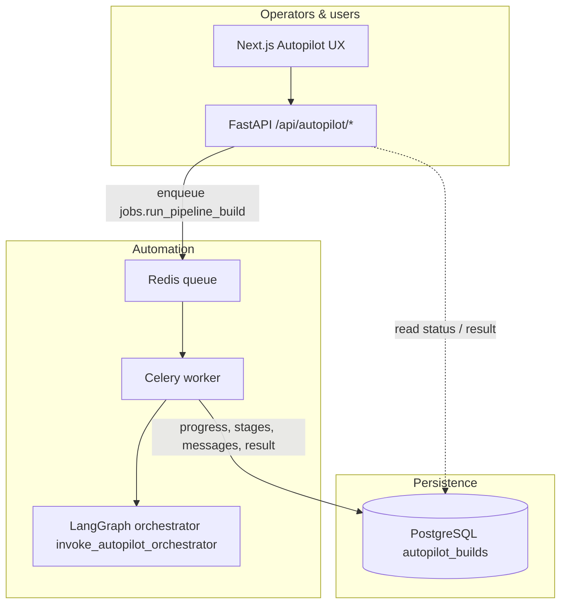
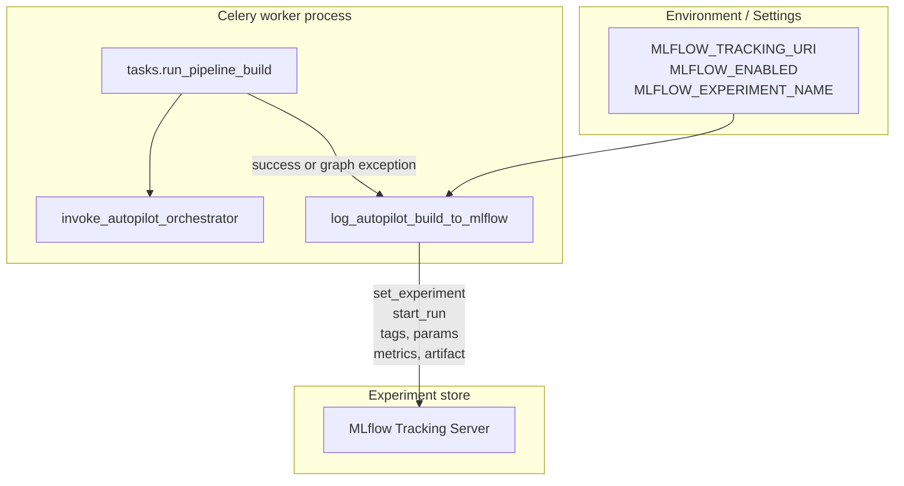
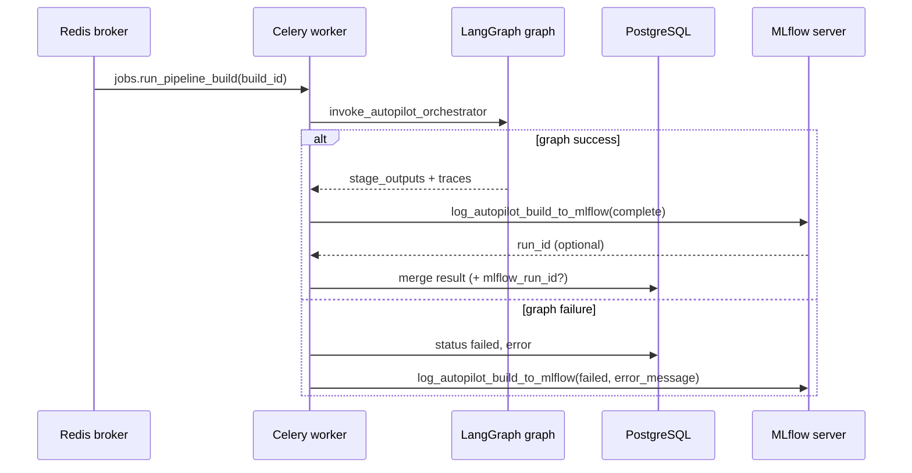
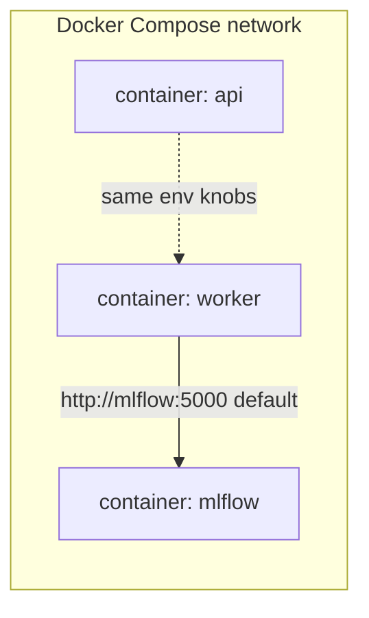
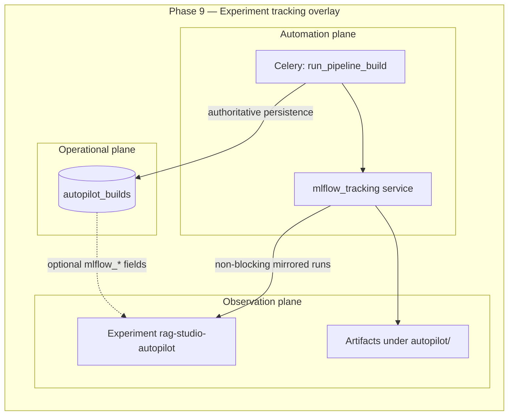

# Project system design evolution — Phase 9 (MLflow experiment tracking)

> **Scope.** Phase 9 adds **reproducibility and experiment observability** for **Autopilot** orchestration outcomes. Canonically this is **`P9-1 · MLflow Integration`**: programmatic logging from the **Celery** worker after each **`run_pipeline_build`** execution — **runs**, **parameters**, **metrics**, **tags**, optional **artifacts**, optional **persisted correlation ids** on the build row — with **fail-open** semantics if MLflow is unavailable.

This document evolves from the **minimal intent** at the phase opening (experiment ledger for builds) through the **concrete separation of concerns** (service + worker hooks + configuration) to the **complete integration topology** wired in Docker Compose and application settings.

---

## Design level 0 — Operational truth in PostgreSQL only (before Phase 9 intent)

Before Phase 9, Autopilot **`autopilot_builds`** rows aggregate **requirements**, **stages**, **messages**, **`result`** (including LangGraph **`stage_outputs`** and normalized payloads from **`compose_build_result_payload`**). This is authoritative for the product APIs and UX but is **not** specialized for experiment comparison dashboards or standardized experiment-run semantics consumed by standalone ML tooling.

**Gap:** operators who live in MLflow-compatible workflows still **manually correlate** builds to spreadsheets or ad hoc exports unless a **purpose-built push** fires at job completion.

---

## Design level 1 — Dedicated tracking façade + Celery-owned timing (architecture direction)

Phase 9 introduces **`app/services/mlflow_tracking.py`** exposing **`log_autopilot_build_to_mlflow`**. Architectural rule: **only the worker**, immediately after interpreting graph output (or capturing graph failure), invokes this helper — aligning **experiment run boundary** with **job boundary** (`jobs.run_pipeline_build`). FastAPI avoids duplicate writes for the same build.

Inputs are summarized as follows:

| Input channel | Contents |
|---------------|----------|
| Identifiers | `build_id`, `project_id`, `build_status` |
| Context | flattened `requirements` → MLflow params (bounded depth/count/length); stage-derived param highlights |
| Measurements | evaluation metrics (`eval.*`), iteration count, embedding candidate scores subset, deployment boolean signal |
| Provenance | JSON artifact under **`autopilot/`** aggregating requirements + compact `stage_outputs` |

Configuration uses **`Settings`**: **`mlflow_tracking_uri`**, **`mlflow_enabled`**, **`mlflow_experiment_name`**.

**Semantics:** **`mlflow_enabled: false`** or import/network failures ⇒ **silent skip with structured warning logs** — build row lifecycle **never** derives from MLflow success.

---

## Design level 2 — P9-1 complete: correlation back to Postgres + Compose wiring + local dev hygiene

Upon **successful** tracing, **`run_pipeline_build`** may enrich **`AutopilotBuild.result`** with **`mlflow_run_id`**, **`mlflow_tracking_uri`**, **`mlflow_experiment_name`** for deep-link orchestration downstream. **`docker-compose.yml`** injects **`MLFLOW_ENABLED`** and **`MLFLOW_EXPERIMENT_NAME`** parity into **`api`** and **`worker`** next to **`MLFLOW_TRACKING_URI`**. **`.gitignore`** acquires **`mlruns/`** to avoid accidental commits of CLI-default file-backed stores beside the repo.

Failure path (**graph exception**) still emits an MLflow **failed** run with **error tag** / message and empty `stage_outputs`.

---

## Design level 3 — Consolidated Phase 9 platform slice

At Phase 9 completion, **PostgreSQL remains system of record**, while MLflow constitutes a **purpose-built Experiment UI + API** keyed to the **same conceptual build identity** via **`build_id`** tag and optional **`result.mlflow_*`** mirror fields — supporting compliance storytelling, benchmarking cohorts across Autopilot executions, and future dashboard links without rewriting core persistence.

---

## Sub-phase → diagram map

| Sub-phase | Primary design levels | Focus |
|-----------|----------------------|--------|
| **P9-1** | 0 → 1 → 2 → 3 | Service module; Celery instrumentation; artifact + enrichment; Compose + `.env.example`; fail-open semantics |

Phase 9 is intentionally **single cohesive deliverable**: there are no branching sub-phase diagram variants beyond P9-1.

---

## References (code)

| Area | Location |
|------|----------|
| Experiment logging | `apps/api/app/services/mlflow_tracking.py` |
| Build job integration | `apps/api/app/worker/tasks.py` → `jobs.run_pipeline_build` |
| Settings | `apps/api/app/config.py` (`mlflow_*`) |
| Container env | `docker/docker-compose.yml` (`api`, `worker`, `mlflow` service definition) |
| Template env | `.env.example` (`MLFLOW_*`) |
| Unit tests | `apps/api/tests/test_services/test_mlflow_tracking.py` |
| Tracker docs (checklist) | `docs/internal/project_status.md` Phase 9; `docs/internal/TASKS.md` Phase 9 |

---

## Relation to neighboring phases

- **Phase 8** established **evaluation** and **deployment** HTTP surfaces alongside **Designer ↔ Autopilot** flows; **`autopilot_builds.result`** stabilized enough to attach Experiment metadata.
- **Phase 10 onward** (**testing**) can broaden automated verification around worker side-effects; observability Prometheus paths remain **orthogonal** (**Phase 11**) to MLflow’s experiment-registry role.
